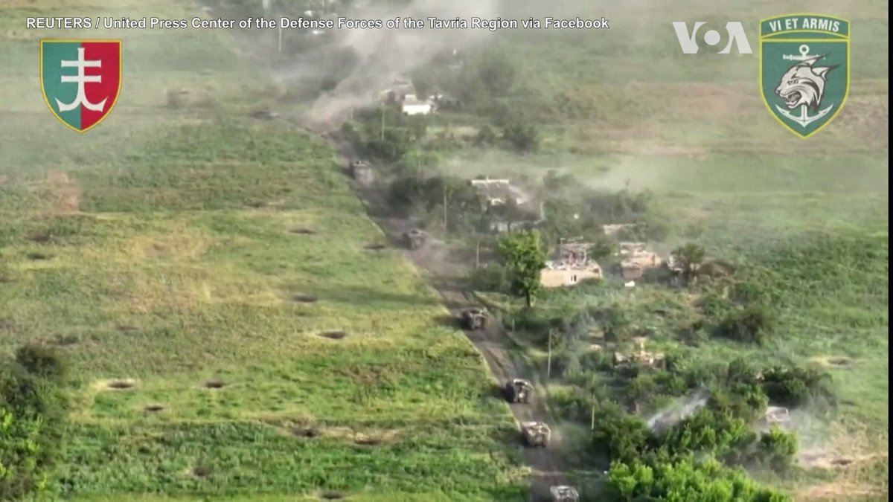
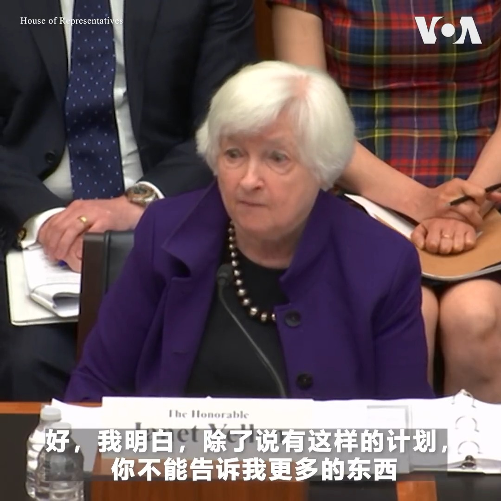
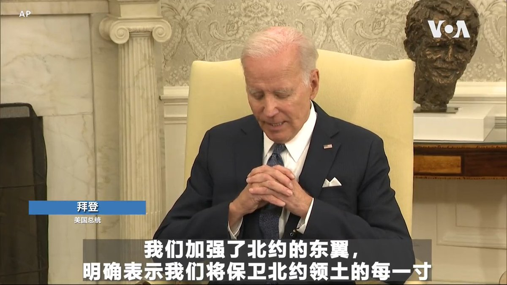
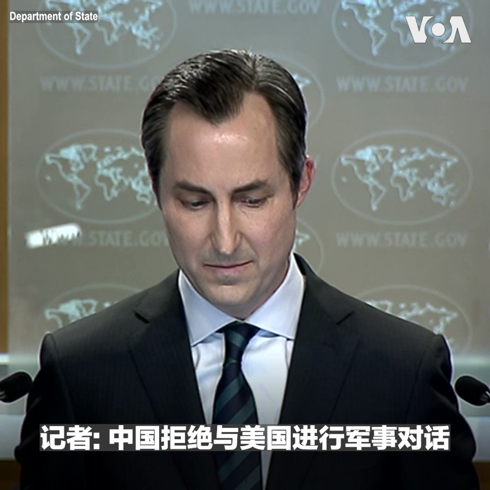
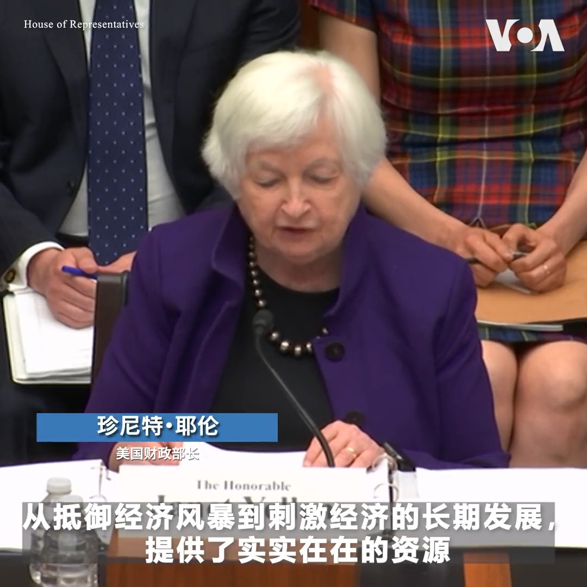
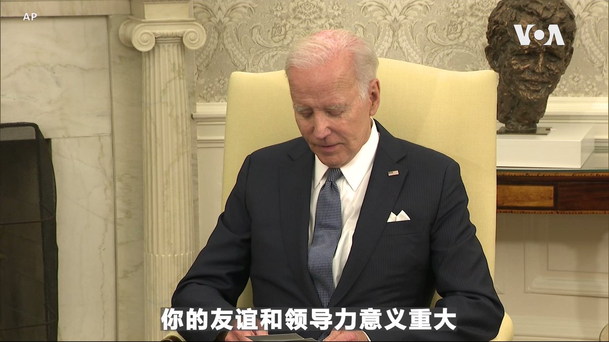

美国之音中文网 北京时间 2023-06-14T14:00:01Z 1668860825849692166 乌克兰海军陆战队第137营战士收回马卡里夫卡村后通过视频展示了营旗，乌军第3突击旅也在视频中展示对俄军阵地的攻击。乌军从俄军手中共夺回四个村庄，显示其反攻正逐步取得进展，同时仍在试探俄罗斯的防御能力，但乌军一周在南方局部推进近4英里的速度已好过俄军的整个冬季攻势。 https://t.co/cKrh6FDihi   美国之音中文网 北京时间 2023-06-14T12:07:29Z 1668832505514917891 #揭谎频道 ：中印“签证战”如何影响新闻自由 文字报道：https://t.co/B6JMUG08xq https://t.co/Fl4dD6aBHd   美国之音中文网 北京时间 2023-06-14T12:18:00Z 1668835151499894785 拜登总统今年在白宫主持的LGBTQ骄傲月庆祝活动规模超过以往，他强调性少数群体在美国社会被爱着、有归属，值得拥有尊严，得到支持。美国国内部分保守州内性少数群体得到的保护有所减弱，包括佛罗里达州长德桑蒂斯签署的“不要说同性恋”法，但他强调反对觉醒意识形态和性化儿童。 https://t.co/Nj4ZpCLdiy   美国之音中文网 北京时间 2023-06-14T09:00:01Z 1668785329766305794 一旦中国入侵台湾，美国是否做好对其进行金融制裁的准备？美财政部长耶伦6月13日在众院金融服务委员会的一个听证会上被问到这个问题时，没有提供美国将如何回应的细节，但她表示，“这是财政部与其他政府部门合作的一件事”。一位议员对耶伦无法直接回答是否支持台湾加入国际货币基金组织表示不满。 https://t.co/w9AbFI4YYW   美国之音中文网 北京时间 2023-06-14T09:03:33Z 1668786217457184769 在国安法下的审查中，香港电影观众渴望看到自己的故事 https://t.co/efsIYMIKE4   美国之音中文网 北京时间 2023-06-14T09:21:04Z 1668790627482636288 北京批评美国在飞行员培训和武器开发方面对企业实施新制裁 https://t.co/urnyNy3DKy   美国之音中文网 北京时间 2023-06-14T09:32:28Z 1668793493387456512 美国总统拜登6月13日和即将卸任的北约秘书长斯托尔滕贝格在白宫进行会晤。斯托尔滕贝格强调，普京绝对不能赢得这场战争，否则“它将向全世界及中国的专制领导人传达信息，那就是当他们使用武力时，他们就会得到他们想要的，”他说。拜登重申，美国对北约宪章第五条款的承诺坚如磐石。 https://t.co/ra923wWSyU   美国之音中文网 北京时间 2023-06-14T09:48:03Z 1668797414445318144 乌克兰最新进展：北约说西方对乌克兰的援助“发挥了重要作用” https://t.co/XnyAYEi60p   美国之音中文网 北京时间 2023-06-14T06:30:00Z 1668747574432632832 诺贝尔文学奖提名人、大右派章伯钧之女章诒和自爆被中共当局限制出境、成为国家囚徒，英文网站“改变中国”主编曹雅学表示，在习近平“边控”名单上的公知、维权律师、异见人士不计其数，不准走是常态，能走是幸运，极权制度下每个有良心的人都是国家囚徒。#时事大家谈完整版：https://t.co/ztz6y0msET https://t.co/gc5uiIGstG   美国之音中文网 北京时间 2023-06-14T06:44:50Z 1668751309351145474 关于美国国务卿布林肯是否会在本周末访问中国，美国国务院发言人马修·米勒6月13日在例行记者会上没有对此进行证实。但米勒重申，与中国进行外交接触是重要的。 https://t.co/3pI5lM9oyQ   美国之音中文网 北京时间 2023-06-14T07:00:00Z 1668755125148725248 习近平重申内循环，称要确保经济在“极端情况下正常运行”。是否暗示中西方紧张关系要升级？是不是关闭国门的新托词？另外，中国结婚人数创下新低，为什么年轻人对政府鼓励婚育政策“不买账”？美国之音【#时事大家谈】6月14日上午9点讨论这些话题，请发表您的看法或提问。 https://t.co/CY9kHPvPUf   美国之音中文网 北京时间 2023-06-14T07:39:00Z 1668764938767040512 美国国会众院金融服务委员会副主席希尔6月13日在一场听证会上批评国际金融机构没有为发展中国家的利益服务，反而让中国成为世界上最大的债权人。不过出席作证的美国财政部长耶伦表示，这些机构反映了美国的价值观。“它是对来自中国等其他国家的不透明、不可持续的贷款的重要平衡，”她说。 https://t.co/GYD7IB3Sw8   美国之音中文网 北京时间 2023-06-14T08:00:00Z 1668770224517304320 太古里牵手门街拍变反腐大片，担任国企领导的男主角被火速免职，网友质疑为何彭帅指控副总理张高丽性侵却没事？中国独立作家慕容雪村表示，习近平反腐只是清除异己，权色交易、权钱交易是中共奖励自己派系的砝码，很能解释为何胡继勇落马、张高丽没事。#时事大家谈完整版：https://t.co/ztz6y0msET https://t.co/tthguLJJaO   美国之音中文网 北京时间 2023-06-14T08:07:04Z 1668772004483432448 美国会议员呼吁联合国秘书长劝阻北京遣返朝鲜难民 https://t.co/p2FRyurbPs   美国之音中文网 北京时间 2023-06-14T08:20:03Z 1668775271791730688 美财长耶伦：试图与中国脱钩将是“灾难性的” https://t.co/tuz2rk2gZz   美国之音中文网 北京时间 2023-06-14T08:30:00Z 1668777773920575488 美国国会众院金融服务委员会副主席希尔6月13日在一场听证会上批评国际金融机构没有为发展中国家的利益服务，反而让中国成为世界上最大的债权人。不过出席作证的美国财政部长耶伦表示，这些机构反映了美国的价值观。“它是对来自中国等其他国家的不透明、不可持续的贷款的重要平衡，”她说。 https://t.co/XV1fElLuxd   美国之音中文网 北京时间 2023-06-14T08:34:03Z 1668778793635549192 美众院筹款委员会42:0票通过《美台21世纪贸易倡议首批协定实施法》 https://t.co/80FtP4MBAm   美国之音中文网 北京时间 2023-06-14T05:06:05Z 1668726458439839745 白宫宣导监控法案更新，称监控捕获了黑客和芬太尼走私者 https://t.co/hZWPToZtCs   美国之音中文网 北京时间 2023-06-14T05:36:35Z 1668734132070027266 卡霍夫卡水坝灾难威胁释放造成身体、精神的健康问题的传染病 https://t.co/aefPFphg6t   美国之音中文网 北京时间 2023-06-14T05:51:33Z 1668737898244640768 前总统特朗普面对机密文件案的联邦指控不认罪 https://t.co/zryxYZbh2Y   美国之音中文网 北京时间 2023-06-14T03:02:14Z 1668695289966764060 正在华盛顿进行访问的北约秘书长斯托尔滕贝格6月13日和美国务卿布林肯进行双边会谈后两人共同表示，预计在今年北约峰会上，北约盟国会继续对乌克兰提供强有力的支持，加强防御投资以提高集体威慑能力，并持续强化与印太地区国家的伙伴关系。今年北约峰会将于7月11日在立陶宛首都维尔纽斯举行。 https://t.co/FCGjYqRUah   美国之音中文网 北京时间 2023-06-14T03:33:22Z 1668703122821353476 北约秘书长延斯·斯托尔滕贝格6月13日说，乌克兰军队对侵乌俄军发起的反攻正在取得进展，但这种攻势仍处于初期阶段。斯托尔滕贝格当天在华盛顿与美国国务卿布林肯举行了会晤。他说，北约正在为今年7月在立陶宛举行的峰会作准备。 https://t.co/OYRDjrYUQn   美国之音中文网 北京时间 2023-06-14T00:30:33Z 1668657115509198849 人定胜天余毒未消：中国规划超大水利工程组建国家水网 https://t.co/NwLFcLQR6s   美国之音中文网 北京时间 2023-06-14T00:44:02Z 1668660508583677952 脚底抹油，中国百万富翁“前赴后‘润’”居全球之首 https://t.co/rshHxgeX6W   美国之音中文网 北京时间 2023-06-14T00:44:04Z 1668660516708032512 巴勒斯坦总统阿巴斯开始访中，北京寻求扩大对中东的影响力 https://t.co/4HUK4G7Xf1   美国之音中文网 北京时间 2023-06-14T00:48:25Z 1668661612490764296 美国NBA丹佛掘金队（Denver Nuggets 又译：金块队）6月12日击败迈阿密热火队，夺得本赛季总冠军。掘金队夺冠后，丹佛当地的球迷彻夜狂欢庆祝。这是掘金队在历时47年后，首次夺得NBA总冠军。 https://t.co/TnK2mAuf3u   