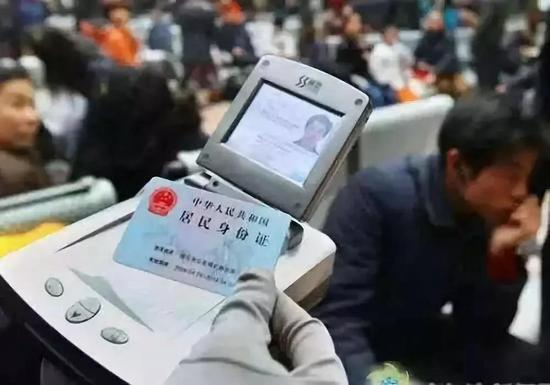

自由亚洲电台 北京时间 2023-06-14T23:41:45Z 1669007222242680840 【香港612抗争四周年特别报道之一：海外离散港人如何凝聚向心力？】香港反送中运动已经过去四年了，离散各地以及仍留在香港的港人，如何维持初心不变？本台将通过系列报道，探讨港人在多变环境下如何自处。首集先探讨香港经历反送中后，离散港人遍布全球多国，对于那些移居美澳加和台湾的港人来说，当地的港人团体会遇到什么困难和挑战？又将如何应对呢？
https://t.co/nfpIEZoRmh   自由亚洲电台 北京时间 2023-06-14T20:51:22Z 1668964343667384320 RT @RFA_Chinese: 据6月13日《华尔街日报》，自上月底以来，中国国家主席 #习近平 已两次要求国内为他所称的“#极端”情境或状况做好准备，包括与西方冲突。

“极端”正成为一种新的口号，并在地方政府层面出现。根据官方信息，从沿海大都市上海到内陆省份湖南省的地方领…   自由亚洲电台 北京时间 2023-06-14T22:12:56Z 1668984874554802178 专栏 | #民主沙龙：中国人讲中国事 （2023-06-13）https://t.co/ATpQvFV4PR   自由亚洲电台 北京时间 2023-06-14T18:38:23Z 1668930879807455233 https://t.co/x9rHCcWlKm   自由亚洲电台 北京时间 2023-06-14T16:54:11Z 1668904657090150400 【警方能用身份证号获取聊天记录】
【大数据库已掌握民众全部信息】
中国警方通过大数据获取民众个人信息的技术手段不断提升。近期，一网民在海口被警察抽查时发现，警方不查当事人手机，仅凭其 #身份证 号码便可查到这位网民的 #微信 聊天记录。有人披露，警方也可从身份证内的芯片，隔空获取个人所有数据。
https://t.co/FCDMTFqL3z   自由亚洲电台 北京时间 2023-06-14T15:58:44Z 1668890702431019009 https://t.co/Ivs6bS6JJR   自由亚洲电台 北京时间 2023-06-14T10:34:04Z 1668808995383963648 RT @RFA_Chinese: 6月13日，上海市纪委监委发布消息：上海东方网股份有限公司原党委副书记、总裁、总编辑徐世平被双开。他被指“落实中央决策部署打折扣、搞变通，对抗组织审查，私藏、阅看违禁书刊等”。2022年，上海电气原党委书记、董事长郑建华被“双开”，也被指“私藏…   自由亚洲电台 北京时间 2023-06-14T10:35:58Z 1668809475313094656 RT @RFA_Chinese: 据6月13日《华尔街日报》，自上月底以来，中国国家主席 #习近平 已两次要求国内为他所称的“#极端”情境或状况做好准备，包括与西方冲突。

“极端”正成为一种新的口号，并在地方政府层面出现。根据官方信息，从沿海大都市上海到内陆省份湖南省的地方领…   自由亚洲电台 北京时间 2023-06-14T04:57:54Z 1668724396641361920 【＃亚太报道（２０２３－６－１３）】
欢迎收听订阅播客 https://t.co/MjLNSvVeAE
#习近平 警告应对“#极端情况” / #汪文斌 拒绝确认 #布林肯访华 / 解放军学者放风“#台海战争 并非不可避免” / 美国众院军委会探讨 #美台联合生产武器 / #湖北美术学院 艺术展品遭查禁 https://t.co/GheVsuoZ4x   自由亚洲电台 北京时间 2023-06-14T05:01:08Z 1668725210365689857 评论 | #陈破空：缓和关系？有必要回顾 #美中关系 当代史
https://t.co/w3A0NQcmiM   自由亚洲电台 北京时间 2023-06-14T05:37:11Z 1668734282632708098 据6月13日《华尔街日报》，自上月底以来，中国国家主席 #习近平 已两次要求国内为他所称的“#极端”情境或状况做好准备，包括与西方冲突。

“极端”正成为一种新的口号，并在地方政府层面出现。根据官方信息，从沿海大都市上海到内陆省份湖南省的地方领导人也表示要为 “极端” 情况做好准备。

外交政策学者 #金灿荣 解读说，习近平提到的极端情况意味着“战争的危险”。

您怎么看？   自由亚洲电台 北京时间 2023-06-14T06:18:36Z 1668744708351221763 6月13日，上海市纪委监委发布消息：上海东方网股份有限公司原党委副书记、总裁、总编辑徐世平被双开。他被指“落实中央决策部署打折扣、搞变通，对抗组织审查，私藏、阅看违禁书刊等”。2022年，上海电气原党委书记、董事长郑建华被“双开”，也被指“私藏阅看违禁书籍”。
网友好奇，他们到底看了什么违禁书籍，值得单列一条？   自由亚洲电台 北京时间 2023-06-14T02:29:46Z 1668687118221336577 英国政府近日对华态度明显放软，外相更计划访问中国，此举引来朝野反对。有国会议员更当面斥责外相克莱弗利（James Cleverly）。英国传媒引述消息，表示，如果外相坚持访华，将有部长级官员辞职抗议。

https://t.co/WnwEnYjfRa   自由亚洲电台 北京时间 2023-06-14T03:13:48Z 1668698200558170112 中国为何对 #布林肯访华 三缄其口？ 学者：美中风险聚焦 #台湾
https://t.co/tQ8VPhBemv   自由亚洲电台 北京时间 2023-06-14T03:39:41Z 1668704713716514818 英国外相克莱弗利（James Cleverly）早前称要和中国建立“稳建而具建设性”的关系，而且正筹划访华行程，引来朝野反对。在英国下议院外交事务委员会周一（12日）的会议上，下议员布赖恩特（Chris Bryant）表示，中国仍制裁多名英国议员，质疑为何克莱弗利仍要访华，并追问他会否带同被中国制裁的保安事务国务大臣董勤达（Tom Tugendhat）一同到北京。他更直斥克莱弗利是“中国走狗”。   自由亚洲电台 北京时间 2023-06-14T00:30:28Z 1668657096554950659 美国国会众议院即将开始针对“2024财政年度 #国防授权法”（National Defense Authorization Act，NDAA）进行专责委员会最后审议，多个小组委员会分别针对中国提出应对方案，突显 #中国威胁 的急迫性。
https://t.co/CX24WHZGDq   自由亚洲电台 北京时间 2023-06-14T00:38:08Z 1668659023506440192 近期 #荷兰 加入美国阵营，加强管制 #芯片出口 到中国。近日更传出，荷兰政府计划立法禁止中国学生修读半导体和国防等敏感大学课程。
道高一尺，魔高一丈，中国多管齐下吸纳西方先进科技，西方国家防得住吗？

https://t.co/OZN8FYMawV   自由亚洲电台 北京时间 2023-06-14T01:20:20Z 1668669646055276545 #事实查核｜美国宣布不再干涉 #乌克兰 进攻 #俄罗斯 本土？

https://t.co/oj5LDAvkUq   自由亚洲电台 北京时间 2023-06-14T01:33:18Z 1668672909567733760 日前，美国众议院军事委员会发布 #国防授权法 草案提出，以美台联合生产武器等可能方式，解决 #对台军售 项目延迟交付的问题并以此增强台湾的军事物资库存。有台湾专家认为，要应对中国对台入侵威胁，美国应加快武器运销速度。

https://t.co/0mZa0gruOG   自由亚洲电台 北京时间 2023-06-14T01:45:28Z 1668675970591756289 今年的6月12日是香港 #反送中运动四周年 纪念日，加拿大香港人分别在多伦多和温哥华举行集会。当年历经警察暴力镇压的香港人表示，永远不会忘记亲眼所见的惨烈。活动组织者说，海外必须为那些因民主抗争被政治迫害的香港人伸张正义。

https://t.co/gVgrGVkJLV   自由亚洲电台 北京时间 2023-06-14T02:14:36Z 1668683301253713921 #台湾 外长会见 #捷克 参议院议长激怒了中国
https://t.co/9iXRE1nKwI   自由亚洲电台 北京时间 2023-06-14T00:02:52Z 1668650149839532032 ＃湖北美术学院 的一个探讨 ＃刻板印象 的装置艺术作品被保安队撤展，存活不到5小时。
展示者留言，保安的举动丰富了这个作品的含义。
您同意吗？
https://t.co/zZbL1ndRCz https://t.co/ngNH4fnGpU   