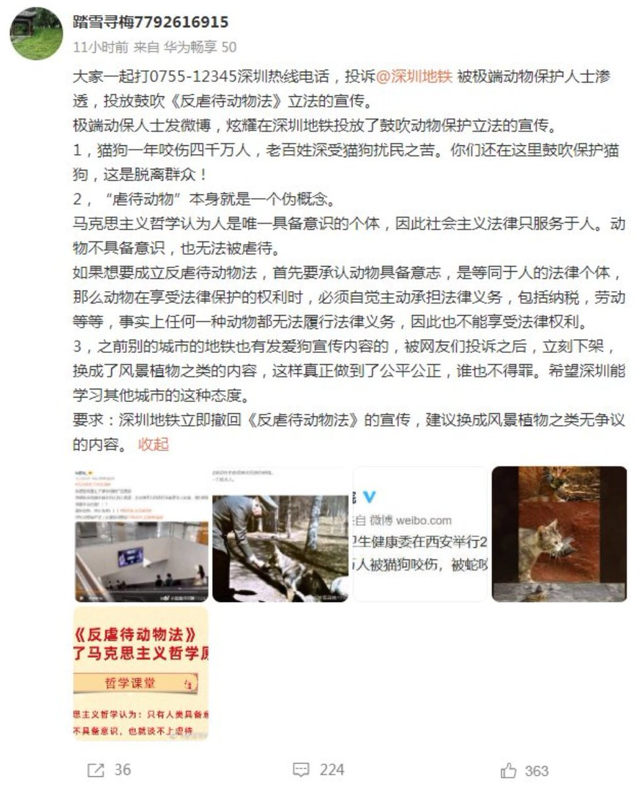

谁将十万横扫三江 北京时间 2023-06-14T23:57:44Z 1669011245846999044 RT @Red_Prinny: 不一定有多少人能看得到，但是有些话不吐不快。
曝光地铁大叔的四川大学女生（以下简称女主），她引发的事件，在各种讨论中，已经无关事件本身，变成了两派极端分子的“盛宴”了。

一派强调女性的弱势地位，大叔拍了其他照片，以及学校企图开除该女生的行为。…   谁将十万横扫三江 北京时间 2023-06-14T19:08:49Z 1668938537134354432 “偷拍”这个词目前只可以搜索蓝V发布的内容了。
看看蓝v发布的这些词条。
从今以后，社交平台上只有女性指认偷拍被打击报复，不存在女性被偷拍上网维权求助，不存在偷拍产业链的曝光调查。
什么是议程设置，这就是议程设置，
要女性闭嘴的议程设置。转载自微博：在于关系 https://t.co/qEQjF5upG5   谁将十万横扫三江 北京时间 2023-06-14T20:18:54Z 1668956176531488773 RT @whyyoutouzhele: 网友投稿
6月14日，深圳动物保护组织在深圳地铁投放了一条15秒的广告，呼吁停止虐待动物、善待动物、尊重生命。
然而，广告却遭极端虐待动物组织投诉，深圳地铁或将广告下架。 https://t.co/IWLzCae35f   谁将十万横扫三江 北京时间 2023-06-14T16:50:29Z 1668903725690408960 某中国法律博主：红星新闻这个女主播眼珠子翻的跟河豚鱼的白肚皮一样，这是某些媒体人的典型形象：一肚子酸菜水，不敢直接表达，但一张口就溢出来。

其粉丝:像古代女孩子都只待在深闺  足不出户不是很安全吗？又不用工作   每天绣绣花，喝喝茶，最多再织布做饭也不是很辛苦，多好 https://t.co/fdGPPGcrDN   谁将十万横扫三江 北京时间 2023-06-14T11:16:42Z 1668819726229975040 RT @torontobigface: 中国现在青年失业率20.4%，而社会总失业率才5.1%，中间差了15.3%
为什么有这种巨大差距？
是因为中国现在没有办法给刚毕业的大学生提供岗位了
中国不是没有人才，而是社会无法提供需要高素质人才的岗位
这也是陷入中等收入陷阱，进入拉美…   谁将十万横扫三江 北京时间 2023-06-14T11:16:52Z 1668819766801481728 RT @whyyoutouzhele: 网友投稿
6月13日，广州市公安局增城区分局雁塔派出所警方回应男子境外参与开设偷拍网站。
据查，广州籍男子汤某然在境外参与开设偷拍网站并以此牟利，原籍地系广州增城，目前没有入境，社区民警已前往他的住处走访，但家中没有人，警方已与物业沟通，…   谁将十万横扫三江 北京时间 2023-06-14T10:17:27Z 1668804815160496128 RT @whyyoutouzhele: 网友投稿
6月13日，福建老农卖菜获利14元被罚十万被多家媒体报道，引发关注。
据悉， 福建一老农2019卖的菜质量不合格，在2021年被当地市监局立案调查，2022年4月22日市监局做出处罚该老农五万元的决定，后来又追加五万元，共计十万…   谁将十万横扫三江 北京时间 2023-06-14T09:46:15Z 1668796964568440833 RT @whyyoutouzhele: 网友投稿
6月13日，福建老农卖菜获利14元被罚十万被多家媒体报道，引发关注。
据悉， 福建一老农2019卖的菜质量不合格，在2021年被当地市监局立案调查，2022年4月22日市监局做出处罚该老农五万元的决定，后来又追加五万元，共计十万…   谁将十万横扫三江 北京时间 2023-06-14T09:46:29Z 1668797021199933440 湖南大学筹备与足浴协会共建商学院。舆情跟进后否认 https://t.co/dLhZ1dahmj   谁将十万横扫三江 北京时间 2023-06-14T08:19:47Z 1668775204007579651 武安检察院：保生育就是最大的人权 https://t.co/CfYwYDEhg2   