A李老师不是你老师 北京时间 2023-06-13T06:14:15Z 1668381222886580226 网友投稿
6月12日晚，上海财经大学毕业季
一名学生在教学楼上组成了一个巨大的行程码，以此纪念自己的大学四年。 https://t.co/7lPw73s0bC https://t.co/YMirN1eFIn 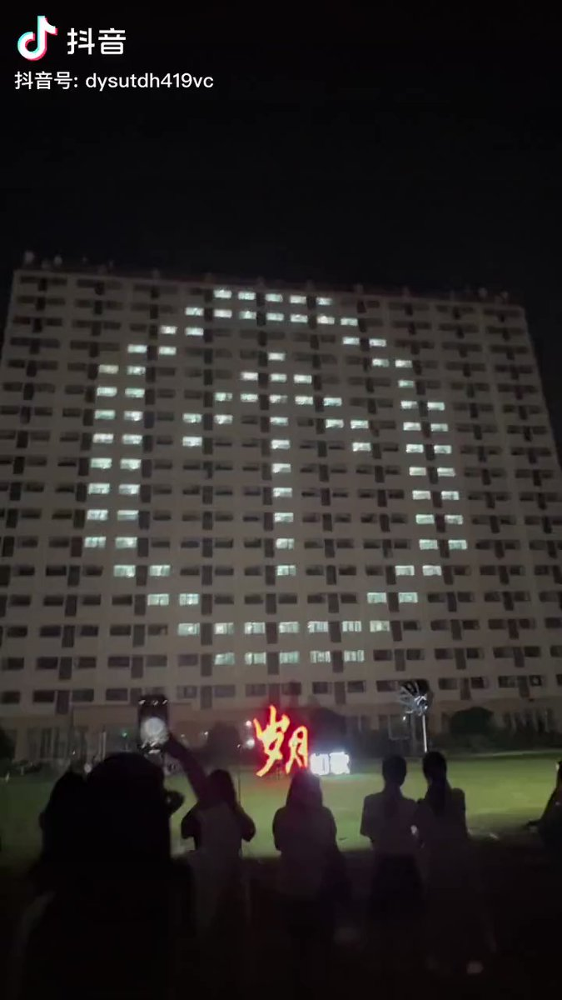  A李老师不是你老师 北京时间 2023-06-13T07:55:50Z 1668406786343202817 网友投稿
6月12日，江苏常州。
有学校突然发通知要求调查学生海外亲属情况，原因未知。 https://t.co/2zSERh8sPR   A李老师不是你老师 北京时间 2023-06-13T08:02:00Z 1668408339389116416 网友投稿
在一则视频下，网友纷纷吐槽“印度”的高房价问题
据悉，由于在抖音上禁止讨论中国现状，所以网友们在评论区里便开始使用其他国家来代指中国。 https://t.co/vxHgBdIhbt 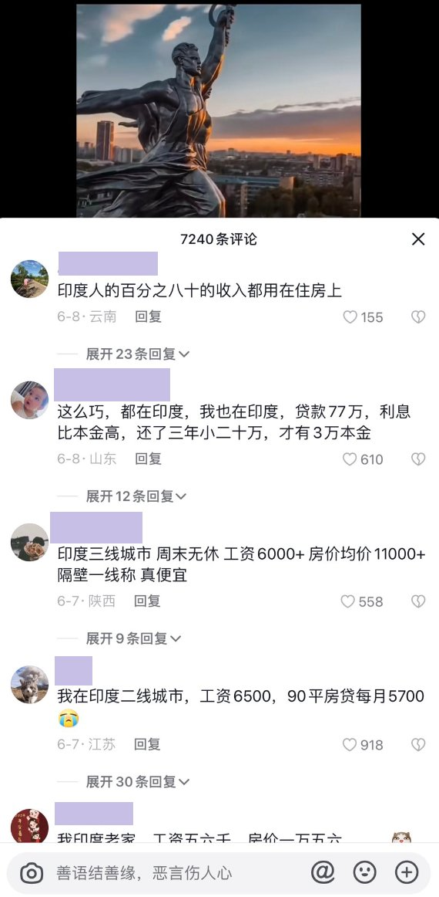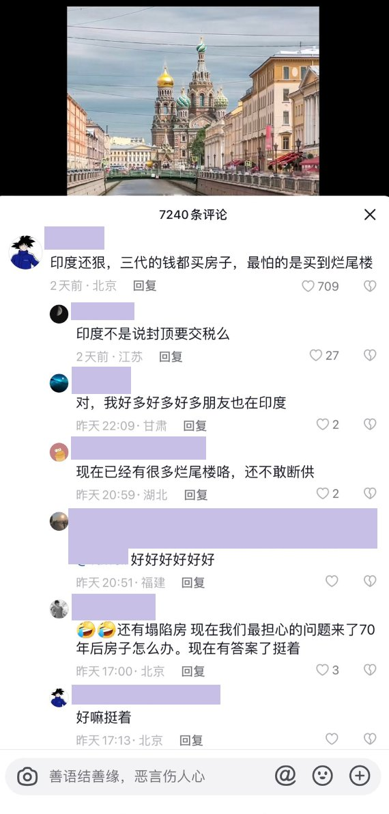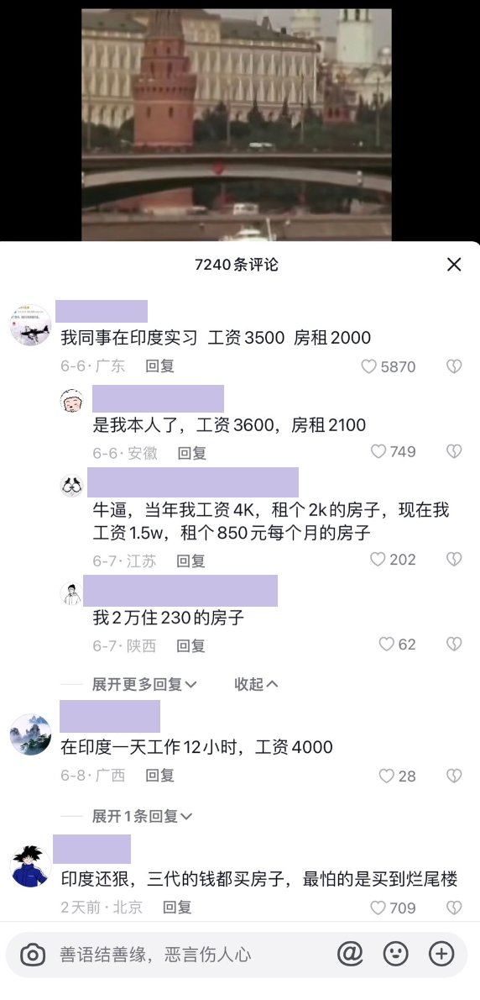  A李老师不是你老师 北京时间 2023-06-13T08:18:52Z 1668412582971990016 网友投稿：时代变了 https://t.co/xib68gG37z   A李老师不是你老师 北京时间 2023-06-13T08:19:27Z 1668412730565378048 据息，这个标语从21年就开始被各地使用了 https://t.co/FwsvQyX4p2   A李老师不是你老师 北京时间 2023-06-13T09:18:23Z 1668427564707184641 经不起   A李老师不是你老师 北京时间 2023-06-13T18:21:47Z 1668564312988819458 网友补充
这是学校毕业季大型灯光秀的一部分 https://t.co/9hSZtYVr4f 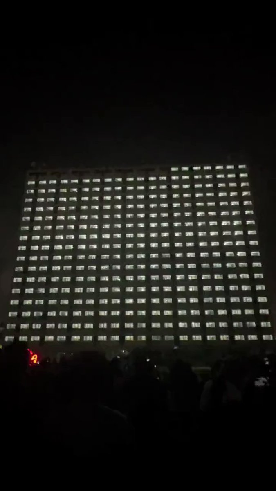  A李老师不是你老师 北京时间 2023-06-13T18:40:12Z 1668568949523447809 网友投稿 
6月13日，香港。 
美国驻港澳总领事馆大门上被人喷上“双标”“hegemony”等字样的涂鸦。
据香港的大公报和星岛早报报道警方随后在现场拘捕了一名男子，对方涉嫌“刑事毁坏”，被带返警署接受调查。目前尚不清楚他的作案动机。 https://t.co/1PRaTBMtOK 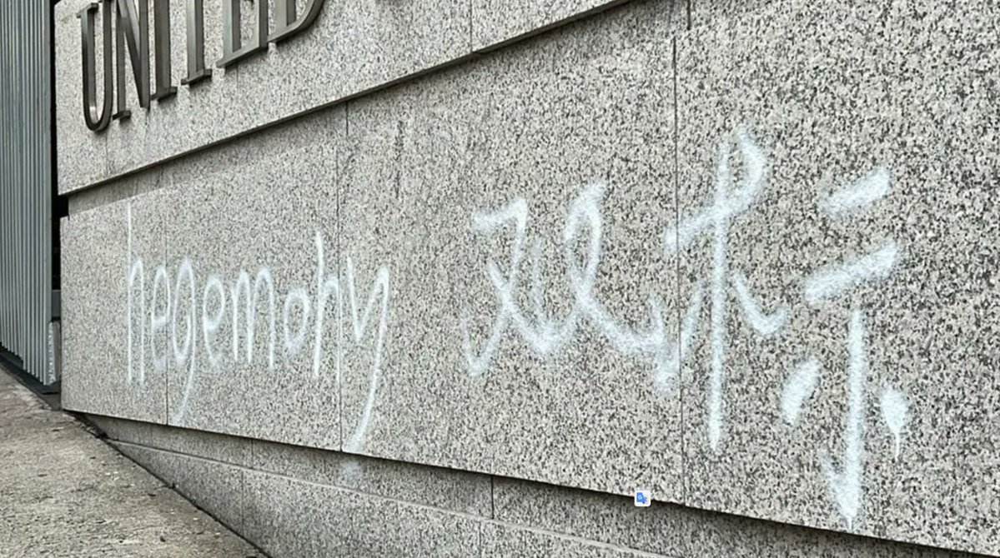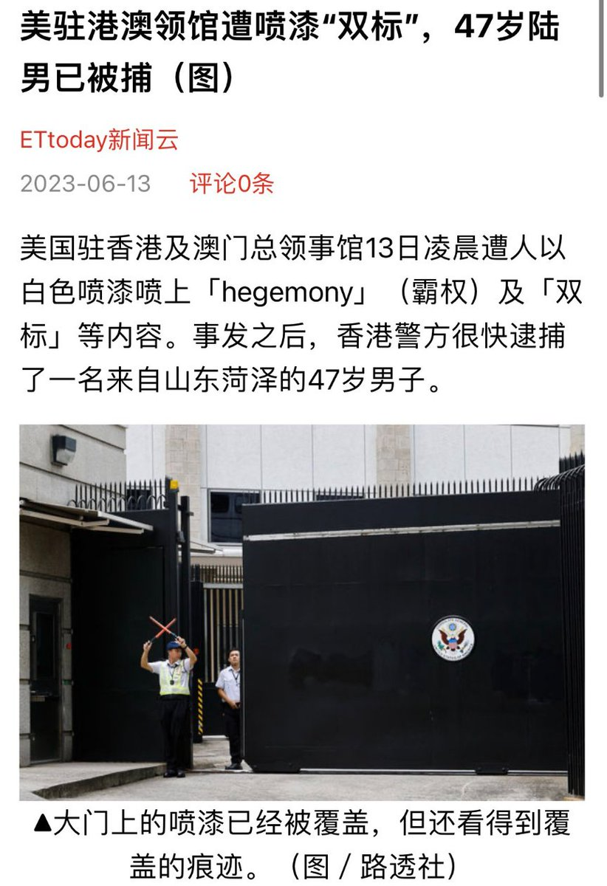  A李老师不是你老师 北京时间 2023-06-13T18:45:30Z 1668570282410295299 网友投稿
6月13日，周鸿炜在一场发布会上公布了360旗下的“人工智能敏感审核体系” https://t.co/5VpW60n5jM 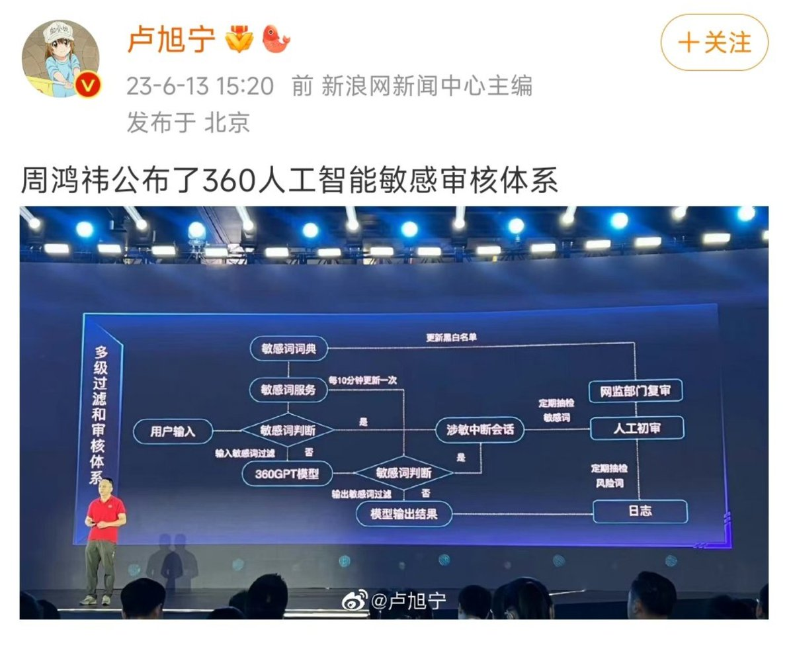  A李老师不是你老师 北京时间 2023-06-13T18:50:54Z 1668571640374915073 网友投稿
6月13日，中央美术学院各分院院长及教授发表公开信，联名抗议反对学校副院长林茂任担任新院长。
文中称，林茂任是“无资质，无学术，无功绩”的三无人员，他担任新院长“师生不答应，历史不答应，中国美术不答应。” https://t.co/somCsq3x5l 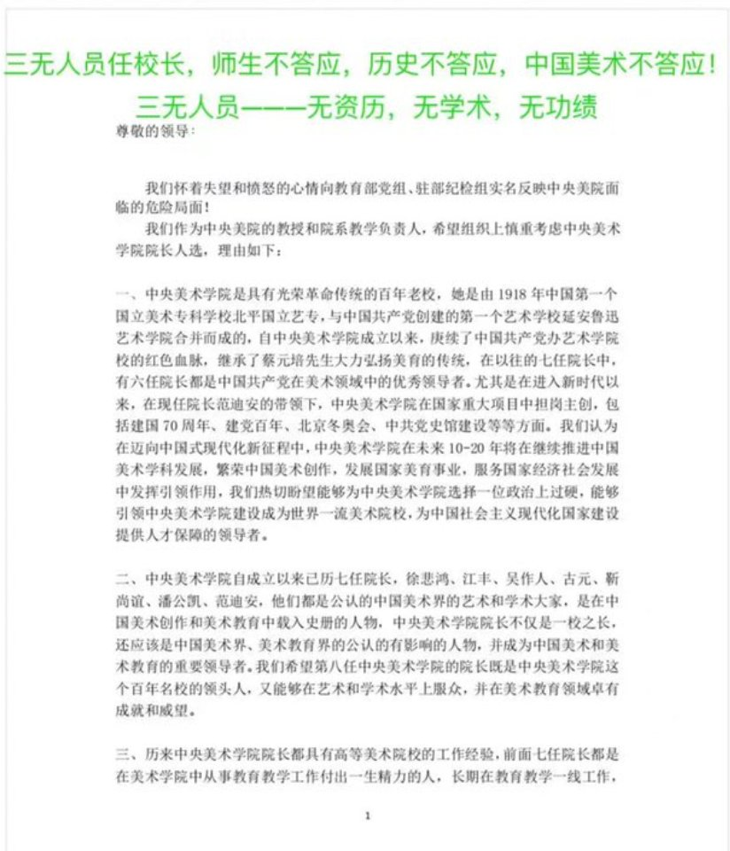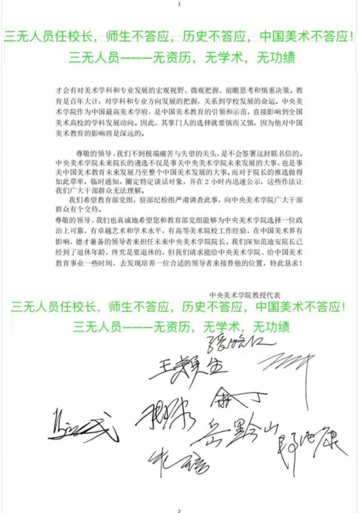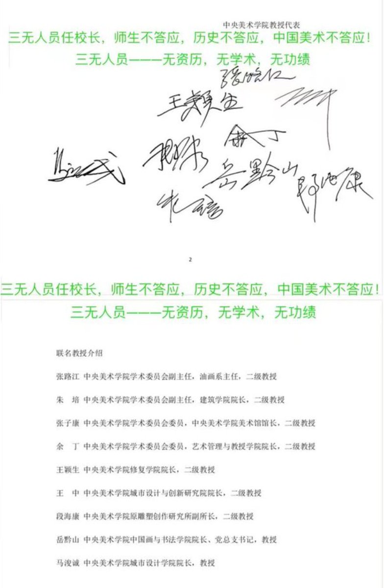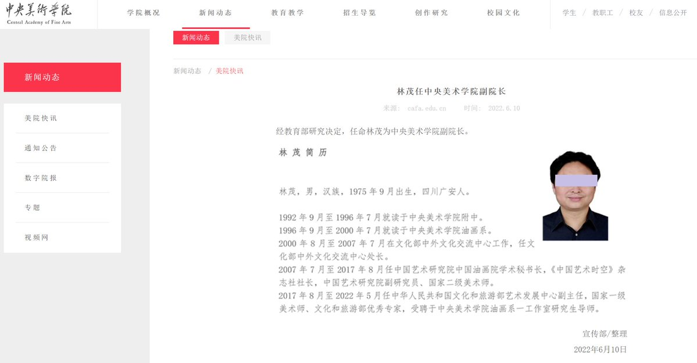  A李老师不是你老师 北京时间 2023-06-13T18:54:38Z 1668572579206922240 网友投稿
在一则关于雄安新区的视频下，网友的高赞评论和留言 https://t.co/QnAT7blHa5 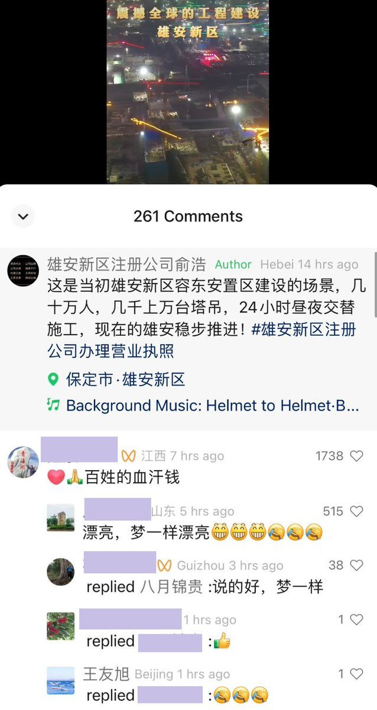  