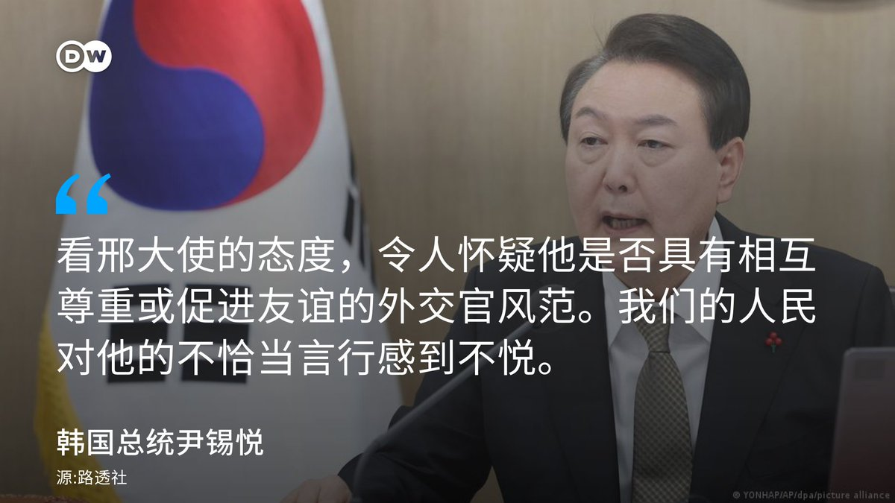
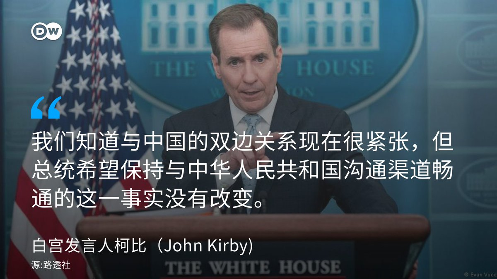
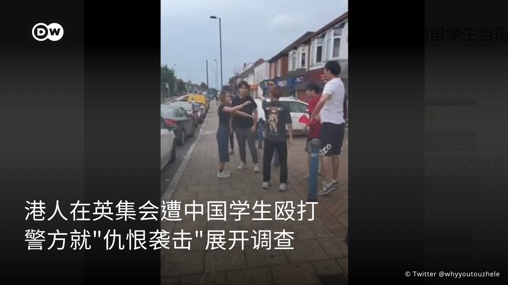
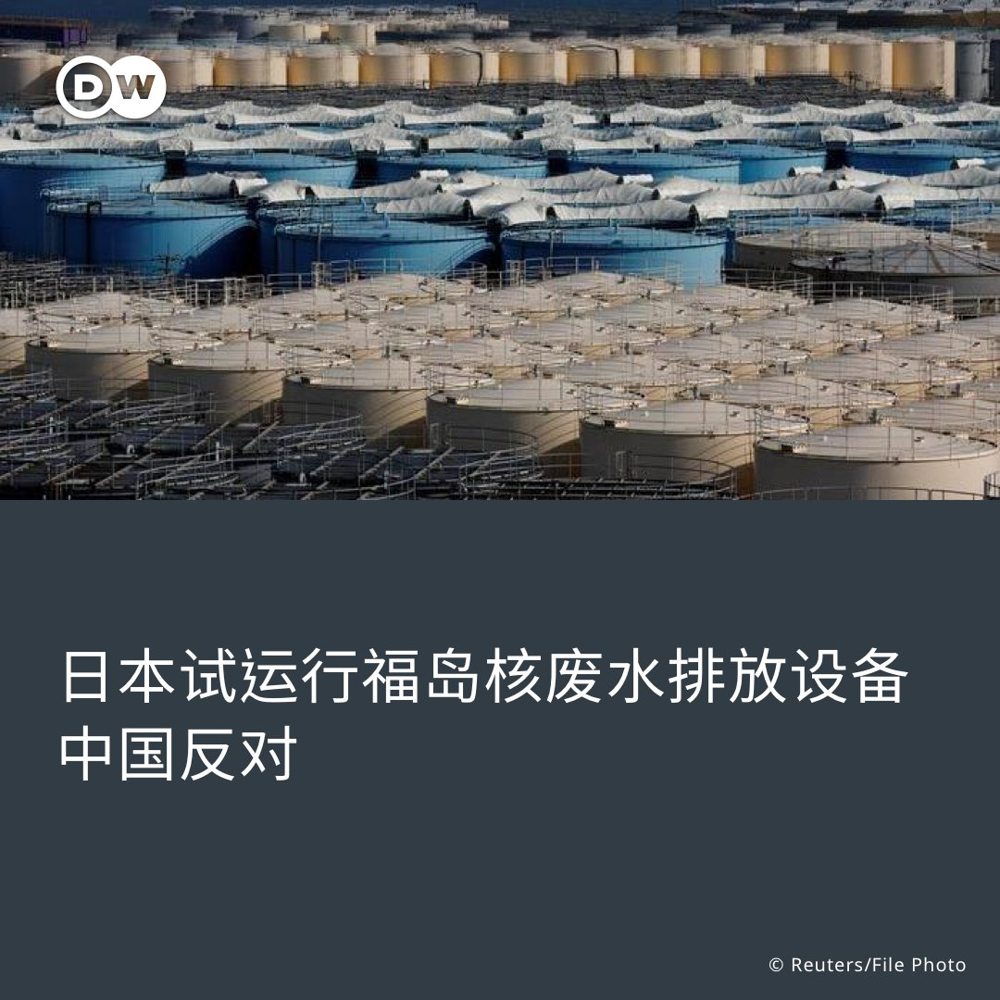
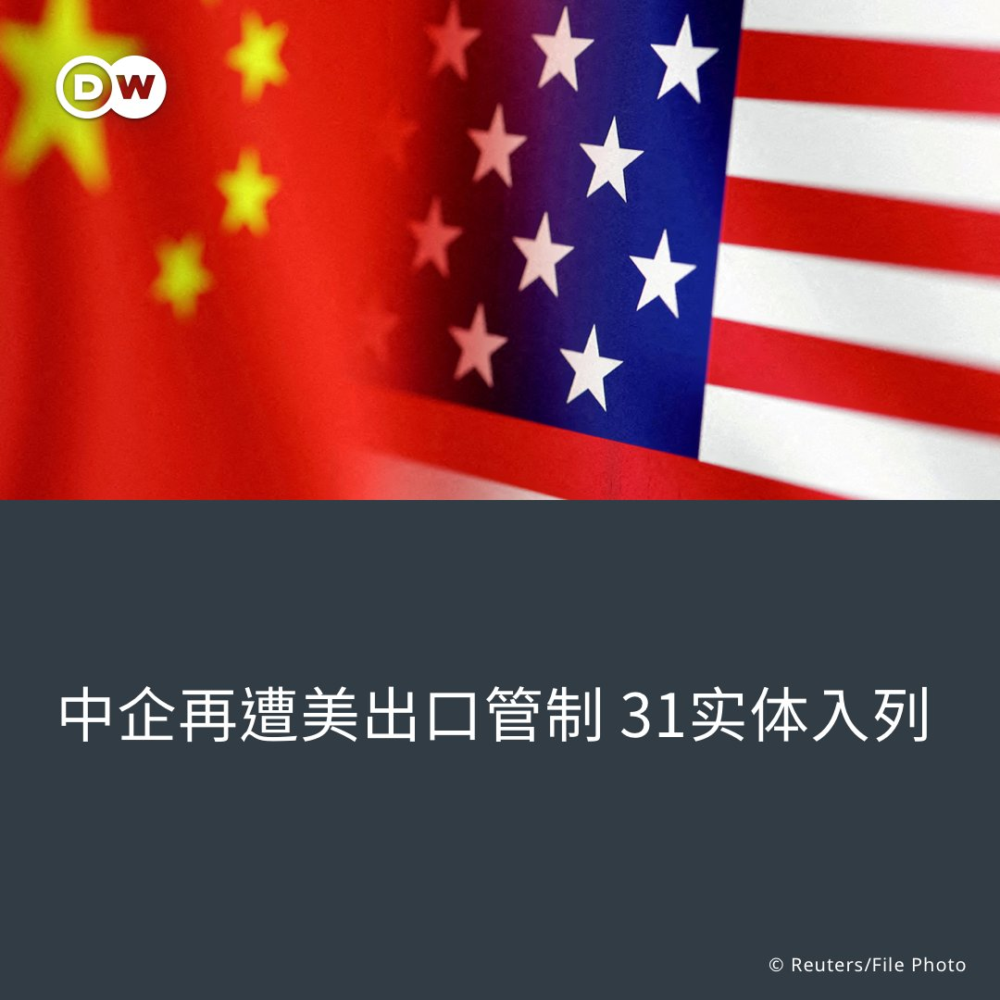
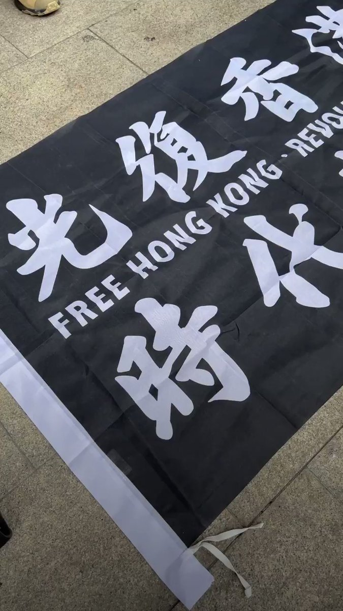

德国之声 北京时间 2023-06-13T22:21:59Z 1668624763030482948 #德国 墨卡托中国研究中心主任胡谧空(Mikko Huotari)警告，不要采取过激的手段或减少与#中国的联系，绝不能奉行“减少与中国接触就能解决我们所有问题’的原则”。
https://t.co/ggqUtmx7hT https://t.co/sPdbvpNtIB   德国之声 北京时间 2023-06-13T22:39:48Z 1668629247454482434 十年前习近平还曾号召年轻人要有雄心壮志，以创新精神推动国家的繁荣富强。而十年后的今天，习近平却在要求年轻一代要像他一样"学会吃苦"。

详细报导👉https://t.co/oi9wPXrlxN https://t.co/JyXqBDW97Q   德国之声 北京时间 2023-06-13T22:49:43Z 1668631743530962962 知道吗，柏林是世界上唯一拥有三座歌剧院的城市，那里得桥比威尼斯还多......

认识柏林，点击图集👉https://t.co/ggKJkQatmz https://t.co/jJo2GpjyDl   德国之声 北京时间 2023-06-13T20:59:38Z 1668604037254594562 #中国经常在其沿海地区举行 #军事演习，但是在#台湾附近海域举行的演习往往最引人注目。
https://t.co/c9EO8pg8Hc https://t.co/s7X99CZCQo   德国之声 北京时间 2023-06-13T21:18:35Z 1668608807860051971 乌克兰战争使西方的战争规划者开始思考，如何避免让具有优势的训练和技术被成群低空飞行的无人机弄得晕头转向......https://t.co/PhkX4Z0yeu https://t.co/p5uIXN4giB   德国之声 北京时间 2023-06-13T22:06:15Z 1668620802911248384 #中国 希望在地区冲突中确立自己作为调解人的地位。北京努力扩大与#中东国家的关系，也是为了削弱#美国在该地区的影响力。https://t.co/GEr4ylttmX https://t.co/kwkVI0F1JQ   德国之声 北京时间 2023-06-13T19:39:02Z 1668583754066022401 巴基斯坦石油部长宣布该国已经以人民币支付了首批进口的折扣价俄罗斯原油。彭博社认为，巴基斯坦此举不仅符合俄罗斯希望摆脱美元和欧元出口的愿望，也有利于推动人民币国际化，削弱美元在国际社会的主导地位。https://t.co/x2zlGrYb1Z https://t.co/ciijSeuwY4   德国之声 北京时间 2023-06-13T19:53:39Z 1668587433531768833 过去几天以来，#乌克兰 军队主要在被俄罗斯吞并的顿涅茨克一带夺回了多个村镇。#俄罗斯 国防部宣称，俄军在前线缴获了多辆德制#豹2坦克。

https://t.co/HCDYsHDH9c https://t.co/w629GgNrIu   德国之声 北京时间 2023-06-13T20:15:37Z 1668592959745294337 《上海证券报》6月12日报道，有中国#光伏企业高管在#德国慕尼黑机场被执法人员带走。德国警方和检察院向德国之声介绍了有关具体情况。
https://t.co/CLy1qp3bVg https://t.co/GtBwStJINB   德国之声 北京时间 2023-06-13T18:28:14Z 1668565937690144768 北約空軍演習在立陶宛拉開帷幕
它被稱作“空中衛士23”，是北約歷史上最大規模的空中演習。 https://t.co/Mjc64CpOJ7   德国之声 北京时间 2023-06-13T17:29:53Z 1668551252735676417 韩国总统尹锡悦6月13日批评中国驻韩大使邢海明日前的涉韩政策言论不当。邢海明在与韩在野党共同民主党党魁李在明会面时说，台湾问题是中国核心利益中的核心，关乎到中韩关系的基础。“有的人赌美国赢、中国输，这显然是误判，没看清历史大势......现在赌中国输的人今后一定会后悔”。 https://t.co/8s9UjFRYF1   德国之声 北京时间 2023-06-13T18:08:59Z 1668561092476280833 白宫发言人柯比日前在简报会上表示，他不认为最近关于#中国在#古巴的#间谍基地的报道会影响到计划中的#美国国务卿布林肯本周晚些时候对中国的访问。 https://t.co/TIJxzsKxK0   德国之声 北京时间 2023-06-13T14:45:00Z 1668509757236477954 【作为中国人的热门留学国，英国对香港学生来说还安全吗？】 

🇬🇧 英国 #南安普敦 11日爆出港人遭殴事件，有关影片显示，有3名中国留学生对着1名港人拳打脚踢，1名女子试图从旁阻止，其中一位施暴者用普通话喊道：”香港属于中国”，手上挥舞着疑似中国国旗 🇨🇳。事后，中国学生将影片上传微信群组炫耀。 https://t.co/UWBTBXMHkc   德国之声 北京时间 2023-06-13T14:45:29Z 1668509881492439040 🇭🇰 据悉，该港人稍早参与了”#反送中"运动周年集会，因而遭到报复。 #英国港侨协会 表示，香港言论自由遭打压的案例被带到了英国街头，这"不仅是对个人的攻击，也是对民主和人权的侮辱"。

目前英国警方已接获有关"仇恨袭击"通报，正在进行调查。   德国之声 北京时间 2023-06-13T16:17:43Z 1668533089973202947 #福岛核灾 12年后，日本政府即将在今年夏天将处理过的核废水排放到大海。 #中国 批评日本"极其自私和不负责任"，#韩国 则有渔民发起抗议行动。
详细报导👉https://t.co/ik8moihhNz https://t.co/Ujti6VUT1b   德国之声 北京时间 2023-06-13T12:34:42Z 1668476967262502912 【 #MeToo 之后，接下来呢❓】

#我们不要就这样算了，一句台词点燃了台湾 🇹🇼 迟来的MeToo浪潮。众多MeToo叙事，带来哪些思考？为什么 #性暴力 的指控追究是困难的？下一步，台湾社会又该如何往前走？DW访问多位专家，深入探讨了性暴力 #创伤 究责与疗愈的可能。
详细报导👉https://t.co/UizhgvQsVI https://t.co/ib2OZiWMRr   德国之声 北京时间 2023-06-13T13:25:51Z 1668489839929438209 【 调查报道：从🇩🇪海德堡走向🇨🇳中国的敏感量子科技】

过去20年，德国历史悠久的 #海德堡大学 一直在和 #中国科技大学 合作，共同研究量子物理。两所学校因为一个人，#潘建伟，有了更深的联系。他是谁？在中国军用科技发展上扮演什么角色？

调查报道全文👉https://t.co/RYa4nkE96u https://t.co/buFi0WveVq   德国之声 北京时间 2023-06-13T14:16:10Z 1668502501203533826 【 客座评论：🇦🇷梅西在🇨🇳中国的那些假新闻】

阿根廷"球王"#梅西 到中国参加足球友谊赛，"因为护照签证问题卡关不能入境"、"还问 #台湾不是中国的吗？"网路发烧到中国足协出面辟谣，证明了在网路时代，普通人也可以成为影响众人的"巨人"。

全文👉https://t.co/00jgqMiqwC https://t.co/90ujR9UB2J   德国之声 北京时间 2023-06-13T11:28:46Z 1668460373656190978 中美若爆发冲突，#中国黑客组织 可能在其中扮演关键角色。美国网路暨基础设施安全局局长12日警告，中国大举投资 #网路黑客 行为，美方应严阵以待，做好更完善的准备。
https://t.co/jeGtnRQD6T   德国之声 北京时间 2023-06-13T10:33:58Z 1668446584668061697 拜登政府再度对多国企业祭出出口管制，理由包含协助训练中国飞行员、参与中国在新疆的侵害人权活动等。有哪些企业被纳入美国 #实体清单❓
详细报导👉https://t.co/Iac1XOAXX6 https://t.co/WqqeXrlw32   德国之声 北京时间 2023-06-13T07:52:01Z 1668405827265515520 【香港容不下一首歌？ 🇭🇰🇨🇳🇹🇼】
 
港府欲禁《愿荣光归香港》，日前向高等法院申请禁制令，案件12日开庭，但又延至7月才审理。有在台港人同日组织活动，在台北车站、西门町、台中连侬墙快闪高唱《愿荣光》以示抗议。参加港人指，香港现在连一首歌都容不下，呼吁台湾人吸取教训，不要相信中国承诺。 https://t.co/r9zTTR4jGr   德国之声 北京时间 2023-06-13T08:58:07Z 1668422463494189057 【美国改口认中国在古巴设监听站 布林肯还会访华吗？ 】🇺🇸🇨🇳
媒体日前报导，#中国 计划在 #古巴 建置新间谍基地以拦截美国通信。白宫否认该消息后，12日却证实自家后院疑遭北京窃听；国务卿布林肯 也首度公开回应此事。该基地对美国国安的威胁有多大？此事会否影响布林肯访华？https://t.co/AmNyVqxRw2   