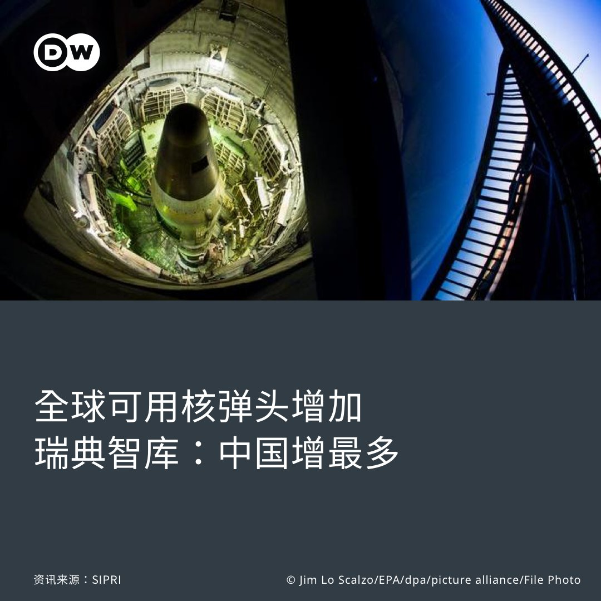
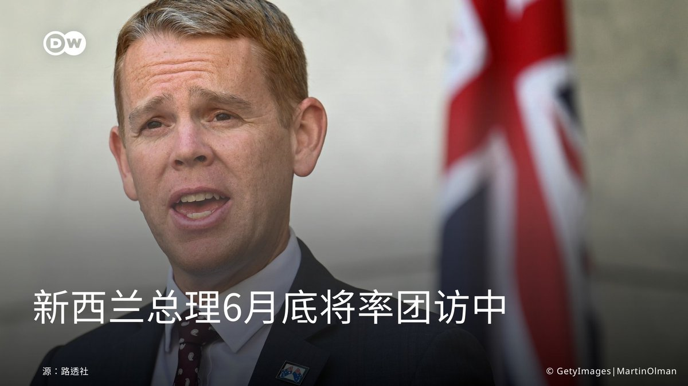

德国之声 北京时间 2023-06-12T22:26:16Z 1668263453029457923 据美国政治新闻网 ( politico ) 报道，特朗普近日表示，即使他最终被判有罪，也会继续竞选美国总统。不过，特朗普预计他不会被定罪，并表示不打算接受认罪协议。 https://t.co/ZYN8KJRrIV   德国之声 北京时间 2023-06-12T22:30:41Z 1668264565144969219 上周，美国财政部对中国大陆、香港和伊朗的六家实体和七名个人实施制裁，理由是他们涉嫌帮助伊朗获得研制弹道导弹的部件与技术。https://t.co/5KbO44nvNg https://t.co/VnevXfinmZ   德国之声 北京时间 2023-06-12T22:39:24Z 1668266757000245248 《南德意志报》：为了准备同台湾开战，习近平制定的目标是，从粮食生产到高科技行业，各个经济领域都应实现自给自足，而此举却降低了中国市场对西方企业吸引力。由于风险激增、薪酬资本上涨以及增长前景下滑，很多在华西方企业已经开始寻找其他的投资地点。https://t.co/vzUaqxaena https://t.co/TZF9b9ywZQ   德国之声 北京时间 2023-06-12T22:50:44Z 1668269608355102720 美国代理常务副国务卿巴斯（John Bass）表示，“如果我们真的认真对待与中国在数字时代的竞争，从我的角度来看，为了一系列明确的利益，我们不能再缺席一个制定科学和技术教育標准的关键平台。“
https://t.co/9f1rMUUXbn https://t.co/v9rJaYjTDT   德国之声 北京时间 2023-06-12T20:53:07Z 1668240011148271617 详细报道：
https://t.co/ON7ONHjdi0   德国之声 北京时间 2023-06-12T20:57:39Z 1668241151273443329 一切将服从“空中卫士23”
北约“空中卫士23”（Air Defender 23）在10天的军演期间掌握空中先行权，民航班机必须绕道飞行。这场由德国指挥的军演是北约历史上规模最大的防空演习。 https://t.co/PzeBGcd8gG   德国之声 北京时间 2023-06-12T21:30:08Z 1668249326060032003 韩国水原地方检察官称，一名韩国半导体制造领域的权威人物涉嫌窃取三星电子的技术在中国建#半导体 制造工厂，给#三星 至少造成3000亿韩元损失。https://t.co/5luXax5ogO https://t.co/Wb9KwEBvGX   德国之声 北京时间 2023-06-12T21:53:44Z 1668255263273484301 美国宾夕法尼亚州费城一座高架桥下方卡车起火，导致95号州际公路（I部分路段坍塌。https://t.co/XcCZSNRbNL https://t.co/1N8TDtFpGh   德国之声 北京时间 2023-06-12T22:02:55Z 1668257574125182980 对汉堡包难说再见 https://t.co/AIDfAo8LNZ   德国之声 北京时间 2023-06-12T19:11:43Z 1668214492407242754 贝卢斯科尼是二战结束后意大利执政时期最长的意大利总理，也是意大利的传媒大亨，全世界知名度最高的意大利人之一。https://t.co/ON7ONHjdi0   德国之声 北京时间 2023-06-12T19:39:55Z 1668221590142611456 #北约 有史以来最大规模的空中#军演 本周一拉开帷幕，有25个国家参与。#美国 将派遣100架飞机飞越大西洋前来参演。 https://t.co/k28Ks9oARY   德国之声 北京时间 2023-06-12T20:10:51Z 1668229372606574595 中共在台海周边活动的军机架次更多。有一种侦察机引起日本国防部的注意。中国半官方的环球时报引述军事专家宋忠平称，解放军8日出动的战机编队是对台以及遏制域外势力军事斗争准备的一种"标配"。https://t.co/mOfiUjLEdX https://t.co/vrz5JGKMRH   德国之声 北京时间 2023-06-12T20:18:09Z 1668231210869436421 更多内容：https://t.co/KR9gAs5dUM   德国之声 北京时间 2023-06-12T20:23:13Z 1668232486302670850 对于崇拜者来说，三度出任意大利总理的贝卢斯科尼是一位有能力、有魅力的政治家，他努力在世界舞台上提升意大利的地位。但对于批评者来说，他是一个民粹主义者，破坏民主并将政治权力作为一种工具，为自己以及自己的企业谋取利益。

https://t.co/ON7ONHjdi0   德国之声 北京时间 2023-06-12T16:35:37Z 1668175209277317120 据中国官媒《人民日报》报道，中国国家主席习近平在内蒙古考察时强调，构建新发展格局，首先要把国内大循环搞好，这是“治本之策”。他还称，“‘双循环’不是要闭关锁国，而是当别人不给我们开门的时候，我们自己还能活下去、活得更好。”你认为“国内大循环”是“治本之策”吗？ https://t.co/HDabo5r6BE   德国之声 北京时间 2023-06-12T17:06:47Z 1668183050004447232 据意大利《晚邮报》6月12日消息，意大利前总理、AC米兰足球俱乐部前主席西尔维奥·贝卢斯科尼12日在米兰圣拉斐尔医院去世，终年86岁。 https://t.co/NxKerKVt1O   德国之声 北京时间 2023-06-12T17:37:28Z 1668190774096277505 香港民主运动的代表歌曲 #愿荣光归香港 即将成为港府规定的 #禁歌 ，许多海外的港人12日在台湾发起串连活动，唱起这首歌。

详细报导👉 https://t.co/oN5juwOhbj https://t.co/I1mM32XZhW   德国之声 北京时间 2023-06-12T18:00:34Z 1668196585686040578 中国有许多年轻人不想结婚，这是为什么？欢迎留言。

详细报导👉https://t.co/Jv9RhYTGvM https://t.co/CWi8LipaUV   德国之声 北京时间 2023-06-12T16:00:41Z 1668166415642431488 媒体日前报导，#中国 计划在 #古巴 建置新的间谍基地以拦截 #美国 通信。 #白宫 否认该消息后，10日又有匿名美国官员证实，此类中国窃听站已设置多年，北京还曾升级设备。这对美国影响有多大？美国官方态度，为何与匿名消息不同调？ 🇨🇳🇺🇸🇨🇺https://t.co/AmNyVqxRw2   德国之声 北京时间 2023-06-12T11:16:22Z 1668094867824857088 瑞典智库SIPRI最新报告显示，全球可用的 #核弹头 库存增加，可能终结过去30多年来削减核武的外交努力。目前全球 #核武 数目最多的国家是 #俄罗斯 和 #美国，加起来占了约90%，第三名则是 #中国。
详细报导 👉 https://t.co/tgQc7Zt9SP

图为美国博物馆内展示的泰坦二号导弹。 https://t.co/mZ21Kk27s8   德国之声 北京时间 2023-06-12T12:06:36Z 1668107508152664065 【新西兰总理本月底将访问中国】🇨🇳🇳🇿
路透社报导，#新西兰 总理希普金斯（Chris Hipkins）周一（6月12日）表示，他将于本月底率领贸易代表团访问 #中国。
 
去年底，时任新西兰总理的阿德恩（Jacinda Ardern）曾在曼谷的亚太经合会上，会见 #习近平，并称她有意在中国放宽境管后率贸易代表团前往访问。 https://t.co/UhEVXJKeio   德国之声 北京时间 2023-06-12T08:48:28Z 1668057644328968192 【偷拍网站主嫌遭爆来自中国 余波断⋯或不断？ 】🇨🇳
英媒9日爆出东亚一个" #痴汉 网站"，内容充斥中港台、日韩的地铁站 #偷拍 及性侵影片，主嫌及管理员是在日中国人。消息一出，高挂 #微博热搜 不久后遭撤。微博网友质疑，相较当年韩国 #N号房 事件铺天盖地的报导，此新闻在中国国内竟无水花 （续） https://t.co/sd89te1KWe   德国之声 北京时间 2023-06-12T08:49:36Z 1668057930640531456 也有人揶揄"事情已解决"、"从上到下地打压女性，还想提高生育率呢"。

无独有偶，中国广州 #地铁 10日有位女乘客怀疑被一名蹲坐大叔偷拍，上前要求检查手机未见相关照片，后上网曝光称对方是猥琐男，遭网友质疑造谣、冲上热搜第一。（续）   德国之声 北京时间 2023-06-12T08:50:19Z 1668058109632446464 警方介入后双方虽已和解，但该女所读的四川大学传仍欲将其开除，女子哭求谅解后大叔父子表示"只要女子公开道歉即可"，引发新一波热搜讨论"造谣的代价只要哭一顿就好？"（续）   德国之声 北京时间 2023-06-12T08:50:34Z 1668058176607129601 🤔以上两件微博热搜事件，显示中国女性在搭乘大众运输工具时，可能因担忧"被偷拍"而草木皆兵。您在搭乘地铁时，也有这样的疑虑吗？请在留言处跟与我们分享👇   德国之声 北京时间 2023-06-12T09:50:02Z 1668073140310757376 阿拉伯国家与中国11日在 #利雅得 召开 #商业合作论坛，主办国 #沙特 称“中国石油需求仍在增长”，欲深化与北京的经贸关系，引起 #美国 关注。在中美角力之下，沙特是否正在“选边站”？
https://t.co/6CUlW4nldA   德国之声 北京时间 2023-06-12T05:51:00Z 1668012984113983488 【墙外文摘：主张“批量宰杀女人”的网暴者为什么在中国不受审查？】
有评论认为，在中国女权博主遭到大量删号和人身攻击的同时，主张“建立一个屠宰场批量宰杀女人”并组织网暴行动的仇女群组却没有遭到审查，因为网络平台审查的标准在于“是否危害社会稳定和国家安全”。
🔗https://t.co/Xh7EXIEnAy https://t.co/5DedcdQz3W   