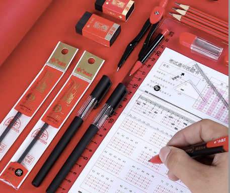
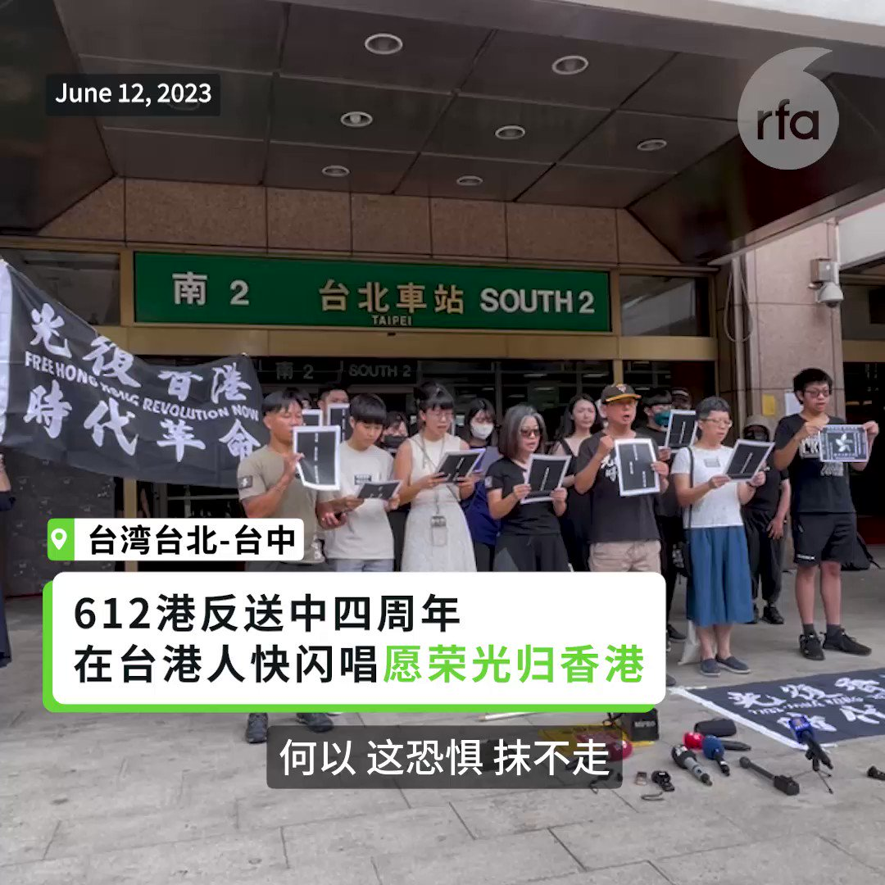
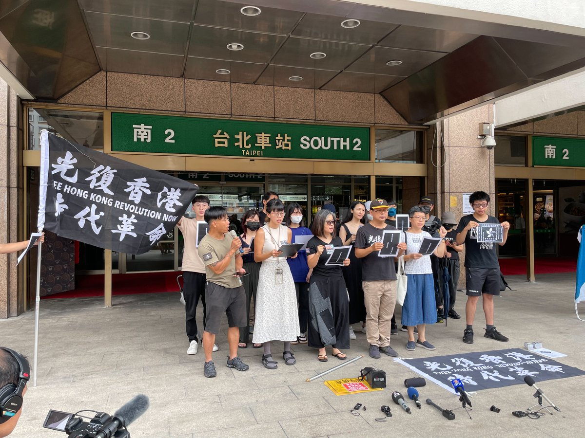

自由亚洲电台 北京时间 2023-06-12T22:26:30Z 1668263509807751168 RT @RFA_Chinese: 【欢迎加入自由亚洲电台电报群】https://t.co/UkKZmFSRkG https://t.co/Qid2LNZxJn   自由亚洲电台 北京时间 2023-06-12T22:55:14Z 1668270740586520580 【“#台湾不是中国吗”？ 梅西不是段子手吗？】
足球巨星 #梅西 日前到访中国，但却因签证问题滞留北京机场，相关消息甚至引发台湾是不是属于中国一部分的舆论热议。

据中国的每日经济新闻网报道，梅西此行计划6月15日率阿根廷队在北京与澳大利亚队进行友谊比赛。但梅西周六抵达中国时，却因所持西班牙护照与中国没有免签证待遇而滞留北京机场约2个小时。

台湾中央社的报道说，西班牙民众入境中国没有免签待遇，但入境台湾却可以免签，因此有中国网友表示，有现场人士说梅西还反问“台湾不是中国吗”？这个反问，“呛得魔都海关没法正面回应”。还有网友表示，都说中国#的朋友遍天下，但大国的落地签有几何？为什么台湾民众能去那么多落地签的地方，而中国大陆居民却不行？   自由亚洲电台 北京时间 2023-06-12T23:20:03Z 1668276988015181825 南昌一所高校的校园餐厅吃到疑似"老鼠头"，而官方坚持是鸭脖子。究竟是鸭还是鼠？江西省政府已成立由省教育厅、省公安厅、省国资委、省市场监督管理局等部门组成的联合调查组进行调查。与此同时，中国法律人士发出公民建议书，呼吁当局彻查此事并接受社会监督。

https://t.co/2HfeCdDTkS   自由亚洲电台 北京时间 2023-06-12T23:34:59Z 1668280744790355968 4年前的6月12日，大批示威者包围香港立法会，阻止港府强推《逃犯条例》修订草案，标志着 #反送中运动 的开端。 4年过去，全球多地举行纪念活动。其中在伦敦，近千名港人在国会外集会，反对英国对华态度转弱。

https://t.co/4glrElGXAm   自由亚洲电台 北京时间 2023-06-12T21:03:56Z 1668242730592665603 【河南官方指定高考用笔成考生“杀手”】
【“爱好”文具月前被质监局点名不合格】
今年的高考上周结束，河南一百多万考生使用政府统一采购，又卖给考生的墨水笔，不是漏水快，就是不出水。有学生抱怨一次考试换了4次水笔，笔的质量远不如其它牌子。官媒报道，河南考生使用“爱好”厂出品的文具，不久前被质检总局点名部分“不合格”。详细报道:https://t.co/cCNjHmuTmJ
#高考   自由亚洲电台 北京时间 2023-06-12T21:39:32Z 1668251689399517184 美国智库本周一发布的一份最新民调发现，与中国联系紧密的韩国、新加坡、菲律宾三国民众普遍对美中竞争导致的紧张局势升级感到担忧，但当地区主权遭受侵犯时，大多数人支持美国进行干预。

https://t.co/WNbm7vfPkt   自由亚洲电台 北京时间 2023-06-12T19:14:25Z 1668215169896579072 【四年前612香港两百万人上街】
【在台港人唱《愿荣光归香港》纪念反送中四周年】

一批在台湾的香港人周一（6月12日）香港反送中抗争四周年，发起在台北和台中快闪合唱代表香港抗争的歌曲《愿荣光归香港》。参与者表示，这首歌代表港人的勇气和身份认同，因为港府欲申请禁制令禁播，海外的港人更要放声唱，为不能发声的港人发声。
#612
#愿荣光归香港   自由亚洲电台 北京时间 2023-06-12T19:42:46Z 1668222306093764608 【港法院审理港府提禁播《愿荣光归香港》申请】
【在台港人合唱《愿荣光归香港》纪念612四周年】
在台港人连续在刚过去的周六和本周一发起游行和快闪合唱反送中抗争歌曲《愿荣光归香港》，纪念612四周年。而香港法院也在612这一天，开庭审理港府提出禁播《愿荣光归香港》的申请。在台港人说：“这首歌代表了我们一份的勇气，代表我们香港一些抗争人士的过去，真的记录了我们怎样对抗极权。而且我们今天唱这首歌，是代替一些不能唱的人去唱。”详细报道：https://t.co/jHTvTjfuE7
#愿荣光归香港   自由亚洲电台 北京时间 2023-06-12T12:58:57Z 1668120681287122944 香港反送中运动4周年，英国多地都有港人举办游行集会。其中在南安普顿（Southampton），有港人在参与集会后被疑似中国留学生殴打，手臂和颈部多处留有伤痕。

https://t.co/1fBqUgU7Zr   自由亚洲电台 北京时间 2023-06-12T12:59:45Z 1668120884232753152 韩联社本周日引述韩国总统室一位高级官员表示，截至当天零时，朝鲜预告发射军事侦察卫星的期限已过，韩国政府将继续保持戒备态势。

https://t.co/9vDJ5GEmTk   自由亚洲电台 北京时间 2023-06-12T04:23:30Z 1667990966622625792 4年前的6月12日，大批示威者包围香港立法会，阻止港府强推《逃犯条例》修订草案。但抗议行动遭港警以催泪瓦斯、橡胶子弹武力镇压，成为香港 #反送中运动 标志性的一天。在反送中运动4周年之际，全球多地举办纪念活动。

https://t.co/LDSvEWLC0n   自由亚洲电台 北京时间 2023-06-12T02:22:02Z 1667960395787808769 中国外交部官方网站6月11日发布新闻稿表示，外交部部长助理农融周六约见韩国驻华大使郑在浩，就韩方针对中国驻韩国大使同韩在野党党首李在明会见交流所作“不当反应”提出交涉，并表明“严重关切和不满”。

https://t.co/y14HfQzPu6   自由亚洲电台 北京时间 2023-06-12T02:23:29Z 1667960763330482176 据美国民间宗教权益组织对华援助协会发布的消息，#山西太原郇城教会 传道人 #王应杰、#王瑛 夫妇上周五与外界失联后，目前得知，俩人已被迎泽区派出所警方带走，以执行去年4月份当局的行政拘留决定。

https://t.co/D22k22HK4R   自由亚洲电台 北京时间 2023-06-12T02:20:43Z 1667960066681741313 中国军机再次侵扰台湾空域 军方：10架次逾越 #台海中线
https://t.co/DTJBms0Pv8   