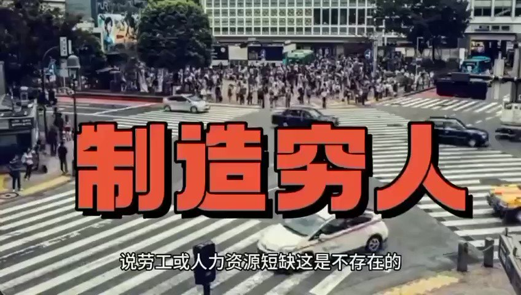
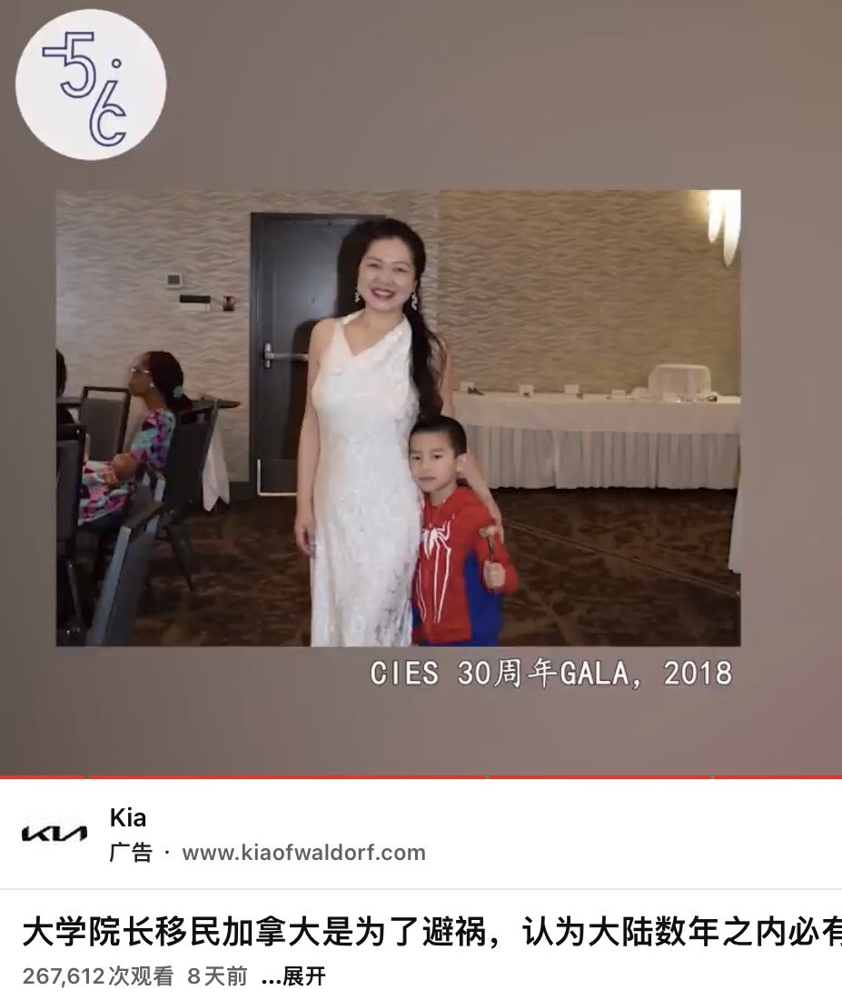
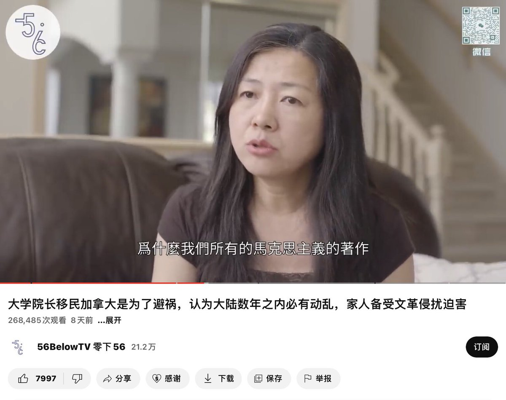
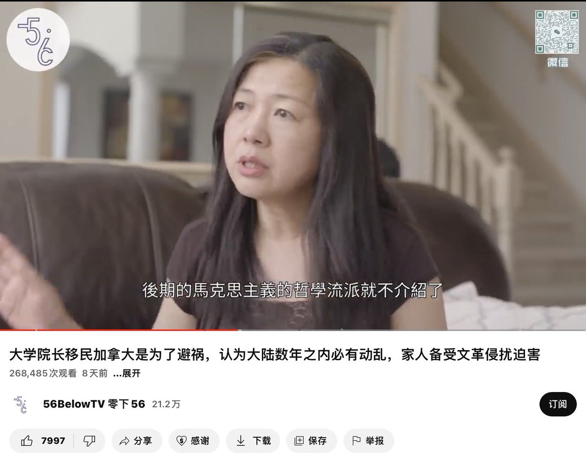

蔡霞 北京时间 2023-06-12T22:25:03Z 1668263144530092034 RT @h5LPyKL7TP6jjop: 制造穷人！就有人口红利！你们勤劳，让我致富！ https://t.co/wshrx1TDeR   蔡霞 北京时间 2023-06-12T02:23:29Z 1667960760943751169 RT @hrw_chinese: "六四34週年前夕，中國異議人士 #喬鑫鑫 在竂國遭到中國跨境抓捕，目前下落不明。人道中國創辦人 @ZhouFengSuo 表示，這是典型的跨國迫害，沒有任何合法性，不僅整個國際秩序遭到破壞，尤其在整個東南亞國家和中國交好的情況下，對中國民運人…   蔡霞 北京时间 2023-06-12T02:36:52Z 1667964130987212800 RT @liqunchen: 与自由雕塑公园一样，“六四纪念馆”从一开始就受到共产党的注意，在加州病毒雕塑被烧毁后、李进进被刺前一周，刘藩和马修找到王军涛，说要捐款给六四纪念馆，借机接近王丹。荣伟发现这就是接近和欺骗陈维明的两个人，立即报告给李进进，李进进报告给FBI。不久李进…   蔡霞 北京时间 2023-06-12T02:39:39Z 1667964830433660931 RT @Wu2020Jack: #一人一推良心犯 #季孝龙
季孝龙，高科技从业者，异议人士，积极为民请命，获得“中国青年人权奖”。2018年开始推动疫苗受害者维权行动，同时倡导“厕所革命”，呼吁“推翻共产党”，获刑三年半。出狱后为民请命反对上海疯狂的疫情清零政策，再遭中共抓捕，…   蔡霞 北京时间 2023-06-12T02:44:40Z 1667966093095317506 RT @liangziyueqian1: 自台湾宣布共机再越过海峡中线将直接开火后，中共军机立马老实了，不敢再犯台湾近空。美军的这道禁令，是给中共套上的又一道紧箍咒。国际社会早已看清中共纸老虎本质，外强中干，色厉内荏。如果共军的鹰派不服气，那就试试吧，战端一开，中共政权必定垮台…   蔡霞 北京时间 2023-06-12T02:48:49Z 1667967137678254083 广西师大出版社在国内是出版界的一个思想学术重镇，他们出了很多好书。何林夏先生无罪！   蔡霞 北京时间 2023-06-12T01:30:16Z 1667947369537601537 偶然看到这个视频，特别推荐：
访谈嘉宾移民到加拿大，她是活得很明白的人。她的家族苦难促使她用心思考国家，思考人性，思考官方的马克思主义，思考要怎么生活，很有启发。
大学院长移民加拿大是为了避祸，认为大陆数年之内必有动乱，家人备受文革侵扰迫害 https://t.co/X1zoICBJ7e 来自 @YouTube https://t.co/Xo5n4ALSsg   蔡霞 北京时间 2023-06-12T01:45:11Z 1667951122210775048 RT @yibao_en: https://t.co/xFZ94Od4j0   