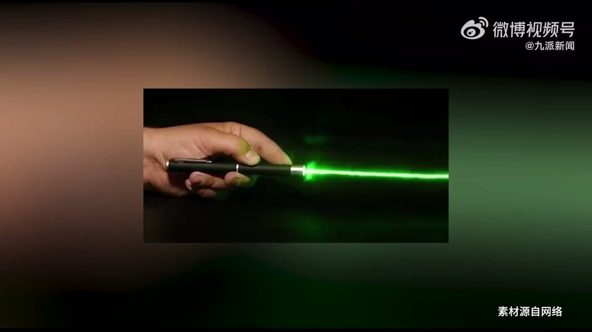
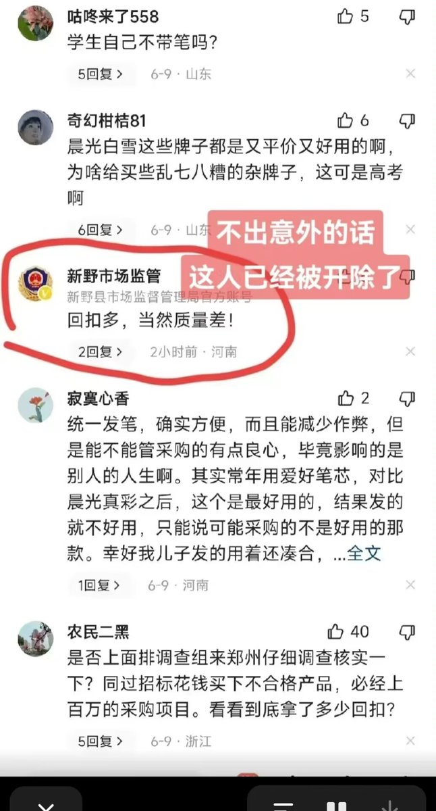
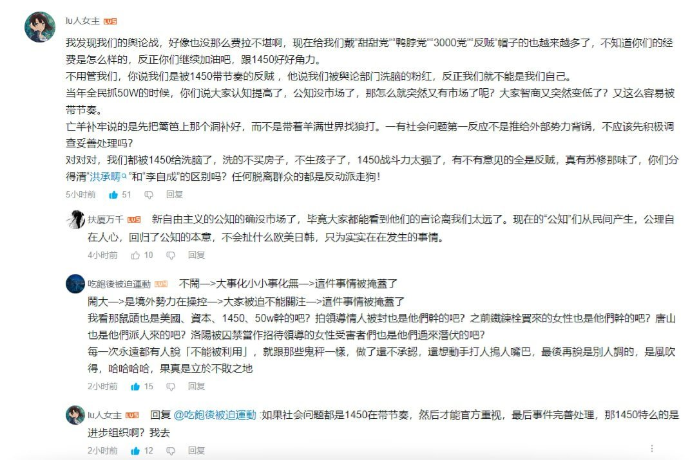
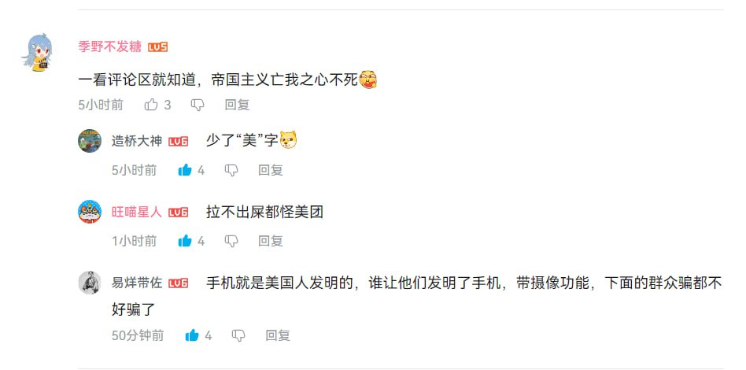

谁将十万横扫三江 北京时间 2023-06-12T22:53:55Z 1668270409433640965 RT @whyyoutouzhele: 网友投稿
11月12日，欧盟驻中国代表团官方微博“欧盟在中国”呼吁立即无条件释放人权律师常玮平。 https://t.co/xHLnfcbIqQ   谁将十万横扫三江 北京时间 2023-06-12T20:53:14Z 1668240038776422402 男子举报妻子的上司柯桥区检察长潘某在饭局中把他的妻子“灌得烂醉如泥，不省人事”   谁将十万横扫三江 北京时间 2023-06-12T21:19:52Z 1668246742901592065 管理者用激光笔射伤工人眼睛 发言：赔偿4600 https://t.co/Docn8ckDkR   谁将十万横扫三江 北京时间 2023-06-12T21:23:34Z 1668247671965114374 在中国，只有政府能零元购 https://t.co/ABXGaRzlOu   谁将十万横扫三江 北京时间 2023-06-12T21:27:53Z 1668248758004633600 RT @torontobigface: 中国老是嘲讽韩国是偷国。
讲道理偷能有中国会偷？
工业革命都开始于郑和下西洋了
这个视频太长了，后面实在离谱，比如宋朝和明朝人就已经计划经营美洲了。
穿越小说都没你顶👍 https://t.co/nxtjoGn1UD   谁将十万横扫三江 北京时间 2023-06-12T21:32:50Z 1668250003540672512 广州最大的临时工市场，每天凌晨4点就开始招聘，但还是有人无工可做 https://t.co/8UjDI2RNmk   谁将十万横扫三江 北京时间 2023-06-12T21:46:49Z 1668253523576856576 电动两轮车社会保有量3.4亿辆，电动三轮车5000万辆 https://t.co/y8mdHjSjaR   谁将十万横扫三江 北京时间 2023-06-12T18:51:53Z 1668209499583414272 没切号，工作没了 https://t.co/0AzQWhTZ3F   谁将十万横扫三江 北京时间 2023-06-12T19:59:06Z 1668226417744830465 https://t.co/3nkxtEMM6M   谁将十万横扫三江 北京时间 2023-06-12T20:12:43Z 1668229841299312644 券业大缩编，降薪、倒追3年打车费

    今年证券公司从业人员已减少多达4291人，减少的主要为经纪人。多家头部券商放缓或暂停“高举高打”的全线扩招路线，两家头部券商人员流失均超过300人，均来自“一般证券业务”。
    行业内卷加剧、公司福利减少、职场内耗等亦综合影响着当下从业人员的职业选择。随着各券商陆续发放2022年年终奖，行业或可能出现离职高峰。
    降薪方案、调岗举措；不同业务条线加强绩效考核、严查考勤，或倒追3年打车费……从业人员正从不同方面感受到行业“寒气”。
    今年以来人员大幅流失主要来自两大领域：一是证券经纪人群体，今年以来人数减少3580人至目前的4.22万人；二是“一般证券业务”，今年以来人数减少1801人。
    挖角越来越难做，甚至比过去三年疫情期还要难做，主要因为证券公司的招人需求比以前要少很多，目前多家券商在压缩成本。

来源：券商中国

高歌猛进的券商扩招或已结束。

截至近日，今年证券公司从业人员已减少多达4291人，减少的主要为经纪人。数据亦显示，多家头部券商放缓或暂停“高举高打”的全线扩招路线，两家头部券商人员流失均超过300人，均来自“一般证券业务”。

有市场人士认为，随着各券商陆续发放2022年年终奖，行业或可能出现离职高峰。

随着市场环境和政策环境变化，证券业从业者正面临艰难的职业选择。陆续有券商出炉降薪方案、调岗举措；不同业务条线加强绩效考核、严查考勤，或倒追3年打车费……从业人员正从不同方面感受到行业“寒气”。有猎头表示，在行业不景气下，如今挖角业务也难做，跳槽难以溢价，另一方面金融求职人士换工作也更为保守，更加求稳。

半年流失逾4000人

在经历过去两年人员大幅增长后，今年证券业从业人员数量掉头向下，震荡下行。

券商中国记者据东方财富Choice数据统计，截至6月6日，券商合计有35.2万名从业人员，较年初减少4291人。而去年同期从业人员数量则增长3400多人，2021年同期也增长了3700多人。

为何今年以来从业人员出现减少？有中型券商中后台人士谈道，今年券商整体释放的招聘需求比往年减少，而提出离职的人员在增加。

谈及人员流失，深圳一名券商投行人士表示：一是业务难做，去年券商多个业务条线业绩下滑，而展望今年，比如投行业务难言有很可观的改善；二是相应的待遇减少，一方面源于业务压力，另一方面则是“限薪令”，在降薪潮下从业人员受到不同程度的影响。

根据券商中国记者计算2022年43家上市券商员工的人均薪酬，逾九成人均薪酬减少。降薪后上市券商员工人均薪酬均值为48.30万元，较上一年度的59.59万元减少18.95%。有30家券商员工人均薪酬集中在30万-50万之间，占比近70%。

而就在近期，券商中国记者从头部券商内部人士求证了解到，该券商出台降薪方案，投行条线中低职级员工的每月固定薪酬普降，根据职级每月固薪的降幅在5000元至10000元之间。

此外，业务转型升级对人才素养提出更高要求，难以跟上的从业人员会面临淘汰。

根据券商中国记者统计，今年以来人员大幅流失主要来自两大领域：一是证券经纪人群体，今年以来人数减少3580人至目前的4.22万人。近年来在财富管理转型“买方投顾”的背景下，行业持续鼓励“证券经纪人”向“投资顾问”转型。不过今年投顾人员增加不到千人，增速大幅下滑，仅1.27%，去年同期投顾数量增加2326人，增长3.29%；二是“一般证券业务”，今年以来人数减少1801人。

另有受访人士认为，行业内卷加剧、公司福利减少、职场内耗等亦综合影响着当下从业人员的职业选择。

扩招后的头部券商如今减员明显

在这当中，头部券商的一举一动备受市场关注。在2021年-2022年全行业人员大幅增长时，头部券商全线大举扩招，以极具竞争力的薪酬在业内“掐尖”。如今，这些证券公司今年均出现规模不小的人员流失。

根据券商中国记者统计，中信建投证券今年以来已减少373人，截至目前人员减少规模为行业之最，人员流失主要来自“一般证券业务”（减少371人），现有员工1.2万人。而在2021年至2022年期间，中信建投证券人员扩充超过2000人。

券商中国记者向中信建投证券了解今年的人员招聘规划时，公司相关人士表示，具备各类行业、专业复合型背景的人才仍然是各家证券机构在加强金融服务实体工作中需要着力吸引和凝聚的人才类别。“懂行业、懂客户，并善于管理化解风险的复合型人才还存在一定程度的结构性缺口，中信建投证券也会着力发掘、吸引、培养这方面的人才。”

当年大幅扩充人员的还有中信证券，根据券商中国记者合并母子公司统计口径来计算，中信证券在2021年至2022年间大幅新增4326人。而在今年，中信证券母子公司减员合计高达351人，人员流失亦主要来自“一般证券业务”，截至目前合计共有1.81万人。

据了解，当年为加大对人才的吸引力，头部券商一度大幅涨薪，比如投行Senior Associate（SA）级别（即“高级经理”）底薪最少涨至3.8万，这对刚刚毕业的应届生（SA1职级）而言已非常可观。

一方面是平台大，另一方面是待遇高，头部券商的招人动作曾令不少中小券商慨叹“比不上”。

同样在过去两年高歌扩充逾4500人的中金公司，今年仍在扩充队伍，但节奏明显放缓。母公司与子公司中金财富证券合计增员145人，截至目前共有1.24万人，其中人数增长主要来自“投资顾问”群体，增加150人至2105人。

此外大型券商中，各家增减员情况不同。招商证券、广发证券、国信证券三家华南券商今年以来人员均减少逾百人，其中招商证券减员362人，主要是证券经纪人的流失（减少251人）。而中国银河证券、华泰证券、国泰君安今年以来均增员上百人，都主要为“一般证券业务”增员。

职业选择的煎熬

业内分析，券商放缓扩员脚步与市场低迷、业务不景气、限薪令等相关。随之而来的是证券公司控制成本、从严的考核力度等。

比如近日有记者求证获悉，一家中型券商研究所内部出台相关规定，要求各团队按照派点占比水平定岗，若人数占比水平在一年后仍高于派点占比水平，则淘汰人员直至派点占比水平。华东一家研究所则在日常考核中增加答辩环节，若答辩不通过，公司将依据综合因素决定是否调岗。

华东一家大型券商投行人士告诉记者，与往年不同的是，今年公司投行招聘对象主要为应届生，社会招聘名额十分有限，“具体什么原因不清楚，但从人力成本来看，投行熟手比应届生要更高。”

华东地区一名金融猎头向记者坦露，挖角越来越难做，甚至比过去三年疫情期还要难做，主要因为证券公司的招人需求比以前要少很多，据其感受，目前多家券商在压缩成本。

有受访从业人员表示现阶段十分煎熬，一方面是“活多钱少”，另一方面难以找到更好出路。深圳一家中型券商中后台人士向记者表示，自己寻找工作机会已有一两年时间，“面试了不同类型的金融机构，但很难匹配上，工作内容的性价比也不高，相关公司的职场也存在不同的内耗问题。”他表示会继续观望，愿意降低薪酬预期以换得更舒适的工作。

深圳一家大型券商保代向记者表示有跳槽意愿，也没有看到好的工作机会，“虽然今年陆续接到猎头电话的推荐，但待遇情况没有达到我预期，整体来看，甚至打压我们预期。”

前述金融猎头向记者表示，当前环境下，金融机构从业人员换工作很难像往年溢价跳槽，待遇最多是微涨，多数情况下是平移，甚至比上一份工作的薪酬还要低。

他也谈道，现在有意向换工作的券商从业者，跳槽时比以前更保守，心态主要求稳   谁将十万横扫三江 北京时间 2023-06-12T20:22:04Z 1668232195344044033 近日，深圳一名员工入职两天就被用人单位解雇，辞退的理由竟是“吃员工餐饭量大”

法院：这是劳动者碰瓷，个别不良劳动者，以诉讼为目的，专门选取用工不够规范的中小企业为“跳槽”载体，不断变更工作单位，频繁提起“碰瓷式”劳动争议诉讼，谋取不当利益，影响极其恶劣，需引起高度重视。 https://t.co/UEC1UWszwT   谁将十万横扫三江 北京时间 2023-06-12T18:08:49Z 1668198663494205440 RT @whyyoutouzhele: 网友投稿
6月12日早上九点，杭州主城区江城路，疑似一名环卫工人因工资问题，捅伤三人。 https://t.co/8nRwxn2VAw   谁将十万横扫三江 北京时间 2023-06-12T18:08:55Z 1668198688500625408 RT @whyyoutouzhele: 网友投稿
6月12日7时许，北京人大附中。
一名被学校辞退的保安驾驶一辆抢夺的网约车驶入校内，途中剐蹭一名学生，后将另外一名学生劫持。
7时55分嫌疑人被公安部门控制，被劫持学生已安全解救（无明显外伤），被撞学生已送医治疗。
有关部门正进…   谁将十万横扫三江 北京时间 2023-06-12T12:33:10Z 1668114193604816896 什么叫国进民退？
深圳顶楼复式大平层只要300块，等政府接手之后。你花1500一个月也只能租到相同地方10平米的逼仄小屋 https://t.co/ZFKP4J2s1J   谁将十万横扫三江 北京时间 2023-06-12T12:52:51Z 1668119148021559296 “鸭脖事件你怎么看？”
“美帝国主义亡我之心不死” https://t.co/3qThwag70A   谁将十万横扫三江 北京时间 2023-06-12T07:43:54Z 1668041396769415169 。。。 https://t.co/mIfTmGM2e6   谁将十万横扫三江 北京时间 2023-06-12T07:44:27Z 1668041537123434497 https://t.co/kNYR1HYiUz   谁将十万横扫三江 北京时间 2023-06-12T07:46:54Z 1668042153984147458 RT @whyyoutouzhele: 网友投稿
6月11日晚，江苏扬州高邮一个男子在街道无差别撞人。
按医院视频拍摄者说是撞了8个人，死了2个，有6个人还在抢救，连撞到汽车发动机坏掉之后弃车逃逸了，然后狂发朋友圈挑衅。据称男子是一名精神病患者。 https://t.co/4c…   谁将十万横扫三江 北京时间 2023-06-12T07:47:21Z 1668042266731220992 RT @whyyoutouzhele: 网友投稿
6月8日下午，辽宁沈阳大悦城中街。一名男子悬挂在高楼向外抛洒人民币和申诉书。
根据申诉书显示，男子自称自己实名举报抚顺一黑恶势力绑架其家人，被人冤枉成精神病，才用这种方式引起关注。 https://t.co/9V2zPWYsyo   