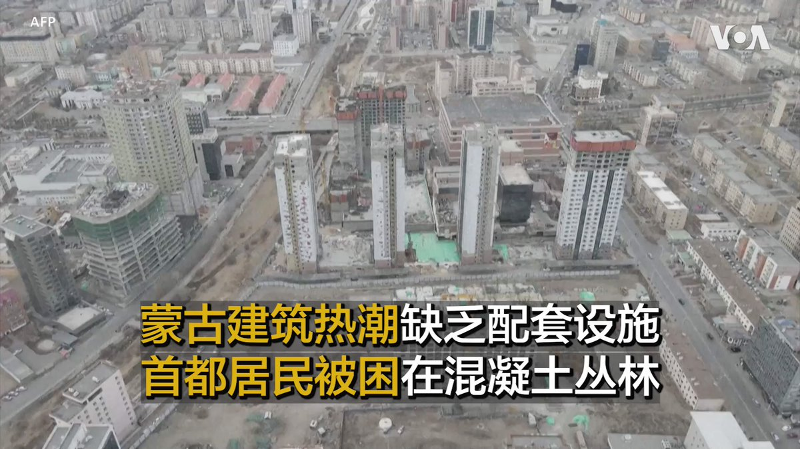
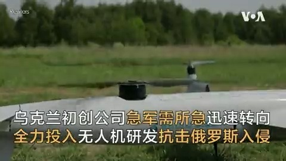
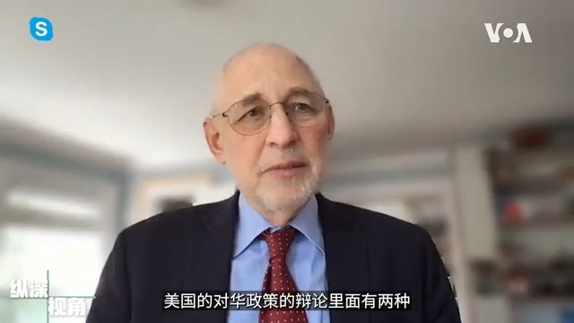

美国之音中文网 北京时间 2023-06-11T22:19:34Z 1667899378034675712 东盟10国将首度举行南中国海军演 专家:选争议水域向中国示威 https://t.co/JHFfMIQbVE   美国之音中文网 北京时间 2023-06-11T22:19:36Z 1667899385093713921 洪都拉斯与台湾断交后数月在北京正式开设大使馆 https://t.co/W2b0Alum17   美国之音中文网 北京时间 2023-06-11T22:26:40Z 1667901163226767362 近来国际间不断示警台海危机在正升高，但对于习近平是否真正做好发动战争的决定则是众说纷纭。分析人士表示，虽然中国当前遭逢前所未有的内外交迫困境，但尚不足以让中共以“替罪羔羊”的手段来转移国内矛盾，台海现状尚无爆发战争的立即明显征候。报道： https://t.co/Laa16YxMau https://t.co/f1tptSdWIl   美国之音中文网 北京时间 2023-06-11T21:54:32Z 1667893078202683392 乌克兰：俄军炸毁卡霍夫卡大坝以阻止乌军在南部反攻 https://t.co/aundh07U5K   美国之音中文网 北京时间 2023-06-11T22:01:30Z 1667894831492874241 乌克兰总统泽连斯基11日会见阿拉伯联合酋长国气候变化与环境部长阿姆海里（ Mariam Almheiri ）。泽连斯基感谢阿联酋提供人道援助，以及愿意为卡霍夫卡大坝被炸造成的损害提供帮助。阿姆海里指出卡霍夫卡大坝被炸不仅造成了民生，环境，可能还有食品安全问题。 https://t.co/Jgn4uZSEva   美国之音中文网 北京时间 2023-06-11T16:36:33Z 1667813054351032320 中国周日再次扰台 10架次军机飞越台海中线 https://t.co/JX7D6PLk6p   美国之音中文网 北京时间 2023-06-11T12:16:33Z 1667747625989459968 台湾数位发展部长本周对英国进行罕见的访问 https://t.co/tzNb3hz95d   美国之音中文网 北京时间 2023-06-11T10:23:02Z 1667719057527939073 天公作美 加拿大东部天空将因降雨很快晴朗 但魁北克火灾仍在肆虐 https://t.co/KQggeLUVkN   美国之音中文网 北京时间 2023-06-11T10:48:47Z 1667725537614110720 #美中对标 中国热点对标美国论据，用一杯咖啡的时间聊聊中国热点的美国冷思考。本周中国高中生迎来人生第一重大考验-高考。美国高中生为了进入大学也需参加标准化考试，但美国大学更看重学生的综合素质。本期视频看看美国大学如何甄选人才。https://t.co/9XmJxHWMeY https://t.co/lWjMBeMlJ6   美国之音中文网 北京时间 2023-06-11T11:00:00Z 1667728359441461250 蒙古首都乌兰巴托建有成吉思汗端坐的塑像，而带领蒙古从中国统治下独立出来的苏赫巴托尔在塑像中骑着马，这座曾经的游牧之城正在转变为钢筋水泥的丛林，高层建筑四处拔地而起。当地的建设热潮由向中国等出口矿产资源的收入推动，但配套设施不够，学校、医院、儿童游乐场缺少预留土地。 https://t.co/E3RjYWe7O1   美国之音中文网 北京时间 2023-06-11T08:00:01Z 1667683063399153671 从中国大疆不同系列民用机到土耳其旗手TB-2低成本察打一体机，乌克兰军队利用无人机完成多种功能，在战场上有效打击俄军，从坦克到巡洋舰。高科技初创公司的尤金和同事们也转向无人机领域，他们在波兰研发的“卫士”无人机进入最后测试，它具备在强风等恶劣条件下收集情报的能力。 https://t.co/f1X6Y19fcO   美国之音中文网 北京时间 2023-06-11T08:09:33Z 1667685462750945280 分析：台海现状尚无爆发战争的立即明显征候 https://t.co/9fxjZeJTJz   美国之音中文网 北京时间 2023-06-11T08:19:03Z 1667687857258127360 美国官员：中国一段时间以来一直从古巴开展间谍活动 https://t.co/8jlmE85sge   美国之音中文网 北京时间 2023-06-11T08:45:02Z 1667694396157100032 达赖喇嘛会见刘晓波遗孀刘霞 https://t.co/5oAM9wMWsH   美国之音中文网 北京时间 2023-06-11T04:55:31Z 1667636633393590272 西藏精神领袖达赖喇嘛10日在印度达兰萨拉会见了诺贝尔和平奖获得者刘晓波的遗孀刘霞。刘霞送给达赖喇嘛刘晓波的诗集和她的个人摄影集。 https://t.co/0y5cXJvxpY   美国之音中文网 北京时间 2023-06-11T05:13:04Z 1667641051132350464 南非总统向习介绍了俄罗斯与乌克兰之间的非洲和平计划 https://t.co/9NiTZyPsRg   美国之音中文网 北京时间 2023-06-11T05:30:00Z 1667645311165116427 卡霍夫卡大坝被炸在乌克兰南部赫尔松地区引发洪水，乌克兰边防局公布的视频显示被冲到港口城市敖德萨附近的房顶和家具。 https://t.co/HFO0LNC6Ar   美国之音中文网 北京时间 2023-06-11T06:00:00Z 1667652863948906496 与前任江泽民、胡锦涛相比，习近平时期中国当局拘押扣留的美国公民人数更多，刑期更长，释放的政治犯和宗教囚犯更少。数十年为争取中共释放囚犯奔走的对话基金会创办人康原(John Kamm)一直关注德克萨斯商人、被广东法院判死缓的斯威丹，他建议美国公民赴华旅行需更为小心。 https://t.co/2tfiJnu9uM   美国之音中文网 北京时间 2023-06-11T02:30:00Z 1667600013625548800 中国越强大，误解中国风险也越大？美国汉学家、哥伦比亚大学政治学教授黎安友解释说：美国对华政策中的拥抱熊猫派已经不存在，美中爆发危险战争的可能性是存在的。#黎安友 完整专访请看6/10【纵深视角】：https://t.co/K2p9eypddv https://t.co/oSgWUCHy2R   美国之音中文网 北京时间 2023-06-11T03:03:33Z 1667608456713605120 土耳其火箭炸药工厂爆炸导致5人死亡 https://t.co/3upenEMg3g   美国之音中文网 北京时间 2023-06-11T04:06:33Z 1667624311639928832 泽连斯基对反攻表示乐观，但没有透露军事进展 https://t.co/2v14D1Glnr   美国之音中文网 北京时间 2023-06-11T00:27:27Z 1667569171549364226 既说中共弹性威权意味政权能持续，又说中共对长期执政有焦虑。如何解释？美国汉学家、哥伦比亚大学政治学教授黎安友说：现在看不出中共政权会变化。但从白纸运动来看，中国人耐性并非无限制。经济越发展，中共治理模式潜在危险就越大。#黎安友 完整专访请看6/10【纵深视角】：https://t.co/K2p9eypddv https://t.co/0N34hGG0bw   美国之音中文网 北京时间 2023-06-11T00:45:22Z 1667573682884034561 英国皇家卫兵10日为6月17日的国王官方生日阅兵庆典进行排练时至少有三名卫兵晕倒。当时的气温超过摄氏30度。 https://t.co/Ymm0hsQWUi   美国之音中文网 北京时间 2023-06-11T02:11:03Z 1667595246132408321 微软准备将其旗下顶级AI专家从中国调至加拿大以防被中国挖走 https://t.co/yrIsUtS49M   