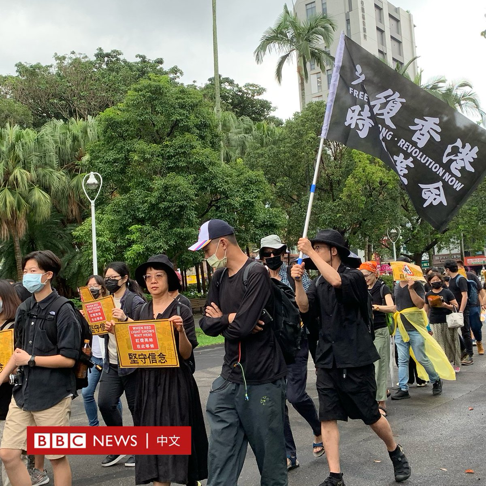
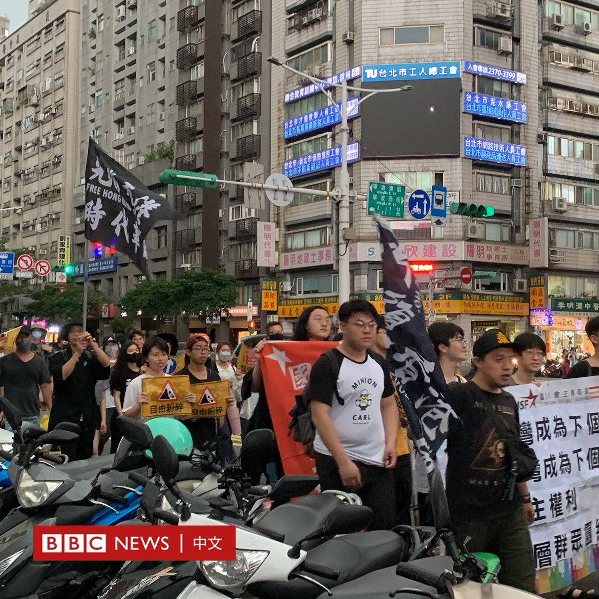
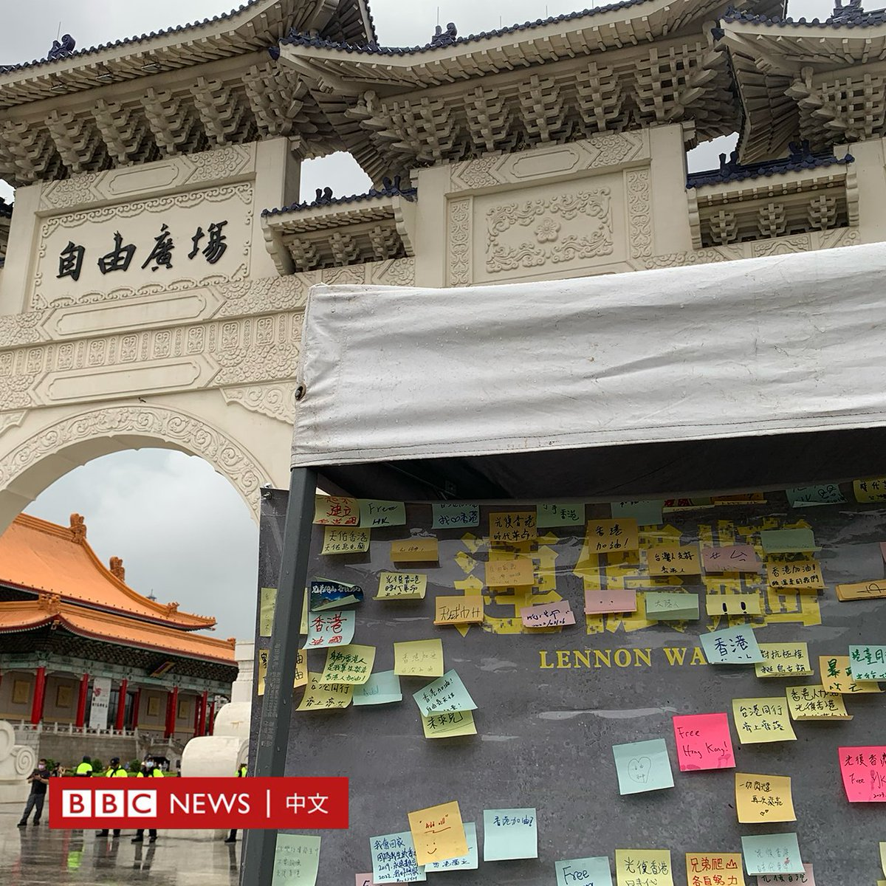
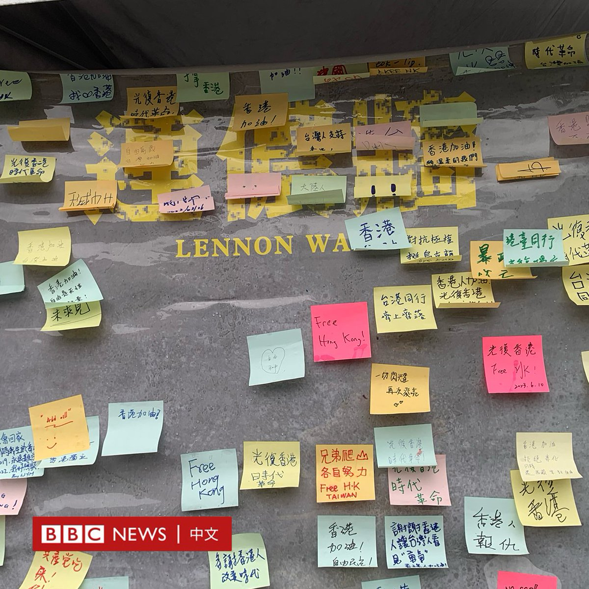
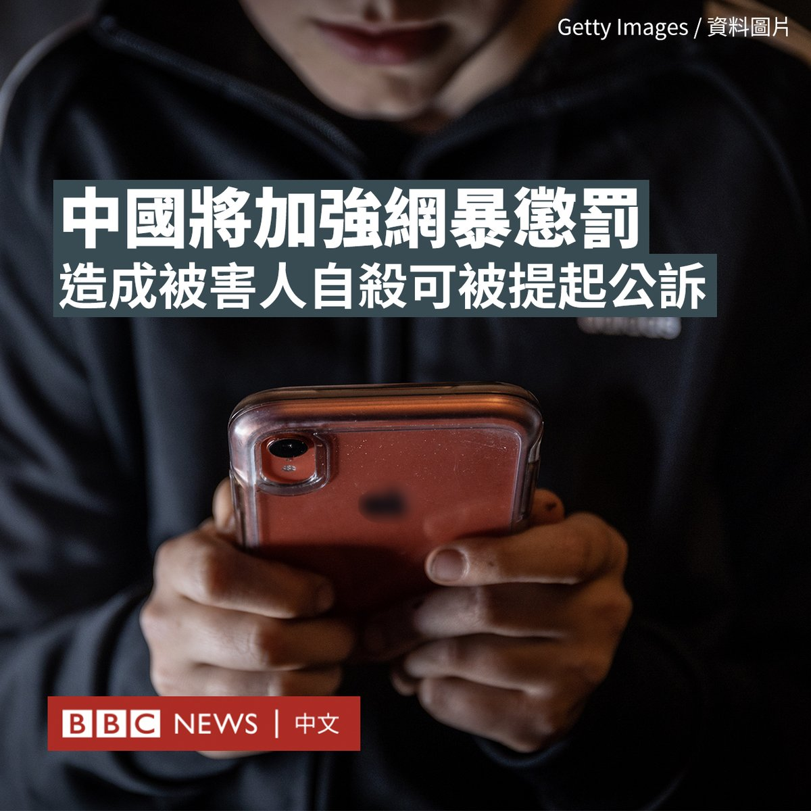

D英国广播公司BBC 北京时间 2023-06-10T22:46:56Z 1667543878562398208 美国前总统特朗普今年以来第二次遭刑事检控。法律专家指，对希望2024年再次竞选总统的他来说，一旦罪成可能要入狱一段时间。不过，根据美国法律，即使被刑事起诉他也可以竞选公职。https://t.co/mIUbopeFZM   D英国广播公司BBC 北京时间 2023-06-10T19:53:24Z 1667500205355442177 6月10日下午，多个人权团体在台北举行“逆风并行，再见香港”游行。

人权团体手持标语横幅，下午三点从台湾大学校门口出发，终点为中正纪念堂自由广场。根据主办单位统计，出发时人数约500人，参与游行群众沿路增加，最高峰达到近千人。

由前导车领队，立法委员洪申翰、台大香港研究社、香港边城青年等团体，接力登上前导车宣讲区，带领群众回顾香港民主运动的发展，从2003年的反《基本法》23条立法、2014年雨伞革命、2020年港版国安法等等。

前导车播放着“愿荣光归香港”的背景音乐。每当一个宣讲结束，群众就高喊口号，用粤语和国语喊“光复香港、时代革命”，以及“Stand with Hong Kong, Fight for freedom”。

BBC中文采访了几位游行参加者，45岁的熊小姐来自台湾，她从2020年开始关注香港的游行，她说：“现在香港人因为安全问题，没办法发声，我觉得我们在香港以外的地方，还有权力帮他们说话，就要帮他们发声。”

被称为TS的香港人是一位大学生，台大香港研究社成员。他觉得有“梦回四年前的香港的感觉”，并表示2019年在香港的经历，成为推动他来台湾读大学的动力，他说：“今天这么多人出来，可能很多人心里没有平复。台湾算是一个，延续香港未竟抗争的场合。”

一名高举“光复香港 时代革命”旗子的台湾男子刘先生，全程以台语说：“香港是香港人的，台湾是台湾人的，我们为了维持我们自己的民主自由，我们要站出来，跟中国共产党说：『我们不是好欺负的』，我们有民主自由，你们没有。”

游行队伍即将抵达自由广场前，下起倾盆大雨，但抵达自由广场，NGO工作者用横幅排成人链后，大雨停止。民众继续听讲、喊口号，没有离开。

台湾NGO工作者李明哲曾因触犯“颠覆国家政权罪”，被中国判刑5年，他在自由广场接受访问说道：“香港议题对台湾人来说，已经是台湾人日常生活的一部分了。当中国不断诉求一国两制统一台湾的时候，当我们台湾人想到一国两制的时候，我们就想到香港，我们不相信中国。”

立法委员林昶佐表示，以自己过去两三年参与国际场合的观察，发现香港议题，依旧很重要。他从两三年前开始推动的“入出国及移民法”，想跟关心香港议题的朋友说，我们继续在关注、继续在推进。   D英国广播公司BBC 北京时间 2023-06-10T14:27:10Z 1667418107714113536 在中国连续发生多起因网络暴力和欺凌而导致受害者死亡的案例后，当局表示，实施网络暴力可能会被刑事起诉。

据官方媒体周五（6月9日）报道，中国最高人民法院、最高人民检察院和公安部公布了《关于依法惩治网络暴力违法犯罪的指导意见》征求意见稿。

根据该草案，如果实施网络暴力造成被害人精神失常、自杀等严重后果，将被认定为“严重危害社会秩序”。

该草案还明确，网络侮辱行为将以侮辱罪定罪处罚，组织“人肉搜索”按照侵犯公民个人信息罪定罪处罚。

此外，该草案强调，利用“深度合成”技术发布违法信息或编造“涉性”话题侵害他人人格尊严，将被从重处罚。

该草案受到网友的支持。一名微博网友评论说：“好消息，希望能落实。现在的人跟风太严重，没有一点思考。”

中国已发生过多起网暴致人自杀事件。去年7月，一名23岁的女生在社交媒体上分享与卧病在床的祖父庆祝获研究生录取的照片后，遭遇大规模网暴。一些网友指责她染了粉红色头发。

今年5月，武汉一名小学生被老师在校内驾车撞伤致死。其母杨女士赶到现场后悲痛欲绝。但几天后，这名母亲也坠楼身亡。

有报道说，这位经历丧子之痛的妈妈生前遭到网友恶意揣测甚至言语暴力，可能是其轻生的导火索。但也有人指出，校方的冷漠及警方的维稳做法引发了悲剧。BBC无法证实这些说法。

但是，网暴在中国却有愈演愈烈的趋势。2022年一项针对中国2000多名社交媒体用户的调查发现，约四成受访者经历过某种形式的网络暴力。调查还发现，16%的受害者有自杀的想法。去年3月，“网暴追究刑责”写入中国最高法的年度报告。   D英国广播公司BBC 北京时间 2023-06-10T12:41:53Z 1667391611402067969 2019年香港的“反修例”运动之后，大量年轻人因相关抗议被捕入狱。据官方数据，有超过一万人在2019年6月至2022年底因示威活动被拘捕，其中有4000多人为学生。

在走过漫长的司法程序与狱内时光后，许多被捕者的职涯、学业和人际关系都发生了巨大转变。他们现在的生活是什么样的？https://t.co/p0hh8BuWGj   