自由亚洲电台 北京时间 2023-06-10T20:44:12Z 1667512990109687808 RT @RFA_Chinese: 专栏 | 夜话中南海：六四镇压时消极抗命的几位武警总部及二十八军首长
https://t.co/bsmFfPFPA5 https://t.co/k8F4BOp81c   自由亚洲电台 北京时间 2023-06-10T22:02:23Z 1667532664885350400 【纪念反送中运动周年 港人等团体台北游行】
【提醒 #中国渗透 严重 台湾需警觉】
多个港人团体和人权组织，周日在台北游行纪念2019年在 #香港 的 #反送中 运动。主办单位表示，通过每年的游行，连系已流散的港人，延续香港的 #反送中精神。提醒正在遭受 #中共渗透 和威胁的人民，要保持警觉。 https://t.co/nGKYid4UcQ 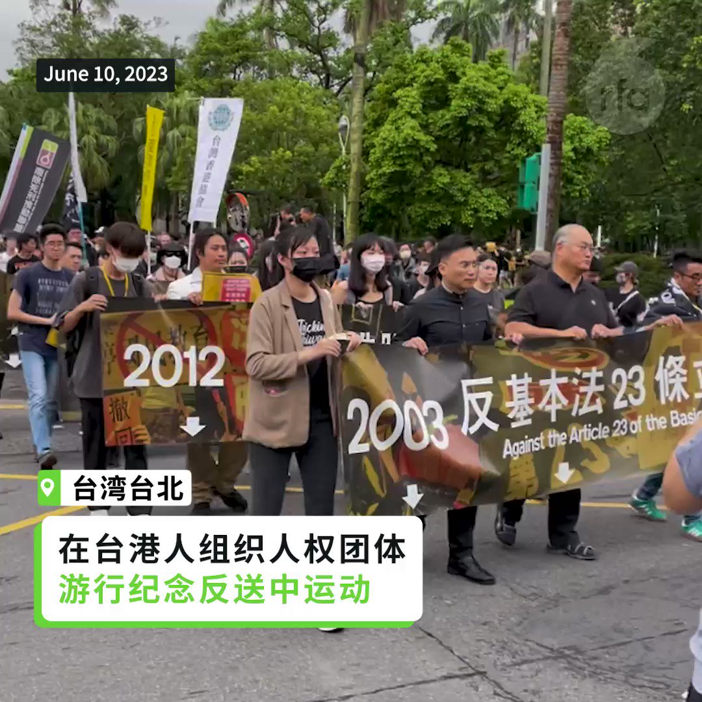  自由亚洲电台 北京时间 2023-06-10T19:24:53Z 1667493031694483456 RT @RFA_Chinese: 【达赖喇嘛会见刘晓波妻子刘霞】
西藏精神领袖 #达赖喇嘛 10日在印度达兰萨拉，会见 #刘晓波 妻子… https://t.co/PMS7pORzeo   自由亚洲电台 北京时间 2023-06-10T17:10:23Z 1667459181706895360 【达赖喇嘛会见刘晓波妻子刘霞】
西藏精神领袖 #达赖喇嘛 10日在印度达兰萨拉，会见 #刘晓波 妻子 #刘霞，刘霞送给达赖喇嘛刘晓波的诗集和她个人摄影集。旅居德国的刘霞已许久未露面，此行相当低调不受访。与会有赴达兰萨拉出席会议的吾尔开希、席海明、夏明、李酉潭等海外维吾尔、南蒙古、中国民运、台湾学者和NGO工作者等约50人。 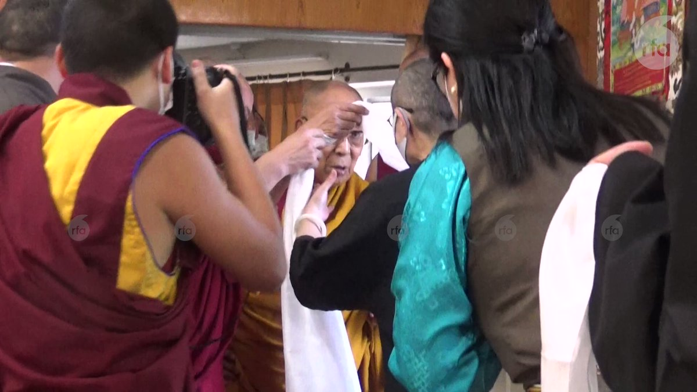  自由亚洲电台 北京时间 2023-06-10T12:24:28Z 1667387227356422145 #事实查核｜美国经济制裁影响了全世界一半人口？
https://t.co/UZO3jVu4En   自由亚洲电台 北京时间 2023-06-10T12:28:32Z 1667388252787994625 【大陆网传“反战文” 台湾人作何感想？】
据德国之声报道，台湾政大东亚研究所特聘教授王信贤在台湾陆委会5月份的简报中撰文指出，中国网络上近来流传一些“#反战文”，主张不愿为国而战，原因包括对社会不平等不满、不愿为既得利益者而战等等。

王信贤分析说，中国大陆舆情现在对政府信任度下降，经济下行、失业率攀升、疫情防控乱象等等因素使得公众的社会安全感下滑，在这种不安定的社会心理下，谈 #爱国主义 不容易被民众认可，也为未来的社会治理埋下不可预期的伏笔。

报道指出，反战文虽然并没有指明是什么战争，但台湾媒体和分析人士立即联想到 #台湾 战争。台湾中央社此前曾引述专家的分析指出，有关反战的文章一直存在于中国网络上，但一直没有被删除，这表明中国政府在一定程度上接受了这样的观点，即武力统一台湾不切实际，甚至是危险的。 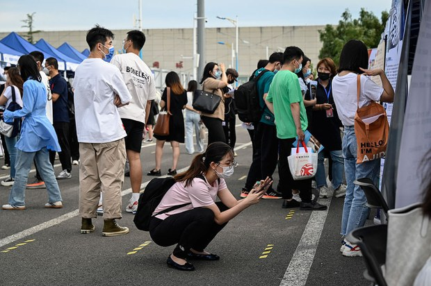  自由亚洲电台 北京时间 2023-06-10T11:21:21Z 1667371345846456323 RT @RFA_Chinese: 专栏 | ＃网络博弈：＃六四 死多少人，哪种说法更可信？
https://t.co/uXbI4cfHQO https://t.co/J4L6nXXEF2   自由亚洲电台 北京时间 2023-06-10T11:22:01Z 1667371511865384964 RT @RFA_Chinese: 日前，中国出现“#不愿为国而战”的网络热贴，帖子称，“如果发生战争，我是不会去的，也不会让我的孩子去”，您认为，是什么引发了他们爱国情怀的消退？ https://t.co/Ir7AjECPE9   自由亚洲电台 北京时间 2023-06-10T11:22:18Z 1667371582883282945 RT @RFA_Chinese: 【#亚太报道（2023-6-9）】
欢迎收听和订阅播客【亚太报道】 https://t.co/MjLNSvVMqc
城市与农村 #高考 人数两极分化 / #中国生产物价指数 创七年最大跌幅 / 美国参院外委会通过 #取消中国发展中国家地位 法案…   自由亚洲电台 北京时间 2023-06-10T10:05:55Z 1667352360354742273 专栏 | 解读新疆：维吾尔学生自杀新细节曝光；一工人因宗教朝圣在狱中死亡
https://t.co/4Q3HdRHQCu https://t.co/KotUeT5mhv 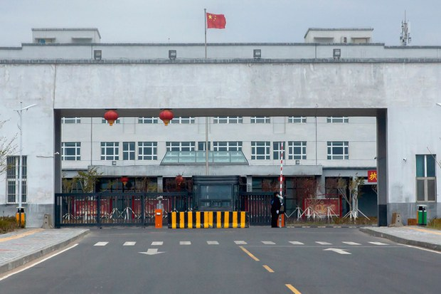  自由亚洲电台 北京时间 2023-06-10T09:20:43Z 1667340988099207168 专栏 | 夜话中南海：六四镇压时消极抗命的几位武警总部及二十八军首长
https://t.co/bsmFfPFPA5 https://t.co/k8F4BOp81c   自由亚洲电台 北京时间 2023-06-10T09:44:26Z 1667346955218059265 专栏 | 周末茶馆：为何惊险 #走线(1): 68岁退休教授
https://t.co/LxwoxgfiNu https://t.co/iFZaNhHx5m   自由亚洲电台 北京时间 2023-06-10T04:27:34Z 1667267212217053185 美国国会参议院外交关系委员日前一致通过法案，要求 #结束中国的发展中国家地位。此举引发中方不满的同时，将如何改变中国在国际组织中的地位？而在美国国务卿 #布林肯 据报最快下周访华之际，美中关系又将面临怎样的挑战？
https://t.co/bsmFfPFPA5 https://t.co/DSJpC07zMB   自由亚洲电台 北京时间 2023-06-10T04:43:10Z 1667271139549413386 【#亚太报道（2023-6-9）】
欢迎收听和订阅播客【亚太报道】 https://t.co/MjLNSvVMqc
城市与农村 #高考 人数两极分化 / #中国生产物价指数 创七年最大跌幅 / 美国参院外委会通过 #取消中国发展中国家地位 法案 / 中国为何连续与美军“碰瓷”？ / 香港“#反送中运动”四周年 https://t.co/QUkOl22rhg 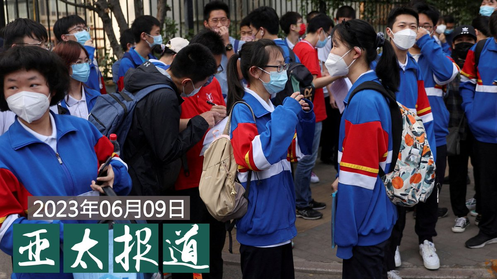  自由亚洲电台 北京时间 2023-06-10T05:22:10Z 1667280952714731522 6月9日，韩国召见中国驻韩大使邢海明，严正抗议他在前一天与韩国最大在野党共同民主党党首李在明会晤时发表的涉韩国政策言论。
邢海明针对韩国政府外交政策到底放了什么“狠话”？
您如何评价他的这番言论？ https://t.co/awad4MOeDk 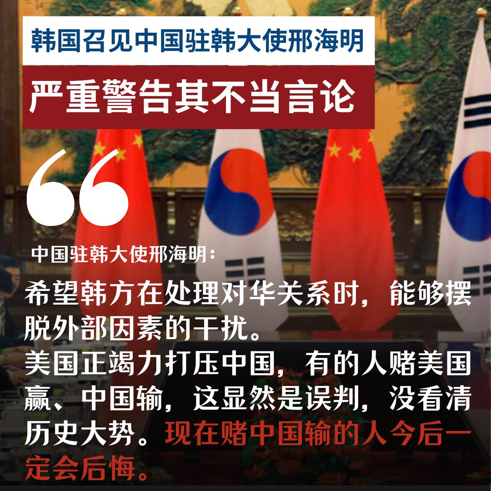  自由亚洲电台 北京时间 2023-06-10T05:23:15Z 1667281225399123968 日前，中国出现“#不愿为国而战”的网络热贴，帖子称，“如果发生战争，我是不会去的，也不会让我的孩子去”，您认为，是什么引发了他们爱国情怀的消退？ https://t.co/Ir7AjECPE9 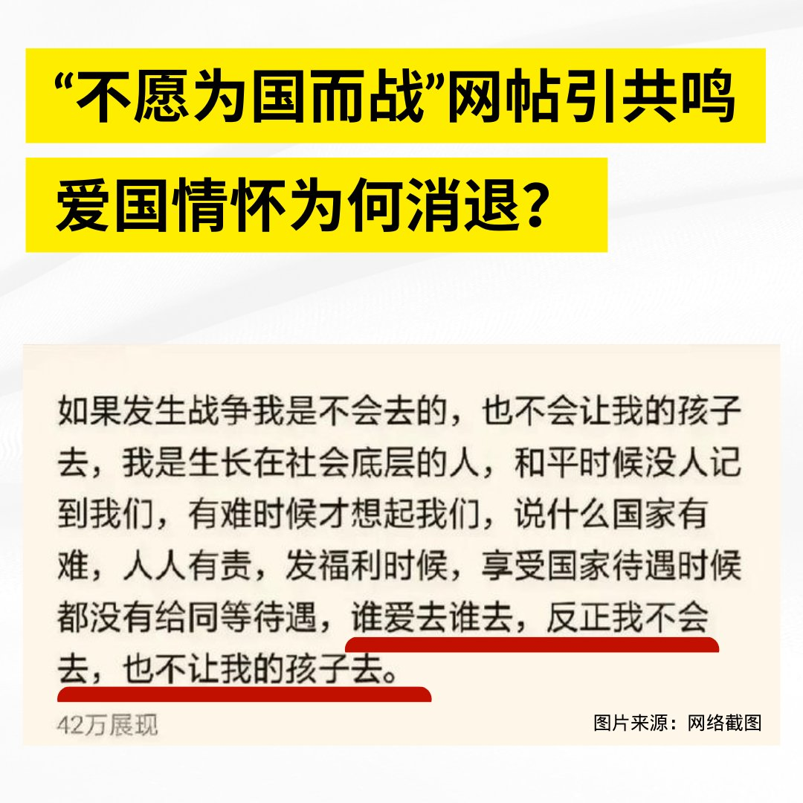  自由亚洲电台 北京时间 2023-06-10T02:33:28Z 1667238497349177344 4年前爆发的香港 #反送中运动，使香港发生翻天覆地的变化。 4年过去，港人虽然流散四海，但仍将在反送中运动纪念日“如水再聚 ”，在全球各地举办一系列纪念活动。除了集会游行之外，海外港人如何在当地深耕细作？又面对什么困难？

https://t.co/AVk1Xs6FB3 https://t.co/rhXaOpCKf6 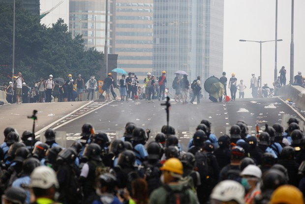  自由亚洲电台 北京时间 2023-06-10T02:35:33Z 1667239023780175894 近年来中国社媒上的 #网暴 现象日益突出。两周前武汉一小学生在校内被老师开车撞死，其母亲去学校讨说法，疑遭网暴而坠楼自尽，让网暴现象再次引起民众的关注。

据澎湃新闻网报道，为惩治网络暴力违法犯罪活动，中国最高法院、最高检察院和公安部近日起草了《关于依法惩治网络暴力违法犯罪的指导意见（征求意见稿）》，向社会公开征求意见。

指导意见指出，实施网络暴力违法犯罪，具有针对未成年人、残疾人实施的，或组织“水军”“打手”实施等等情形之一的，应当从重处罚。

指导意见还就对网络诽谤、网络侮辱、侵犯公民个人信息等行为准确适用法律作出了规定，比如：在信息网络上采取肆意谩骂、恶毒攻击、披露隐私等方式，公然侮辱他人，情节严重，符合刑法第二百四十六条规定的，以侮辱罪定罪处罚。 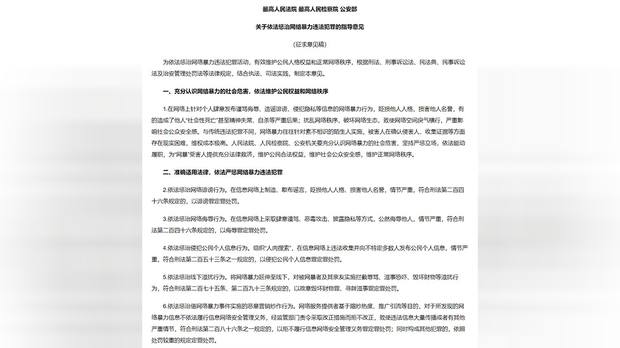  自由亚洲电台 北京时间 2023-06-10T03:33:01Z 1667253484440420352 专栏 | #财经时时听：跨国巨头高管密集中国行，和中国领导人唱什么双簧？
#马斯克 #秦刚 
https://t.co/wZJPb80aOp https://t.co/QjKzlwQz5G 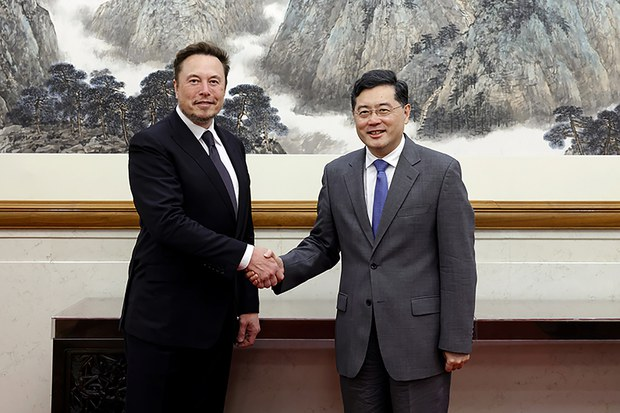  自由亚洲电台 北京时间 2023-06-10T04:00:00Z 1667260276847136776 【解放军“空中碰瓷”海上逼舰”】
【我舰奉命撞击你舰 制造摩擦】
本台 #亚洲很想聊 上，经济学家 #程晓农 指出，当年苏联海军遇上美军时使用的信号旗，就是“我舰奉命撞击你舰”。程晓农推测，最近行动是由中央军委下令，故意制造摩擦。
完整视频：https://t.co/s8qDCOVJYE https://t.co/yvqtXZY8on 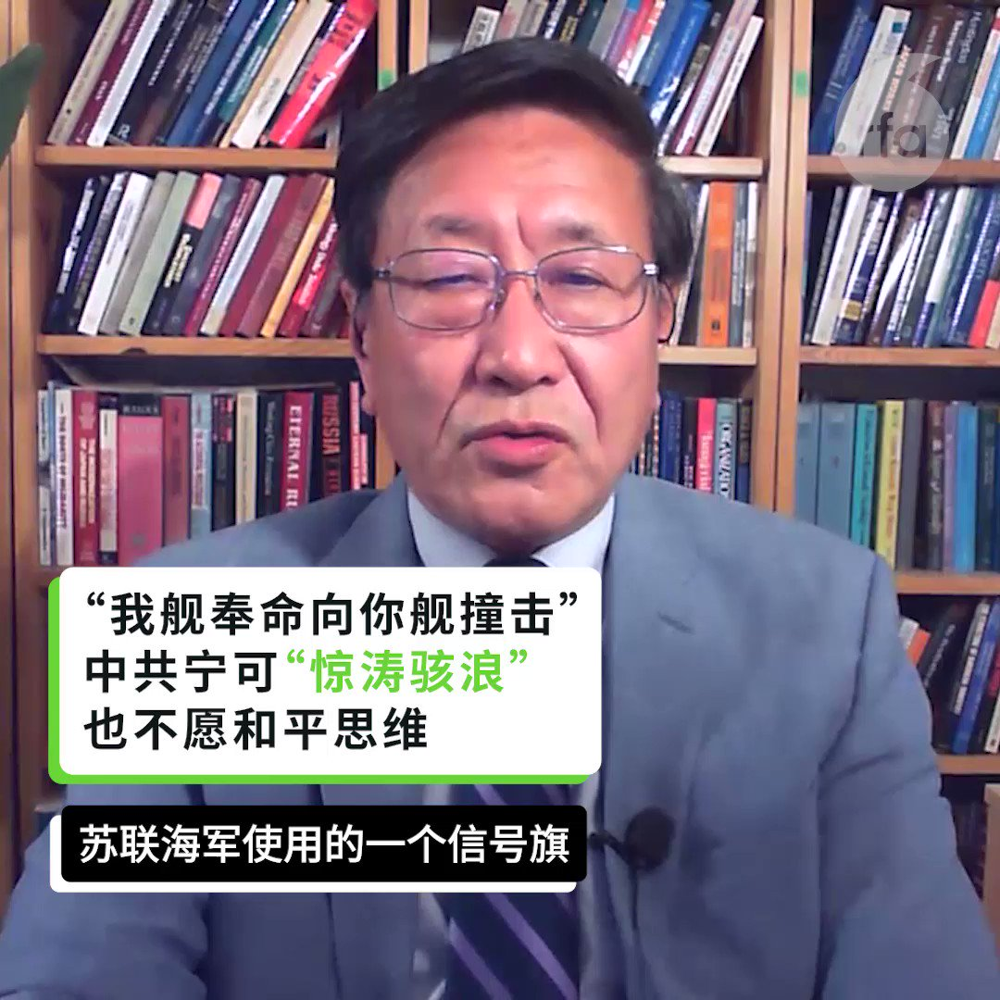  自由亚洲电台 北京时间 2023-06-10T04:02:56Z 1667261014587625472 近日，多位 #八九民运 的亲历者接受本台采访，讲述了他们眼中的 #白纸运动，以及在他们看来，为什么中共会作出六四屠杀和动态清零这样的决策。

https://t.co/rcm6Rdi3XM https://t.co/vrIGzGUoxS 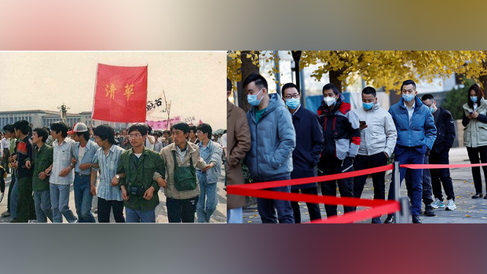  自由亚洲电台 北京时间 2023-06-10T00:48:46Z 1667212147909185536 19岁新疆女大学生卡米莱·瓦依提（Kamile Wayit）因在微信上发布 #白纸运动 视频而于去年底被中国警方抓捕，最近传出消息，她于今年3月25日被判犯有“#宣扬极端主义罪”，但刑期尚不清楚，这一罪名最高可判5年。据英国卫报网站报道，这一消息是中国外交部发言人上周向《经济学人》杂志证实的。

本台获得中国外交部给《经济学人》的答复，其中还提到，瓦依提目前正在服刑，各项合法权利得到保障。

但有知情人匿名向本台透露，瓦依提目前没有律师，而她的健康状况让人担忧。她从2017年开始就有持续做噩梦的状况，因为精神健康问题，她不得不在高中休学一年。另外，瓦依提的视力也有严重问题，本打算今年夏天在北京做手术，现在不得不拖延。

美国外交部就此事回复本台，称对中国政府继续关押瓦依提表示关切。美国呼吁中国确保尊重她的人权和基本自由，包括所有公正审判的保障，并立即无条件释放所有不当拘留的人士。

身在美国的维吾尔族人权活动家玛雅·米塔利波娃（Maya Mitalipova）告诉本台，她为瓦依提的遭遇感到伤心，她要求中国政府立即释放瓦依提；她和成千上万的维吾尔族人一样是无辜的。米塔利波娃说，她将与美国国务院的官员见面，施压中国政府释放瓦依提。 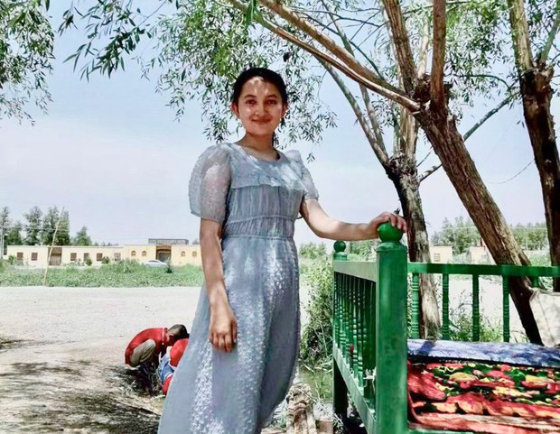  自由亚洲电台 北京时间 2023-06-10T01:01:11Z 1667215272720191488 美国《华尔街日报》近日发表报道，揭露因参加2019年香港 #反送中 运动而被捕的青少年在当地的青少年监舍中遭受了香港政府“#去极端化”措施。

这些青少年在这样的设施里每天被强迫走正步，并被强迫参与亲中国宣传讲座和心理咨询，这些设施里还有密切的监视和惩罚系统，包括单独关押。有消息显示，到今年4月30日为止，共有871名青少年囚犯参与了该计划，其中约70%与2019年的抗议活动有关。其中一些人年仅14岁。

香港官员拒绝提供有关去极端化的任何具体细节。而据一名前狱警的说法，这个计划最终目标是在囚犯中制造一种绝望感，阻止这些年轻的前抗议者继续从事社会活动。

香港纠正罪犯服务署（CSD）的负责人黄国兴则在2月份声称，这个计划可以帮助这些青少年纠正错误的价值观。”在CSD的2021年年度报告中，该计划被称为以“脱离激进思想、灌输正确价值观”为重点的有针对性的康复计划。黄国兴还在回复香港立法会议员的质询时表示，该计划取得了“理想的结果”，因为“参与者对过去的非法行为深感懊悔”。

但研究去极端化计划的人表示，去极端化的概念已经被威权主义国家所利用。这篇报道则指出，对年轻被拘留者的这些做法是香港对任何挑战当局、倡导民主或批评中国的政治言论进行更广泛压制的一部分。 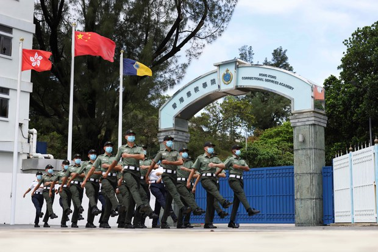  自由亚洲电台 北京时间 2023-06-10T01:27:33Z 1667221912089665537 中国上月通胀回升，不过，工业生产者出厂价格指数(PPI)创下逾七年以来最大跌幅。有分析认为，拉动中国经济的"三头马车"乏力，中国经济实际上已步入通缩。

https://t.co/c97OEbK0ab https://t.co/j8f58nh9pe 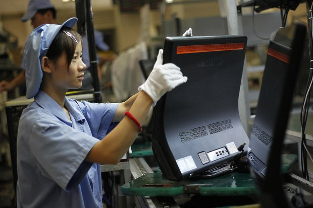  自由亚洲电台 北京时间 2023-06-10T00:07:06Z 1667201663852224515 近日，中国的军机战舰连续在 #南海 和 #台海 与美军发生摩擦。在本台最新一期的《#亚洲很想聊》节目中，有专家认为这一连串的举动就是习近平所指的"#惊涛骇浪"，中国企图借此在印太称霸。
https://t.co/Cv0yJmNQ77 https://t.co/MpsNJmnP8L 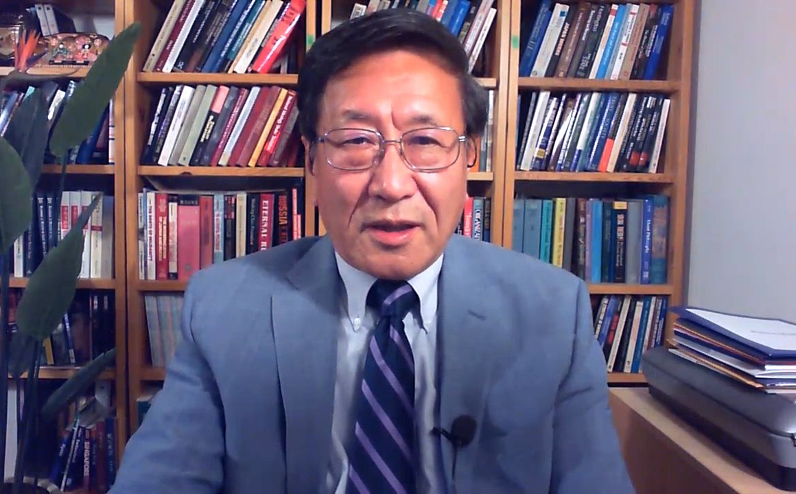  