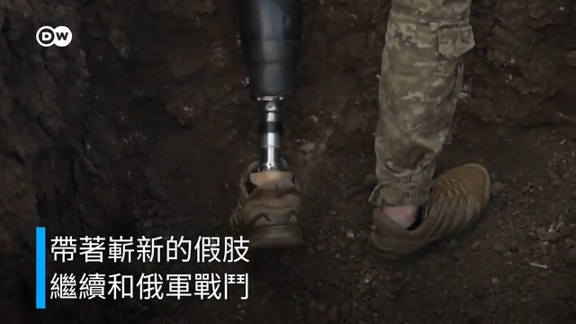

德国之声 北京时间 2023-06-09T22:35:00Z 1667178486065135621 最开心的是“吃瓜群众”。没有什么比看著权势者出丑更让普通民众高兴的事了。一个国企垄断集团的中高层干部，是最合适的围观对象。
再大一点的“瓜”，比如前政治局常委张高丽性侵网球名将彭帅，当局不让看，很多人看到了也不敢转发。 #牵手门  #中石油
https://t.co/KRMJXU9CkQ   德国之声 北京时间 2023-06-09T23:10:00Z 1667187293793206273 中国驻韩国🇰🇷大使 #邢海明 指责首尔受到美国的影响，“希望韩方在处理对华关系时，能够摆脱外部因素的干扰。美国正竭力打压中国，有的人赌美国赢、中国输，这显然是误判，没看清历史大势......现在赌中国输的人今后一定会后悔。"
https://t.co/NCbTCwd2Y4   德国之声 北京时间 2023-06-09T23:40:00Z 1667194842915680256 《南德意志报》：德国工商大会（DIHK）负责人士指出，由于成本和地缘政治的原因，作为企业确保竞争力的国际驻地，中国对德国企业越来越失去吸引力。https://t.co/aSJ5hzSx8b   德国之声 北京时间 2023-06-09T20:50:00Z 1667152061509816320 “现在中国民营资本对中国经济增长缺乏信心，不少蓝筹股的估值达到了历史低位，近不悦，又怎么能远来呢？”  #中国股市
https://t.co/KUc4IjsxgY   德国之声 北京时间 2023-06-09T21:25:00Z 1667160869304958977 被誉为德国“第一天团”的重金属乐队 #Rammstein（中文译为“#德国战车”或“#雷姆斯汀”）在慕尼黑开启了今夏欧洲巡演。日前多名女性指控乐队主唱🎤林德曼专门招募年轻女性与之发生性关系，但这些争议似乎并没有给蜂拥而至的歌迷造成困扰。—如果你是乐队歌迷，会因为这样的争议而选择退票吗？ https://t.co/nCG7Y34TRV   德国之声 北京时间 2023-06-09T22:02:06Z 1667170205796114432 台湾政大东亚研究所特聘教授王信贤指出：过去中国民众的社会安全感较高，但近年来随著经济下行、失业率攀升、疫情防控乱象以及防疫政策从“清零”大转弯，使得民众的社会安全感急剧下降。在社会心理的焦躁浮动、冲突不断之下，#爱国主义 甚至不敌现实。  #反战
https://t.co/AL9wdMBp1n   德国之声 北京时间 2023-06-09T18:40:37Z 1667119500456611844 美国参议院外交关系委员会通过“结束中国发展中国家地位”的法案，要求国务卿争取在美国参与的国际组织中取消中国享有的 #发展中国家 地位。
中国外交部回应称，把发达国家帽子强加给中国是美国一张牌，“醉翁之意不在酒”。
https://t.co/HQYpVTCep1 https://t.co/dWeJeBbTsb   德国之声 北京时间 2023-06-09T19:12:00Z 1667127398599655425 这位律师承认自己是首次使用 
 #ChatGPT “我以为ChatGPT是一个可靠的搜索引擎。”
https://t.co/etMch14egs   德国之声 北京时间 2023-06-09T19:45:00Z 1667135703569035266 观察家指出，雇用北约 #退役飞行员 训练 #中国空军 可能要追溯到近十年前。德国过去曾与中国正式开展军事训练项目。军方交流技术和战术经验很常见，退役军人将其独特的技能带到私营部门也很常见。
https://t.co/OrCJwPENYg   德国之声 北京时间 2023-06-09T20:19:54Z 1667144486361657344 统计数字显示，中国消费、生产部门价格大幅下滑，#通货紧缩 风险急剧升高。
经济学家认为，应当让更多的货币流向民营企业和中等收入人群；而从长期来看，中国经济的一系列结构性问题将导致 #增长率 徘徊在2%~3%左右。
详细报道https://t.co/GS0QNN5ejo https://t.co/LLyF2W5zTr   德国之声 北京时间 2023-06-09T16:33:17Z 1667087459291897857 台美签订首批" #21世纪贸易倡议"，遭 #北京 批为不平等的"幌子"协议。这份台美断交以来 #最完整全面 的贸易协定，是让台湾摆脱对中依赖？还是如北京所说反被"敲骨吸髓"？ DW采访专家请他们提出观点。
https://t.co/RZr26Yvmhv   德国之声 北京时间 2023-06-09T17:05:00Z 1667095438657454082 截肢之后 他又回到战场
自从俄罗斯发动侵略战争以来，乌克兰人一直在坚强地为保卫国家而战。一些士兵甚至在受伤截肢之后还继续战斗。DW记者在前线见到了一名20岁的年轻战士，他在左腿小腿截肢之后又带着假肢回到了部队。 https://t.co/W2bsVFsWDb   德国之声 北京时间 2023-06-09T17:40:00Z 1667104246100267009 德国工商大会 #DIHK 的调查显示，近五分之一的受访公司已经搁置了在中国的业务计划，并正在将投资从中国分散出去。六分之一的公司在为“最坏情况”做准备，包括可能 #撤出中国。
https://t.co/CneUUGwyrI   德国之声 北京时间 2023-06-09T18:10:00Z 1667111795847479296 中国云南省一座清真寺的局部拆除计划上周引发警民冲突，引起了国际社会对中国政府汉化伊斯兰教五年计划影响的关注。
曼彻斯特大学的中国政治讲师斯特劳普（David Stroup）：“习近平将外来宗教意识形态或传统视为威胁，而伊斯兰教是他非常关注的一个。”
https://t.co/okHs5ixNRr   德国之声 北京时间 2023-06-09T13:20:58Z 1667039059318013953 【特朗普因机密文件案 成首位联邦政府起诉的美国前总统】🇺🇸
#美国 前总统 #特朗普 8日表示，他已因机密文件案被起诉，这将使他成为首位被联邦起诉的 #美国总统。目前我们知道什么？
详细报导👉https://t.co/z0WiMkmQ18   德国之声 北京时间 2023-06-09T15:55:23Z 1667077920739983361 https://t.co/7Oep4Nro8g   德国之声 北京时间 2023-06-09T15:55:33Z 1667077960480997379 #中国 作家章诒和8日在社群媒体自曝，她被🇨🇳 中国当局禁止出境，沦为"国家囚徒"，并称自己提早收到通知，代表政府对她已算"客气"。事发经过为何？章诒和为什么被限制出境？ https://t.co/cqdcoHFuoH   德国之声 北京时间 2023-06-09T13:59:28Z 1667048748441034752 香港特首 #李家超 遭美国政府制裁，#美国跨党派议员 因此呼吁应禁止他出席 #APEC 领导人会议。 #中国 外交部8日回应，美国作为东道主应信守承诺，确保香港代表也能顺利参会。 全文请见: https://t.co/IcBq9rUWS8 https://t.co/WKVtzKKipF   德国之声 北京时间 2023-06-09T11:10:43Z 1667006282409332736 路透社引述匿名消息独家报导，#台湾 外交部长吴钊燮🇹🇼下周将赴欧访问，并突破性地与 #捷克 总统🇨🇿同台出席外交活动，若成真料将再次引发 #中国 不满。https://t.co/FsSJ48T8iD   德国之声 北京时间 2023-06-09T11:26:44Z 1667010309922406400 日媒指出，这是近2年来 #中国 军舰第11次闯入 #日本 海域。同日，还有2艘 #中国海警队 船只也进入两国的争议领海。日本防卫省表示已为此向北京表达"严正关切"。
https://t.co/H2Yd1FkXeu   德国之声 北京时间 2023-06-09T08:39:26Z 1666968208077668353 【中国将在古巴建窃听基地？美称报导有误】《华尔街日报》8日报导，#中国 将斥重金在 #古巴 打造一处电子窃听基地，与 #美国 佛州仅相距100英里，但消息遭到涉事三国质疑或否认。他们分别说了什么？https://t.co/0NHaESlp7V https://t.co/RX8hE9qHWL   