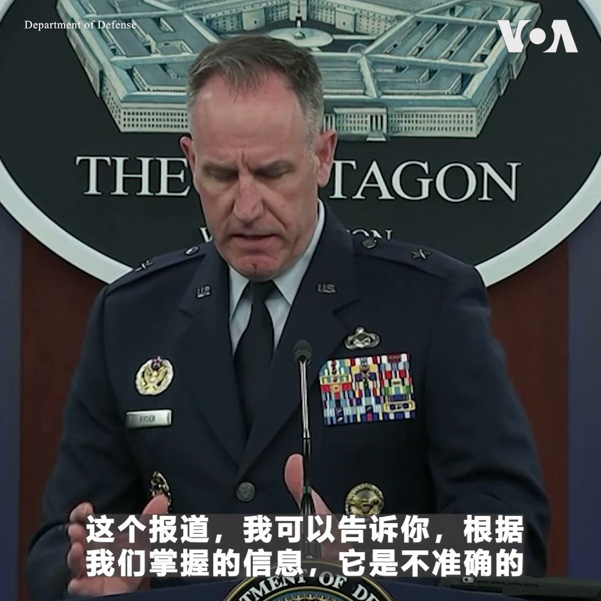
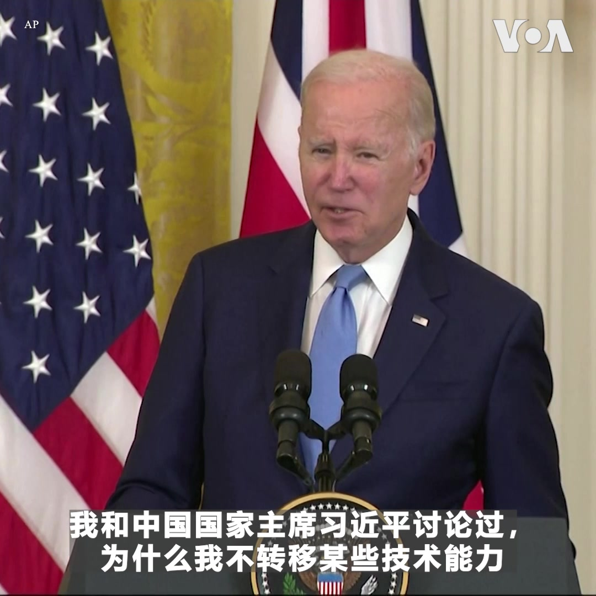
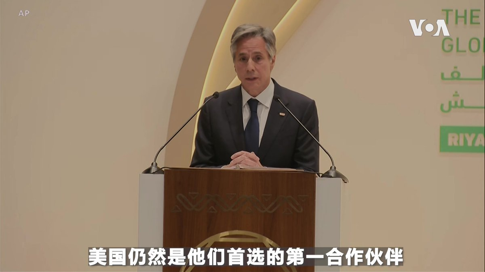
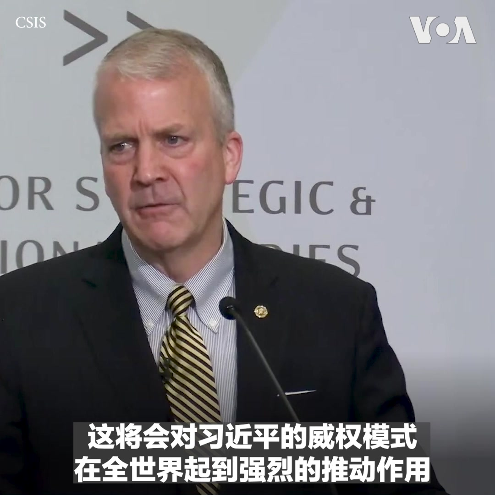
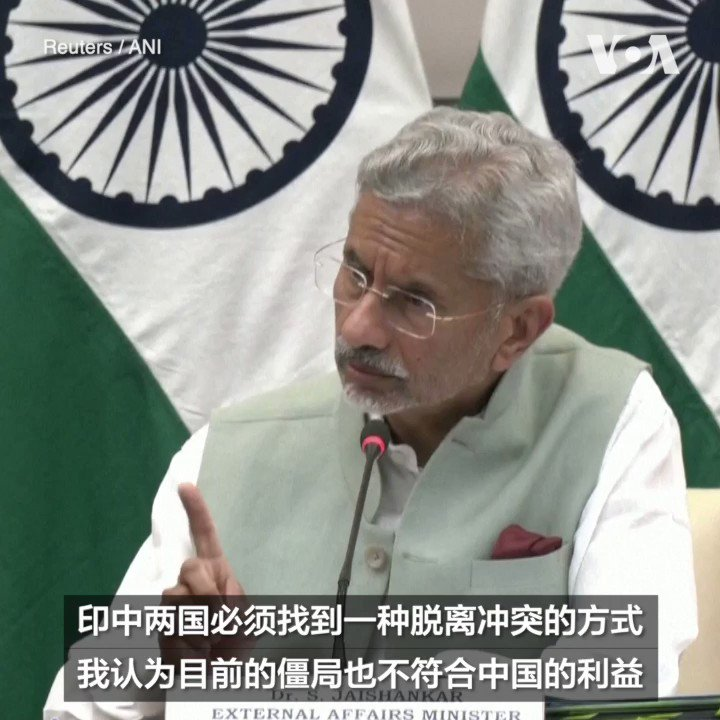

美国之音中文网 北京时间 2023-06-09T23:14:02Z 1667188307787145217 台湾行政院经贸谈判办公室总谈判代表邓振中6月9日呼吁欧盟尽快与台湾签署双边投资协定。邓振中在接受路透社专访时表示，设立永久性双边投资法律框架，将有助于台湾与欧盟经贸与投资的长远发展。 https://t.co/khEwwYRqNs   美国之音中文网 北京时间 2023-06-09T23:22:51Z 1667190527794585600 台湾战略专家认为，中国企图阻绝日本成为美国施展其亚洲政策的平台。日本学者认为，日本与中国的对话要保持态度强硬、立场坚定，该说什么就说什么。报道：https://t.co/6nZ6oQEgBO https://t.co/cMAbwtzNzV   美国之音中文网 北京时间 2023-06-09T23:50:33Z 1667197501303308288 马克龙探望震惊法国的持刀行凶案受害者 https://t.co/jXgIIGtu9S   美国之音中文网 北京时间 2023-06-09T23:50:35Z 1667197508756574208 不求北京求鬼神，中国失业者生计无着 烧香拜佛盼好运 https://t.co/5G4RmHFwfP   美国之音中文网 北京时间 2023-06-09T23:51:37Z 1667197766492385280 瑞典著名环保活动人士格蕾塔·桑伯格6月9日和多名高中生在瑞典议会大厦外举行抗议活动。桑伯格自2018年起定期在这里举行抗议，呼吁立法者关注环境议题。这是她高中毕业前夕组织的最后一次学生抗议。 https://t.co/TCDRmXGAsx   美国之音中文网 北京时间 2023-06-09T23:55:14Z 1667198675951443968 “大黄鸭”时隔十年再度现身香港，而且这次好事成双，一对高18米的大黄鸭9日从会展中心出发， 游到市政府中心附近停靠。大黄鸭系列由荷兰艺术家霍夫曼创作，曾出现在世界多个城市。2013年大黄鸭到香港后，有人以一排大黄鸭取代坦克人身后的六四坦克，惹恼了北京政府。大黄鸭还在多个国家成为抗议的象征。 https://t.co/MgUtBJSILQ   美国之音中文网 北京时间 2023-06-09T21:00:36Z 1667154729565298694 6/9【#时事大家谈】中国出口大幅下跌，这对经济复苏意味什么？中国经济大不如前，世界应趁现在摆脱北京？

嘉宾：美国欧道明大学国际商学教授李少民博士；台湾淡江大学产业经济学系与经济系合聘教授蔡明芳博士
主持人：陈小平
 
Youtube🔗 https://t.co/8m41dO1i1z https://t.co/4qD7VIoqHX   美国之音中文网 北京时间 2023-06-09T21:13:04Z 1667157868787933184 苏丹准军事快速支援部队袭击武器工厂 https://t.co/BZ4vG4nhHg   美国之音中文网 北京时间 2023-06-09T22:09:04Z 1667171961934426118 中国企业面临通缩重压，内外需求熄火 强复苏已成镜中花 https://t.co/XasVbZmzK1   美国之音中文网 北京时间 2023-06-09T22:09:07Z 1667171970880864258 捷克外长证实台湾外长吴钊燮将访布拉格，北京警告欧洲遵守“一中”承诺 https://t.co/oXtPGwxLeu   美国之音中文网 北京时间 2023-06-09T16:30:32Z 1667086766145413121 日本修订《开发合作大纲》 加强援外抗衡中国影响力 https://t.co/Q4Pup9GGKd   美国之音中文网 北京时间 2023-06-09T18:02:03Z 1667109797240655873 南中国海局势紧张 中国海军训练舰“友好”访问菲律宾 https://t.co/78RP8lDeuA   美国之音中文网 北京时间 2023-06-09T18:15:04Z 1667113073034027008 中国人权律师常玮平 因“颠覆国家罪”遭中共判刑3年半 https://t.co/I6KCXsemtp   美国之音中文网 北京时间 2023-06-09T14:01:03Z 1667049146015166464 沙特称与美中的关系非零和 专家：需警惕中国扩大中东军事存在 https://t.co/7dAIlasMaI   美国之音中文网 北京时间 2023-06-09T16:16:07Z 1667083138315747329 中国驻韩大使警告韩国 在美中竞争中可能“下错赌注” https://t.co/kprkiS9jvY   美国之音中文网 北京时间 2023-06-09T12:42:33Z 1667029390612627457 哈瓦那否认中国计划在古巴建立间谍基地 https://t.co/ZMF8vipNc8   美国之音中文网 北京时间 2023-06-09T13:19:00Z 1667038563140259843 共和党初选呈现人才济济的局面，他们中的大多数都会常去最早投票的艾奥瓦州展开零售政治，尽可能多地与选民见面以推广自己、赢得支持。在当地“烤肉与骑摩托”慈善活动中，佛罗里达州长德桑蒂斯、前驻联合国大使黑利等到场，前副总统彭斯骑哈雷摩托车前往。民调领先的特朗普没有参加。 https://t.co/x9lwQgbdpG   美国之音中文网 北京时间 2023-06-09T14:18:33Z 1667053551582089216 特朗普因不当处理机密文件被联邦大陪审团起诉 https://t.co/rSMqlKcogf   美国之音中文网 北京时间 2023-06-09T14:20:00Z 1667053914397757440 乌克兰已收回大片失地，然而俄军撤退时留下的雷区覆盖30%的领土，人工排雷或需花费数年时间。有播种期的农民将拖拉机改装成无人遥控，装上从俄罗斯废弃坦克拆下来的保护板后碾过农田以清除地雷。67岁的退休女子普里什琴斯卡用金属探测器检查园圃后才会放牛，以免奶牛遭地雷伤害。 https://t.co/XBYzzbAUJT   美国之音中文网 北京时间 2023-06-09T11:23:32Z 1667009505895526400 美媒称中国在古巴设间谍监测站 白宫：报道不准确 https://t.co/siF6IvlVBj   美国之音中文网 北京时间 2023-06-09T11:30:43Z 1667011314773004293 华尔街日报报道说，中国和古巴达成了秘密协议将在古巴建立一处电子窃听设施。美国白宫方面称，这一报道“不准确”。情报专家表示，如果报道属实，这将意味中国监视美国能力的重大提升，也会加剧美中关系的紧张。报道内容：https://t.co/2yYRpra1fA https://t.co/3pZ6rYqnaN   美国之音中文网 北京时间 2023-06-09T11:58:33Z 1667018320581918720 美参院外委会通过法案 取消中国发展中国家地位 https://t.co/AcsEPwfyze   美国之音中文网 北京时间 2023-06-09T12:17:35Z 1667023109248155648 包含美、中等36国海军参与的“2023科莫多多国海军演习”于6月8日于印尼落幕。专家分析，这次联合演习进一步提升雅加达的国际话语权，但无法有效调解美中分歧，且由于演习不具针对性，东盟各国也难借此在南中国海议题上，对应对北京扩张行径达成一致立场。https://t.co/zxDDQdG2Ti https://t.co/gE88yDLV4Y   美国之音中文网 北京时间 2023-06-09T06:30:00Z 1666935635242885122 习近平语录成了今年高考作文题之一。独立时评人张杰博士认为，恢复高考原本是对文革的否定，历年高考作文题也反映了时代的演变，曾具有进步的痕迹。如今用习近平语录做题目，是一种可悲的倒退。#时事大家谈完整版：https://t.co/kmAP0nlczY https://t.co/iVRV5b24WS   美国之音中文网 北京时间 2023-06-09T06:59:02Z 1666942942362337282 研究：大多数亚裔美国人认可平权法案，但反对大学招生考虑种族因素 https://t.co/eS1W8L8cNz   美国之音中文网 北京时间 2023-06-09T07:00:00Z 1666943187435536384 年轻人觅工难，房子卖不动，5月份出口同比又骤降7.5%，进口降4.5%。什么原因？对经济复苏影响如何？转向内需是生路？美国约翰·霍普金斯大学教授孔诰烽说，多亏中国经济衰退，世界应趁现在摆脱中国。北京毒品般的经济诱惑大风险高，摆脱它正是好时候？请收看美国之音6月9日上午9点《时事大家谈》。 https://t.co/ZXyDLCf8RE   美国之音中文网 北京时间 2023-06-09T07:09:34Z 1666945594227843072 阿塞拜疆要求推迟由美国斡旋的与亚美尼亚之间的和平谈判 https://t.co/Om2QZbAyok   美国之音中文网 北京时间 2023-06-09T07:31:04Z 1666951005068726274 伊斯兰国附属组织正汇集资源、提高能力 https://t.co/TOR5VDcsAn   美国之音中文网 北京时间 2023-06-09T08:00:00Z 1666958285344497664 中国政府或将颁布人工智能监管新规。作家、独立时评人傅志彬先生认为，北京介入人工智能发展会适得其反，不仅监管会扼杀活力，就连国家投资也会起反效果，这一点从苏联的教训中就可看出。#时事大家谈完整版：https://t.co/kmAP0nlKpw https://t.co/Yn6MZPYcfi   美国之音中文网 北京时间 2023-06-09T08:00:43Z 1666958465653407745 “这个报道，我可以告诉你，根据我们掌握的信息，它是不准确的，”美国五角大楼发言人莱德准将6月8日在例行记者会上被问到华尔街日报有关中国在古巴建立情报监听站的报道时说。与此同时，在被问到是否支持北约在日本开设办事处时，这位发言人说，美国欢迎北约和美国的亚洲盟友加强合作。 https://t.co/ZOT8nerpHt   美国之音中文网 北京时间 2023-06-09T08:04:43Z 1666959472978280449 美国总统拜登和英国首相苏纳克6月8日在白宫进行会谈后共同宣布《大西洋宣言》，应对中俄构成的国家安全和经济安全威胁。拜登在会后记者会上说，两人讨论了“某些对外投资所带来的国家安全风险”。苏纳克强调，中国和俄罗斯等想利用英美的开放性，窃取知识产权并将技术用于专制目的，“他们不会成功的”。 https://t.co/UwByI4edt9   美国之音中文网 北京时间 2023-06-09T08:17:03Z 1666962574825635840 美参院外委会表决通过《台湾保护与国家韧性法》阻中侵台 https://t.co/UjNDNtMSr3   美国之音中文网 北京时间 2023-06-09T08:32:00Z 1666966337430908928 在美中两国有望恢复高层对话之际，美国国家安全顾问沙利文最近提出在“无预设条件”的前提下与中俄就核军控问题进行谈判。俄罗斯称对对话持开放态度，但中国到目前为止尚未对沙利文的呼吁作出公开回应。报道内容：https://t.co/jRfbKK7MVQ https://t.co/E4msJ1I6xc   美国之音中文网 北京时间 2023-06-09T09:15:52Z 1666977379049431044 拜登政府最近派出多名高官访问北京，强调保持沟通渠道畅通的必要性，这让外界似乎看到坠入低谷的美中关系有望回暖。过去半个世纪以来美国对华接触政策是否依然有价值，学者对此看法不一。报道内容：https://t.co/itfSCIhNNt https://t.co/nwhtbX9MxX   美国之音中文网 北京时间 2023-06-09T09:17:00Z 1666977661942476801 “当前我们连军方层级的任何可靠的沟通都没有”, 来自新泽西的联邦众议员金安迪谈对美中缺乏基本沟通感到担忧。学者认为在国安、军事等问题上，美中有必要建立基本共识避免灾难性后果，但也有意见指出，美中对合作的理解相去甚远，难以建立互信，中国在新冠疫情时不负责任的表现也让学者提高警惕。 https://t.co/uzhii2IzRr   美国之音中文网 北京时间 2023-06-09T09:18:02Z 1666977923449106432 尽管谈判，美中关系的僵局可能会继续 https://t.co/o6O7GNEMsg   美国之音中文网 北京时间 2023-06-09T09:31:34Z 1666981327382667265 乌克兰发起期待已久的反攻 https://t.co/5DtRQWIoOb   美国之音中文网 北京时间 2023-06-09T09:31:36Z 1666981335267962881 国事光析：八九“动乱”到六四“风波”的中共变脸术 https://t.co/phUIYs60Br   美国之音中文网 北京时间 2023-06-09T09:47:04Z 1666985230207692800 美国东海岸继续应对来自加拿大的野火浓烟 https://t.co/iHWJ0tZfXW   美国之音中文网 北京时间 2023-06-09T04:29:55Z 1666905418172596224 正在华盛顿访问的英国首相苏纳克6月7日观看了华盛顿国民队主场的一场棒球赛。拜登总统星期四在白宫隆重欢迎苏纳克。两位领导人就乌克兰战争、中国、经济安全以及对人工智能实施监管上如何进行国际合作进行深入的讨论。详细：https://t.co/jE9DN60btn https://t.co/RdtxvxzD0k   美国之音中文网 北京时间 2023-06-09T05:19:42Z 1666917943354052609 法国城市阿讷西 Annecy 的一个公园8日发生持刀袭击事件，造成四名儿童和两名成年人受伤，其中两名儿童和一名成年人伤势严重。当地居民对这起事件表示震惊。行凶者已被逮捕。警方说这是一名有合法难民身份的叙利亚人，他的作案动机尚不清楚。 https://t.co/w5bZgyQVQs   美国之音中文网 北京时间 2023-06-09T05:31:03Z 1666920800681865216 布林肯访华前夕表示不要求各国在美中之间做选择 https://t.co/m6XEHcQ1Bs   美国之音中文网 北京时间 2023-06-09T05:49:03Z 1666925331742343168 路透社：台湾宏碁称暂停业务后又向俄罗斯运送电脑硬件 https://t.co/74hAvoCN8K   美国之音中文网 北京时间 2023-06-09T06:02:25Z 1666928695330885634 美中两国正准备美国国务卿布林肯访问北京的行程。美国驻华大使伯恩斯已推迟原计划下周在华盛顿两个智库的行程，但美官员仍拒绝评论这是否与布林肯访中有关。
与此同时，布林肯周四在利雅得说，“美国不要求他国在美中之间选边站“。详细报道： https://t.co/tSVpc9FPOY https://t.co/IpgbEmnXDv   美国之音中文网 北京时间 2023-06-09T06:07:02Z 1666929854481145859 “如何加强台湾的防卫能力，威慑中国军事入侵”已成为美国国会两党最为关注的外交议题之一。

共和党联邦参议员沙利文(Sen. Dan Sullivan) 6月8日以“台湾为何重要？”为题，在华盛顿智库战略与国际研究中心发表演说，从经济影响、地缘政治、盟友合作，以及对抗威权体制等角度，说明中共武力犯台的后果。 https://t.co/8jkkvGffTL   美国之音中文网 北京时间 2023-06-09T06:11:03Z 1666930868835987457 法国发生令人震惊的持刀攻击，四名儿童受重伤 https://t.co/u6hnblpVe6   美国之音中文网 北京时间 2023-06-09T03:39:34Z 1666892746437828608 中国核战略目标渐趋模糊，美国呼吁展开核军控对话 https://t.co/jl821YbfkB   美国之音中文网 北京时间 2023-06-09T04:09:04Z 1666900170276212736 科莫多联演闭幕 印尼国际话语权升但难调解美中分歧 https://t.co/bT0sk19y69   美国之音中文网 北京时间 2023-06-09T00:30:03Z 1666845052436647941 拜登政府对华政策：乞求对话还是“更准更狠”？ https://t.co/CIDQ5u2awx   美国之音中文网 北京时间 2023-06-09T00:42:06Z 1666848084607873024 美国东部许多大城市包括纽约和首都华盛顿由于加拿大野火继续被烟雾笼罩，美国联邦航空管理局8日暂停了一些飞往纽约拉瓜迪亚机场的航班。美国气象机构向大西洋沿岸地区发布空气质量警告，从佛蒙特到南卡罗莱纳州，甚至远至俄亥俄州和堪萨斯州都告诫居民尽量避免在室外活动。 https://t.co/kYqbutE5MZ https://t.co/uwjNHlIwNj   美国之音中文网 北京时间 2023-06-09T00:51:33Z 1666850463852158976 北京要摸老虎屁股？在美后院古巴秘建情报监听基地-华尔街日报 https://t.co/0byU4HZ0Fk   美国之音中文网 北京时间 2023-06-09T01:09:03Z 1666854868580196352 英首相苏纳克首访白宫，美英峰会关注乌克兰、中国和经济安全等议题 https://t.co/4SP92oU4Bf   美国之音中文网 北京时间 2023-06-09T01:37:33Z 1666862038822576128 日本对华政策 专家:与不守规则的国家如何交往? https://t.co/8M3cMClOmh   美国之音中文网 北京时间 2023-06-09T01:55:34Z 1666866571325894657 外交突破：台湾外长吴钊燮下周访欧，并与捷克总统同台出席活动 https://t.co/ABxnPTOyPh   美国之音中文网 北京时间 2023-06-09T01:56:17Z 1666866754146934786 乌克兰总统弗拉基米尔·泽连斯基6月8日视察了南部赫尔松地区。几天前，位于卡霍夫卡水库的一座大坝被炸后，当地多座村落被淹。基辅和莫斯科都指责对方炸毁了大坝。泽连斯基在赫尔松街头探望了正在疏散的民众。 https://t.co/5XxXn7H8iO   美国之音中文网 北京时间 2023-06-09T02:13:33Z 1666871100440203265 泽连斯基访问遭洪水侵袭的赫尔松地区 https://t.co/meQ4WFPk1F   美国之音中文网 北京时间 2023-06-09T00:01:15Z 1666837804347715584 台湾高雄市的三民高中最近在校内设立气枪射击练习场，学生们参与射击练习、模拟开军机等。高雄教育局的官员说通过这个活动传递保国卫民的观念。有学生表示通过训练对全民国防有了更深刻的了解。 https://t.co/FXqk3tBsZu https://t.co/WNaL29Eo9f   美国之音中文网 北京时间 2023-06-09T00:10:46Z 1666840198678818818 印度外交部长苏杰生（Subrahmanyam Jaishankar）6月8日说，印度和中国目前在边境地区的僵局不符合双方利益，两国必须找到一种脱离冲突（disengagement）的途径。中印边界争端已持续近三年，且仍无撤军迹象。详细：https://t.co/gdm393L1gC https://t.co/X3mLnVkE4j   