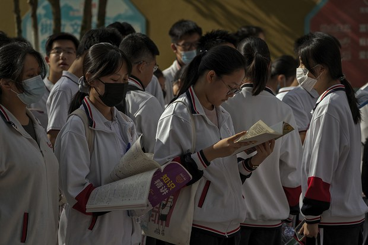
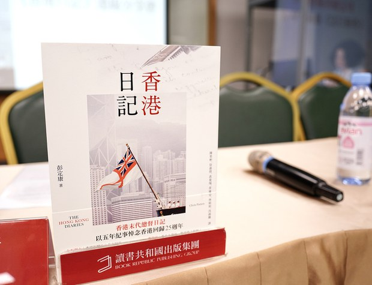
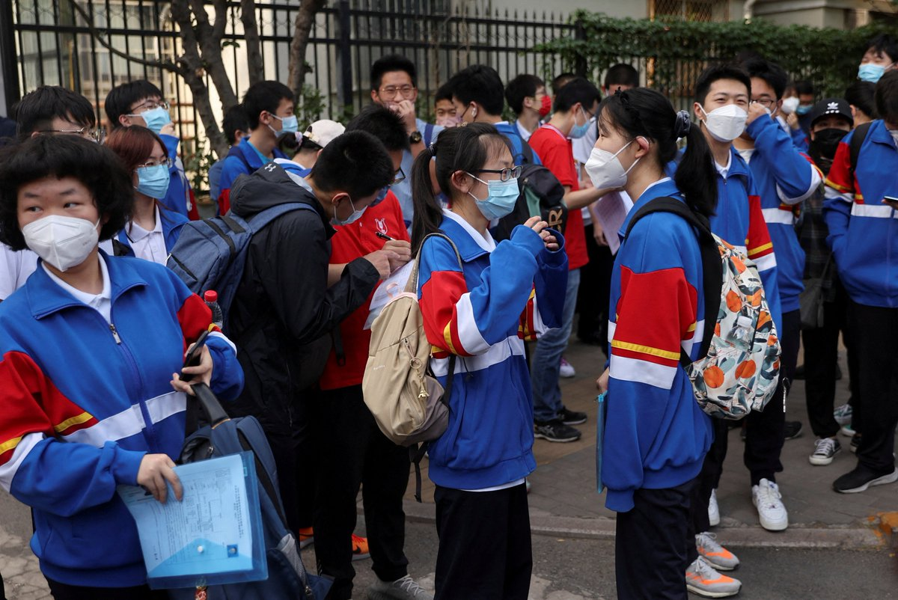

自由亚洲电台 北京时间 2023-06-09T22:57:52Z 1667184239471734786 专栏 | #周嘉有话说：年年高考，今又 #高考
#周孝正 
https://t.co/hsbtbeBhcg https://t.co/CCEGp080m6   自由亚洲电台 北京时间 2023-06-09T23:42:44Z 1667195534065676289 香港末代港督 #彭定康 以中国违背对港许下承诺为例证，向自由世界警告，#中共不可信，批评中共不理解自由和法治，应认清其极权本质。

https://t.co/4V0ZnStYBx https://t.co/b0mglTt535   自由亚洲电台 北京时间 2023-06-09T17:32:07Z 1667102263163359234 【中国生产物价PPI创七年以来最大跌幅】
【通缩风险恐加剧】
中国上月通胀回升，不过，生产物价创下逾7年以来最大跌幅。
中国消费需求持续恢复，在市场供应稳定下，通胀连续3个月放缓后，首度回升。
5月份中国居民消费价格指数(CPI)同比上升0.2%，和预期一致，但环比跌幅扩大至0.2%。受惠于食品供应充裕，食品价格环比下降0.7%, 蛋类及猪肉价格下跌1.3%及2%，鲜菜跌幅3.4%。
不过，反映企业成本的工业生产者出厂价格指数(PPI) 连续八个月下降，同比下跌4.6%，跌幅是2016年2月以来最大。
根据中国国家统计局的说法，上月国际大宗商品价格下跌，国内外市场需求偏弱，加上高基数均影响上游生产物价表现。
有分析认为，中国存在通缩风险，预期中央会出台政策推动内需。报道:https://t.co/GXCqthhm7v
#PPI
#通缩   自由亚洲电台 北京时间 2023-06-09T15:37:01Z 1667073299422285826 【农村与一线城市考生人数两极化】
【全国新增98万考生京沪却减少】
中国今年 #高考 人数近一千三百万，比去年增加98万，其中河南131万人，排名第一，其次是山东、河北两省超过80万考生，教育资源最丰富的上海考生仅五万多人。学者认为，中国 #考生红利 正在消失，大学招生难的现象将会浮现，大学产业化的路已到尽头。
详细报道：https://t.co/XHqnhdR9MM   自由亚洲电台 北京时间 2023-06-09T10:19:33Z 1666993403177861121 RT @RFA_Chinese: 6月7日，习近平语录历史性地进入中国高考语文考试题目。… https://t.co/Mg124UFcgy   自由亚洲电台 北京时间 2023-06-09T10:19:44Z 1666993451412357120 RT @RFA_Chinese: 【#亚太报道（2023-6-8）】 欢迎收听和订阅播客【亚太报道】 https://t.co/MjLNSvVeAE
#微信 或记录电脑日志并上传/#常玮平 涉" #厦门聚会”被判刑三年半/#律师谢阳 要求视频会见病危父亲遭脱延/中国高考作文题出…   自由亚洲电台 北京时间 2023-06-09T05:15:56Z 1666916996296896518 中国37架次军机扰台　台湾启动防御系统应对https://t.co/6vsNS9XveJ   自由亚洲电台 北京时间 2023-06-09T06:11:31Z 1666930983558422533 6月8日,中国四大国有银行回应政府要求，“奉旨”降息，下调一系列存款产品利率。今年5月初，也有3家股份行曾集体下调了存款利率。为了赶上利率下调前的末班车，一些中国年轻人奔波到另一个城市存钱，诞生了一个新的网络流行词：“特种兵式存款”。 https://t.co/TkkUXRuK1d   自由亚洲电台 北京时间 2023-06-09T06:14:45Z 1666931797240758279 【#亚太报道（2023-6-8）】 欢迎收听和订阅播客【亚太报道】 https://t.co/MjLNSvVeAE
#微信 或记录电脑日志并上传/#常玮平 涉" #厦门聚会”被判刑三年半/#律师谢阳 要求视频会见病危父亲遭脱延/中国高考作文题出现 #习语录/ 泰国偶像香港粉丝见面会引粉红出征 网友反击 #BILLKIN #PPKRI https://t.co/Bk4TWqJ5Ls   自由亚洲电台 北京时间 2023-06-09T02:47:51Z 1666879730811797527 据香港媒体大公文汇网6月7日报道，泰国人气偶像团体BILLKIN &amp; PP KRIT (BKPP)6日晚在香港举行粉丝见面会。见面会主持人发表涉台言论，粉丝齐喊“中国”表示抗议。见面会主持人在发言时将中国、台湾和香港并列提出。台下不满的粉丝大喊“台湾是中国的”。https://t.co/xgtarqg3h5   自由亚洲电台 北京时间 2023-06-09T02:48:31Z 1666879898630094858 中国敢于发声的文化界人士近些年频频遭到当局无理由边控。据悉，此前出版过一系列敏感书籍而遭到中共当局封杀的作家章诒和，近期被禁止出境。https://t.co/57qkQyUODz   自由亚洲电台 北京时间 2023-06-09T02:49:27Z 1666880133439844352 中国5月大雨酿洪灾　20省直接损失共逾32亿元https://t.co/38JxkYj1Ij   自由亚洲电台 北京时间 2023-06-09T03:58:57Z 1666897624035647504 【#变态辣椒：那是马，我是鸭！】

江西南昌的江西工业职业技术学院一名学生吃饭时吃惊地发现饭菜里出现老鼠，而校方的反应在微博上引发热议。校方宣称，发现的是鸭脖子而不是老鼠头，并警告学生不得在网上谈论此事。然而图片显示，食物中的动物长着老鼠牙。许多网民引用了源自秦朝的成语“指鹿为马"，认为校方蓄意造假。
https://t.co/mmxHurZCOT   自由亚洲电台 北京时间 2023-06-09T04:11:00Z 1666900656379027456 专栏 | #中国透视：“赫尔辛基时代”降临中国https://t.co/e2q93ZghVp   自由亚洲电台 北京时间 2023-06-09T01:54:34Z 1666866321529643008 湖南人权律师谢阳遭当局指控涉嫌"煽动颠覆国家政权罪"被关押在长沙市第一看守所已近1年半。近日，谢阳的父亲因感染新冠病危，盼望能与儿子视频会见，但法院对此至今却未作出回复。家属质疑当局推诿责任，担心会令谢阳终身抱憾。https://t.co/N9sxofmCi6   自由亚洲电台 北京时间 2023-06-09T01:59:13Z 1666867491715285009 北京对美国提出了的新的地缘政治挑战 。
据熟悉高度机密情报的美国官员称，古巴已和中国达成秘密的原则性协议，允许中国在其岛屿上建立电子窃听站。中国已同意为此向资金紧张的古巴支付数十亿美元。https://t.co/xQ7UohYFDY   自由亚洲电台 北京时间 2023-06-09T00:13:56Z 1666840996062044160 台湾学者蔡金树遭中国指控为"台谍"，一度上中国官媒央视"认罪"。蔡金树四年刑期期满后，因剥夺政治权利四年附加刑，近日传出被软禁在厦门的鼓浪屿。
https://t.co/eCcF8ThK0s   自由亚洲电台 北京时间 2023-06-09T00:15:20Z 1666841348379406336 据路透社独家报道，美国国会民主、共和两党参众议员周三（7日）向国务院发出联署信，要求禁止正受到美国制裁的香港特首李家超入境出席亚太经济合作组织（APEC）峰会。https://t.co/7b2yodoOu0   自由亚洲电台 北京时间 2023-06-09T00:16:03Z 1666841528701001728 #唯色RFA博客：与一位藏学家的对话：关于无辜受责的达赖喇嘛（四）https://t.co/uUMZh1433F   自由亚洲电台 北京时间 2023-06-09T00:18:14Z 1666842078184128512 评论 | #余杰：作为出版家的 #富察 和作为朋友的富察https://t.co/5IqlOOA3ZP   