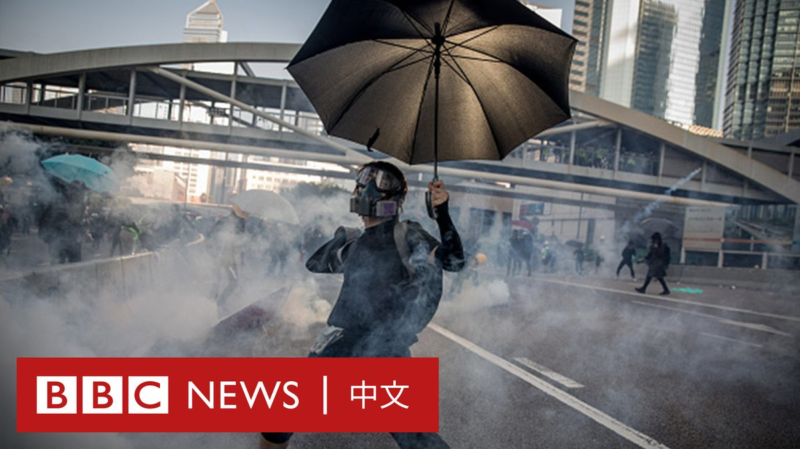
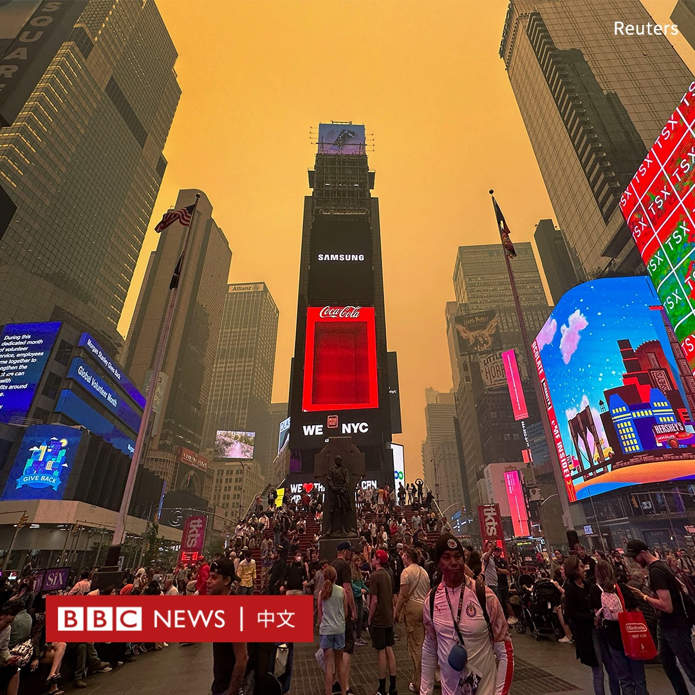
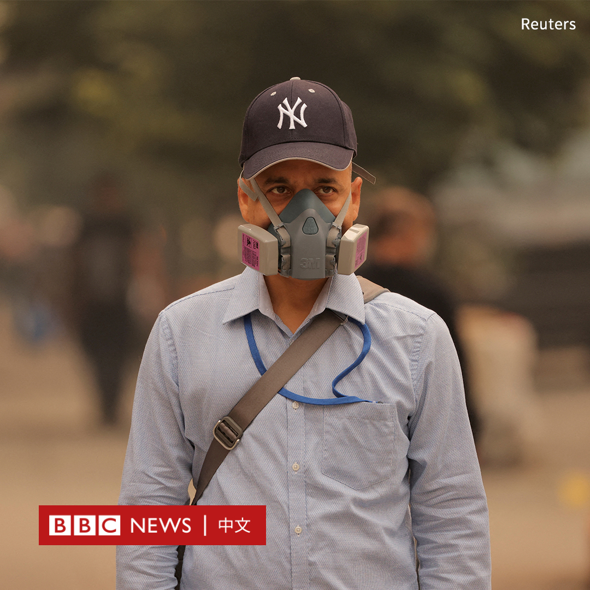
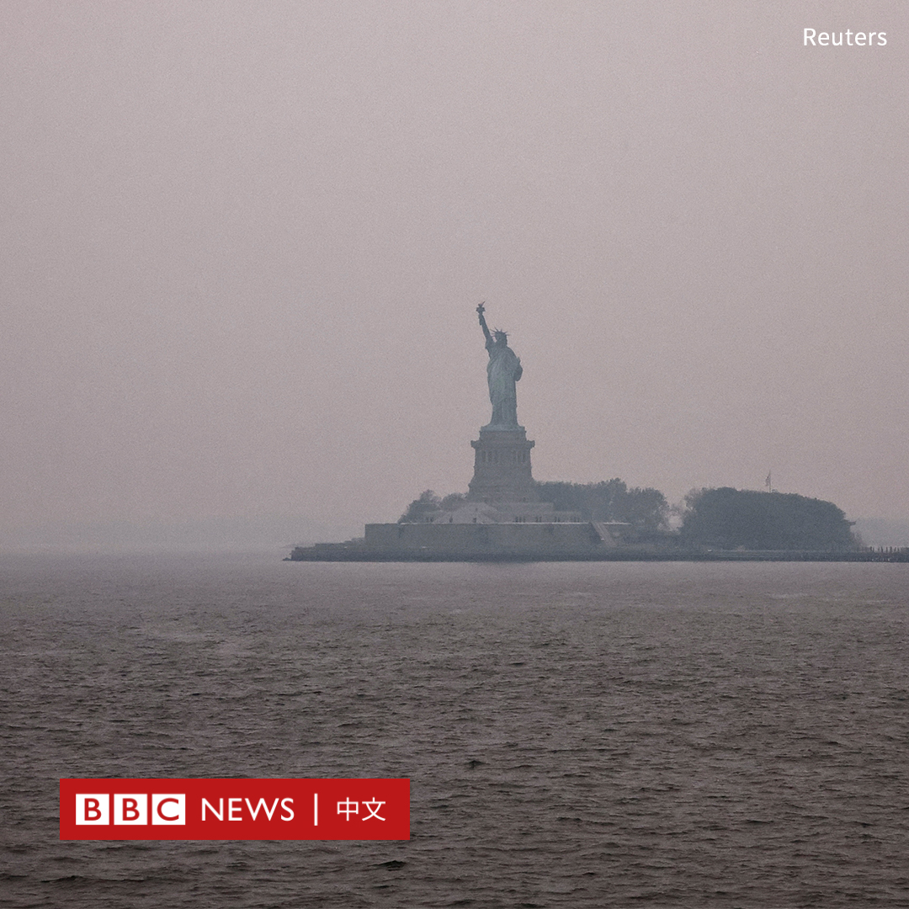
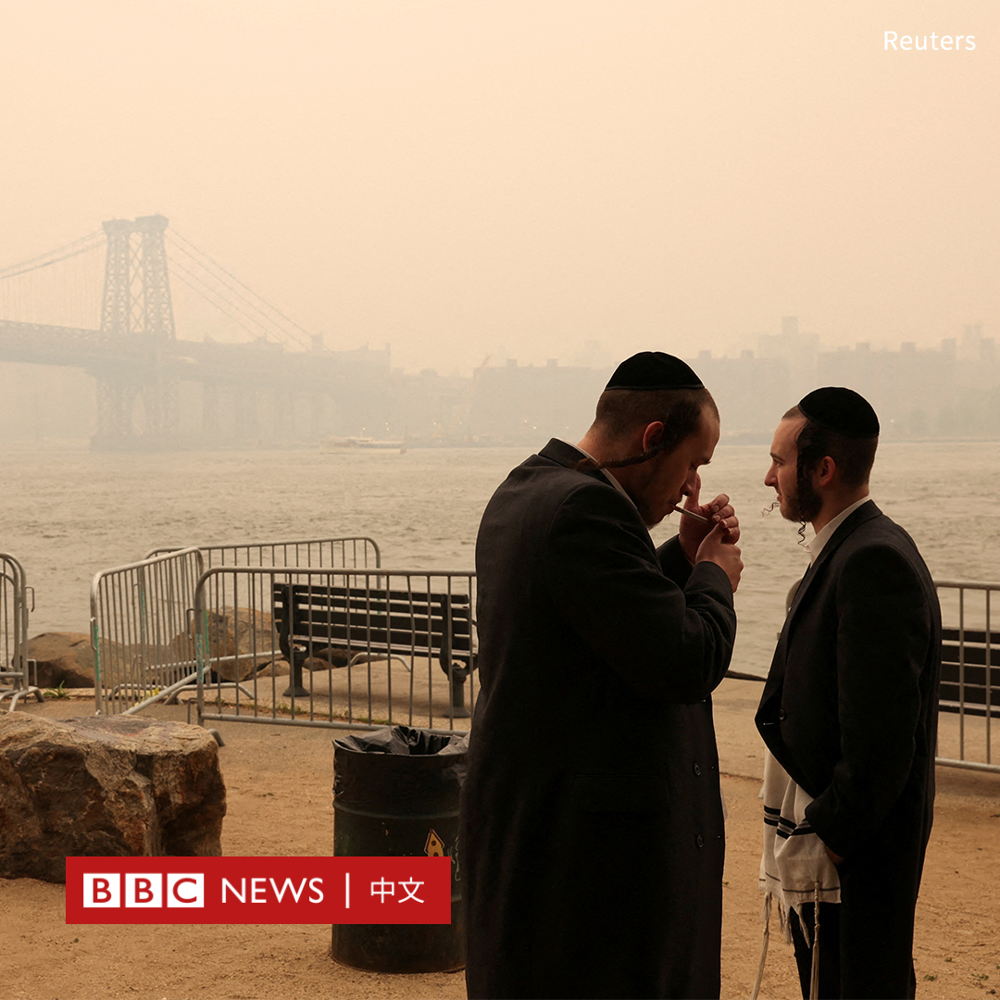

D英国广播公司BBC 北京时间 2023-06-08T22:23:17Z 1666813151202140164 在互联网上，数以千计的东亚女性在公共场所遭性侵犯的影片正被出售，观众甚至可以在这些网站上“定制”自己想要的视频。

运营性侵犯网站的幕后主谋是一个名为“齐叔”的神秘人物。他究竟是谁？

BBC调查栏目“BBC之眼”经过长达一年的卧底调查，带你走进这个黑暗而扭曲的世界。

完整版中文纪录片将于周五（6月9日）发布，敬请关注。   D英国广播公司BBC 北京时间 2023-06-08T20:54:55Z 1666790913048293378 字节跳动前高管余英涛在美国法庭提交的文件中声称，在Tiktok上传与香港示威活动相关内容的用户会被该公司识别和监控。字节跳动发言人否认指控，称其为“毫无根据”。https://t.co/tpSPupFX54   D英国广播公司BBC 北京时间 2023-06-08T18:18:45Z 1666751612143144960 在中国一名国企高管与年轻女子在四川成都牵手逛街的影片在网上疯传后，其公司宣布免去该高管的职务，并接受纪委核查。

周三（6月7日），一段据称是中国石油旗下的寰球项目管理公司党委书记、总经理胡继勇在街头牵着一位时髦女郎的影片引起网友的关注。

画面显示，一位中年男子身穿粉红色上衣，与一名衣着靓丽的年轻女子牵手逛街，面对镜头并不避讳，有说有笑。

在中国快手、抖音等社交媒体上，经常有博主上传在街头拍摄的时尚美女或帅哥影片。此类影片往往伴随着争议，一些人指责他们侵犯了肖像权。

但这段影片却引起一些网民叫好。因为有自称是该公司员工的网友表示，该女子并非胡继勇的妻子或女儿，而是该公司的员工，而这段时间正值两人到成都出差。

中国石油北京项目管理公司同日发布公告称，公司对该信息“高度重视”，并且进行了核实了解。

公告补充说：“胡继勇已被免去寰球项目管理公司执行董事、党委书记、总经理职务，并接受公司纪委核查，公司将根据结果进一步作出处理。”   D英国广播公司BBC 北京时间 2023-06-08T16:12:30Z 1666719840436994048 中国一年一度的大学招生考试“高考”周三（6月7日）拉开帷幕。在一份多个省份采用的语文考卷中，作文试题引述了中国领导人习近平的讲话，要求考生据此写出感想。
https://t.co/LVWAEVbKKH   D英国广播公司BBC 北京时间 2023-06-08T13:13:00Z 1666674667833413633 2019年2月，香港政府宣布修订《逃犯条例》，触发了一场席卷全港的抗议浪潮，起初相对和平的游行后来演变成警民激烈的暴力冲突。

2020年6月，中国人大常委会在争议声中通过港区国安法。此后三年，香港社会在诸多方面发生了巨大变化。在这场示威四周年之际，BBC中文带您回顾这场运动始末。 https://t.co/RS4A5aDHw8   D英国广播公司BBC 北京时间 2023-06-08T14:14:37Z 1666690173755695104 在东亚各地的公共交通工具上遭遇性侵犯的女性，还面临着另一种风险：性侵者偷偷拍摄下猥亵过程，并把影片放在网上出售。

经过超过一年的调查，BBC调查栏目“BBC之眼”以卧底的方式，揭露通过性暴力牟利的幕后黑手。https://t.co/ZBO1G8USYL   D英国广播公司BBC 北京时间 2023-06-08T10:15:18Z 1666629946255736832 由于加拿大持续的野火，北美空气质量严重恶化，包括纽约在内的多座城市笼罩在橙褐色阴霾中。加拿大则建议民众在户外佩戴N95口罩。

强烈的烟雾导致航班延误，并使纽约三家大型剧院的演出和美国职业棒球大联盟的两场比赛被取消。动物园也已将动物关在室内。

据IQair，纽约市空气污染指数在当地时间周二（6月6日）晚上达到200，周三更一度超过340，成为全球空气质量最差的大城市。

纽约州州长凯西·霍楚尔（Kathy Hochul）周三宣布，纽约州将于周四向该州居民分发100万个口罩。

美国环境保护局（EPA）将东北部大部分地区的空气质量归类为“不健康”，尤其是对有呼吸道疾病的人来说。

影响美国的大部分烟雾来自加拿大魁北克省，那里有150处大火正在燃烧。

当地官员表示，预计魁北克有1.5万名居民被迫撤离。这是魁北克有纪录以来最严重的火灾季节。

加拿大多地的大火已经烧毁了380多万公顷的土地，是过去十年同期平均数字的12倍。

白宫周三宣布，600多名美国消防员已被派往加拿大协助灭火。   D英国广播公司BBC 北京时间 2023-06-08T09:00:03Z 1666611007920414721 你愿意每小时交55美元，只为学习如何微笑吗？ 😊 

在日本东京的一间课堂，微笑教练正在帮助十余名学生学习微笑的方法。

在新冠疫情期间，日本人普遍佩戴口罩。如今，随着人们摘下口罩，很多人开始注意“表情管理”，这些课程如雨后春笋般涌现。 https://t.co/VpkD7OdFzo   