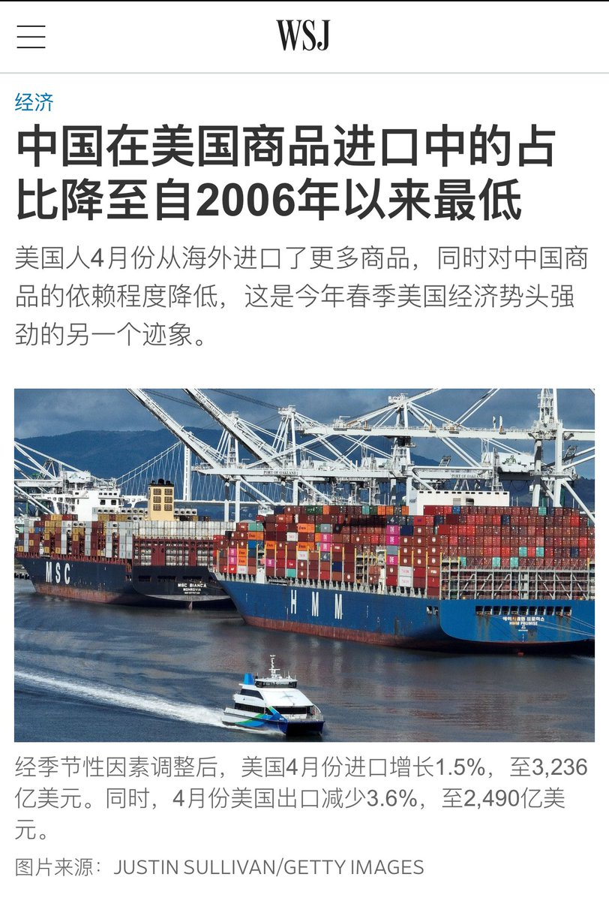

多伦多方脸 北京时间 2023-06-08T18:30:29Z 1666754563876196353 中美脱钩的速度超乎很多人的想象，也完全超过我的想象。
在2020年的时候，还有大量的人鼓吹世界离不开中国。
去年我在知乎说印太框架的时候还被小粉红嘲笑不懂供应链，说世界离开中国物价将会崩溃
其实从苏联解体，再到俄罗斯的失利和如今的中国被快速脱钩
独裁政权总比我们想的要弱小很多 https://t.co/goqL8V2TzJ   多伦多方脸 北京时间 2023-06-08T14:14:42Z 1666690195868233730 今年的ios17 beta版本。
是我见过BUG最少的测试版本。
但是也是我最感受不到差距的一次更新。
或许是更新的少，所以BUG少吧
😬😬😬😬
如果想体验的话，先下一个16的beta描述文件。
然后去更新那里把beta updates里面的打开就可以更新了。   多伦多方脸 北京时间 2023-06-08T11:01:23Z 1666641545947394048 上岸第一剑，先斩意中人。   多伦多方脸 北京时间 2023-06-08T11:01:46Z 1666641642273783808 中国为什么在2012年上台的是习近平却不是一个改革派？
是中国人做的选择吗？
为什么中国没有像文化，经济发展路线都十分类似的韩台一样迎来改革者？
我把其原因称为大国诅咒！
方脸说：为什么中国选择的是习近平？https://t.co/WXH6Fab8w7 来自 @YouTube   多伦多方脸 北京时间 2023-06-08T07:45:51Z 1666592338452574208 午饭吃个鸭架🥺 https://t.co/63mlWa9qt4   