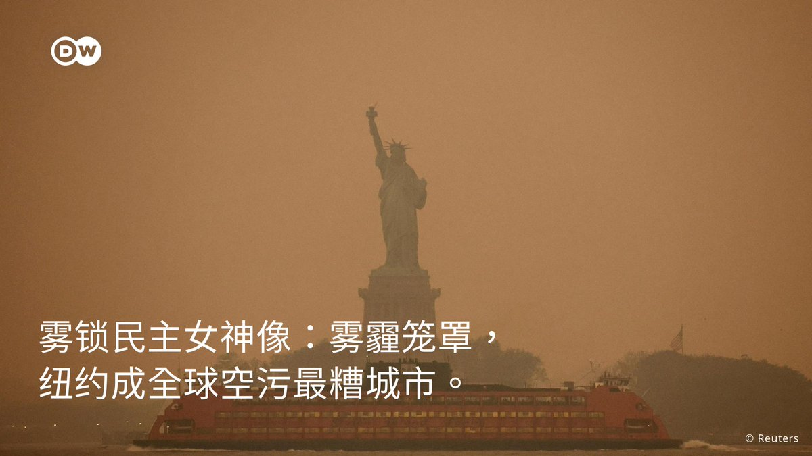

德国之声 北京时间 2023-06-08T22:28:06Z 1666814361695039489 《华尔街日报》称，中国同意向古巴🇨🇺支付几十亿美元，两国已达成秘密协议，在该国建一处电子 #监听 设施。
https://t.co/0NHaESlWXt   德国之声 北京时间 2023-06-08T23:00:01Z 1666822394281959424 《南德意志报》： “欧盟🇪🇺将中国🇨🇳定位为'对手、竞争者和伙伴'，但对欧盟民众而言，中国首先是一个'必要的伙伴'。盡管如此，很多欧洲人并不赞同中国在他们的国家购买港口、高科技企业或媒体机构。在德国，持这一立场的人占比为70%，高于欧盟各国的平均水准。”
https://t.co/gZjKbN6reT   德国之声 北京时间 2023-06-08T20:50:00Z 1666789673589686272 人间梦想在这家工厂实现了！
大多数德国人都希望每个星期工作4️⃣天，休息3️⃣天。 一些🇩🇪企业开始尝试一周四天工作制，并且已经取得了一些令人鼓舞的成效。 🕠一周四天工作制有何好处？让我们来听听老板和员工分别怎么说。 https://t.co/JPoU13Um45   德国之声 北京时间 2023-06-08T21:04:52Z 1666793415843954688 袭击发生在法国南部阿尔卑斯山小镇安纳西（Annecy）的一座公园，造成四名儿童及至少一名成人受伤。
https://t.co/KSgxhTWQhv   德国之声 北京时间 2023-06-08T21:51:54Z 1666805250634969090 乌克兰总统 # 泽伦斯基 周四视察赫尔松洪水灾区。他指控俄罗斯应为 #卡霍夫卡大坝 损毁负责，并指占领军去年就在水坝安置了地雷。 “他们低估了危险，没有料到也会淹没俄方占领区”。
他表示，乌克兰收复水库坝区后，将邀请国际专家调查大坝垮塌的原因。 https://t.co/D4LV2JLmQb   德国之声 北京时间 2023-06-08T18:51:36Z 1666759879405469696 《维权网》报道称，中国人权律师 #常玮平 6月8日被以"顛復国家政权罪"判处有期徒刑3年6个月。
这是继许志永和丁家喜分别被判处14年和12年重刑之后，卷入#厦门聚会案 的另一名律师被判刑。
https://t.co/IAKbChFZKU   德国之声 北京时间 2023-06-08T19:25:00Z 1666768282647678976 被告是一位旅居德国近30年的乌克兰裔，在2022年5月组织了一场亲俄示威游行，期间还接受了媒体采訪，声称"俄罗斯🇷🇺不是侵略者，而是在帮助结束乌克兰🇺🇦的战争"。
https://t.co/EdFBHbMSs5   德国之声 北京时间 2023-06-08T20:14:51Z 1666780828502827009 有网民指出，事件女主角家境出身优越，自己也是国企白领，曾在社交媒体上感慨：“认识到自己是怎样被羡慕的，一切不费吹灰之力，以别人奋斗的终点为起点。”
https://t.co/9tZRczsqee   德国之声 北京时间 2023-06-08T16:55:13Z 1666730590798860294 母公司可调取TikTok用户数据？前高管：党委委员有“后门；字节跳动否认：毫无根据。
”https://t.co/EsL3eY6QCq   德国之声 北京时间 2023-06-08T17:31:49Z 1666739798374064128 英国《金融时报》引述消息人士报道，美国🇺🇸、台湾🇹🇼和日本🇯🇵将共享海军 #无人侦察机 的实时数据。
此举将能助台湾及其邻国更全面、实时地掌握中国海军在 #第一岛链 上的活动。
https://t.co/R3soLJfTpi   德国之声 北京时间 2023-06-08T18:10:47Z 1666749605227143171 🚢送电到家？
日本公司PowerX设计的电池船计划取代海底电缆，直接运送电池🔋🔋，你看好这种运营模式吗？#dwbusiness https://t.co/8Mtp2YvCoH   德国之声 北京时间 2023-06-08T14:39:15Z 1666696373800976385 欧洲人怎么看 #台海冲突？跟 #法国总统马克龙 先前提出"欧洲不应卷入台海争端"的表态似乎不谋而合。
https://t.co/20Vo8XPdFK   德国之声 北京时间 2023-06-08T15:38:45Z 1666711344748396545 「"内卷是因为狼多肉少"是一种普遍的错误认知。从历史角度而言， #人均资源 和内卷程度的相关性并不明显。中国的 #内卷 是什么时候出现的？不正是在人均经济资源大量增长后才开始的么？2000年之后才逐渐开始出现"内卷"的。所以首先这是一个"不公平"所导致的问题。」
https://t.co/uu3xnrOMoi   德国之声 北京时间 2023-06-08T16:14:56Z 1666720453174468613 “最后一代”是犯罪组织？德国司法机构正在调查。无论结果如何，该运动的极端行为早已分裂了社会。 https://t.co/T0f4QtINUm   德国之声 北京时间 2023-06-08T13:54:04Z 1666685001637965825 中国驻美大使 #谢锋 7日在一场履新活动演讲时表示，自己抵美后有美国网友在推特踊跃留言，他确实感到“不少美国朋友对促进中美合作有压力、有顾虑，担心被批评’政治不正确‘”，需要他把支持 #美中关系 的人找出来。 https://t.co/Of4FDeaUZ0   德国之声 北京时间 2023-06-08T13:54:25Z 1666685088506187776 他指，美中关系恶化，工商界首当其衝，“大环境好，大家才能安心发财”，盼多交流但“问题是我现在常常被双边关系中的难题拴住，感觉一天24小时工作都不够用”；同时暗批，“中国有句话叫‘心诚则灵‘一边把对方放在制裁名单里，一边要求对话合作，这是不可接受的”。   德国之声 北京时间 2023-06-08T12:14:04Z 1666659835302268930 这张宛如末世的照片不是科幻电影，而是6月7日的 #纽约。#加拿大 近日 #野火 肆虐，发生逾百起森林大火，烧毁至少380万公顷左右土地，约相当于31个纽约市。#雾霾 跨境南漂，美国数十州发布空污警报，追踪全球空气品质的IQair表示，本以蓝天著称的纽约7日却超越了新德里，成为全球空气品质最糟城市。 https://t.co/VH2ISFINub   德国之声 北京时间 2023-06-08T12:14:34Z 1666659961278181376 严重空污已导致东岸航班延误、学校取消校外活动；以《杀死伊芙》闻名的Jodie Comer原在百老汇登台演出，也因空气品质差称自己呼吸困难，演出临时喊停。   德国之声 北京时间 2023-06-08T09:57:14Z 1666625400338825216 #中国 先前对 #美光 祭出贸易禁令，并无预警搜查多家美企。#美国驻华大使 7日表示，这些行动出于"政治动机"，美方将抵制并进行反击。 https://t.co/m4cWR38yFz   德国之声 北京时间 2023-06-08T07:05:00Z 1666582055508135938 为了阻遏中国等国家以 #经济胁迫 手段，干预欧盟成员国的政治决策，欧盟🇪🇺 即将推出反制工具。此前，因 #立陶宛 同意台湾在该国设立代表处，北京曾对立陶宛实施大规模经济制裁。

https://t.co/Vxt7DcixQn   德国之声 北京时间 2023-06-08T09:46:02Z 1666622580370059267 #美国 和 #德国 官员表示，演习将"绝对令人印象深刻"，并表明北约领土是一条政治"红线"。
这场以德国🇩🇪为主、北约有史以来规模最大的空军演习有哪些值得关注的看点？看详细报导👉https://t.co/RcMtyXjjH1   