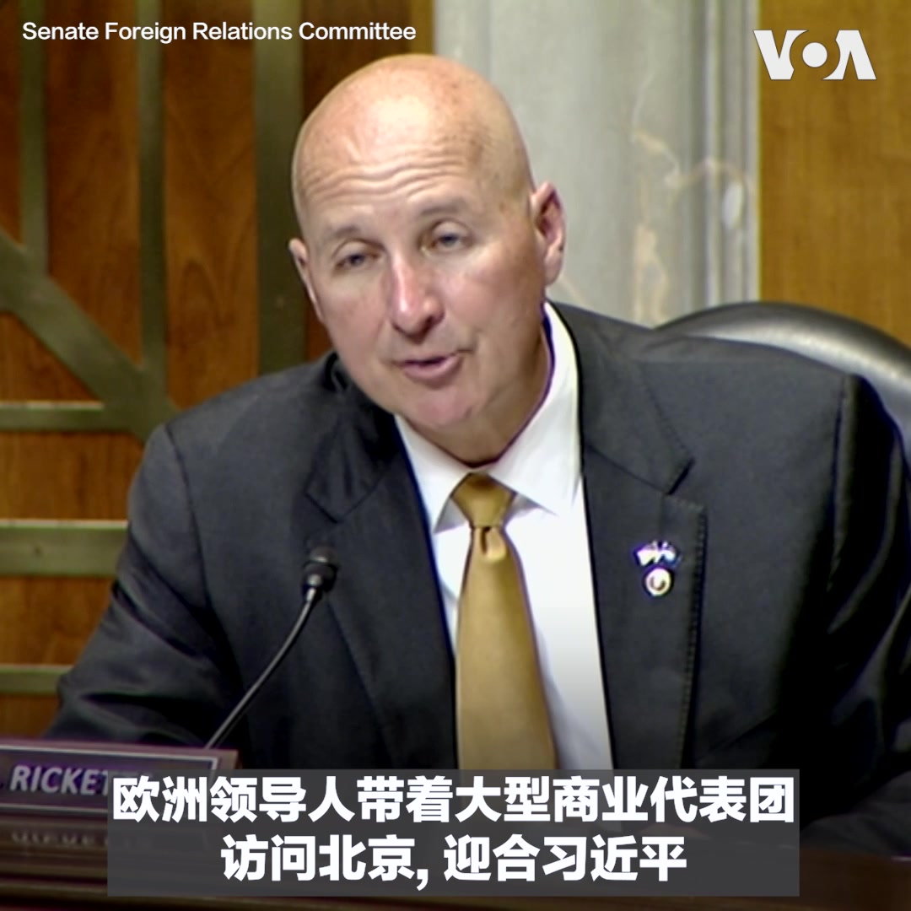
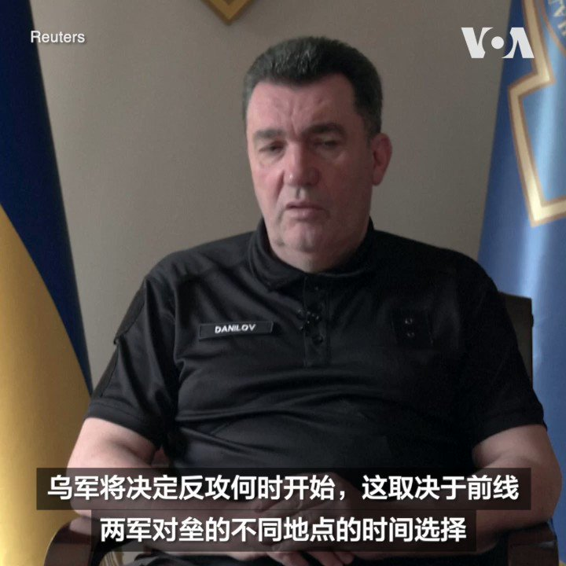

美国之音中文网 北京时间 2023-06-08T22:33:11Z 1666815640186019841 美中再接触？美国国务卿布林肯预计不久访问中国 https://t.co/DCkBlkJC1s   美国之音中文网 北京时间 2023-06-08T23:02:04Z 1666822911100080130 布林肯：与伊斯兰国的战斗“尚未结束” https://t.co/1GSXhsEnDQ   美国之音中文网 北京时间 2023-06-08T23:36:04Z 1666831464435154951 香港“六四”民调压力下被叫停 分析：港府图清洗港人集体记忆 https://t.co/KRVrAETUPg   美国之音中文网 北京时间 2023-06-08T21:00:54Z 1666792418946195456 6/8【#时事大家谈】中国高考人数破纪录，读书还能改变命运吗？中国监管人工智能，为何引发担忧？

嘉宾：独立时评人、法学博士张杰博士；作家、独立时评人傅志彬先生
主持人：平章

YouTube: https://t.co/rh79UCrFdO https://t.co/eKuBV9p2AH   美国之音中文网 北京时间 2023-06-08T21:42:32Z 1666802895768162306 印外长：印中必须要找到避免边境冲突的途径 https://t.co/dudGBUTrZT   美国之音中文网 北京时间 2023-06-08T22:00:04Z 1666807305499987969 陆家嘴论坛为经济复苏寻求新动力，国监管当局向国际金融界抛橄榄枝 https://t.co/7WQxLnkzWM   美国之音中文网 北京时间 2023-06-08T16:35:03Z 1666725515976380417 中国最大国有银行降低存款利率 https://t.co/m2R8RGlCbM   美国之音中文网 北京时间 2023-06-08T18:06:03Z 1666748415584374786 中国近期最大规模37架次军机扰台 台湾启动防御系统 https://t.co/YFb9Lt5S5N   美国之音中文网 北京时间 2023-06-08T14:38:00Z 1666696056451547136 2024大选共和党初选中，前总统特朗普民调明显领先，超过其他十多位候选人支持率的总和。本周新泽西前州长克里斯蒂在新罕布什尔州宣布参加角逐，2016年他曾经是特朗普的坚定支持者并负责其权力交接团队，但2020大选后成为特朗普的批评者，克里斯蒂或将继续坚持这一立场。 https://t.co/Msaz5dIUv5   美国之音中文网 北京时间 2023-06-08T16:15:03Z 1666720482023075840 俄中战略轰炸机联合巡航 日本战机升空警戒伴飞 https://t.co/BSRuG8YajH   美国之音中文网 北京时间 2023-06-08T12:51:03Z 1666669141540089856 美国矛头指向中国拉美贸易与芬太尼贩运 https://t.co/3oCZITzZ4k   美国之音中文网 北京时间 2023-06-08T13:14:02Z 1666674928719130624 苏丹各派系争夺军火厂控制权时引发大火 https://t.co/f2XPeZM5NP   美国之音中文网 北京时间 2023-06-08T13:37:00Z 1666680705252827138 乌克兰第3突击旅等部队携手在6日发动机械化突袭行动，在巴赫穆特附近将俄军击退1公里，其装备包括全履带配置的美制M113装甲运兵车、60毫米迫击炮、坦克等，部分战斗过程被乌军战士随身携带的摄像头记录下来。M113是当代军事史上的经典战车，乌军目前已受援约1500辆。 https://t.co/IuYrOmlQtC   美国之音中文网 北京时间 2023-06-08T06:30:00Z 1666573247410782209 继城管农管之后，文管隆重登场。独立时评人虞平说，中共对文化和意识形态的整肃到了登峰造极地步，已经悄悄开始了文革2.0，虽然不像原始版那样大张旗鼓和粗暴，但让每个人心存恐惧，没有思想自由，李昊石事件就是一个可怕的例子。#时事大家谈完整版：https://t.co/mfLeetUSuo https://t.co/wQ6YnhxroF   美国之音中文网 北京时间 2023-06-08T06:30:32Z 1666573384388341760 英国首相苏纳克周三抵达华盛顿进行为期两天的访问。他将于周四到白宫和美国总统拜登进行双边会晤。白宫新闻秘书让-皮埃尔在周三的例行记者会上表示，两位领导人将讨论美英经贸伙伴关系，对乌克兰的坚定支持，以及美英在关键和新兴科技上的领导角色等议题。 https://t.co/Yodsji65Y4   美国之音中文网 北京时间 2023-06-08T06:40:06Z 1666575790627233793 辛灏年用历史眼光解剖六四: 是改良还是革命？ https://t.co/t2RqKLY0SA   美国之音中文网 北京时间 2023-06-08T07:00:00Z 1666580799464828928 中国今年有破纪录的1291万学子参加高考。面对学费上涨、青年失业、阶层固化，高考是否还是普通家庭改变命运的阶梯？习近平语录成高考作文题，中国教育在走向何方？另一方面，北京或将推出人工智能监管新规，为何引发外界担忧？6月8日的时事大家谈将讨论这些问题，请留言参与。 https://t.co/qPnpP7Ov2I   美国之音中文网 北京时间 2023-06-08T07:11:33Z 1666583703013961728 VOA专访全球接触中心特使，谈美国试图与盟友签署更多协议打击中俄虚假信息 https://t.co/EUL6dNAEWt   美国之音中文网 北京时间 2023-06-08T07:23:33Z 1666586723311292418 反恐官员：美国国内极端分子成为世界其他极端分子的“灵感来源” https://t.co/8SnLAPAh5z   美国之音中文网 北京时间 2023-06-08T08:00:00Z 1666595898367913985 中国文管高调登场，引爆舆论。芝加哥大学客座教授滕彪说，把言论控制扩展到非政治领域，表明中共面临全面危机感，包括领导人交班、官民矛盾、经济放慢和意识形态危机，而危机感让中共夸大矛盾和恐惧。#时事大家谈完整版：https://t.co/mfLeetUSuo https://t.co/enlRnUUSfV   美国之音中文网 北京时间 2023-06-08T08:45:04Z 1666607238239371264 布林肯与沙特领导人讨论恐怖主义、也门与苏丹冲突 https://t.co/RtUghyG9Bf   美国之音中文网 北京时间 2023-06-08T08:52:09Z 1666609019962753026 美国会两党参议员周三在一场听证会上呼吁欧洲国家采取协调一致的方法，应对中国威胁。参院外委会民主党人沙欣(Jeanne Shaheen)说，“我们必须与盟友团结，保护我们的经济和共享的价值观”。委员会共和党人里科特(Pete Rickettes)认为，主张加强与中国外交接触和经济联系的政策是个“重大的错误评估”。 https://t.co/2VrCwstYiV   美国之音中文网 北京时间 2023-06-08T09:00:00Z 1666610996662915072 一键解锁#美国热搜 榜1、习近平改计生协为催生协，强制生育在路上2、中共利用Tic Tok监控香港民主人士，周受资被指控装无辜3、李家超发明器官革命4、美军的另类战法5、外交战狼的小聪明6、解放军中校占位子7、中国的人工智能谈六四8、官员笑场为人民服务9、大学女生的生育观 https://t.co/49RxpRjb6o https://t.co/0BDcTv7ECJ   美国之音中文网 北京时间 2023-06-08T09:20:05Z 1666616049813565440 国会两院两党议员敦促美国务卿不要邀请香港特首出席APEC峰会。 https://t.co/RxE8Zsstwm   美国之音中文网 北京时间 2023-06-08T09:20:07Z 1666616058101514242 国际民航组织负责人访北京，中国夸赞其“在涉台问题上坚持正确立场” https://t.co/nrJBNB5eFJ   美国之音中文网 北京时间 2023-06-08T09:30:06Z 1666618574021033984 中印两国最近几乎驱逐了双方全部驻站记者。中国官媒《环球时报》称，是印度首先使用签证作为武器。 实际上，北京以记者签证为武器的事例颇多，中印媒体交流中断，双方都难辞其咎。 请看 #揭谎频道 。https://t.co/B6JMUG08xq   美国之音中文网 北京时间 2023-06-08T09:34:03Z 1666619564401254400 中国与伊朗、巴基斯坦罕见地举行反恐会谈 https://t.co/ziQ3kavufW   美国之音中文网 北京时间 2023-06-08T09:55:05Z 1666624860712497152 前副总统彭斯在首场竞选活动中批评前上司特朗普 https://t.co/Ju6g45iKgQ   美国之音中文网 北京时间 2023-06-08T04:56:03Z 1666549605537054720 两位美国参议员跨党联名致函，要求TikTok解释有关处理美国用户数据的“不准确”说法 https://t.co/wDTniEG0MK   美国之音中文网 北京时间 2023-06-08T04:56:05Z 1666549614026309632 加拿大烟雾飘向南方，美国多州发布空气质量警告 https://t.co/uQblUCR7FC   美国之音中文网 北京时间 2023-06-08T05:27:02Z 1666557402110623744 美国驻华大使：中国针对美国公司的行为是出于政治动机 https://t.co/Ubt3EoKPIA   美国之音中文网 北京时间 2023-06-08T06:03:03Z 1666566467947749381 欧盟与美国要求科索沃在与塞族的对峙中后退，否则面临“后果” https://t.co/bETjV9E2mF   美国之音中文网 北京时间 2023-06-08T01:53:07Z 1666503570466955264 中国新一代JF-22超高速风洞通过验收，专家质疑技术大幅领先美国 https://t.co/Seo2yvBBhM   美国之音中文网 北京时间 2023-06-08T04:00:35Z 1666535645844770819 乌南卡霍夫卡大坝崩塌后，乌克兰向受灾民众紧急运送饮用水 https://t.co/HtrTVEnhoY   美国之音中文网 北京时间 2023-06-08T04:05:52Z 1666536974415728647 乌克兰国家安全和防务委员会秘书长阿列克谢·达尼洛夫6月7日说，乌军尚未发动收回被俄军占领国土的反攻。他说，俄罗斯官员有关乌军已经开始发起反攻的说法是不真实的。达尼洛夫在接受路透社专访时表示，乌军最近在前线发起的零星攻势并非反攻计划的一部分。 https://t.co/lMr02WZ3Sp   北京时间2023-06-08T02:03:12Z 乌克兰扎波罗热地区的紧急救援人员和警方6月7日举行防辐射和居民疏散演习。几天前，位于卡霍夫卡水库的一座大坝被炸后，当地多座村落被淹。这座水库是扎波罗热核电厂的供水主要来源，大坝被炸引发核泄漏担忧。当地官员说，目前核电站情况正常。 https://t.co/v46xa7WYzw   北京时间2023-06-08T01:53:07Z 中国新一代JF-22超高速风洞通过验收，专家质疑技术大幅领先美国 https://t.co/Seo2yvBBhM   北京时间2023-06-08T00:14:05Z 2023年中国普通高等学校招生全国统一考试（高考）6月7日开始举行。约有将近1300万名考生参加了这场为期两天的考试，比去年增加近100万人，创下历史新高。在上海，一些在考场外等待的家长对法新社讲述了他们对高考的看法。 https://t.co/suTSZmUGOz   