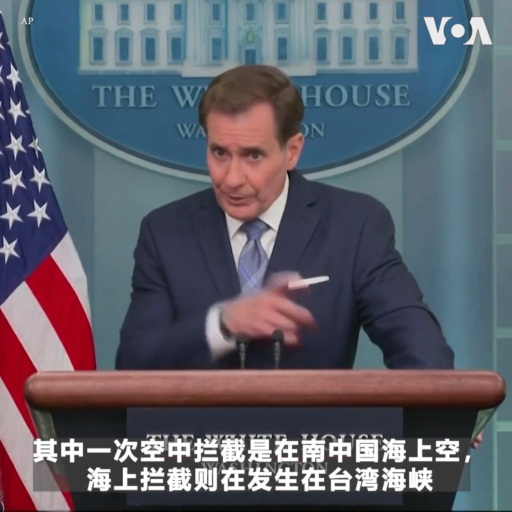
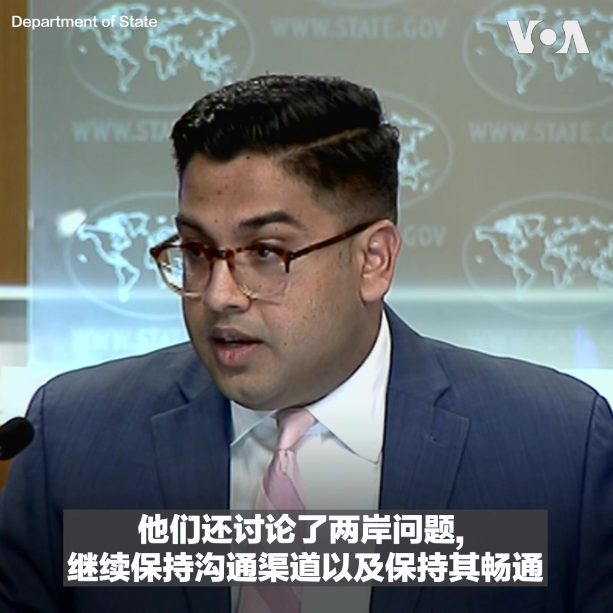
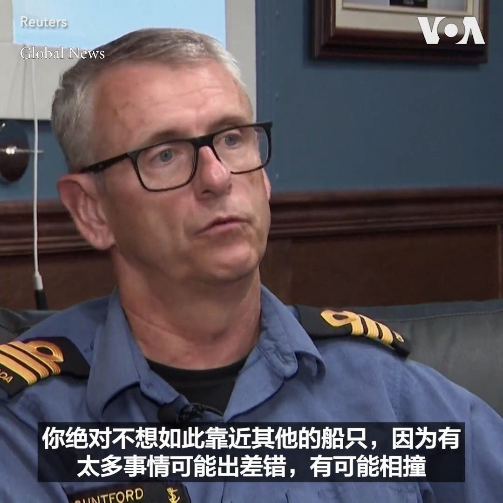

美国之音中文网 北京时间 2023-06-06T08:00:01Z 1665871125589499905 三十四年前的1989年6月4日，中共当局出动军队血腥镇压天安门广场学生。当年的热血青年学生，如今也都白发斑斑。三十四年后，回首往事，最没有想到的是什么？相关报道：https://t.co/18Erupo2KX https://t.co/5NE0KqiVGM   北京时间2023-06-06T06:07:05Z 回港艺术家创作荒诞P图 学习委内瑞拉民众保存幽默感 https://t.co/H3vv8hyM7a   北京时间2023-06-06T06:07:02Z 中国社媒不断删除西方国家大使馆纪念六四帖文 https://t.co/OzhwByvemC   北京时间2023-06-06T05:57:37Z “我自己是个老水手，当你在这样开阔的水域那样做时，那是非常接近的，”白宫国安会战略沟通协调员科比6月5日在例行记者会上谈到解放军最近在台湾海峡近距离拦截美军驱逐舰时说。他说，解放军的做法是“不安全的，是不专业的”。他指出，解放军若继续这样的做法，“用不了多久就可能会有人受伤。“ https://t.co/4cIYSC0Ts1   北京时间2023-06-06T05:39:03Z 美SEC起诉全球最大加密货币交易所币安及其创始人赵长鹏,指控其涉嫌经营“欺诈网络” https://t.co/afkDmkL1j1   北京时间2023-06-06T05:35:56Z 美国会众议院中国特设委员会将在美东时间6月5日下午5点30分举行“从民主墙和天安门广场到四通桥”活动，纪念1989年天安门广场大屠杀和中国争取自由的奋斗。活动将包括众院议长麦卡锡、主席加拉格尔、众院民主党领袖杰弗里斯及持不同政见者的讲话。 https://t.co/UWop1As2Vd   北京时间2023-06-06T05:25:04Z 前美国副总统彭斯提交文件，正式竞选总统 https://t.co/D57mSIWOcf   北京时间2023-06-06T05:09:41Z 美国会众议院中国特设委员会将在美东时间6月5日下午5点30分举行“从民主墙和天安门广场到四通桥”活动，纪念1989年天安门广场大屠杀和中国争取自由的奋斗。活动将包括众院议长麦卡锡、主席加拉格尔、众院民主党领袖杰弗里斯及持不同政见者的讲话。美国之音将在官网、YouTube频道和推特平台进行直播。 https://t.co/TyizwLTK80   北京时间2023-06-06T05:09:05Z 欧盟调查涉嫌来自中国的欺诈性生物燃料 https://t.co/vZlakqHFki   北京时间2023-06-06T05:09:03Z 美国两党提案: 加强对中共在新疆对维吾尔人虐待问责的力度 https://t.co/uK5roAr5aI   北京时间2023-06-06T04:56:33Z 韩国在美中对抗中倾向华盛顿 https://t.co/naqq4zQY9d   北京时间2023-06-06T04:31:45Z 美国国务院负责东亚和太平洋事务的助理国务卿康达(Daniel Kritenbrink) 本周在中国进行访问。美国国务院副发言人帕特尔6月5日在例行记者会说明，美中官员就人权和两岸问题等议题进行了“坦诚而富有成效“的讨论。这是继中央情报局局长伯恩斯上个月秘访北京后，又一位主管中国事务的高层官员访华。 https://t.co/p3qBidK7nP   北京时间2023-06-06T04:30:01Z “在行动之前先用无线电广播宣布，这一事实清楚地表明他们是故意的”，加拿大“蒙特利尔号”护卫舰舰长蒙福德目睹了中国军舰在危险距离内逼近美国军舰“钟云号” 。当时“蒙特利尔号”正与 “钟云号” 联合穿越台湾海峡。专家认为中国的行为是危险的。中国声称美国军舰在台海的行动是对中国的“挑衅”。 https://t.co/30afr3dMGu   北京时间2023-06-06T04:26:02Z 美国高级外交官在北京会晤了中国外交部高官,讨论双边关系和台海等议题 https://t.co/SvYcw8Ste2   北京时间2023-06-06T03:12:34Z 美国实施制裁，打击俄罗斯在摩尔多瓦的影响力行动 https://t.co/RnHAe2PpJg   北京时间2023-06-06T02:45:48Z 印度铁道部长阿什维尼·瓦伊什瑙6月5日说，上星期五发生在印度东部奥里萨邦的重大列车事故的搜救工作已经结束，政府已经启动对这起20多年来最致命交通事故的调查。他说，所有脱轨车厢都已经被移走，事发现场已经恢复了列车通行。这起事故造成至少275人死亡，1200人受伤。 https://t.co/H581txr8dS   北京时间2023-06-06T01:39:05Z 癞头面前不得说“光”：香港一辆挂US8964车牌的私家车竟遭拖走扣车 https://t.co/wo8myZ7k4R   北京时间2023-06-06T01:29:21Z 欧盟官员6月5日说，欧盟计划要求谷歌和Meta(脸书)等签署欧盟人工智能行为规范的网络平台为人工智能生成的文字和图像加注特别标识，以利于用户识别并防止虚假信息泛滥。欧盟委员会副主席维拉·约洛瓦说，包括ChatGPT在内的人工智能聊天软件为打击虚假信息带来新的挑战。 https://t.co/MIEdUIejN7   北京时间2023-06-06T00:57:06Z 严遭打压的香港新闻界获得罕见胜利：记者查询公共信息无罪 https://t.co/ltUv9aTwhY   北京时间2023-06-06T00:57:04Z 美台蒙特利战略与安全会谈七月在华盛顿举行，聚焦军售与台海安全 https://t.co/X785BtK0Mt   