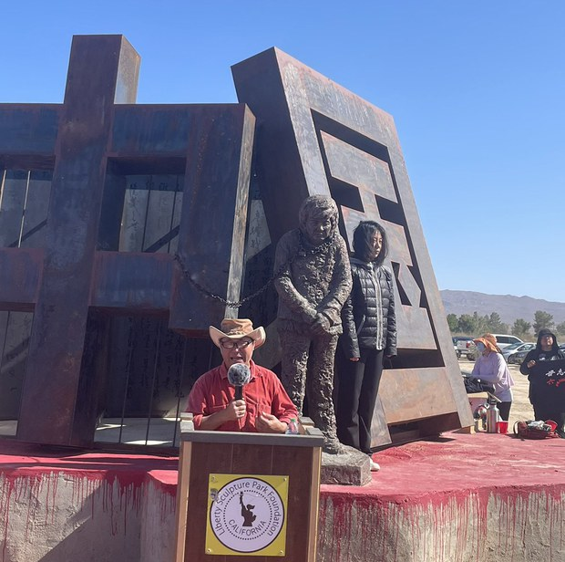
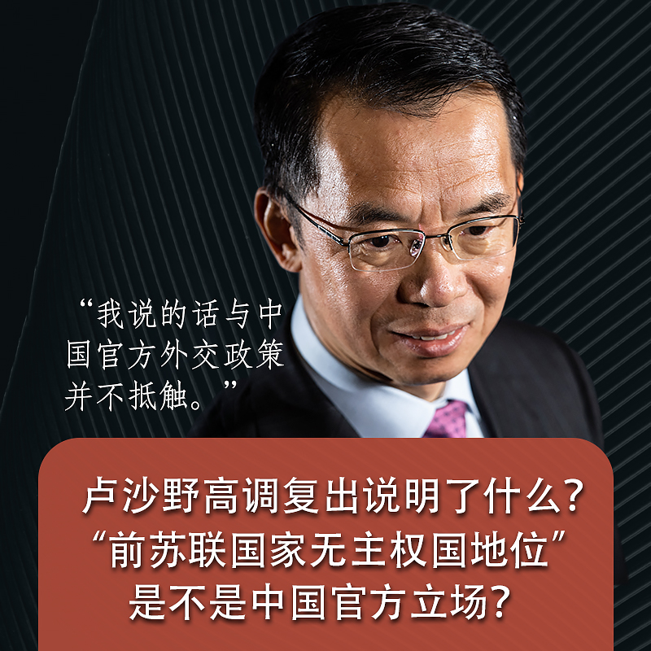
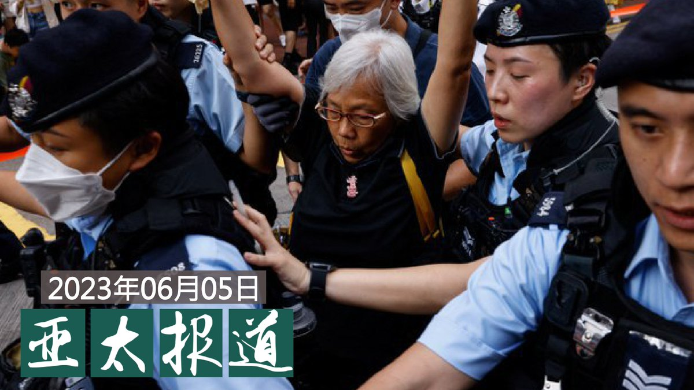
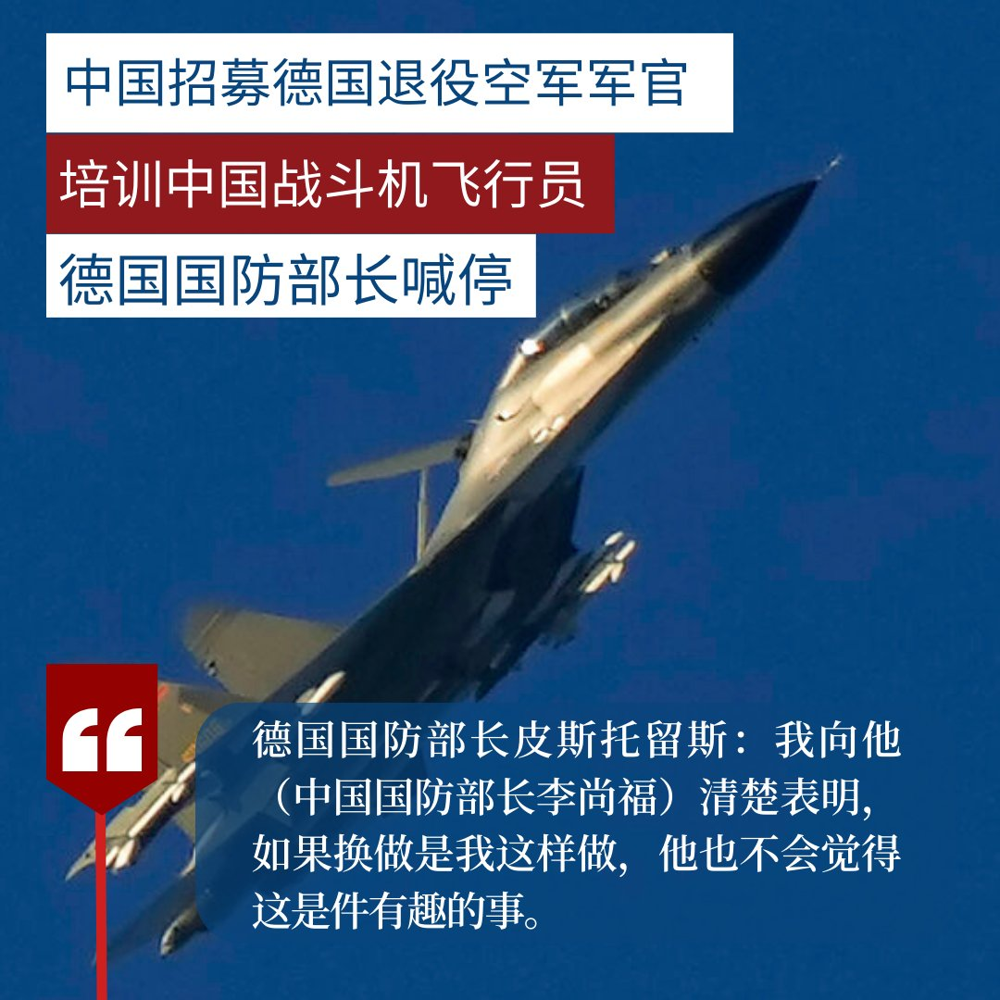
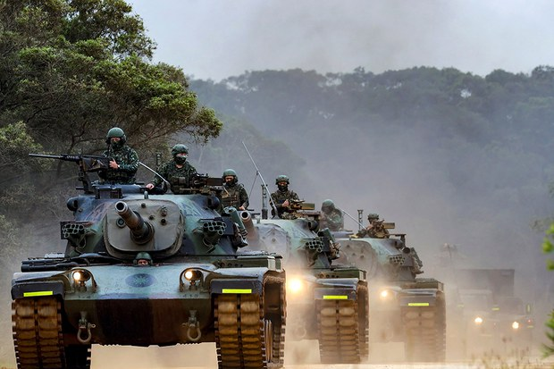
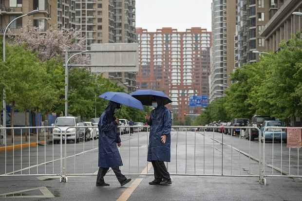

自由亚洲电台 北京时间 2023-06-06T12:56:05Z 1665945632467558400 在南加州的 #自由雕塑公园，“#铁链女”雕塑的落成仪式于6月4日下午举行。这一雕塑展示了徐州丰县铁链女的形象，并在铁链女雕像身后雕刻了“中国”两个大字。

铁链女事件，是一起于去年1月被曝光的虐待、拐卖妇女案件。在江苏徐州丰县，一名被用铁链囚禁、生下八名孩子的精神异常妇女的视频在网络上被广泛传播，引起了舆论哗然。而当地政府就此事发布的自相矛盾的通告，也引起了不少人的愤怒。

本次“铁链女”雕塑落成仪式有上百人出席，到场人士包括自由雕塑公园负责人陈维明、中国民主教育基金会会长方政、旅美维权律师陈光诚、部分美国当地官员等各界人士。在本次落成仪式中，人们也向公园内的六四纪念碑雕塑进行了献花悼念活动。   北京时间2023-06-06T11:34:10Z 我是一名成长在大陆的00后。

小学的时候，无意中学会了翻墙，便会在闲暇随意的翻阅维基百科，因为从小对历史感兴趣，便搜索中国的历史词条，无意中看到了六四事件。后来就自己去YouTube看了纪录片和各种相关报道。

升入初中随着系统的学习知识，经常会在老师课堂上的闲聊中听到关于六四的只言片语，化学老师说：“在天安门事件的暴动中，解放军在处理尸体时使用了烧碱溶液，最后都化为了血水……”历史老师说：“在改革开放中，我们国家也差点被颜色革命，他们一群小屁孩想占领国务院……”思想品德老师说：“我的很多朋友因为这件事而葬送了一生的前程，被迫靠边站，也有人因此而鸡犬升天……”顺带一提，当时正处胡温执政的末期，习近平刚刚上台，“膜蛤文化”也刚刚从我们那个圈子里兴起，当时就算是使用习近平的恶搞P图也不会有什么事，也没有人因此生气辱骂之类的事。在这样的环境下，是有不少QQ群聊是用来讨论政治的，而且也几乎没有什么事。但是即便是这样的环境下，每年的六月三日晚，几乎所有的QQ群都会自发的开启禁言，因为在这一天违禁词监测系统就会特别敏感，甚至前后几日都无法更换用户头像。至今，这一点都会让不明真相的孩子感到困惑。

我想，当初非常迫切的想要了解这个事情，心中不免有一种身为学生的使命感，和对同为学生的受难者的同情心同理心。但随着时间的推移，特别是这几年来国内的走向，让人感觉愈发绝望。现在，我只好选择留学海外了。曾经，我们很多人都希望投身于中国的社会，做出自己的贡献。

【00后：#我是怎么知道六四的】   北京时间2023-06-06T11:31:23Z 其实我最早知道六四是当时玩一个游戏第五人格，但是国内被迫在广电要求下删改了很多恐怖元素，然后我就去玩国际服，然后在国际服匹配到了一个台湾人，我们加个好友，后来又加了微信，我们聊了很多两岸的事情，他也告诉了我六四这个事，但是我之前从来没有听说过六四，他给了我几个图片，我只了解了个大概，但是我当时还不会翻墙，第一次会翻墙是偶然，去搜那个黄色软件嘛，然后发现了个网站，有很多软件的破解版
然后就有VPN的破解版，然后我之前也知道国外用YouTube，推特什么的，
然后第一次上YouTube，
然后卧槽这给我震惊到了
看了很多纪录片视频
最深刻的是那个BBC拍的两个六四的纪录片
第一次看给我看的眼泪哗哗的然后身体就发抖
后边每天都看看一次哭一次📷
之前从来不知道这个事
然后就经常看YouTube了慢慢的就从小粉红变成所谓反贼了
我之前也是纯正小粉红
经常被墙内爱国视频洗脑然后就高潮了
毕竟所接受的教育教育的你都是好事儿，爱党爱国
【00后：#我是怎么知道六四的】   北京时间2023-06-06T08:20:25Z 【卢沙野打破受贬传言 重返国际视野】
4月，中共驻法大使 #卢沙野 因“前苏联国家无主权国地位”言论犯众怒，中共驻法国大使馆4月24日发声明称，卢沙野发言代表他的个人观点。
就在人们以为卢沙野会因莽撞言论被贬时，他却在5月31日高调复出，再度接受媒体采访，再次重申“苏联宪法中有一条是关于加盟共和国退出苏联的，但还有其他条款规定苏联主权优先于加盟共和国主权。”并说：“我说的话与中国官方外交政策并不抵触。有些人小题大做了。”   北京时间2023-06-06T08:07:27Z 【#亚太报道（2023-6-5）】
欢迎收听和订阅播客【亚太报道】 https://t.co/MjLNSvVeAE
“#天安门母亲” 重申不忘六四 / 香港警方带走 #纪念六四 民众 / 英国、加拿大等地纪念六四 / 武汉一学生母亲疑遭网暴和维稳坠楼身亡 / 香港電台前记者 #蔡玉玲 案件胜诉 https://t.co/N1pfabGmBG   北京时间2023-06-06T06:51:59Z 德媒报道称，一些德国退役空军飞行员多年来一直在为中国训练军事飞行人员。他们可能泄露德国和北约的战术机密，甚至模拟训练进攻台湾的场景。

德国国防部长皮斯托留斯3日在新加坡参加香格里拉对话会期间这样说： https://t.co/OK3nwjpcS1   北京时间2023-06-06T06:50:54Z 据香港自由新闻报道称，一辆牌照为“US8964”的保时捷敞篷车于六四34 周年纪念日当天在铜锣湾被扣押。车主说，警方以他的浮雕车牌和刹车作为扣押车辆的理由。他说，“今年是第一次我的车被扣押。去年，在警察放我走之前，我也曾被警察拦了两次。”他说，在之前的车辆检查中，他的浮雕车牌从未出现过问题。

对此，您怎么看？   北京时间2023-06-06T06:28:48Z 台湾中央社6月5日引述知情人士消息报道，关注战略与安全议题为主的例行性美台“#蒙特利会谈”（Monterey Talks）7月在美国华盛顿举行，台湾方面将由国安会官员、国防部战略规划司长李世强中将等人率团出席，将聚焦美国对台军售、中共对台威胁日益严峻等议题。

“蒙特利会谈”是由美台高层官员针对双边战略与安全的年度例行性对话之一。报道引述台湾淡江大学国际事务与战略研究所所长翁明贤的说法指，去年的“蒙特利会谈”主要聚焦俄乌战争，但美国拜登政府在过去一年来积极推动美国与印太地区国家的双边或多边关系，预计今年会谈主题将聚焦台海议题，并探讨印太盟邦对于台海有事的因应方式，及讨论如何应对来自中国海上民兵的灰色地带、海上冲突等非传统威胁。

台湾国防部智库、国防安全研究院学者苏紫云则告诉中央社，“蒙特利会谈”为目前台美例行对话机制中层级最高的，定位介于国家安全与国家军事战略层次之间，双方就大政方针讨论，是安全管理、军事规划沟通的场域。   北京时间2023-06-06T05:45:00Z 专栏 | #夜话中南海：对 #六四 镇压的不同态度导致了三任三十八军军长的不同命运
#徐勤先

https://t.co/VF7mCMDVUY   北京时间2023-06-06T05:11:04Z #台海 紧张局势日趋升级之际，美国与台湾上周签署了《21世纪贸易倡议》的首批协定。6月5日，台湾驻美代表 #萧美琴 举行记者会，针对美台强化经贸关系以及避免双重课税等问题发表看法。有学者指出，台湾通过相关对美协议有望摆脱对中国市场的依赖。
https://t.co/4FtURWfusw   北京时间2023-06-06T04:34:48Z #六四34周年 之际，虽然香港维多利亚公园再无烛光，然而纪念活动却遍地开花。全球各地共有超过50场游行、展览和集会等活动。
其中英国 #伦敦 周日（4日）举行的六四纪念活动首次由中国留学生打头阵，并带领港人、藏人及维吾尔人等社群，在伦敦闹市游行至中国驻英大使馆外举行集会。
https://t.co/5yig1WJGW9   北京时间2023-06-06T03:30:00Z 加拿大多个城市举行纪念 #六四34周年 活动，其中 #温哥华 市的活动现场重现香港维园气氛，超过3千人手持蜡烛，呼吁决不遗忘曾经为中国和香港民主抗争的勇士。另外，多伦多也有两场纪念会，两千多民众参与。
https://www.rfa.o\rg/mandarin/yataibaodao/renquanfazhi/lf-06052023101039.html   北京时间2023-06-06T02:48:57Z 【#封城 封了个寂寞？】
英国《每日电讯报》（The Telegraph）6月4日刊登一份研究表示，严厉的封控措施对降低新冠死亡率的作用“微不足道”，是“政策失败”。

美国约翰霍普金斯大学和瑞典隆德大学的科学家调查了近20,000项关于疫情控制措施的研究，研究结果表明，严厉的 #封控措施 对降低 #新冠疫情 死亡率的作用“微不足道”，例如与瑞典等国家相比，实施严格封锁的英格兰和威尔士只减少了1700个死亡案例。该研究得出结论，跟封控措施带来惊人附带成本相比，挽救的死亡人数只是九牛一毛。

这份报告的共同作者、瑞典隆德大学的名誉教授拉斯·乔农（Lars Jonung）表示，这是第一个全面评估强制封城造成影响的研究。他说，这份研究结果代表了封控是一个失败的承诺，对国民健康的好处十分微小，但却给社会带来了灾难性的经济、社会和政治代价，他认为，实施封城很可能是现代最大的政策错误。   北京时间2023-06-06T02:22:42Z #六四34周年 之际, 澳大利亚 #悉尼 市在刚刚过去的周未举行了多场悼念活动。参加活动的除了一批长期支持民主运动的人士外, 更有多位来自中国的90后和00后年轻人, 他们以行动捍卫历史记忆。

https://t.co/jChXQk7tIJ   北京时间2023-06-06T01:50:50Z 香港电台前女编导 #蔡玉玲 在2020年调查 #元朗721袭击事件 申请涉事人车牌资料时，被港府指控虚假陈述。蔡玉玲不服判决，经历近三年上诉，终获撤罪。

https://t.co/U3nsI2YB1o   北京时间2023-06-06T01:30:52Z "#六四悼念"已成香港的禁忌，警方在六四当天，因涉悼念"六四"带走与拘捕最少二十三人。有被捕者指，不能因政权恐吓而停止悼念。 另外，联合国人权事务高级专员办事处对港府的行为感到震惊。

https://t.co/UmAudxEIeB   北京时间2023-06-06T00:31:21Z 我在2006年出生于北京，现在就读于北京市某高中。我的父亲是德国一家汽车企业的行政雇员，所以我在小时候就去了很多地方，像德国、英国、西班牙、新加披、台湾等相对自由开放的地方。对于六四，我最早的记忆是来自于我的父亲，因为在89年时他是信阳陆军学院的学员兵，早年中国人民解放军信阳陆军学院曾和北京大学联合办学，北大学子须在信阳陆军学院训练一段时间，再进入北大深造，我的父亲考上了北大，但是并没有到校报到而是先进入军校训练。据他的回忆，六四当天或前几天，他所在的学员兵部队被编入戒严总指挥部指挥，戒严总指挥部下达了执行戒严的命令，要求他们不惜一切代价使用一切手段准时在6月4号早上到达天安门广场，并且准许开枪，因为成千上万的市民在北京竖起路障并围堵在军车周围，阻止部队开进位于北京市中心的天安门广场。我父亲说，当他看到军官们从军车上搬下一箱箱的武器弹药的时候，他和他的同学（注意这个称呼，我的父亲和其他“学员兵“到底还是学生）十分惊愕、恐惧、难以置信，没有人说一句话，也没人敢说话。
“真的，我当时很害怕，因为我知道发枪发子弹意味着什么，那是要死人的啊”我的父亲跟我说。
但是，我的父亲告诉我，他的上级军官不知道为什么并没有执行这个“狗娘养的“命令，而是拖到六月五号才下令开进北京。
据他所说，一路上他和同学们坐在车里，压根没敢往外看，只是听见零零散散的枪声和叫骂声，“我实在不能相信，北京城是这个样子，真的会有解放军冲着平民开枪吗”他说。
他还告诉我，当他们进城之后，他听到有人对他们喊“操你妈法西斯刽子手”， “在我对面的一个同学可能是神经太紧张了，就向我身后开了几枪，硝烟崩到我身上”他说。“但他让我给骂回去了，当时我的原话是‘x你妈x别他妈开枪了’但是随车军官斥责了我，并下令向着已经散开的人群开枪，所以我也朝天开了七八枪”我父亲补充道。
我父亲说他亲眼目睹了坦克在天安门广场上行驶，还看见了散落在广场上布满弹孔和沾着血迹的衣服。我父亲和他的同学因参与戒严而获得一枚勋章，但是他视这枚勋章为耻辱。
“我告诉你，我也是个学生，当时如果我不是在军校念书，我也会去天安门，说不定我也会被打死”，我的父亲最后说道。
这就是我对于六四惨案的初记忆。上高中之后有一个同学是北京市171中学毕业的，六四的时候171中学也有很多同学勇敢的走上街头游行示威，所以他对六四也有所耳闻。
最后我要补充的是，请你们千万不要以为00后一代从小被红色灌输，上网的时候就已经有防火墙，所以就对历史毫不知情，就比如我们学校和一些当年参加了民主运动的学校，都有纪念墙和纪念账号（表白墙之类的），我们会用我们自己的方式铭记历史，追求自由和民主，对于六四事件这是中国历史上一次伟大的民主运动，尽管强调黑色历史对于国家发展没有什么好处，可历史总是要被铭记的，今天我撰写这篇回忆，权当是为了忘却的怀念吧！   