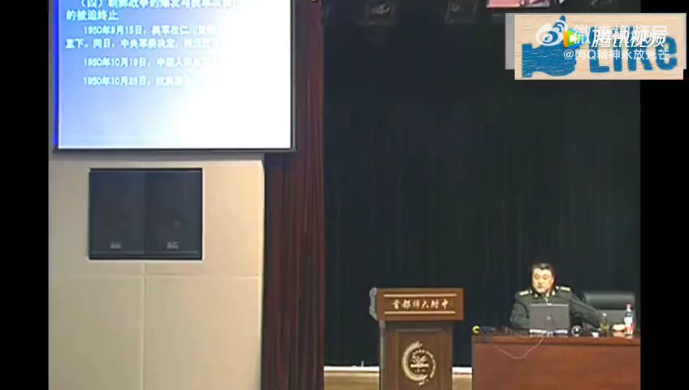

北京时间2023-06-05T08:08:05Z 把自己国家的人不当人，命不当命，这竟然成为他们骄傲的资本，更可悲的是还能赢得韭菜的赞许声。 https://t.co/nO5zXAjd8y   北京时间2023-06-05T03:47:57Z 2021年5月22日中国青海省果洛藏族自治州玛多县的地震造成野马滩大桥一路倒塌，说明该桥有建筑设计和质量问题。 https://t.co/rKyqocTBLZ   北京时间2023-06-05T02:03:44Z 中国申请加入“全面与进步跨太平洋伙伴关系协定”组织（CPTPP），美日加澳不同意，怕中国不遵守规则。美国贸易代表戴琪也公开宣称，“印太经济框架”是“独立于中国的安排”。中央媒体说“而戴琪是华裔，为什么要排华呢？” 
可见多么愚蠢的想法。她是美国公民，而不是中国公民，维护自己国家利益。 https://t.co/lh14VcstDw   