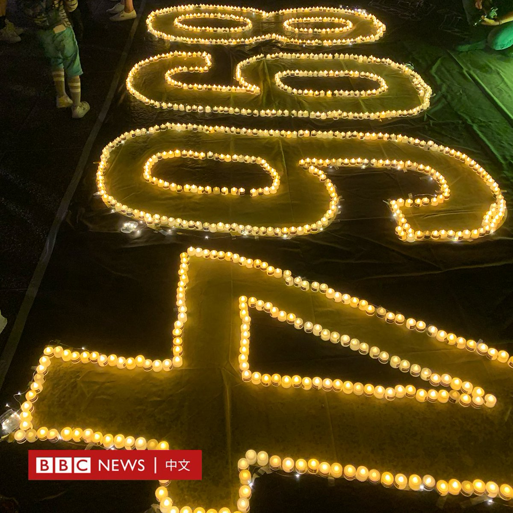
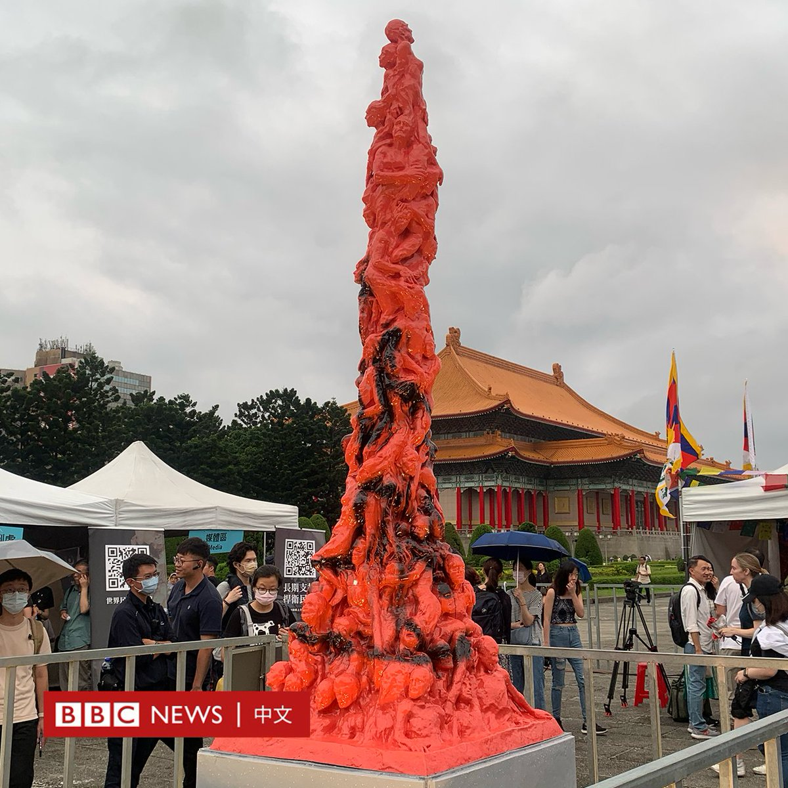
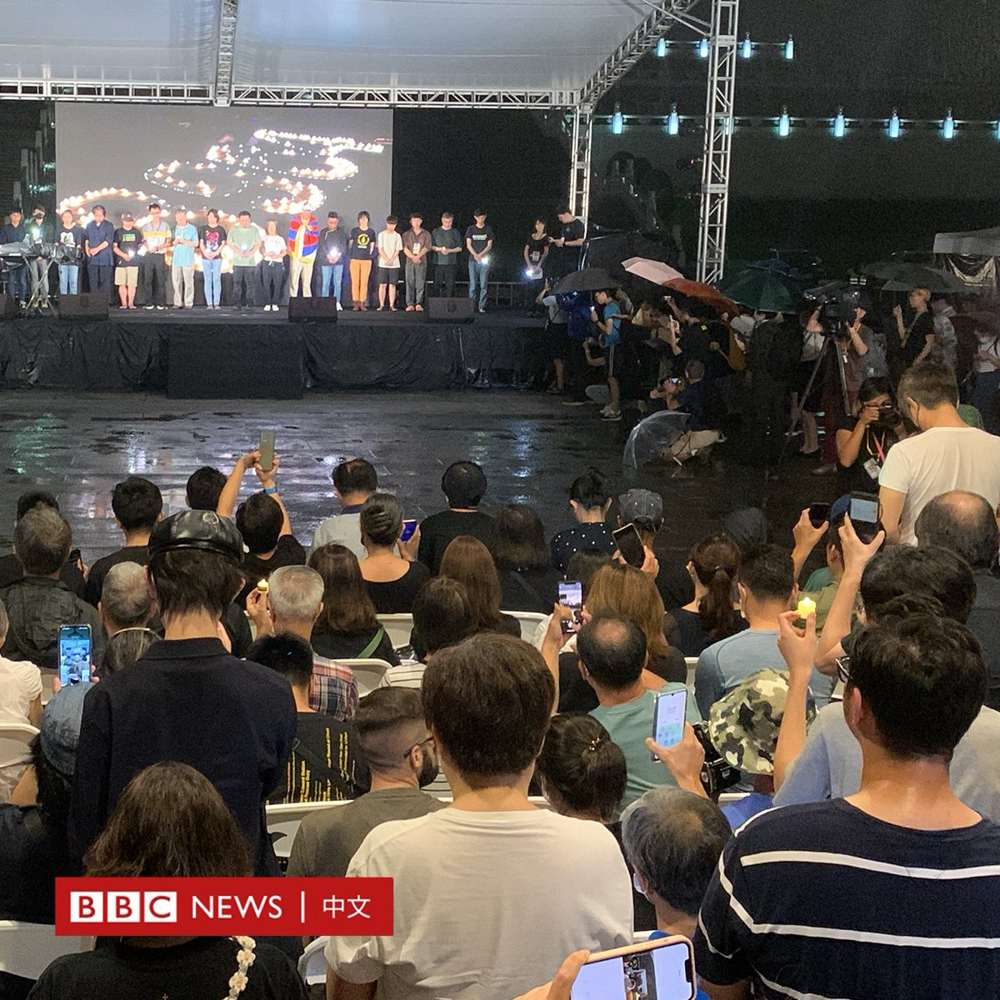
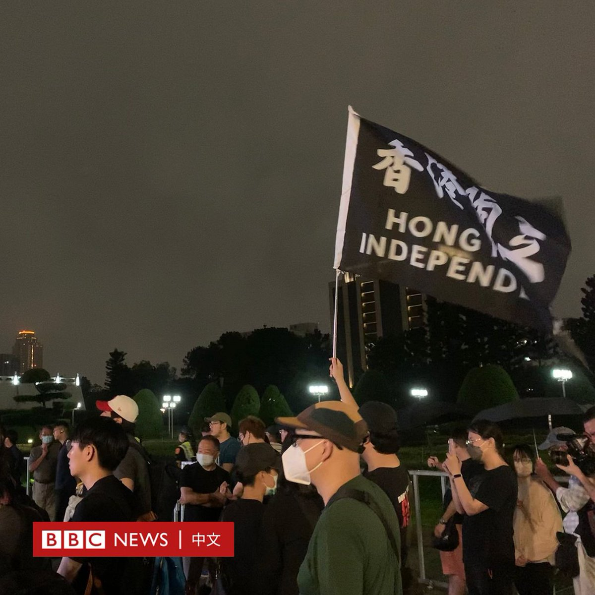
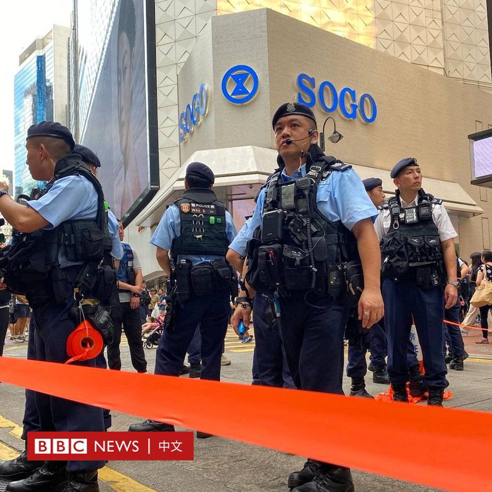
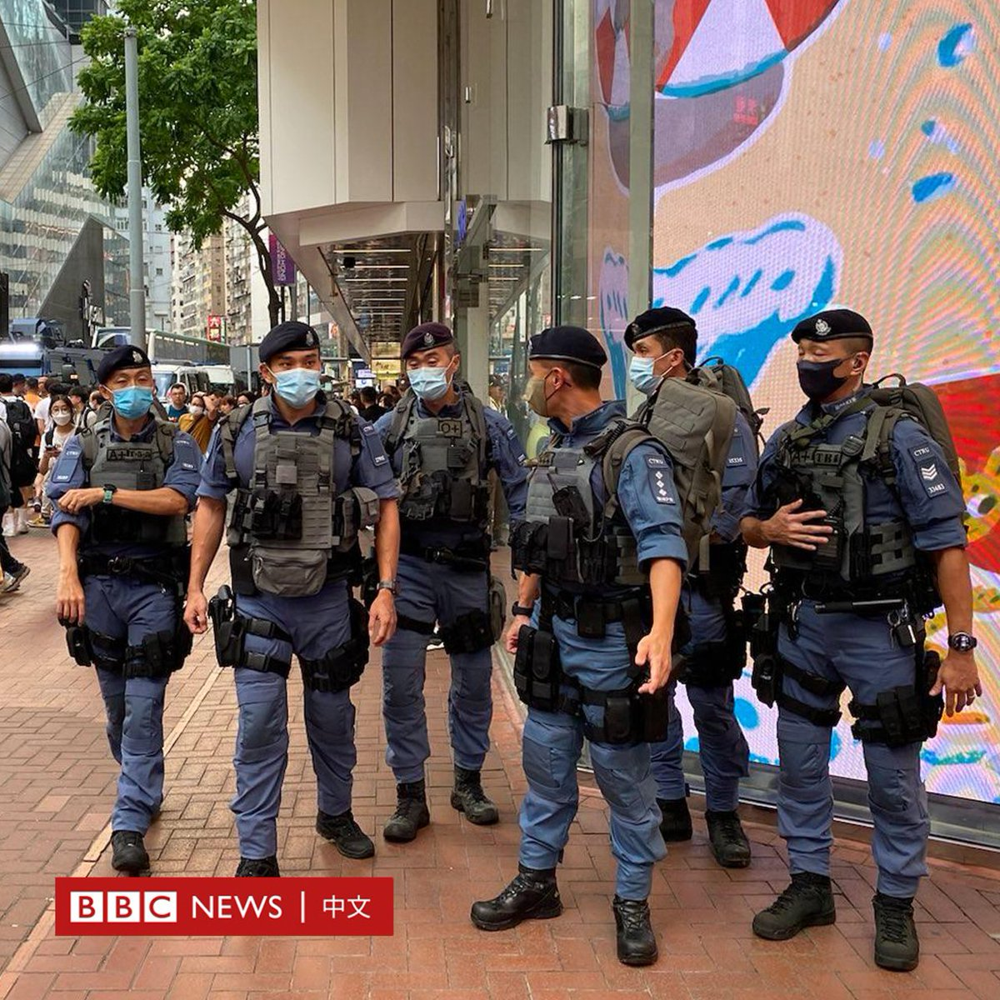
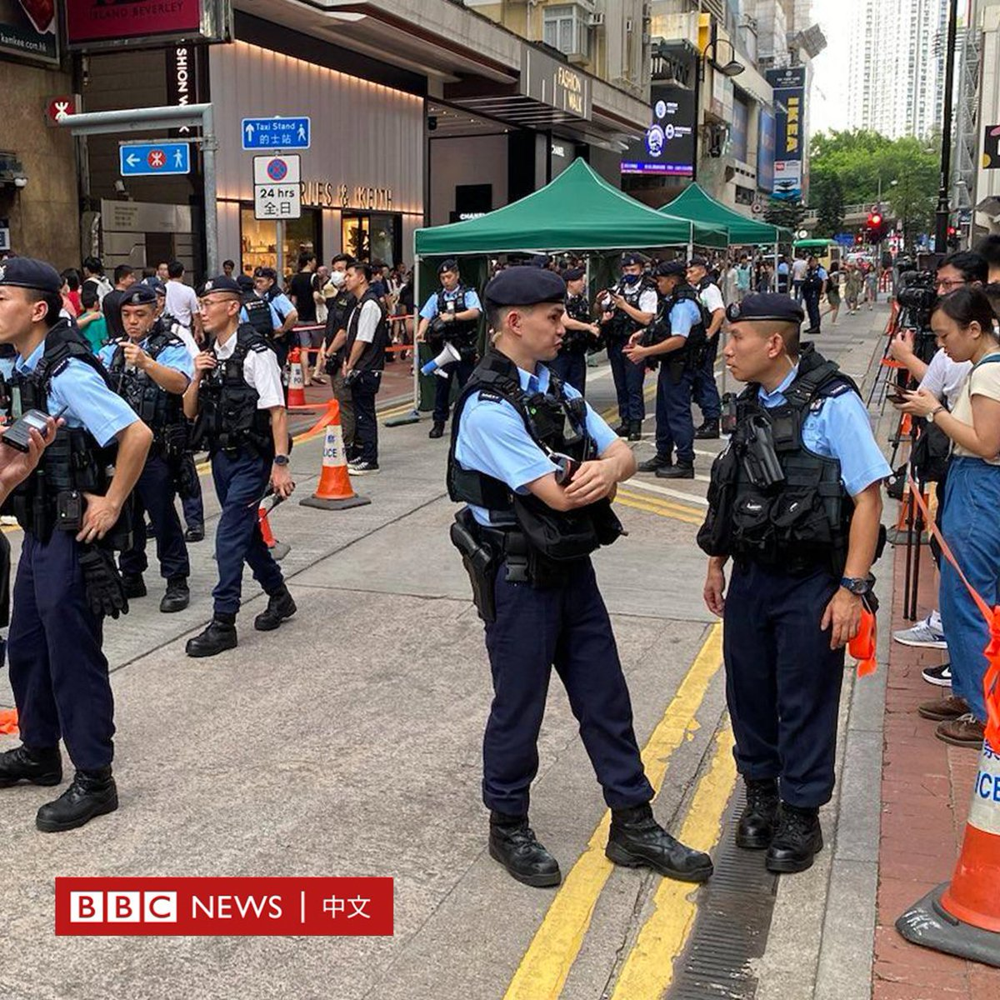
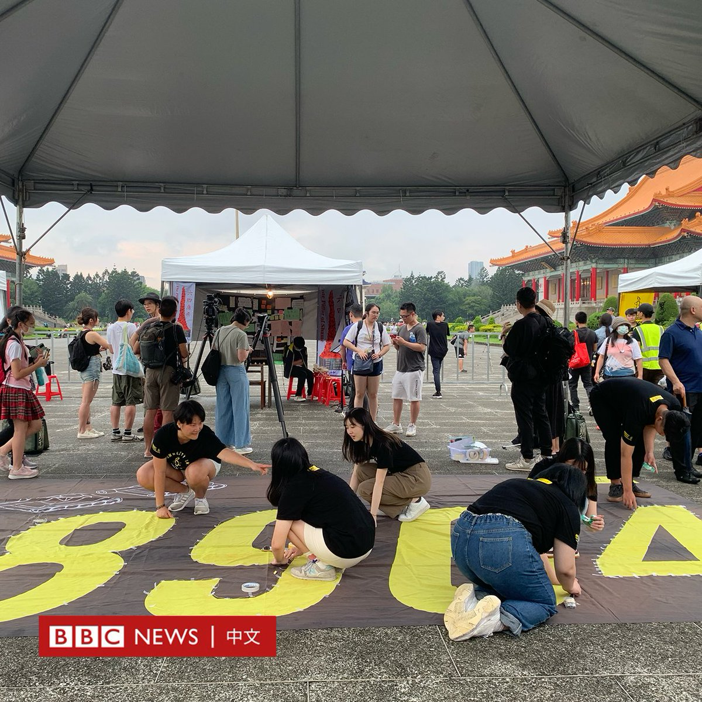
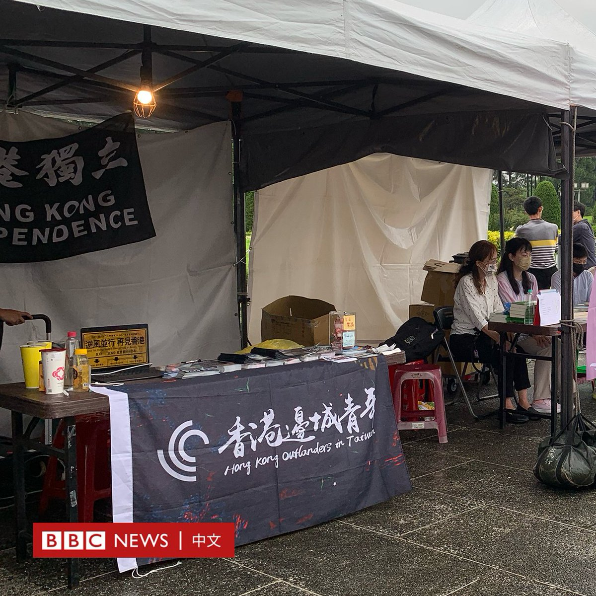
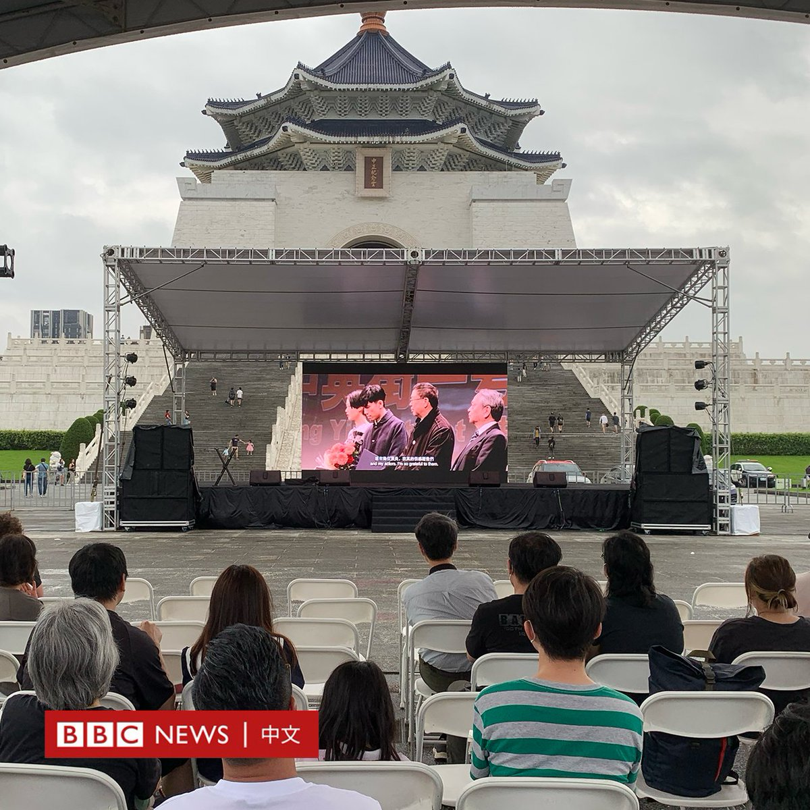

北京时间2023-06-04T22:56:13Z 周日（6月4日）是1989年“六四”事件34周年纪念日。这个日子在中国大陆地区被视为禁忌，而随着《国安法》的实施，香港维园延续多年的大规模烛光晚会也已不再，在台北的纪念活动受到关注。

BBC中文在台北的特约记者刘子维报导说，当日下午，台北下起滂沱大雨，到傍晚雨势暂歇，中正纪念堂广场上，陆陆续续出现来参与六四纪念活动的群众。

该晚会以“威权扩张捍民主 凝聚星火撑自由”为主轴，由华人民主书院协会、民间司法改革基金会、台湾人权促进会等公民团体共同举办。

华人民主书院理事长曾建元对BBC中文表示，去年的纪念活动，有破千人参与，主办单位准备的上千份小蜡烛被索取一空。曾建元预估，今年人数应该也和去年差不多，上看千人。但到了大会预估“人数达到最高峰”的晚间八点，目测人数离千人仍有一大段距离。

晚会在六点正式开始，六四见证者吴仁华上台演讲，其他讲者接力上台。不像香港维园晚会，有固定的口号。台北现场带动的口号，有广东话、有英文，也有国语。主题围绕“追求民主”、“香港加油”。

曾被中国关押的NGO工作者李明哲向北京当局喊出：“我们是小国小民，但是我们不愿做你的大国顺民”。台下有民众挥舞“香港独立”黑色旗帜，这样的景象，在香港已被视为非法。

现场“民主市集”摊位的文宣产品包括雪山狮子旗、撑香港的留言卡等。

晚间8时9分默哀64秒的仪式，NGO工作者在台上举起烛光，帐篷外的大雨不断落下，帐篷内的民众高举烛光，或打开手机闪光灯回应。

刘子维报导说，有些年轻父母，带着小孩到现场，在“光复香港时代革命”的海报前驻足，或在“国殇之柱”前留影。

她称，现场听到广东话的频率非常高。一些在台湾的香港人通过这场纪念活动，追忆已经不存在的维园烛光晚会。   北京时间2023-06-04T20:07:24Z 在台北的六四纪念活动中，BBC中文采访了两位流亡港人，分别是暴动案罪脱者“赴汤”，原名汤伟雄，以及前香港中文大学学生会外务副会长罗子维。

赴汤称，台湾人对六四的关注度不高“其实可以理解”，他观察到香港曾经有很多人不关心社运事件，但他希望人们明白“我们就是人权侵害的受害者，我们跟你们台湾的朋友一样，中共现在也想去侵害台湾的民主自由，我们在这边纪念的不单只是六四……我们也是在追求同一个民主自由，希望你们可以跟我们站在一起，一起争取民主自由。”

他到维园参加六四晚会已经十多年，比较香港和台湾的六四晚会，他观察到，“台湾这边气氛比较平和”，“因为香港跟中共很接近，我们抵抗的感觉会比较大一点，现在台湾好像还没有觉得中共会对我们做什么，他们就没有我们那种紧张的感觉”。

23岁的罗子维目前在台大就读政治系，积极参与公民团体与倡议工作。他从16岁开始在香港参加六四纪念晚会，直到他流亡台湾。

作为香港人，他庆幸能在台北参加烛光晚会，因为他没办法回香港，而且香港也没办法继续纪念，“香港人需要我们（在海外）继续传承这个理念”。

他说：“我觉得以往一直以来，六四最大现场都在香港维园，很可惜这个意义已经被中共剥夺、窜改了，可幸的是，对于民主运动的纪念和支持，已经流散世界各地了。”

他认为，与其说“继承八九民运”，不如说是“继承香港人的悼念方式”，从他的观点来看，“六四晚会的纪念方式已经不单止是悼念当年的中国民主运动，而是在传承香港民主运动、在传承台湾民主运动。”   北京时间2023-06-04T19:09:21Z 六四事件34周年之际，以往香港铜锣湾维多利亚公园每年都会举办六四烛光晚会，今年，维园正举行“家乡市集嘉年华”。同时，铜锣湾一带有大批警员驻守及巡逻。

警方在铜锣湾地铁站外设置棚对途人进行搜查，两辆由中国制造的“剑齿虎”装甲车则停泊在维园及祟光百货外。

六四前夕，香港政府发声明指警方在铜锣湾一带拘捕四名人士，他们分别以涉嫌干犯“在公众地方扰乱秩序”或“作出具煽动意图的作为”罪。   北京时间2023-06-04T19:01:19Z 周日（6月4日）是1989年“六四”民运34周年。“华人民主书院”等组织在台北的中正纪念堂及民主大道举行“威权扩张捍民主 凝聚星火撑自由” 纪念晚会，让民众进行追悼、献花。

活动包括开放六四哀悼亭、举行民主市集，并于晚上举行烛光排灯、六四晚会、以及进行哀悼仪式。 https://t.co/jJp4cNOWTw   北京时间2023-06-04T18:12:42Z 印度在周五（6月2日）晚上发生列车相撞并脱轨事故，已造成至少288人死亡，超过1000人受伤。关于这起致命意外的确切原因，还有很多问题有待解答。
https://t.co/neymHBOyRe   北京时间2023-06-04T17:01:02Z 【一周热点回顾】作为全球最大的跨国军事联盟，北约在印太设定第一个正式联络处，只有象征性意义还是具有实质战略功能？它的目标又是什么？https://t.co/9zttXjHoPY   北京时间2023-06-04T16:01:04Z 【旧片重温】1989年的北京，天安门广场。中国政府动用军队，向手无寸铁的学生和市民开枪，曾令亿万人充满希望的政治改革戛然而止。 这个震惊世界的事件，如今在中国仍然是不能公开讨论的话题。当年，到底发生了什么？
请到BBC中文YouTube频道观看全片：
https://t.co/nAymmFRWXO   北京时间2023-06-04T15:01:06Z 【一周热点回顾】包括OpenAI和谷歌Deepmind负责人在内的专家警告称，人工智能可能导致人类灭绝。但是机器如何取代人类呢?https://t.co/54M2HfvVyf   北京时间2023-06-04T13:01:03Z 【一周热点回顾】70年前，有人首次成功登上了位于中尼边境的世界最高峰珠穆朗玛峰。最早征服8849米高峰的两个人已经不在了，但他们的儿子告诉BBC，父亲的成就如何改变了登山运动。https://t.co/GyT0IfiTFe   北京时间2023-06-04T11:01:05Z 【一周热点回顾】近日，中国极目新闻一名记者在贵州毕节采访时遭到警方殴打，引起大陆对媒体人处境的担忧。官方调查组向记者和媒体道歉，涉事派出所警员及辅警被免职或解聘。
https://t.co/OxVBRRSk0E   北京时间2023-06-04T09:01:04Z 【一周热点回顾】被视为特朗普劲敌的佛罗里达州州长德桑蒂斯正式宣布角逐2024年共和党总统提名，他说：“我正在竞选美国总统，以引领我们的伟大美国卷土重来。”
https://t.co/6N8YaVfDNI   