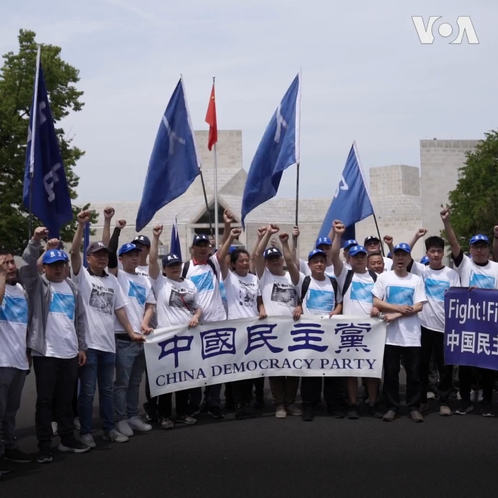
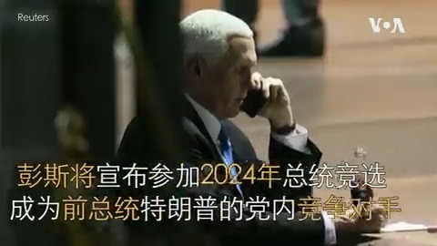
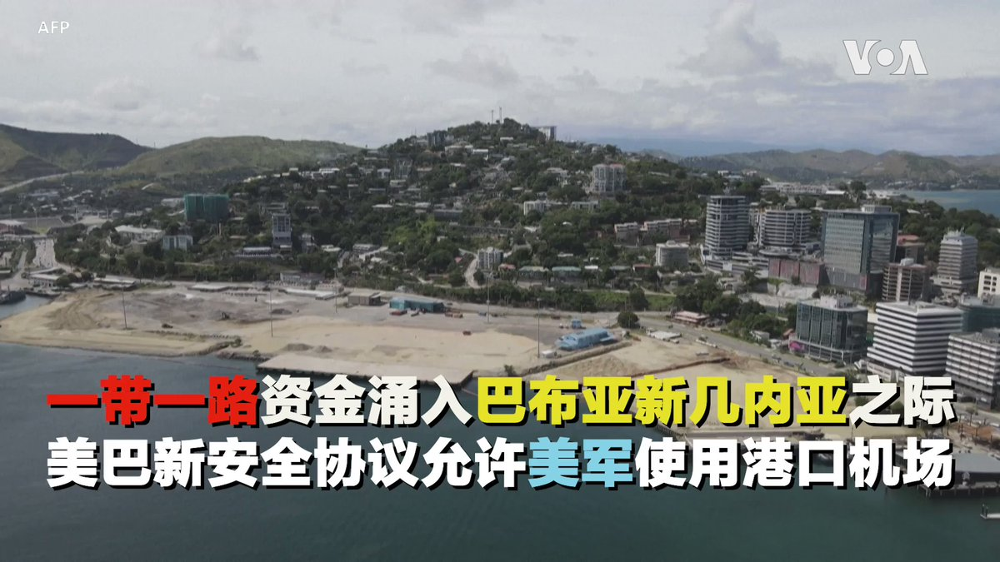
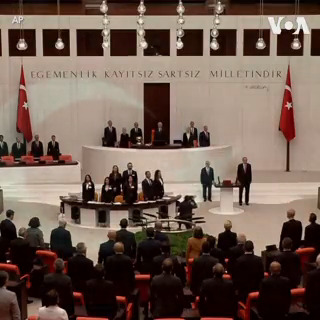
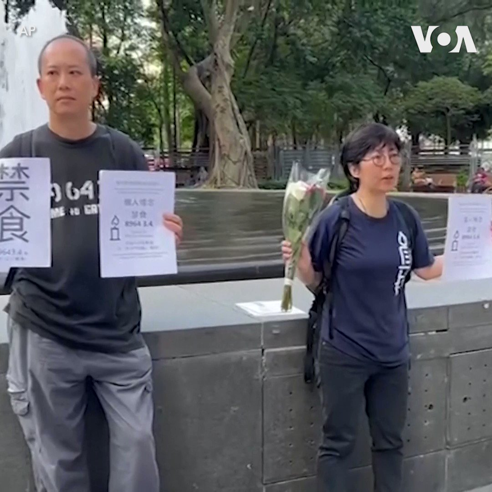
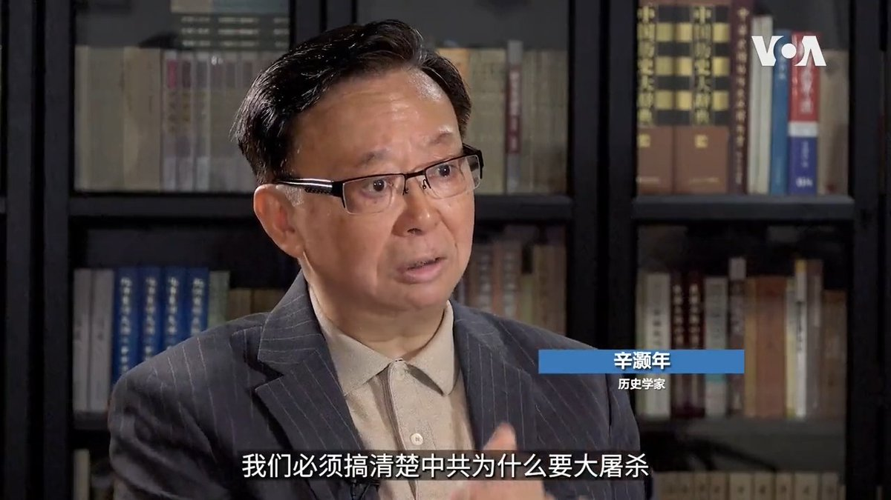
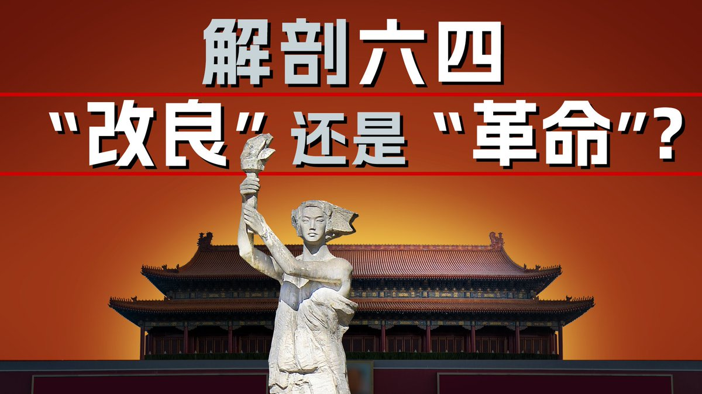
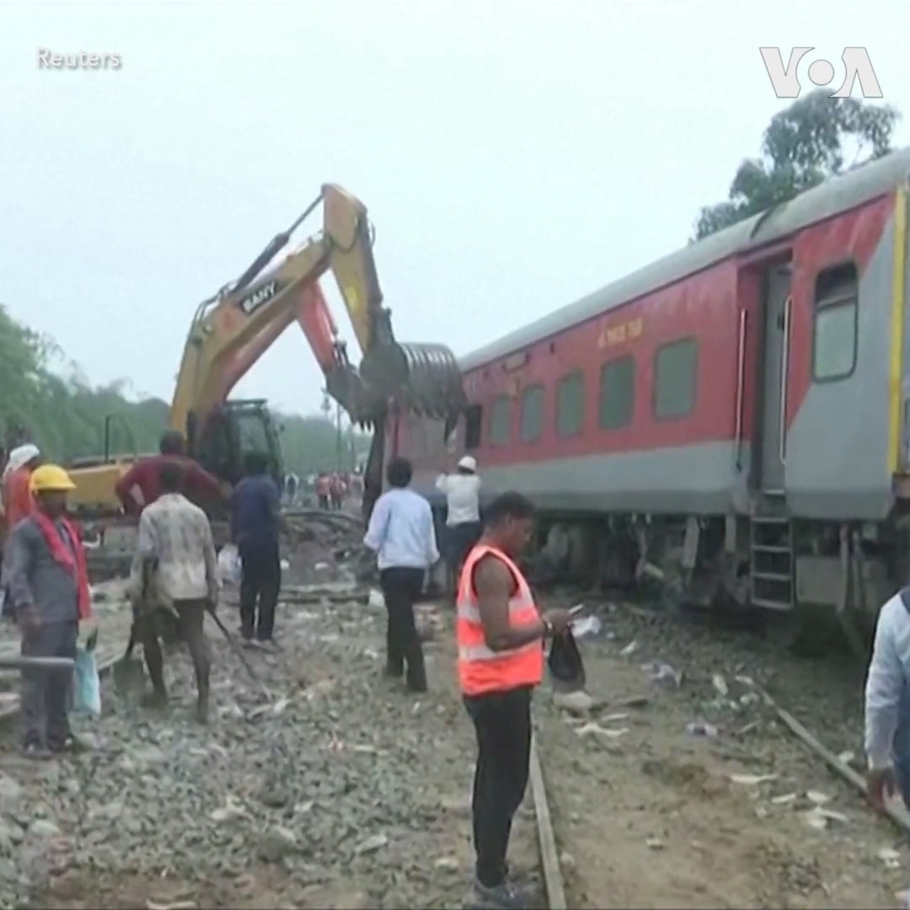

美国之音中文网 北京时间 2023-06-04T05:25:34Z 1665107482530947073 美国国务院在天安门事件34周年发表声明 https://t.co/nw4v38MIeo   美国之音中文网 北京时间 2023-06-04T20:30:40Z 1665335256856264704 香港警方6月4日在天安门事件34周年这一天在往年举办大型六四纪念活动的维多利亚公园附近拘捕了4人，包括知名活动人士王婆婆和一名手持描写天安门母亲的舞台剧《5月35日》剧本的男子。香港媒体说警方这一天部署了大约6千警力。 https://t.co/dB3XeDsGZo   北京时间2023-06-04T10:28:54Z 6月3日下午，在华盛顿的中国大使馆前，民众喊出“勿忘六四，民主万岁！”的口号，纪念34年前的民主运动和六四受害者。与会人士表示，今年最大的不同是看到更多年轻人的参与，从去年中国的白纸运动，到今天纪念活动上年轻的身影，“年轻世代在逐渐地觉醒中。”更多：https://t.co/1nfpeRkbZq https://t.co/AkGgpAcHVV   北京时间2023-06-04T10:00:00Z 2024共和党总统初选活动正日趋激烈，民调显示前总统特朗普大幅度领先，佛罗里达州长德桑蒂斯排第二。前副总统彭斯、前新泽西州长克里斯蒂等即将宣布加入，有分析认为参选人更多将导致选票更加分散，特朗普取胜的可能性增加。彭斯是坚定的保守派，2020大选后与特朗普逐渐疏远。 https://t.co/Ea0wM7sUSf   北京时间2023-06-04T09:19:02Z 朝鲜抨击联合国开会讨论朝鲜卫星发射 https://t.co/ybkzmms5Zw   北京时间2023-06-04T08:20:02Z 拜登总统签署债务上限法案 https://t.co/0PmayFQnmI   北京时间2023-06-04T08:03:57Z 六四34周年之际，欧洲多地举行了一系列纪念活动，一些参加“白纸运动”的中国青年也加入抗议的行列，在欧洲各地的抗议人士通过视频电话向美国之音介绍了现场的情况。 详细内容：https://t.co/caz3UfQBTc https://t.co/FfRB7sK7KB   北京时间2023-06-04T08:00:01Z 中国一带一路给巴布亚新几内亚带去大量投资，4亿美元的首都综合体包括影院、酒店、公寓和餐厅，但当地民众并没有感到受益，因为本地劳动力被排除在外，中国投资者自带员工。中国援建的APEC峰会中心电力不足，涂鸦的围墙里冷冷清清。中国承建的23层高楼出现瑕疵后一直空无一人。 https://t.co/Lvjv3zkZw3   北京时间2023-06-04T07:09:32Z 从柏林到巴黎，六四悼念不停息：欧洲多地举行六四周年纪念活动 https://t.co/U34DNmynJ9   北京时间2023-06-04T06:00:42Z 【六四34周年特别节目--记忆与遗忘的斗争】
美国之音 “六四34周年特别节目--记忆与遗忘的斗争”，前六四学运领袖吾尔开希、流亡作家苏晓康、六四幸存者李恒青回顾六四，并从中反思、探索中国未来民主化的道路。
YouTube🔗https://t.co/lzEVYBt4L0 https://t.co/vScIGiIz8L   北京时间2023-06-04T05:25:34Z 美国国务院在天安门事件34周年发表声明 https://t.co/nw4v38MIeo   北京时间2023-06-04T04:53:05Z 美国制裁后，苏丹战斗恶化 https://t.co/PzcZ5eEdot   北京时间2023-06-04T04:00:00Z 中国第一季度超过日本成为最大汽车出口国，俄罗斯遭受制裁后大量增加从中国进口为因素之一，电动车销量更在攀升中。多年政府补贴之下，中国发展供应链较早，成品车能低价销售，特斯拉、宝马和雷诺等从中国的出口也占据相当份额。独立媒体人王剑认为，美欧日韩大车厂应该能够迎头赶上。 https://t.co/3iAhhUDu6a   北京时间2023-06-04T03:18:03Z 以色列同埃及爆发边境冲突，造成4名军人死亡 https://t.co/K4c6gnAUOf   北京时间2023-06-04T03:09:32Z 土耳其总统埃尔多安3日在议会宣誓就职，正式开始了他的第三个总统任期。 https://t.co/pZv7uyyH7t   北京时间2023-06-04T02:05:36Z 香港警方3日拘捕了大约8名纪念六四的活动人士和艺术家。活动人士关振邦和刘佳仪3日在维多利亚公园手持菊花和举着要为六四死难者“禁食”的标语，表示他们要绝食一天；后来他们被警方带走。 艺术家陈式森和陈美彤在铜锣湾一带被拘捕，陈式森在现场高呼“香港人不要怕”“不要忘记明天是六四”。 https://t.co/AMtkMM5alM   北京时间2023-06-04T02:00:01Z 中共党内改良是否已毫无希望？历史学家辛灏年在接受美国之音专访时表示，六四是中共的一场血誓，习近平的出现是历史必然。辛灏年完整专访请看6/3【纵深视角】：https://t.co/uwiwrRC0nC https://t.co/MFEcWevJjm   北京时间2023-06-04T01:59:33Z 美国在印太安全布局获得重大进展，专家：印太军力平衡可能向美国及盟友倾斜 https://t.co/Ha2y13o6DX   北京时间2023-06-04T00:32:32Z 反思六四的结果，历史学家辛灏年在接受美国之音专访时表示，当年学生们若在镇压之前冲入中南海，这场革命有可能成功。辛灏年完整专访请看6/3【纵深视角】：https://t.co/uwiwrRCyda https://t.co/vV088tpp5z   北京时间2023-06-04T00:30:04Z 美中沟通渠道并未堵死：美助理国务卿和白宫国安会高官联袂访华 https://t.co/itCKChTWGZ   北京时间2023-06-04T00:11:08Z 印度官员3日说，前一天发生的火车脱轨、相撞事故造成至少288人死亡。这起事故发生在奥迪沙邦，当时一列客运列车脱轨后与另一条轨道上行进的列车相撞，并撞上一列货运列车。印度总理莫迪3日视察了火车事故现场。 https://t.co/q4DUaRTHh4   