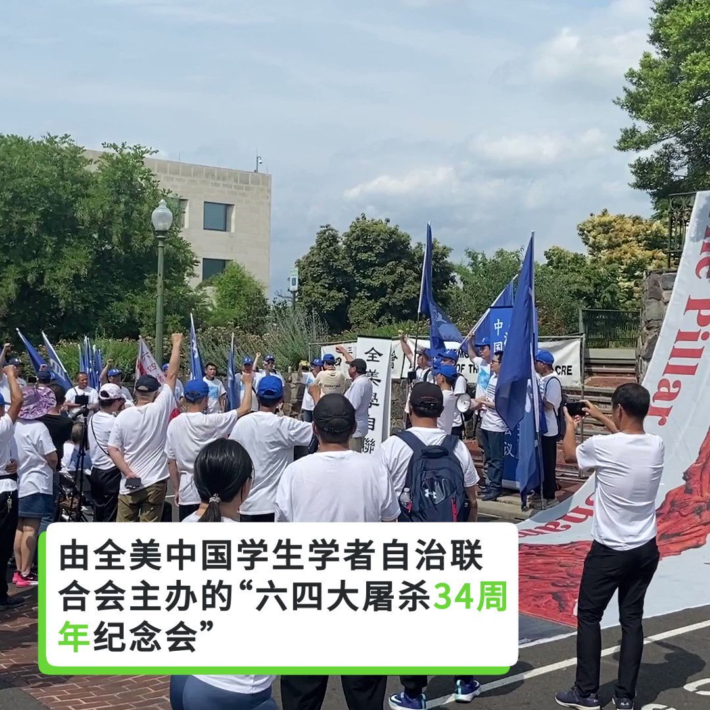
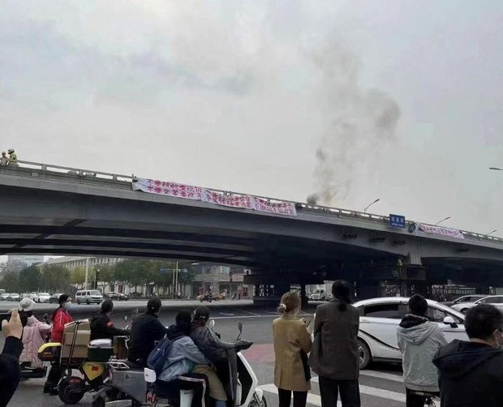
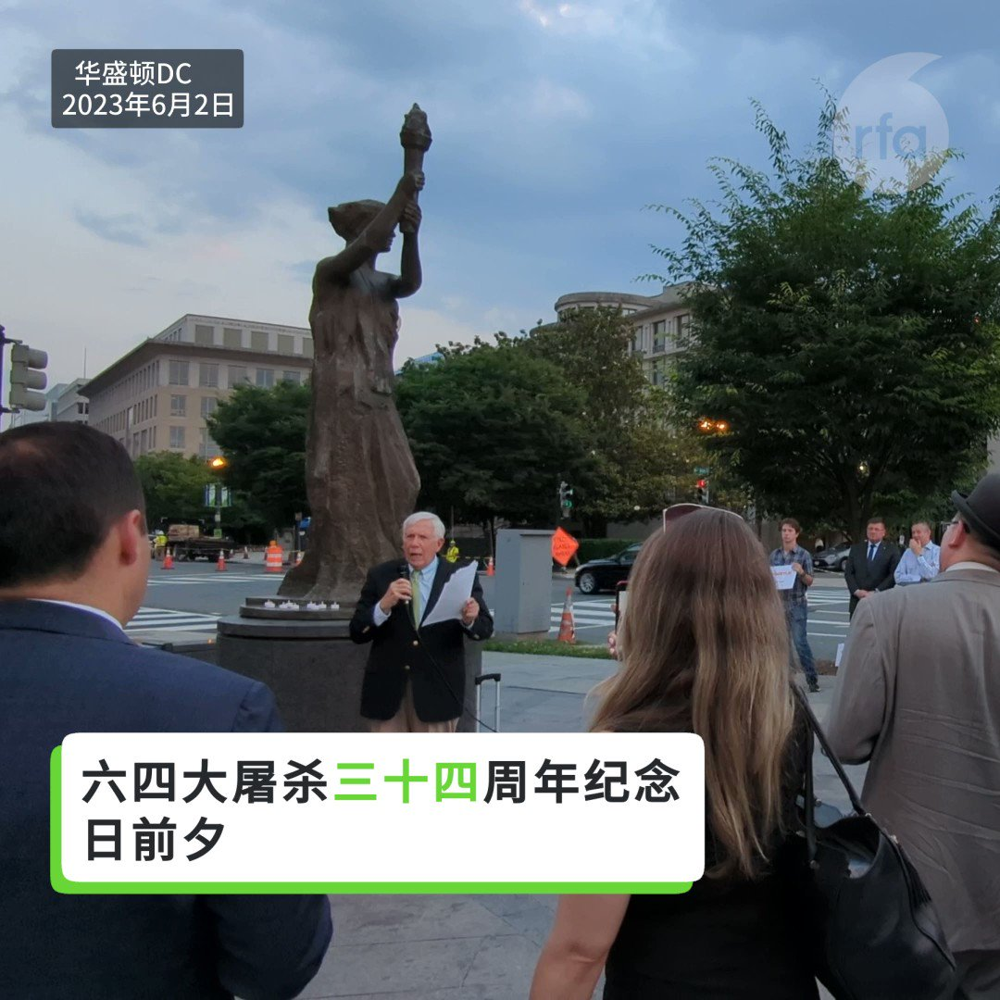
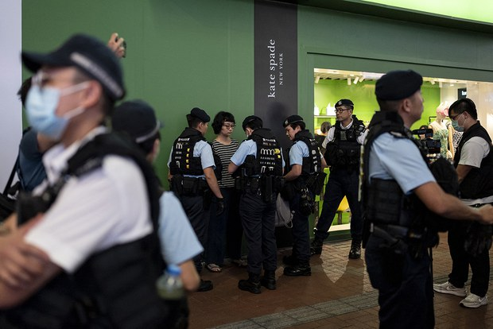
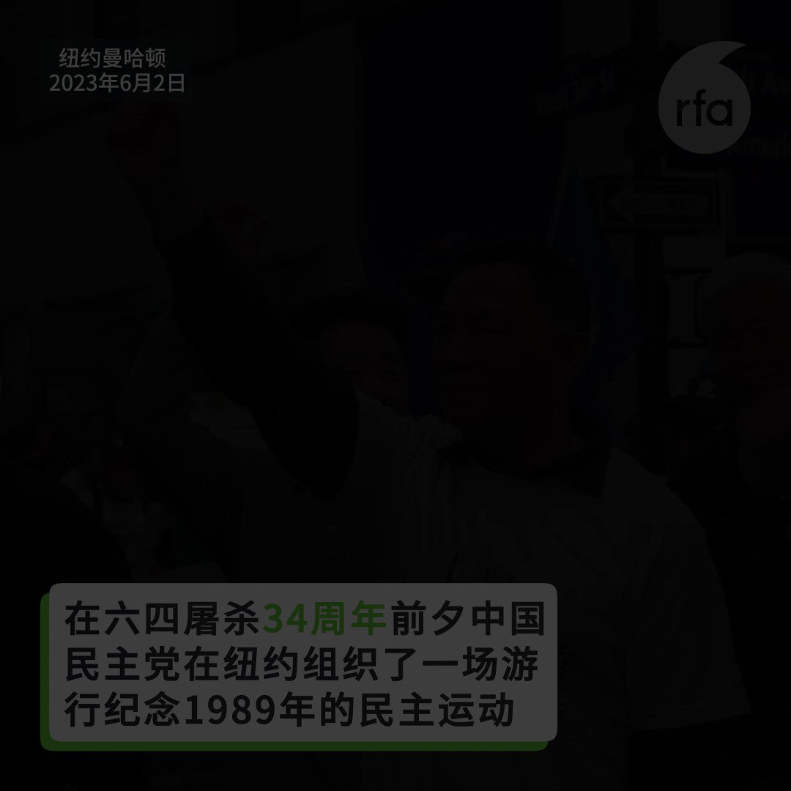
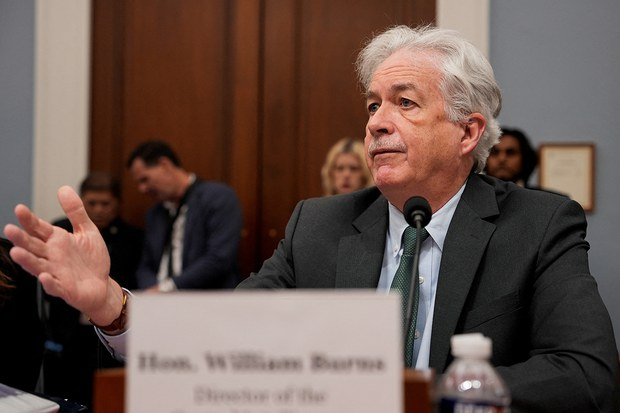

北京时间2023-06-04T10:54:43Z RT @RFA_Chinese: 【00后：我是怎么知道六四的】
#六四34周年，自由亚洲电台征集年轻人的六四经历，响应者众。详见 https://t.co/kTbhqkcJIc

我是一名在中国国际学校念书的学生，我从来不知道我们的政府会做出这种反人类的暴行，但是世界上没有不…   北京时间2023-06-04T10:53:39Z 【中国驻美大使馆前的六四纪念会】
六四屠杀34周年，悼念和纪念活动在这里也举行了34次。这次以新一代的年轻人为主。 https://t.co/mkm0YfX15X   北京时间2023-06-04T10:45:31Z RT @RFA_Chinese: 美国国会及行政当局中国委员会主席克里斯·史密斯（共和党-新泽西州）和参议员杰夫·默克利（民主党-俄勒冈州），6月2日就六四34 周年发表声明，宣布增加提名北京四通桥抗议事件主角彭立发、公民记者张展以及南京传媒学院学生李康梦等三人，为2023年诺…   北京时间2023-06-04T09:06:11Z 由全美中国学生学者自治联合会主办的“#六四 大屠杀34周年纪念会”，6月3日下午2点在中国驻美大使馆门前的广场举行。多位当年天安门民主运动的学生领袖及各界民主人士超过百人到现场参与集会，其中尤以年轻人为主。

https://t.co/AVYtaprMgp   北京时间2023-06-04T07:20:10Z 美国国会及行政当局中国委员会主席克里斯·史密斯（共和党-新泽西州）和参议员杰夫·默克利（民主党-俄勒冈州），6月2日就六四34 周年发表声明，宣布增加提名北京四通桥抗议事件主角彭立发、公民记者张展以及南京传媒学院学生李康梦等三人，为2023年诺贝尔和平奖候选人。

声明说， “我们每年都纪念天安门悲剧，因为它太重要了，”我们向 34 年前的今天勇敢抗议的人们致敬，向 1989 年坦克驶过北京街头时牺牲的人们致敬。我们要继续铭记天安门大屠杀，绝不允许中共将其从历史书中抹去。

声明提到“今天的纪念再次提醒我们永远不要将中国人民与中国共产党混为一谈。 尽管一波又一波的镇压、暴行和虐待，中国人民对自由的渴望依然存在。”

声明说，“在这个纪念日，我们与所有在中国和平寻求自由的人站在一起，缅怀天安门大屠杀。 我们通过继续揭露中国的暴行和其他令人发指的侵犯人权行为，并追究中共官员对他们的反人类罪行的责任，来纪念这个重要的日子。 由于中国有太多人无法为自己发声，我们承诺为他们辩护，支持和平促进中国人权的努力，并争取释放被任意拘留的政治犯。 中国人民必须知道，自由世界永远不会忘记他们的勇气和牺牲。”   北京时间2023-06-04T07:13:11Z 【华盛顿举办六四烛光悼念活动】
#六四34周年 纪念日前夕，华盛顿人权组织“#共产主义受难者纪念基金会”于6月2日在华盛顿举行了该组织第十届六四烛光悼念活动。天安门民主运动的亲历者，和维吾尔族、藏族以及香港人的代表均在活动中发言。 https://t.co/ekheJBJBTS   北京时间2023-06-04T05:14:33Z 在六四34周年前夕，香港警方在街头逮捕了至少两名艺术家和另外两名人士。

据法新社目击，在繁华的香港铜锣湾区的一条街道上，香港艺术家三木（陈式森）在唱 "不要忘记六四！不要忘记六四！香港人，不要怕他们"。一名警察对他喊道："不要说煽动性的话"。法新社记者观察到，这名男子随后被一辆警车带走。

另一位知名行为艺术家陈美彤也被带走。

警察还逮捕了一对年轻夫妇，他们手持象征哀悼的白菊花。

当法新社询问他们是否被逮捕时，男子回答说："我不知道"，然后他就被带走。

法新社的报道说，30多年来，香港每年都有数万人聚集在维多利亚公园举行烛光晚会，纪念1989年6月4日在北京天安门广场被枪杀的1000多名和平示威者。但自从北京在2020年对香港实施国家安全法以来，香港当局已经终止了这些集会，并推动参与这些纪念活动的艺术家在香港以外的地方进行纪念表演。

在今年的六四纪念日之前，香港当局一再拒绝确认公众纪念活动是否违法，只说 "每个人都应该依法行事"。   北京时间2023-06-04T05:10:53Z 【纪念 #六四34周年 纽约游行队伍中的年轻人】
6月2日纽约曼哈顿市区举办了一场纪念1989年天安门事件的游行，游行队伍中，不乏有些未亲身经历过六四事件的中国年轻人，他们是怎么知道六四屠杀的？他们又背负着什么样的故事走上纽约街头？ https://t.co/pmP56y89uc   北京时间2023-06-04T04:47:51Z 本周五，纽约曼哈顿市区举办了一场纪念1989年天安门事件的游行，游行队伍中，不乏有些未亲身经历过六四事件的中国年轻人，他们是怎么知道六四运动的？他们又背负着什么样的故事走上纽约街头？
#六四34周年 
https://t.co/NfM5iu580W   北京时间2023-06-04T03:46:47Z 你好，我是一名03年的大学生。关于六四，我最早是在七年级的历史课上，老师上到了60年代文革那个时期，然后顺道给我们提到了1989年6月4日那天，人民起义上街游行，闹颜色革命，共产党用枪和坦克镇压。回家后问我爸，我爸也是诧异地问我怎么知道的，也草草地给我说了大概。到了八年级下学期也就是18年那会，我首次接触到了VPN，那会工信部还没严格查封私人VPN，我就上了Google 和YouTube查了六四，知道了整个事件以及看了视频，以及共产党的一些负面的从来没在国内听过的所作所为。

【00后：#我是怎么知道六四的】   北京时间2023-06-04T03:42:00Z 作为国内的00后群体，从小到大接受的都是共产党的意识形态灌输以及爱国爱党的教育。国内对于义务教育阶段的历史，尤其是49年之后的历史把控的尤为严格。

索性，在我初中二年级开始学习中国近现代史时换了一位我直接都十分感激的老师。这位老师的专业素养过硬，最重要的是他在一众不愿意讲出历史真相的老师中是唯一一位仍怀着良心，告诉我们这一代人那些被抹去的历史真相。

当这位老师花了一节课时间为我们讲清当年天安门发生的一切时，那一刹那，从小到大被灌输而形成的信仰崩塌了。“为人民服务”成了笑话。当天回去就找到老一辈的家人询问89年发生的事情，老一辈才开口说出了他们的那段记忆。其实，老一辈的都知道也都明白，但是面对当年那种血腥清洗，他们选择了沉默、选择了闭口不谈！选择了让后辈蒙在鼓里活在谎言的“盛世”中。

随着年龄和阅历的增长，也伴随着我开始翻墙了解更多真相，我的认知在不断重塑，我知道我自己完成了脱离中国这种谎言的叙事、这种意识形态灌输。但在高中里，我发现我身边的同学朋友几乎个个都是从小到大灌输出来的“小粉红”、“小战狼”、“小红卫兵”，他们坚定不移的信仰着这套谎言叙事。作为学生的我感到无奈也感到迷茫，认知重塑后的我在一群“战狼”同学中格格不入，被他们视作“反动”的异类。我想要改变他们的认知，或者说，我想让他们看到更多被禁封的真相，从而让他们也认知重塑。

我开始从维基百科上下载并打印文档，天安门事件、文化大革命等等，这些打印的文档不知不觉中就在我们文科班中广泛传阅。虽然经历了将近一年，但这是有效果的，后来我们班形成了一种政治课上的“共识”，每当政治老师讲到什么我们的社会主义民主、什么人民代表大会、什么一切为了人民这样诸如此类的谎言叙事时，我们全班同学都会在讲台下面不约而同的报以冷笑或发出质疑，当然，政治老师心里也门清儿，偶尔也会同我们一起嘲笑这些谎言。

我想，作为00后群体，从小就开始红色灌输，开始接触网络时就已经有了防火墙，长辈又对历史避而不谈，想要了解真相重塑认知真的很难很难，由衷地希望每一位00后都能看到真相，保持清醒理智，在这个极权下，在这个乱世中，保护好自己和家人。
【00后：#我是怎么知道六四的】   北京时间2023-06-04T03:40:26Z 我是中国大陆地区的一名中学生，出生在一个四代红色的环境下，生长在胡锦涛主席后期以及习近平时代。

我对“六四”的第一次认识是在初中二年级的历史课上，以“学潮”的名称出现。我初中时的历史老师是年轻、活泼的，几乎受到所有同学的喜爱，正是他在课堂上的一次谈论，引起我们的兴趣——第一次就是初二的下学期，仅仅简单描述了有一次“绝食”“示威”“清场”，至于细节，如何“清场”，则没有提到。过了快一年，课堂又来到接近的话题，他再度提起“八九学潮”，引发了我们“一探究竟”的好奇，强烈要求他详细讲述，当时他的表现在我看来是相当可爱——悄悄告诉我们不要在外谈论，并关上教室门，拉上窗帘，现在想来，气氛也十分合适。较为满足的，讲到了“清场”动用了坦克等武装力量，很快讲天安门清理干净。但我仍不满足，却没有更多的途径去深入了解，直到上高中的时候。拥有了途径突破“墙”的桎梏，我注册推特账号，届时我还是一个“粉红”，看见对中共不好的言论还会骂上去，维护中共，直到一件又一件中共干过而我曾不知道的恶事展现在我面前，其中就包括“六四”。那都是我们最顶尖的人才啊，他们心中充满希望，他们自己就是希望，他们是否曾想过这个政权会对自己抱有如此大的敌意。不仅是学生，知识分子、普通市民很难接受，不仅是北京，国内、国外的华人又有多么痛心？军人，对有良知的，这是让他们内疚惭愧一辈子的罪恶，对没有良知的，杀戮和血腥是他们青春的开始，像刘晓波先生诗中写的：

“那些年轻的士兵

也许刚刚穿上军装

还没有经历过

被姑娘亲吻的醉意

却在刹那间

体验到嗜血的快感

杀人是他们青春的开始”，甚至当成一辈子炫耀骄傲的资本。实在惭愧啊，这么晚才知道这样的悲剧，这么少的人知道这样的悲剧。按鲁迅先生的定义，悲剧就是把有价值的东西毁灭给人看，学生们民众们年轻的生命、中国实现民主自由的希望，等等，中共在那一天通通毁掉了!

没错，我已经完全转变为一个“反贼”，不仅是在网上看到的，我在现实生活遭遇许多，虽然只有十几年，尤其是新冠三年，一次一次给我打击，磨灭了我对中共的最后幻想，在之前，我还迫切狂热地想加入它。我能做的不多，只有尽可能多的传播这样的事，将“六四”讲述给同学们，或者是比我小的朋友们，尽可能详尽叙述事实，我不会试图强行灌输反共的理念，只是让一件又一件恶行的事实去冲击他们的观念，显然，效果不错，朋友们也不会盲目跟从中共。

近一年来，我更加详细地学习“六四”相关人物事迹与文艺作品，知道了被迫害的诺贝尔和平奖得主刘晓波，他是英雄，我的榜样；知道了“民主歌声献中华”公益演出，那么多我喜欢的港台艺人都心系中国的民主自由事业，让我更加喜爱。今年，我也搜集我们这一代学生对于“六四”的认识以及想对当年学生说的话，之后会一并发送。我先对“六四”的学生致敬：“你们的行动与愿望失败了，但成功在历史上留下一道伤口，人们只会被蒙蔽，不会忘记，现在民主自由的种子在中国大地上又开始发芽，我们会努力，你们不会被忘记，我来拾起火把，不管有没有人追随，或许我也会倒下，但一定会有更多人接续，民主是杀不死的，正义是杀不死的!”
【00后：#我是怎么知道六四的】   北京时间2023-06-04T03:37:20Z 知道 64 事件是06 年的事情,当时我跟父母看《满城尽带黄金甲》这部电影。影片快结尾的时候,有一个情节，描写杰王子造反失败,宫里的太监宫女一边洗刷地上叛军的血迹,一边摆菊花的场景.然后我妈就说,这不是跟 64 一样么.我就特别好奇想继续问,结果我爸很紧张的示意我妈不要再说了. 那时候我还小，父母紧张的神色就让我特别好奇, 从来没见过他们这样的表情, 就从百度搜索相关信息,但是一点内容也没有. 再后来学会用维基百科,才知道原来建国后发生了很多事情，才知道有胡耀邦,赵紫阳这两个人,以及广西文革期间人吃人的惨剧......
【00后：#我是怎么知道六四的】   北京时间2023-06-04T03:31:37Z 一位不愿透露姓名的美国官员2日对媒体表示，美国 #中央情报局（CIA）局长伯恩斯 (William Burns)于 5 月秘密访问了中国。

“上个月，伯恩斯局长前往北京会见了中国同行，并强调了在情报沟通渠道中保持顺畅的重要性。”这位官员说。

该官员没有提供有关会晤的更多细节。

美国中央情报局并不定期公布其负责人的旅行记录。

美联社援引第二位匿名消息人士的话说，伯恩斯只与情报官员会面，而没有与政治领导人会面。

美国政府曾经派这位中央情报局局长进行过多次敏感的访问，包括在 2021 年底访问俄罗斯，讨论莫斯科准备入侵乌克兰的迹象。   北京时间2023-06-04T02:05:56Z #事实查核｜#传播观察：#六四 前夕，社媒上的假帐号、假讯息
https://t.co/eUNynx1IAz   北京时间2023-06-04T02:04:05Z RT @RFA_Chinese: #六四34周年 将至，北京民众发现，原本挂在 #四通桥 护栏外的桥名路牌被拆除，百度、高德两大网络地图也不再标示四通桥位置。网友议论纷纷：
政府在怕什么？
他们会给四通桥改个什么名？
他们不会拆桥吧？
上海消失了一条“乌鲁木齐路”，北京消失了一…   北京时间2023-06-04T02:03:32Z RT @RFA_Chinese: 中国00后，从小被红色灌输，开始触网时就已有防火墙，长辈又对历史讳莫如深，怎么能责怪他们不了解真相？
好在，世上没有不透风的墙，即便是防火墙。
#六四34周年 前夕，众多中国年轻人争相与自由亚洲电台分享 【#我是怎么知道六四的？】和他们对 #六…   北京时间2023-06-04T01:18:54Z RT @RFA_Chinese: 【00后：#我是怎么知道六四的？】
亲历者的见证，课堂的传授，正史的欲盖弥彰，弹幕的蛛丝马迹，墙外的海量影像，还有自己的百思不解 ...六四就这样以禁忌的形式植根于年轻人的头脑，有时如电光石火，有时像五雷轰顶 https://t.co/FAiA…   