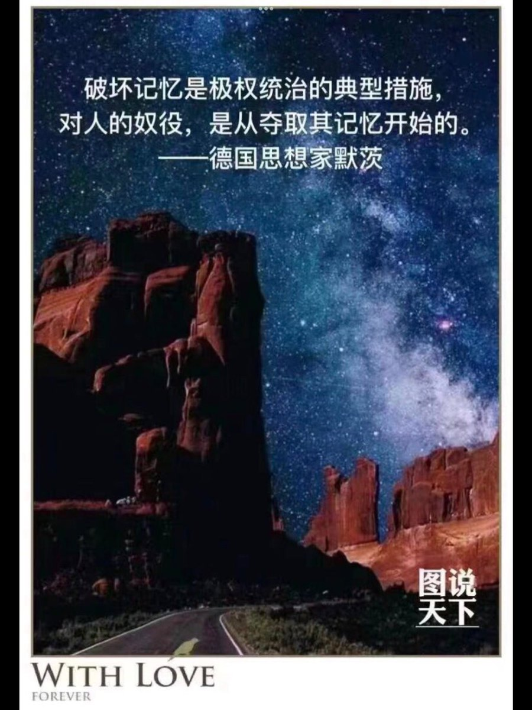
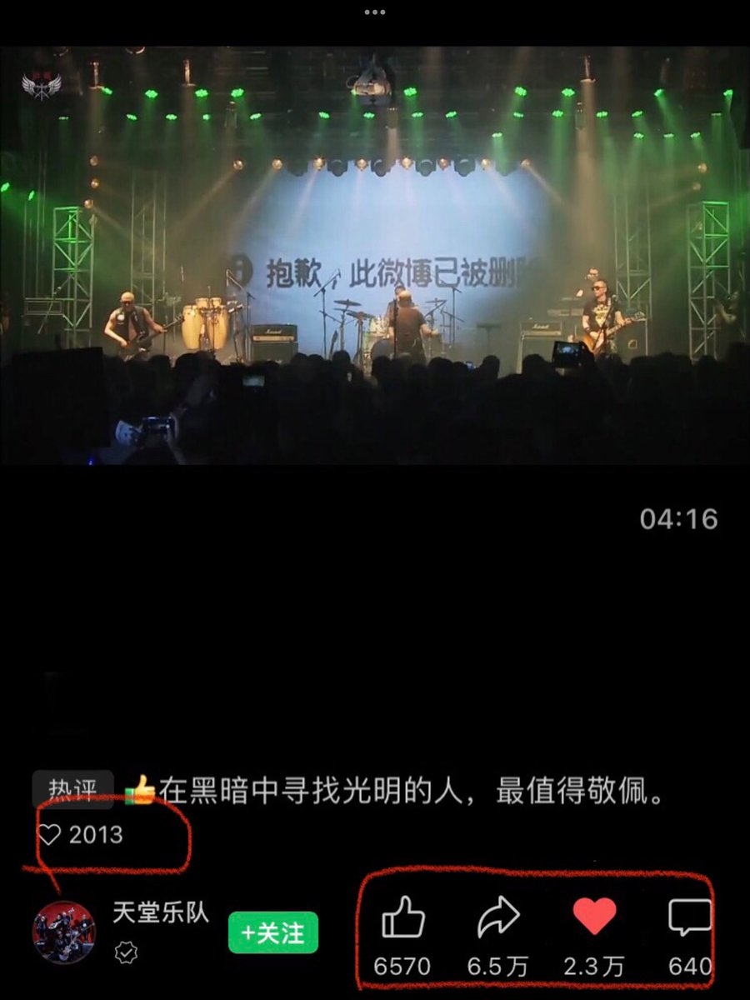
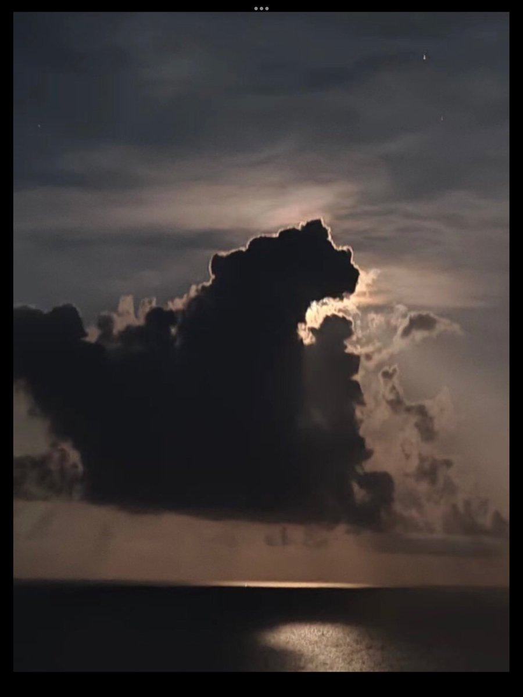
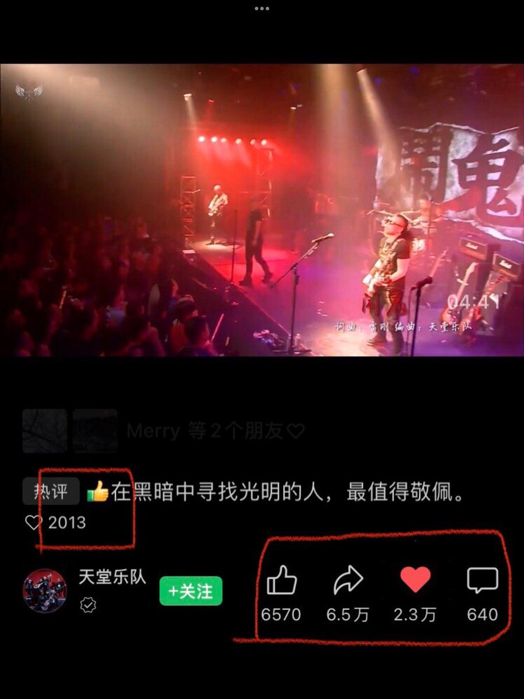
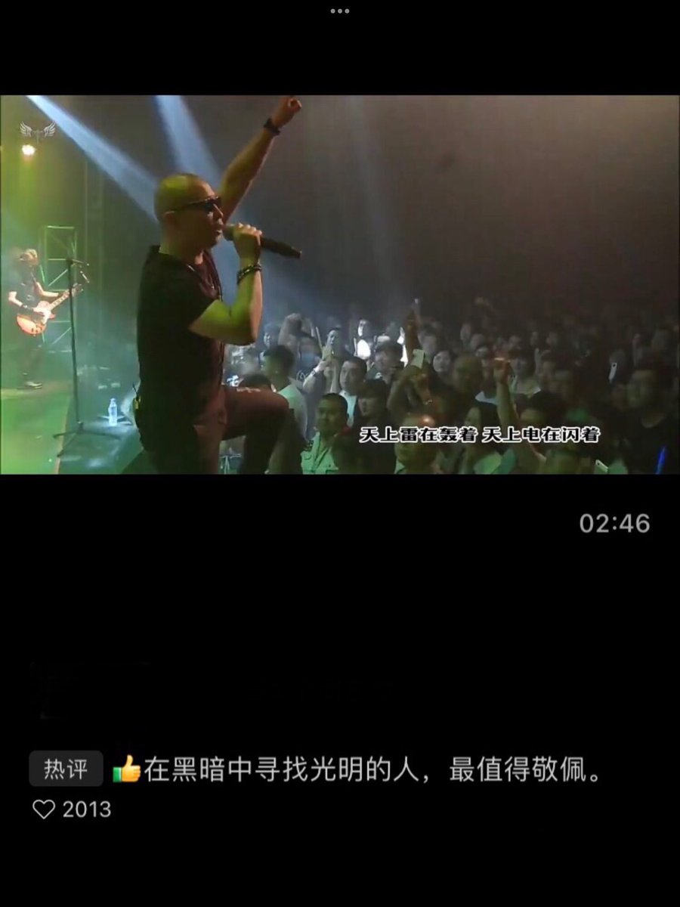
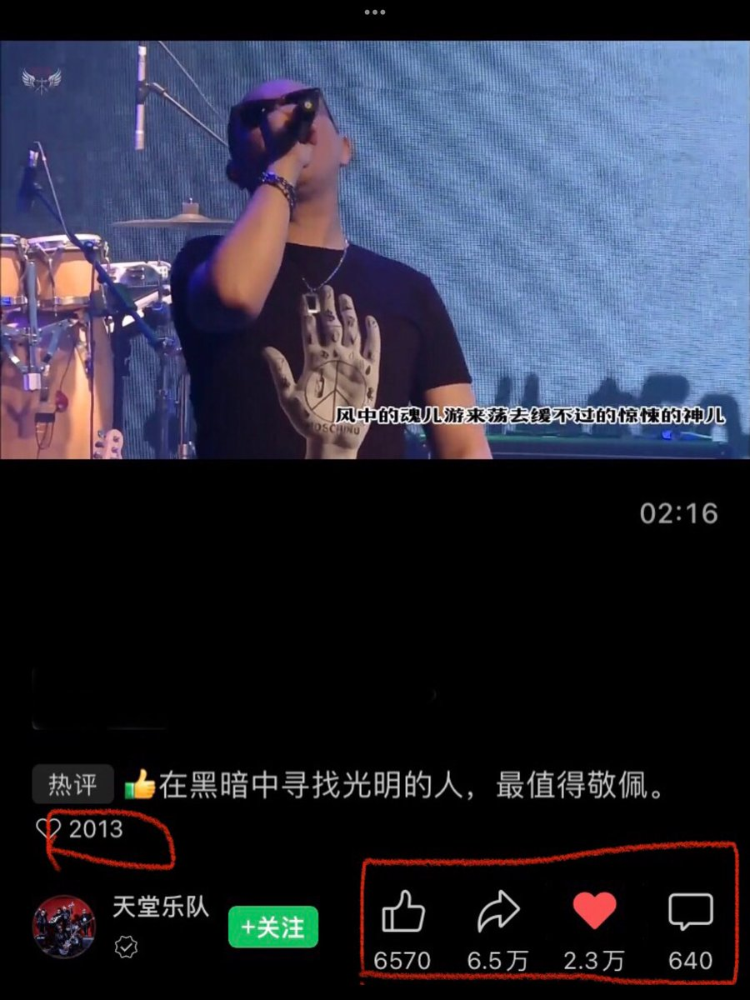
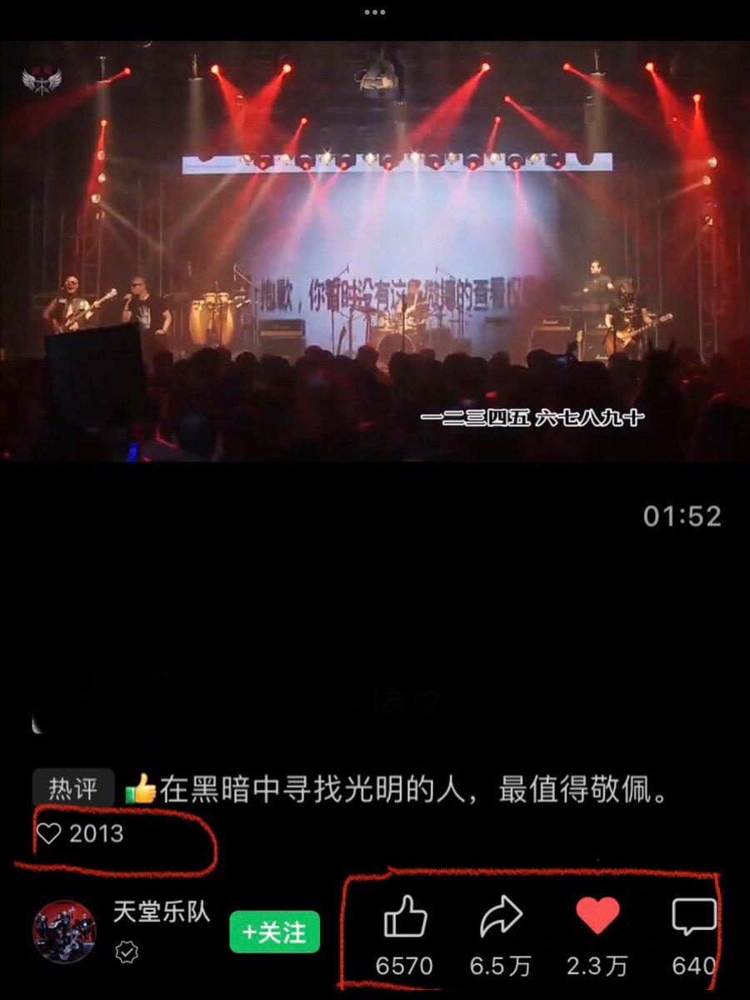

北京时间2023-06-04T23:52:54Z RT @lianchaohan: 【64感言】六四一天不昭雪、中共一天不認罪，中國一天無望進入文明社會，世界一天不會相信一個屠殺自己孩子的政權會真心實意維護和平促進發展。中共的惡根惡性源於馬列暴力專政邪說和農民流氓無產階級的野蠻，其崛起是中外人民的災難，它為實現野心不惜毀滅世界…   北京时间2023-06-04T23:50:29Z RT @ziding_zhou: 父亲拍摄的64珍贵照片，我们可以看出当年的游行是自发的和平的全国的。89年父亲在北京中国地质大学读研究生，父亲是非常谨慎的人，在我出国前从来没有和我谈过64，也没有谈过这些照片。这些照片甚至都是我母亲私自扫描，带到国外来的。34年之后，我父亲被…   北京时间2023-06-04T23:49:54Z RT @whyyoutouzhele: 6月4日晚，香港。
美国驻香港和澳门总领事馆的每扇窗户都点起蜡烛。
https://t.co/Z9o6KJib1i https://t.co/SrLf9qLaqU   北京时间2023-06-04T23:49:32Z RT @lianchaohan: 「布林肯国务卿64声明」明天，我们纪念天安门广场屠杀34周年。 1989年6月4日，中华人民共和国政府派遣坦克进入天安门广场，残酷镇压了和平的中国民主抗议者和路人。受害者的勇敢精神不会被遗忘，他们将继续激励世界各地这些原则的倡导者。美国会继续在…   北京时间2023-06-04T23:47:23Z RT @HuPing1: 埋葬中共暴政，埋葬人类历史上最后一个专制强权，任重道远，我们的抗争无比艰难，也无比神圣，无比光荣。对自由的渴望深深地植根於人心之中，它永远不会熄灭。自由民主好比不死的凤凰，它可以失败一百次一千次，但每一次它都会浴火重生。相反，共产专制只能输一次，它一旦…   北京时间2023-06-04T23:20:01Z 5/35/1989—2023，他们千方百计地想扼杀我们的集体记忆，他们不择手段，疯狂地压制我们的声音。只要人心不死，记忆就必定活着，任何鬼魅魍魉都阻挡不了我们，看他们在恐惧中崩溃倒台。我们坚信，时间在我们一边！ https://t.co/4yk3WU28AU   北京时间2023-06-04T23:06:28Z 今天是个大日子！所有追求自由民主的人都不会忘记！用我们天赋的歌喉发出我们的同气共吁，每一个数字都是一颗心心相应的心。让我们天南海北、墙里墙外，同一个祖先的华夏儿女，为我们自己，为我们的儿女，为我们的世代后人，记住34年前的今天，我们接续努力！
墙里这首歌热传！ https://t.co/yvJwy6AJVP   