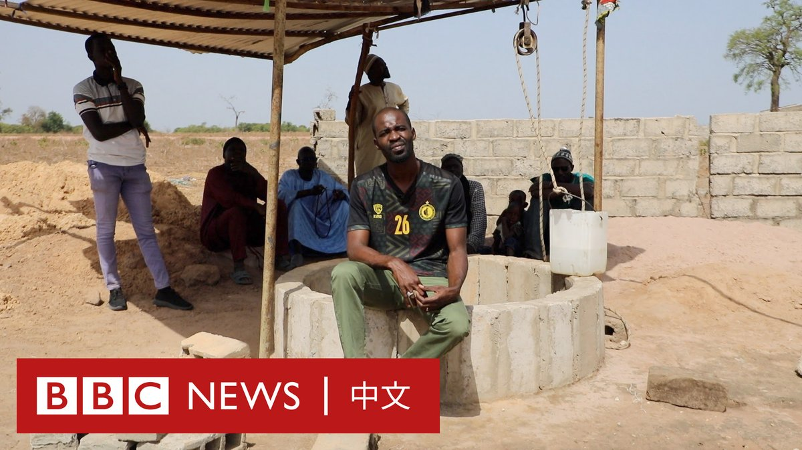

北京时间2023-06-03T15:01:03Z 【一周热点回顾】拜登总统近日表示，正在就解除对中国防长李尚福的制裁“进行谈判”。但美国国务院做出澄清，表示不会取消制裁，出了乌龙。https://t.co/MV3yPHyOyc   北京时间2023-06-03T12:30:18Z 在看到塞内加尔北部的女性需要走超过七公里才能取水后，马马杜·迪亚哈特希望用自己的方式帮助他们。

现在，他和他的团队已经建造了30口井让当地居民就地取得干净的水，他们预计在今年年底前能完成100座。 https://t.co/9dLQiUDNc3   北京时间2023-06-03T11:01:02Z 【一周热点回顾】乔·卡梅伦（Jo Cameron）是世界上唯一已知拥有两种基因突变的人，她几乎感觉不到疼痛，并有强大的愈合能力。她经常在烤箱上烫伤手臂，要依靠皮肉烧焦的气味才知道自己已经受伤。https://t.co/ubHSoxbfkW   北京时间2023-06-03T09:01:06Z 【一周热点回顾】领导中国应对疫情的高福教授告诉BBC，调查疫情起源应该考虑到所有，不应排除新冠病毒从实验室泄露这一可能性。
https://t.co/VUYhiMZStV   