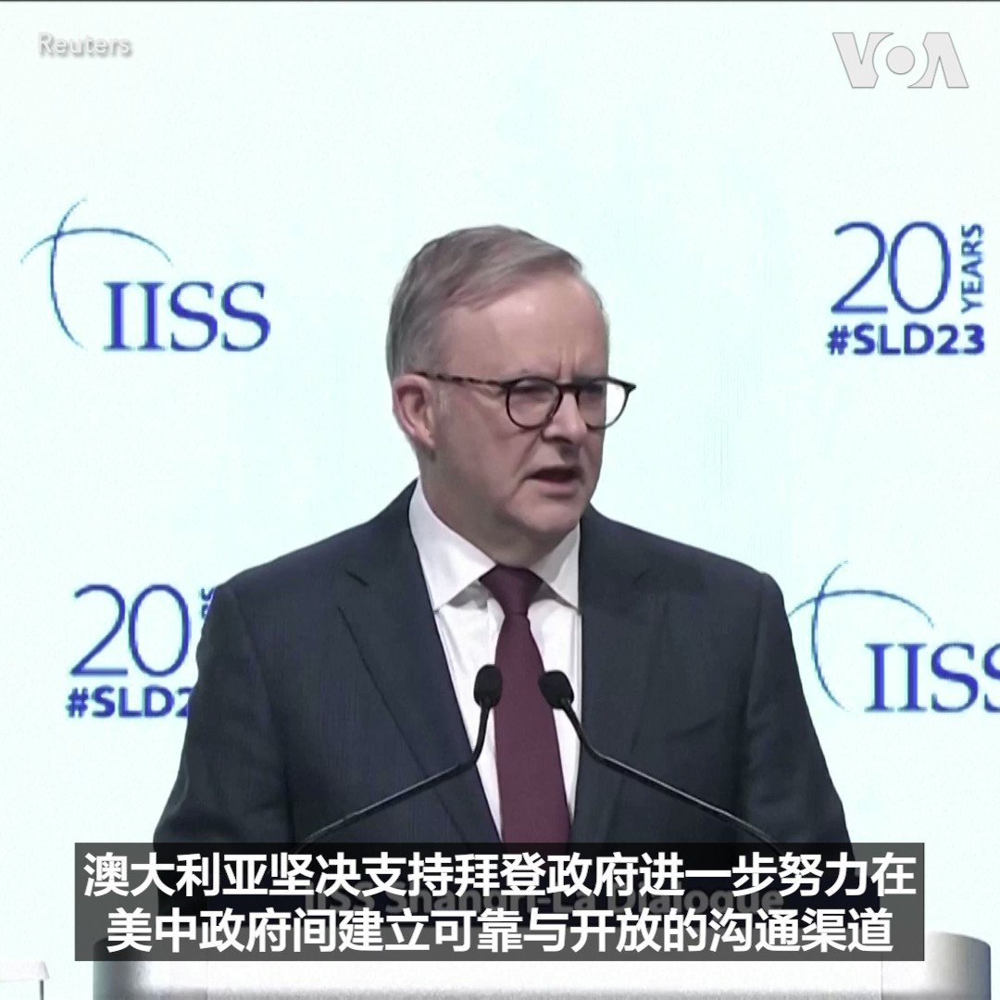
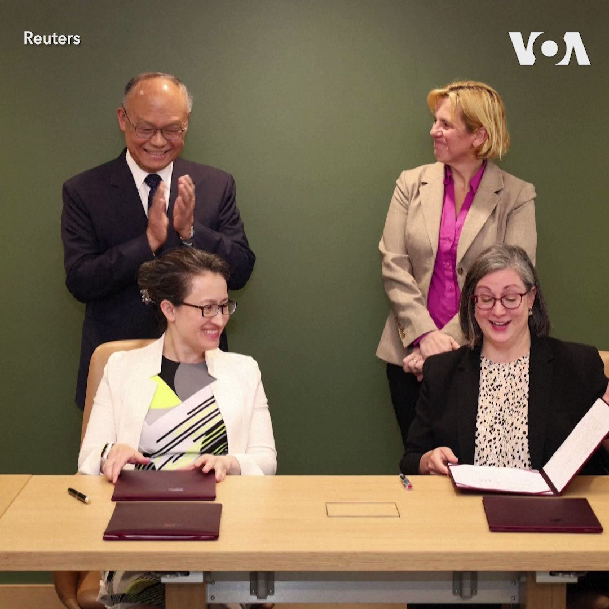
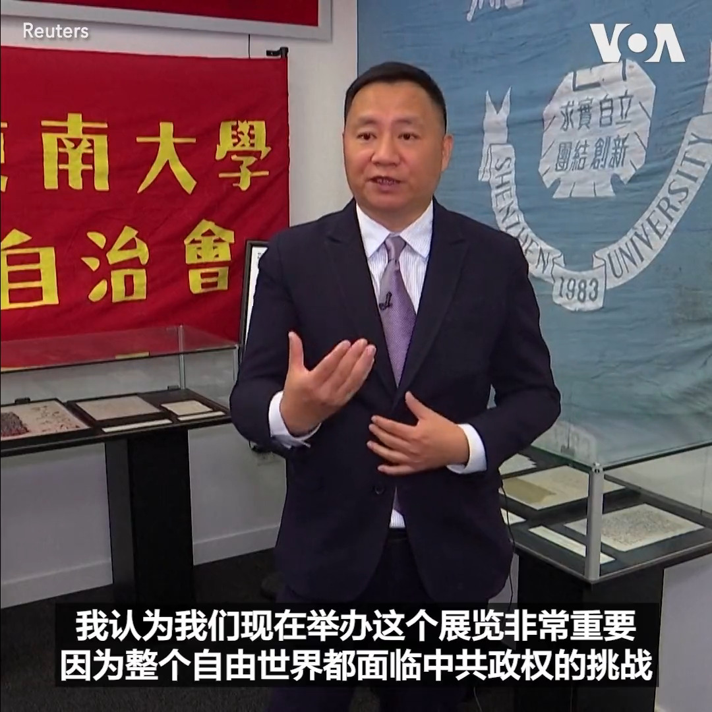

北京时间2023-06-03T05:55:32Z 面对俄中挑战，美国对其现有核武库充满信心 https://t.co/XIro326QBz   北京时间2023-06-03T05:10:32Z 澳大利亚总理阿尔巴尼斯2日在新加坡香格里拉对话上呼吁美国与中国进一步接触，他说超级大国对话破裂将对全世界带来严重后果。此前中国国防部长李尚福拒绝了与美国国防部长奥斯汀会晤的提议。李尚福与奥斯汀2日在香格里拉对话晚宴上握了手，但五角大楼表示双方未进行实质交流。 https://t.co/nX5t0wVqZj   北京时间2023-06-03T04:56:05Z 神舟十六号完成载人任务　中国航天技术恐追上美国? https://t.co/LfQSutFm6c   北京时间2023-06-03T04:33:02Z 拜登将就美国成功避免债务违约发表讲话 https://t.co/UweYIudPzd   北京时间2023-06-03T04:03:34Z 纪念六四事件34周年，CECC主席提名彭立发、张展、李康梦角逐诺贝尔和平奖 https://t.co/zcF1TfNYQc   北京时间2023-06-03T03:16:04Z 布林肯：乌克兰和平协议必须包括俄罗斯撤军 https://t.co/h8CxfTHXSP   北京时间2023-06-03T02:02:52Z 台湾与美国1日签署了“21世纪贸易倡议”框架下的首批协定。双方去年8月开始相关的谈判。 中国指责协定违背美方做出的仅与台保持非官方关系的承诺。该协议预计不会改变商品关税，但支持者表示，它将加强美国和台湾之间的经济联系，增加美国商品对台湾的出口，并增强台湾抵制来自中国经济胁迫的能力。 https://t.co/LL30Bo1Atb   北京时间2023-06-03T01:56:59Z 香港曾是唯一能公开纪念六四的中国领土，但2020年国安法后，公开悼念六四变得困难。今年六四期间，曾举办六四烛光晚会的维园亦被亲北京社团用来庆祝香港主权回归中国。已解散的香港支联会副主席蔡耀昌说，如今的政治形势下难有大型六四集会，但人们会用自己的方式去纪念。https://t.co/99zkRcUWqe https://t.co/Jezc9ezHmW   北京时间2023-06-03T01:14:35Z 美中两军关系出现松动迹象：奥斯汀和李尚福在新加坡简短交谈 https://t.co/fn977psCvo   北京时间2023-06-03T00:59:35Z 中情局长伯恩斯五月曾密访中国，在高层沟通不畅情况下试图改善关系 https://t.co/VVfOq2X5xy   北京时间2023-06-03T00:53:19Z 中国当局镇压天安门运动近34周年之际，纽约的六四纪念馆2日对公众开放。六四学生领袖周锋锁1日对媒体说这里体现着追求自由中国的梦想。另一位六四学生领袖王丹说展览能让人们了解中共是一个靠暴力与谎言进行统治的政权。香港六四纪念馆被关闭后，纽约这个纪念馆将是全世界唯一一个永久性六四展览。 https://t.co/qeLkJ2yBJi   北京时间2023-06-03T00:22:34Z 无功而返， 斡旋俄乌冲突的中国特使考虑第二次出访欧洲 https://t.co/2bgcHCYy12   