北京时间2023-06-03T20:37:36Z 1930年代斯大林残酷“肃反”苏共党内，赫鲁晓夫揭开了黑幕；毛泽东为争权夺位与康生一起对中共党内残酷清洗和抓特务。这是中共内部一贯做法，习上台后同样残酷清洗党内非习人马……

禁忌史話：李銳日記秘密28｜中共情報頭子康生 https://t.co/UVrJXuTvc9 来自 @YouTube https://t.co/BJN0CkpmLT 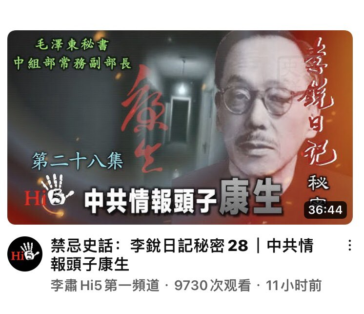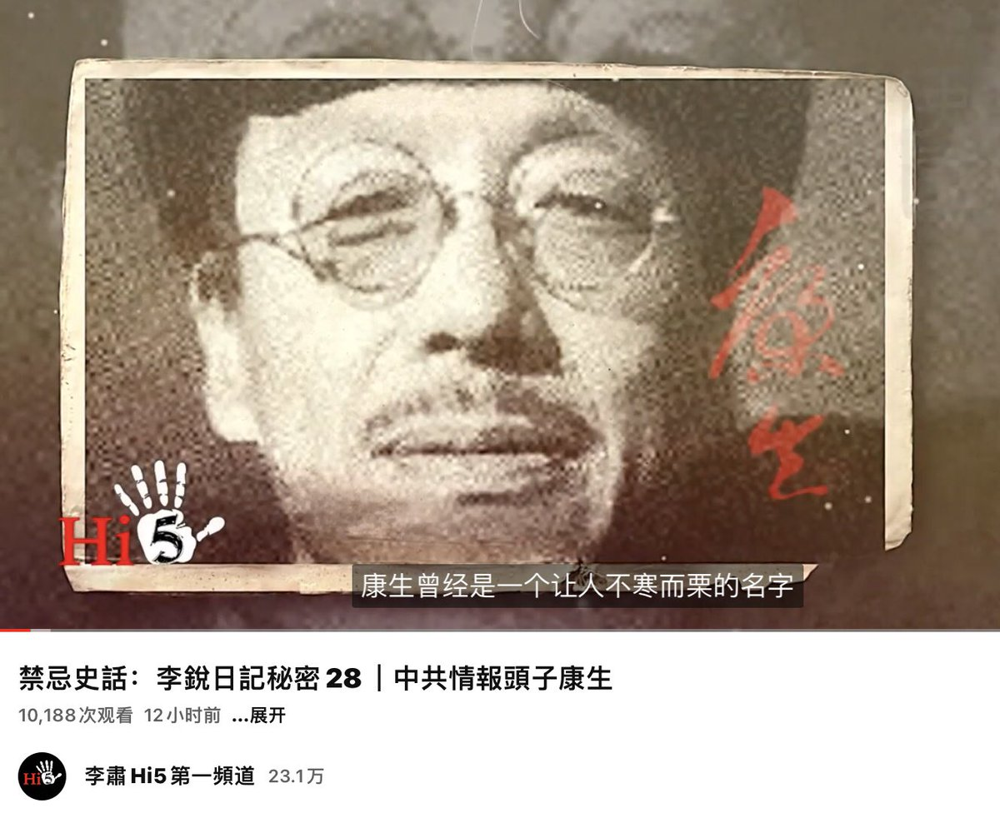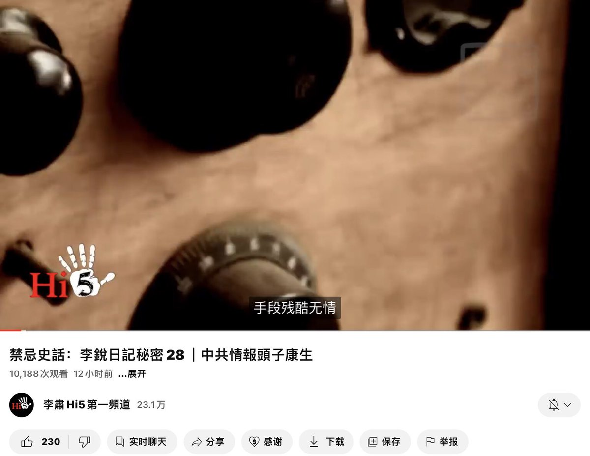  北京时间2023-06-03T08:00:50Z 特別強烈推薦
六四是當代中國歷史上無法迴避的重大事件，是中共統治集團無法否認的罪惡。
特別感謝吳仁華老師為保存集體記憶所做大量艱苦細緻的學術努力。主持人與嘉賓的思考表達極有深度。

回到过去：如何打造六四时光机（戴忠仁/吴仁华/郑旭光）|  亚洲很想聊 https://t.co/VUcvlUoqSt 自@youtube https://t.co/ApYlEbFN7q 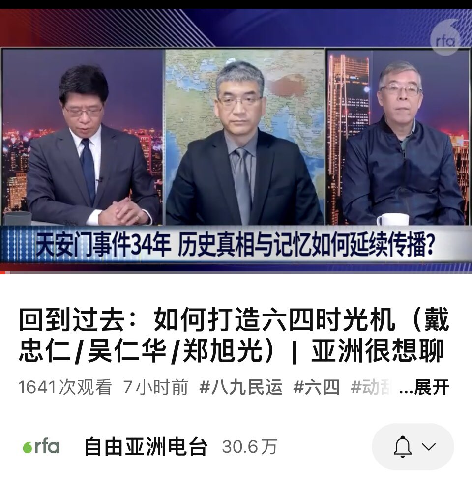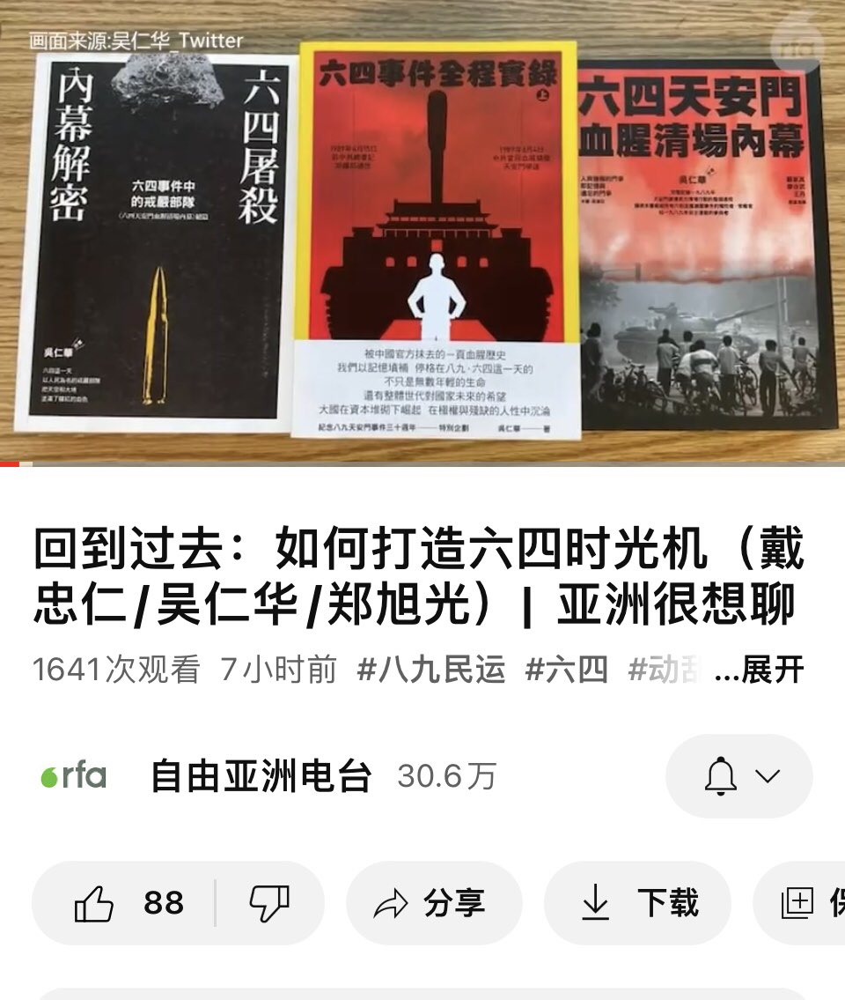  北京时间2023-06-03T07:19:50Z 張盼成是一位非常樸實的青年，他在北大當保安，他的小視頻表明他的政治觀點，他因小視頻被北京警方拘捕。   北京时间2023-06-03T01:47:23Z https://t.co/AHNc3Qz6Uq 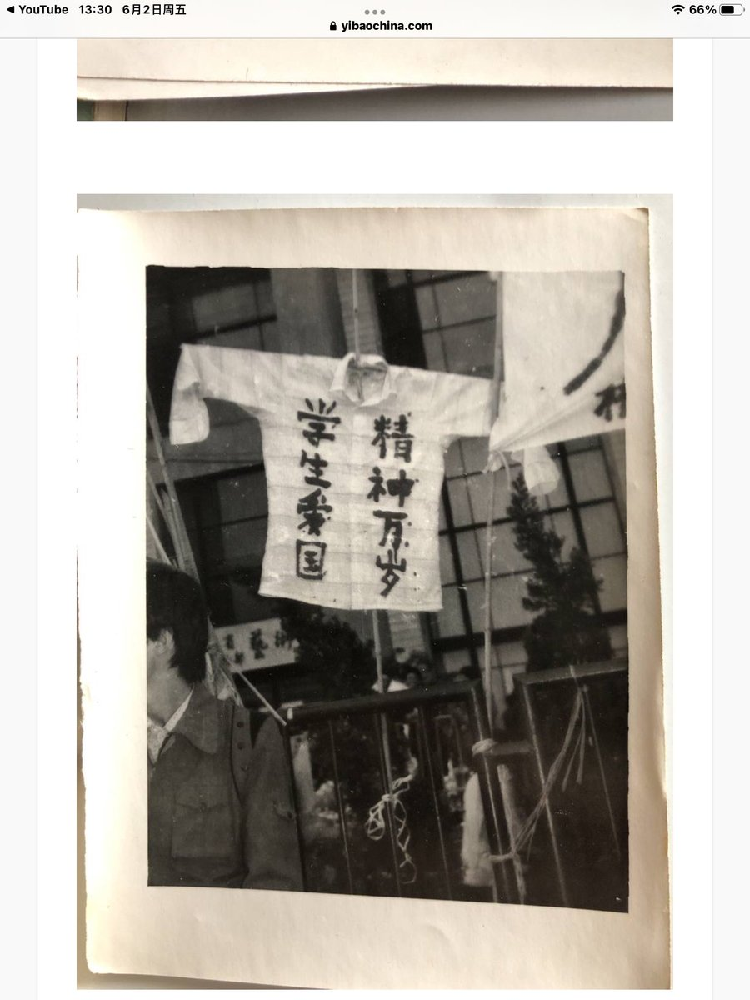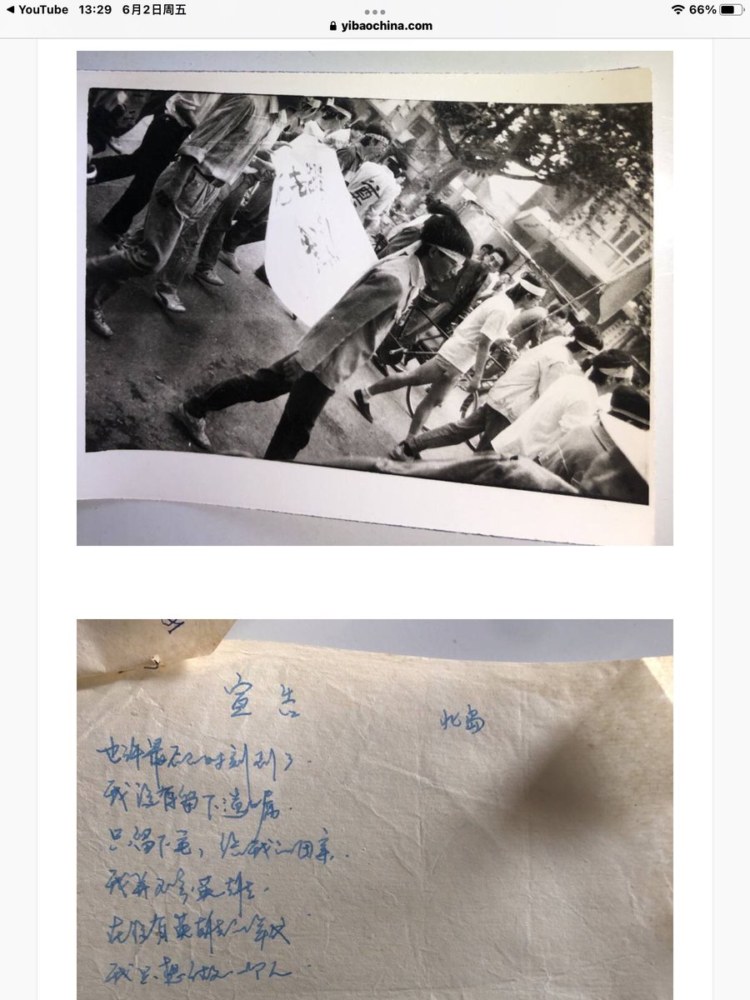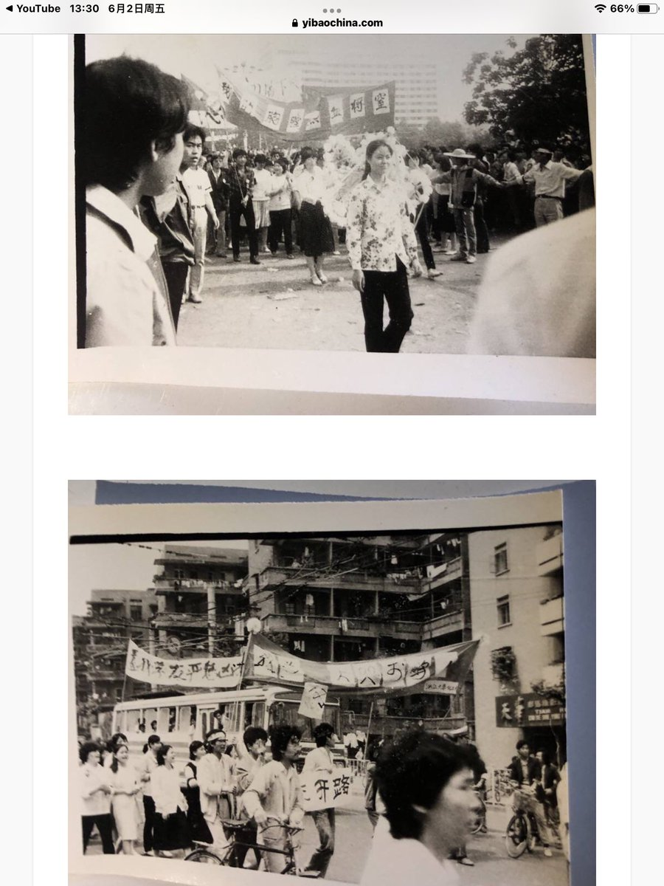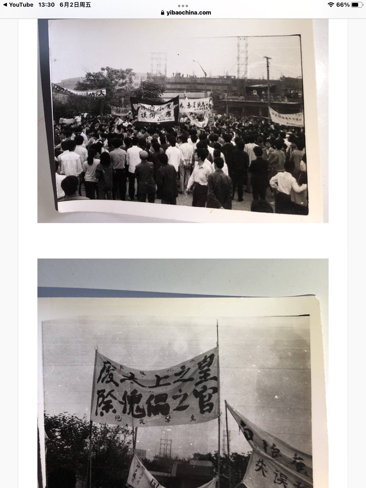  北京时间2023-06-03T01:44:40Z 【議想天開】淚往下流，血往上湧（題34周年首次曝光的六四圖片） - 议报 https://t.co/YT9HBhXy1e   北京时间2023-06-03T01:41:13Z https://t.co/u5uvf7fHyS 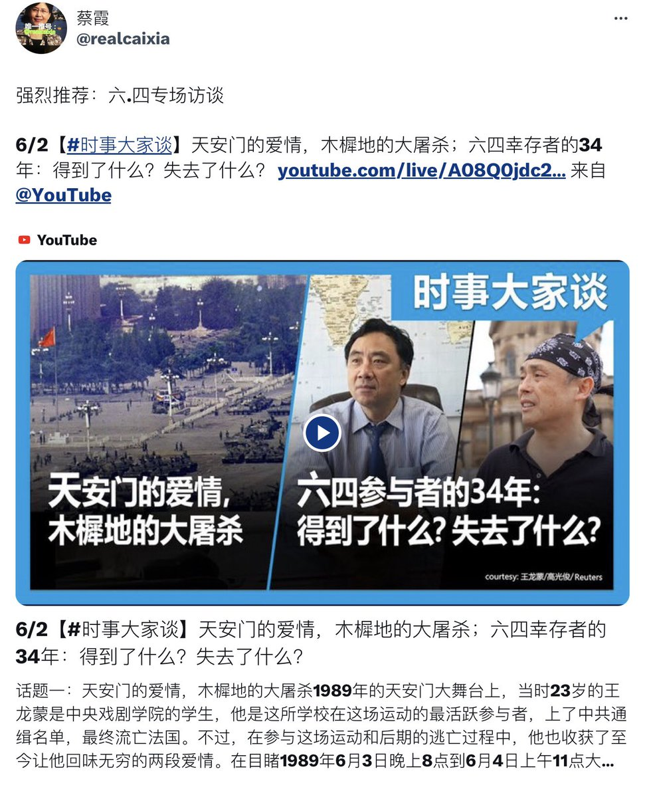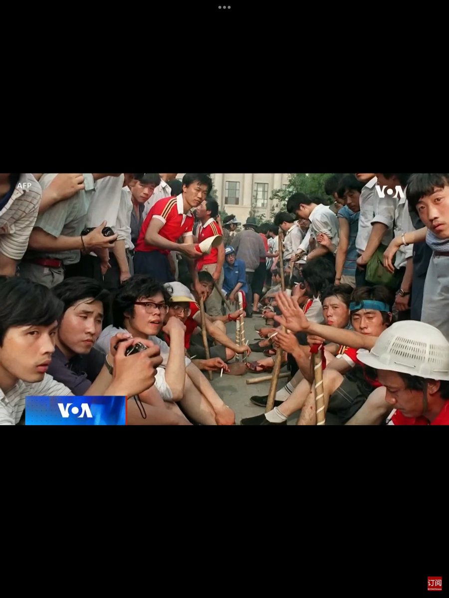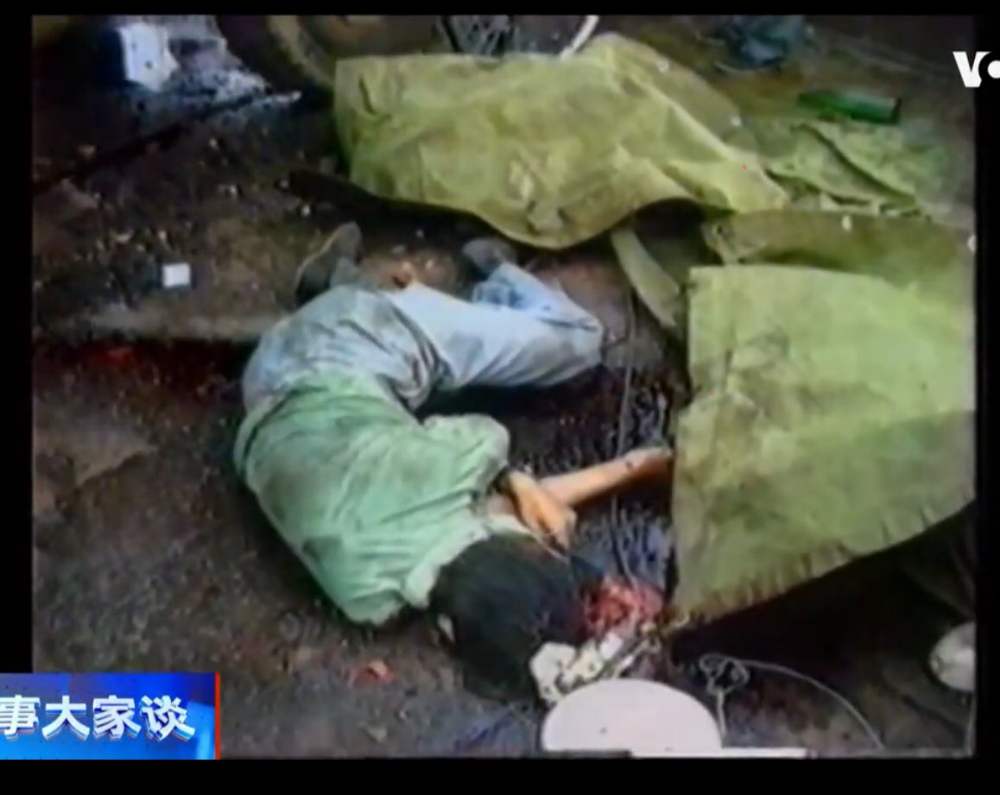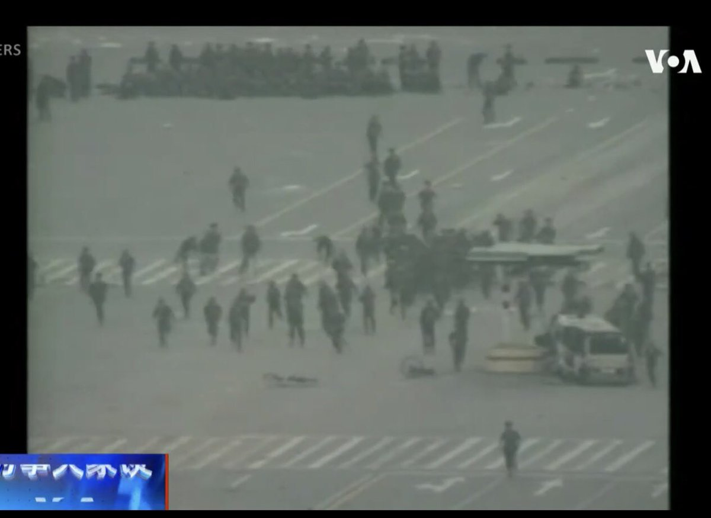  北京时间2023-06-03T01:23:32Z 强烈推荐：六.四专场访谈

6/2【#时事大家谈】天安门的爱情，木樨地的大屠杀；六四幸存者的34年：得到了什么？失去了什么？ https://t.co/gD5Jx9dLNv 来自 @YouTube   