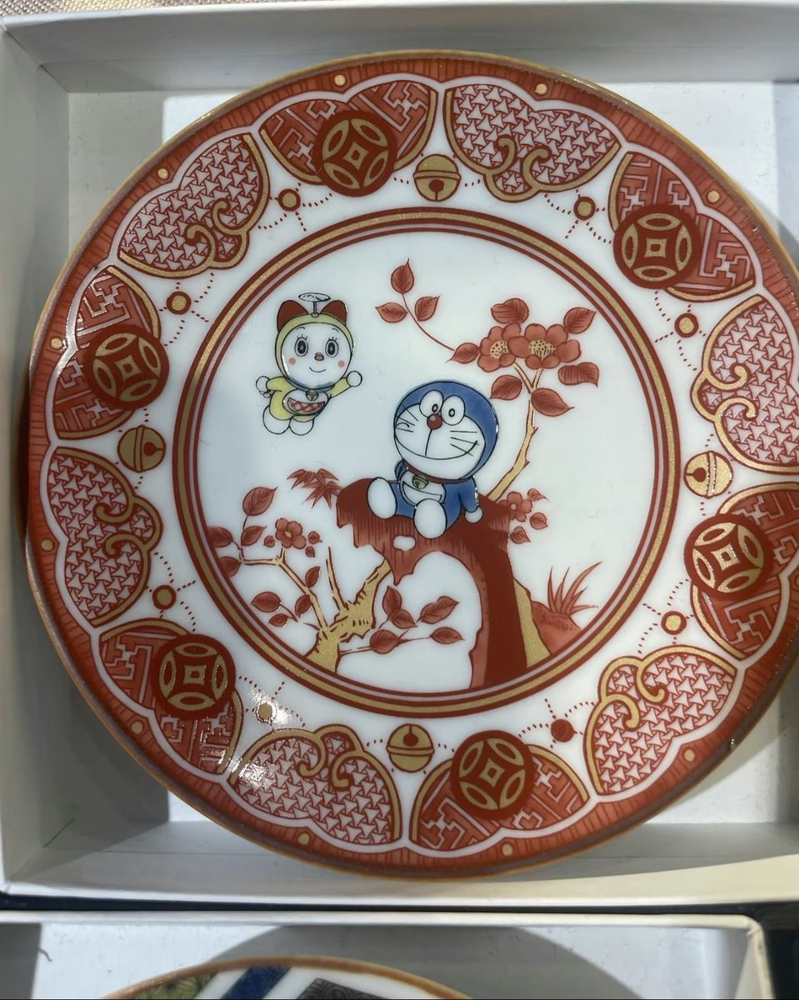
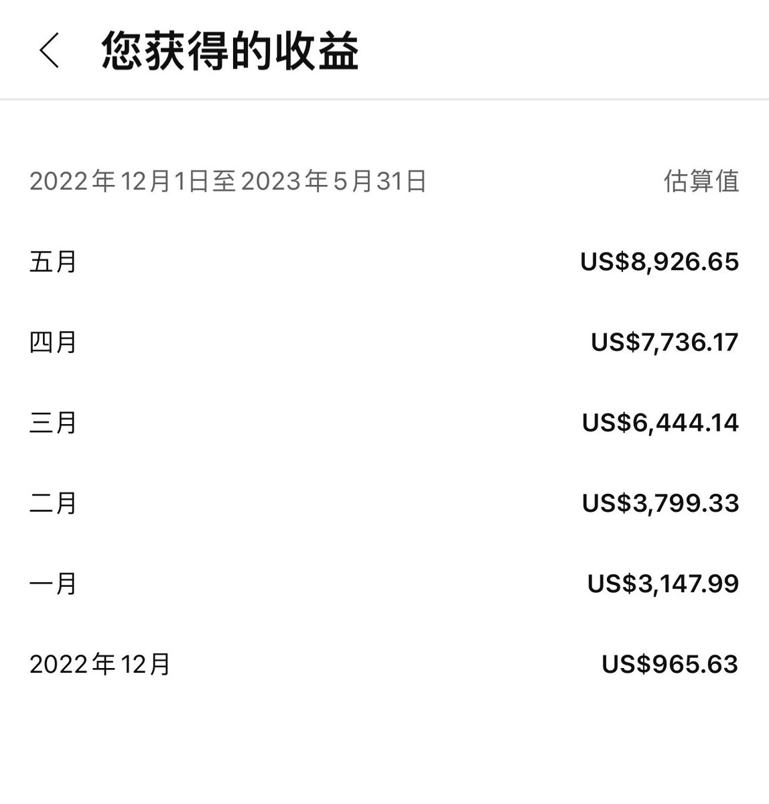

北京时间2023-06-02T13:58:30Z 今天高价收了个
康熙的官窑釉里红双猫戏春盘。
大家看保真吗？ https://t.co/vJgPQJzozX   北京时间2023-06-02T13:25:16Z 我一说民主问题，就有粉红说我喜欢搞民主万能论，民主了中国经济就能好了
我从来没有说民主是万能的，我只认是认为独裁一定失败
成为发达国家就像考上大学，而民主改革就像开始学习，学习了不一定能考上大学，但是你不学一定考不上大学
当然也不是没有个例，比如家里有矿有石油的富二代可以买个大学上 https://t.co/QhShtX8FHD   北京时间2023-06-02T11:06:02Z 5月PMI再次不及预期。
其实我觉得目前中国经济的问题并非到底衰退的有多快。
而是根本看不见未来会有什么样的利好消息，扭转这个局面。
方脸说：锐评五月经济数据，中国目前最大的问题不是持续衰退，而是没有希望！ https://t.co/npfb6cZCma 来自 @YouTube   北京时间2023-06-02T06:36:48Z 我记得我流量很低的时候，有小粉红骂我，就这水平怪不得没人看。
流量有点，就有人骂我，只有讲这些低水平的话才能吸引无脑反贼。
你让些人说具体哪里不行，水平低在哪里，又不说不出来
扣帽子总是简单的，因为一旦正儿八经辩论，很容易显得自己像个小丑🤡   北京时间2023-06-02T05:47:29Z 下个月争取冲刺一下一万刀了💰 https://t.co/44EgLY0Lev   北京时间2023-06-02T01:06:07Z 支持支持   