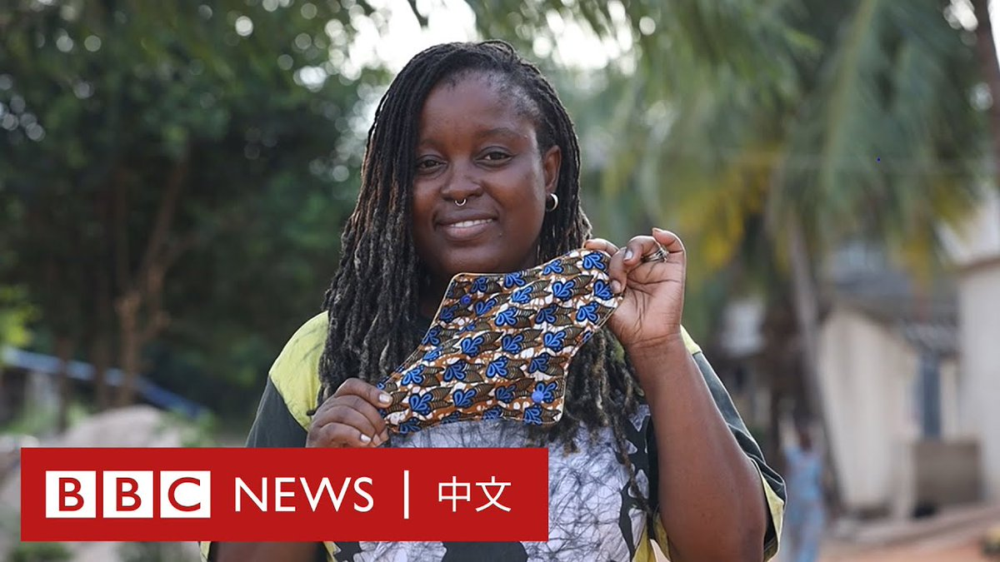
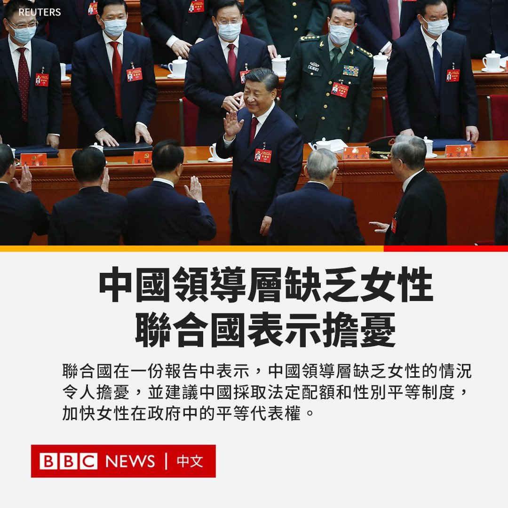
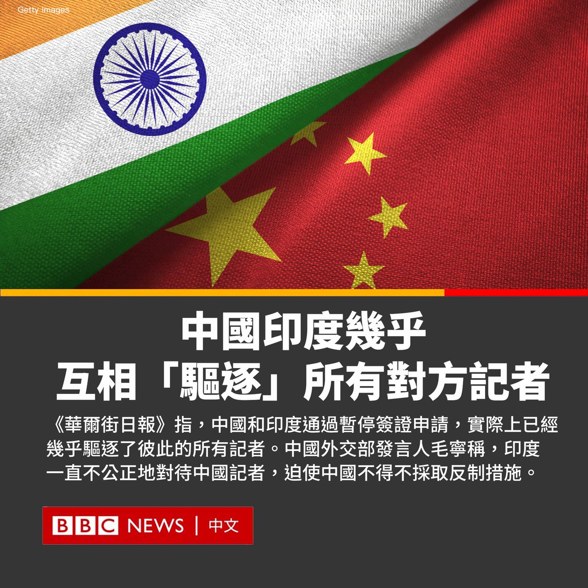
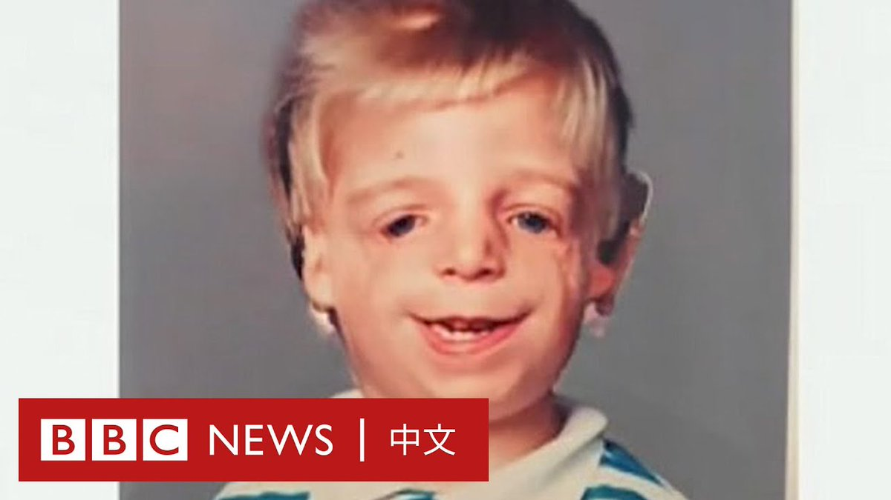

北京时间2023-06-01T20:32:09Z 近日，中国极目新闻一名记者在贵州毕节采访时遭到警方殴打，引起大陆对媒体人处境的担忧。官方调查组向记者和媒体道歉，涉事派出所警员及辅警被免职或解聘。
https://t.co/lHZracNhWm   北京时间2023-06-01T20:01:07Z 在西非的多哥共和国，女性权益倡议者艾尔莎（Elsa M’béna Ba）设计了一款能够重复使用的卫生棉。透过再利用裁缝厂的角料，她和伙伴教导当地女性如何制作这个更环保且经济上容易负担的生理用品选择。 https://t.co/il51EyS6X4   北京时间2023-06-01T19:01:05Z 作为全球最大的跨国军事联盟，北约在印太设定第一个正式联络处，只有象征性意义还是具有实质战略功能？它的目标又是什么？https://t.co/6GdmpzY7bJ   北京时间2023-06-01T17:25:22Z 联合国在一份报告中表示，中国领导层缺乏女性令人担忧，并建议中国采取法定配额和性别平等制度，加快女性在政府中的平等代表权。

周二（31日），“消除对女性歧视委员会”(UN Committee on the Elimination of Discrimination against Women)对中国提出建议，并公布了对于德国、冰岛、圣多美和普林西比、斯洛伐克、西班牙、东帝汶和委内瑞拉的调查结果。

委员会表示，尽管中国在政治和公共生活中女性的代表数量有所增加，但对于女性仅占第十四届全国人民代表大会代表的26.54%，委员会仍然担忧。

委员会敦促中国在所有政府机构中增加女性的数量，包括司法机构和外交服务，特别是在决策层面。

报告指出：“自2022年10月以来，中国共产党中央政治局的24名成员中就没有女性，这是20年来首见，而且政治局的7名常委中也没有女性。” 

中国外交部表示，政府非常重视在妇女领域的国际交流与合作，并将认真研究委员会提出的有益意见，继续与国际社会合作，促进全球妇女事业的发展。

联合国还敦促中国废除“不成比例的限制”以及确保妇女人权捍卫者不会因为工作而受到恐吓、骚扰和报复。   北京时间2023-06-01T16:01:09Z 美国太空总署（NASA）的专项小组公布对800次神秘现象的调查结果：有些不明飞行物其实是卡通气球，有些则仍然是个谜。https://t.co/jKpMFpj31Z   北京时间2023-06-01T15:03:01Z 《华尔街日报》指，中国和印度通过暂停签证申请，实际上已经几乎驱逐了彼此的所有记者。中国外交部发言人毛宁回应称，长期以来，印度一直不公正地对待中国记者，迫使中国不得不采取反制措施。

报道称，印度于五月拒绝为最后两名中国官方媒体记者续签签证，其中一人来自新华社，另一人来自中国中央电视台。

在中国，今年初还有四名印度记者未能获得返回中国的签证，其中至少两人目前仍未获得签证。第三人五月被告知其新闻记者证已被吊销，但该记者仍在中国。

《华尔街日报》称，2020年6月在有争议的中印边境曾发生致命冲突，导致两国关系恶化。随后的这些相互反制行动可能会加剧两国之间的紧张关系。

毛宁在5月31日的例行新闻发布会上还表示，自2020年以来，印度拒绝批准中国记者的常驻申请，导致中国驻印记者数量从正常时期的14人骤减至只剩1人。她还表示，印度目前仍未为中国最后一名驻印记者延长签证，中国驻印记者面临被“清零”的可能性。   北京时间2023-06-01T10:16:38Z 罹患罕见疾病“崔契尔柯林斯症候群（Treacher Collins Syndrome）”影响了乔诺（Jono Lancaster）面部的骨骼与组织，亲生父母在他出生时便将他抛弃。

乔诺在一次学校短讲中意识到自己的分享能让更多孩子得到帮助，两年前开始更加频繁在各地演讲、并计划出书撰写自己的生命经历。 https://t.co/EfeOSYCHXB   