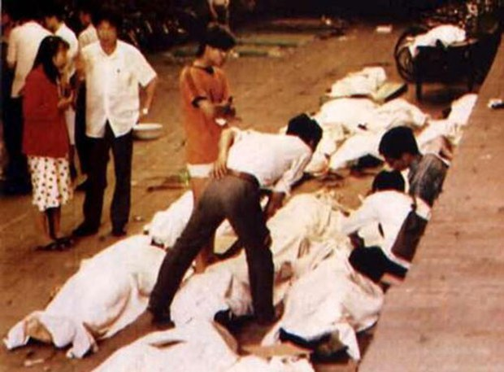

自由亚洲电台 北京时间 2023-06-01T04:45:35Z 1664010257553661954 【00后：我是怎么知道六四的】
#六四34周年，自由亚洲电台征集年轻人的六四经历，响应者众。详见 https://t.co/mbw3r7Y1Oc

我是一名在中国国际学校念书的学生，我从来不知道我们的政府会做出这种反人类的暴行，但是世界上没有不透风的牆，即便是有防火墙，历史和事实永远无法掩盖.。

在中国国际教材的历史书都会被管制，甚至有些城市都不允许学历史（AP，A Level 或IB课程）我们的历史书一开学就被收了上去，过了一个月才还给我们。我们的书上被贴上了各种各样的封条。在好奇心的驱使下我和我的同学们小心翼翼的将书上的封条撕开。 我在看关于中国的内容时看到了一张图片：一个男人站在坦克前面阻挡坦克。我和我的同学十分震惊。在我们的了解下我们开始读书中的内容，我们发现原来我们一直被我们的政府蒙在鼓里。我们的历史上从来没有写到这样反人类反人权的暴行。之后我们在教室里聊到这个内容并且手里拿着撕开封条的书的时候，我们的老师走进了教室，他看到我们手里的书撕开了封条，他当时十分生气，把我和我的同学送去了校长室并且给了我们处分还让我们写检讨。

我最终下载了VPN去看BBC和RFA的新闻和纪录片彻底了解了事情的真相。我非常不理解为什么我去了解历史的真相却要得到惩罚？我们的政府为什么要掩盖事实？我对我的政府现在真的非常失望，而且十分厌恶他们虚伪的样子。   