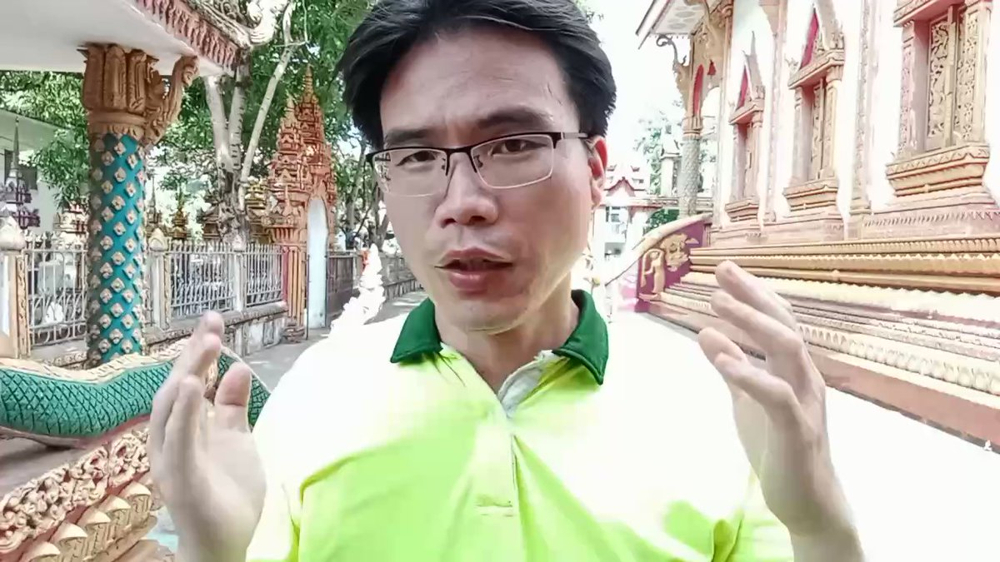
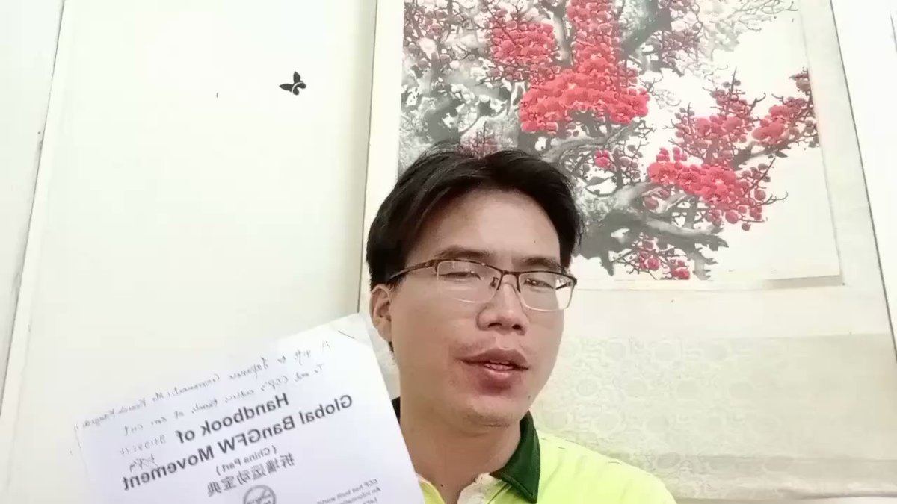
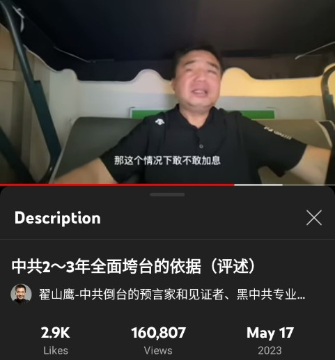

北京时间2023-05-29T16:17:15Z 「中国中产集体沉默 • 会不会被各派优先割韭菜？」

中产有钱有知识，不少还多次出国，能接触自由互联网。中共就剩3年，还在集体沉默，事实上已陷入中共权贵、农民阶层、民主团体3派孤立，无论谁上台，都可能被重点盯上。人心都是肉长的，如果你不曾为社会正义付出，日后很可能孤家寡人
#拆墙 #BanGFW https://t.co/1GrU7PXVMY   北京时间2023-05-29T11:13:40Z 【如何说服1个小粉红变正常人？】

把 #拆墙宝典 第2期的PDF版，通过微信、邮箱、WhatsApp发给对方，过几天再面谈感想。若始终不听劝，就让其先尝尝共匪铁拳滋味，再等浪子回头。30多页拆墙宝典已成一定体系，对亲共者有一定震撼力。#拆墙 #BanGFW

欢迎点击加拆墙电报信使群 https://t.co/c0CvnTsEn0 https://t.co/x58lFMki9g   北京时间2023-05-29T08:47:14Z 「处处是火药桶 • 中共3年垮台无悬念」

中共掌权中国，社会经济问题巨多。垮台说法也并非首次，08年金融危机时就传得很广。但当时中共还办了奥运和世博。当前中共无1个好消息，钱也烧光了，对内对外讲话也没人听了，反抗者云涌。这和苏共倒台前很多症状相似。
#拆墙 #BanGFW
https://t.co/M8eAktgbkg https://t.co/P4ACFhlDmG   北京时间2023-05-29T00:52:00Z RT @YOYO_MIAO: @zhihui999 拆墙的四大巨头乔鑫鑫、dongling、王清鹏、林生亮纯他妈的四个精神病院跑出来的玩意儿   