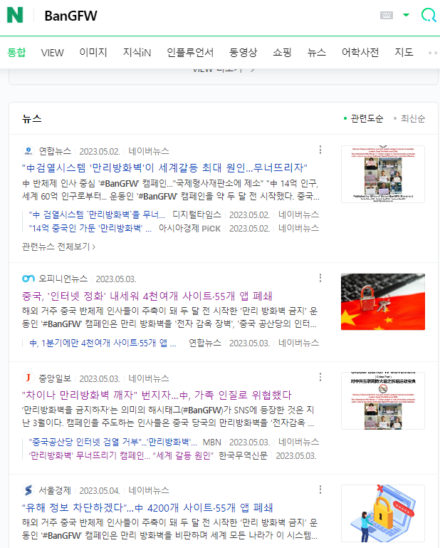
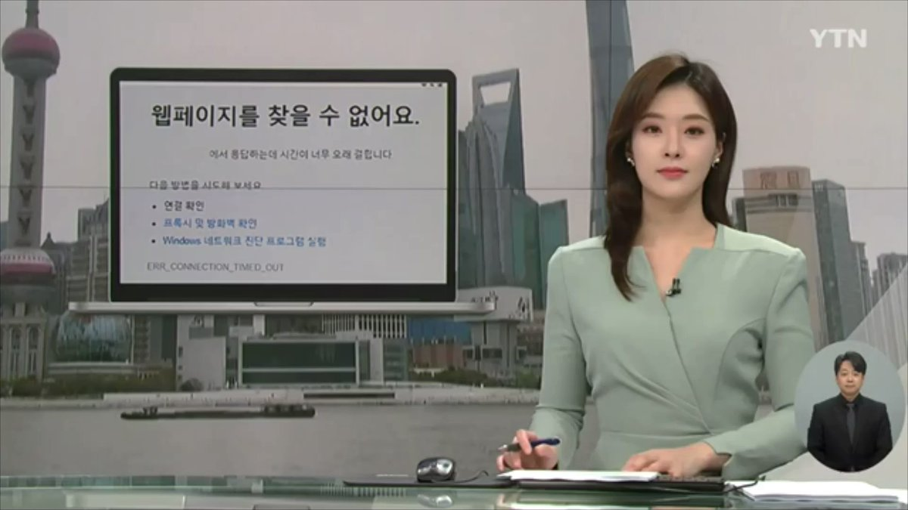

北京时间2023-05-27T12:44:58Z 感谢中共加倍的信息封锁，从Naver搜索结果看，#拆墙运动 韩文阅读量预计在两三千万，我们将设法申请光州人权基金赴韩推广交流
Great thanks to CCP, #BanGFW is very hot in S.Korea now, we'd like to apply for funds from its May 18 Foundation, to invite more Koreans to ban #GreatFirewall. https://t.co/LTxKzKg8nf   北京时间2023-05-27T12:07:58Z RT @Ban_GFW: @MyloveKBS Many S. Korean in China are complaining the Chinese Communist Party again blocks their portal website NAVER  #Great…   北京时间2023-05-27T11:11:49Z 韩联社：#拆墙运动 急需韩语作家，以反击中共防火墙把Naver等多个门户网全封锁
S. Korea's  @YonhapNews tells #BanGFW need Korean writers while CCP has blocked all portal websites,  NAVER ,Daum,Kakao, Nate @kakaotalk_japan @dailynaver
中, 한국 포털 전면 차단...인터넷 통제 강화 이유는? https://t.co/TPnqhxkNDN   北京时间2023-05-27T10:41:54Z Hot news in RFA: No.1  Korean portal website &amp; search engine NAVER has been blocked in China? Chinese Communist Party said we don't know
韩国第1大门户网站和搜索引擎Naver @dailynaver 被 #防火墙 封锁，中共又不认账 
#BanGFW  #GreatFirewall  #만리방화벽금지
https://t.co/LUdJxEltSO   