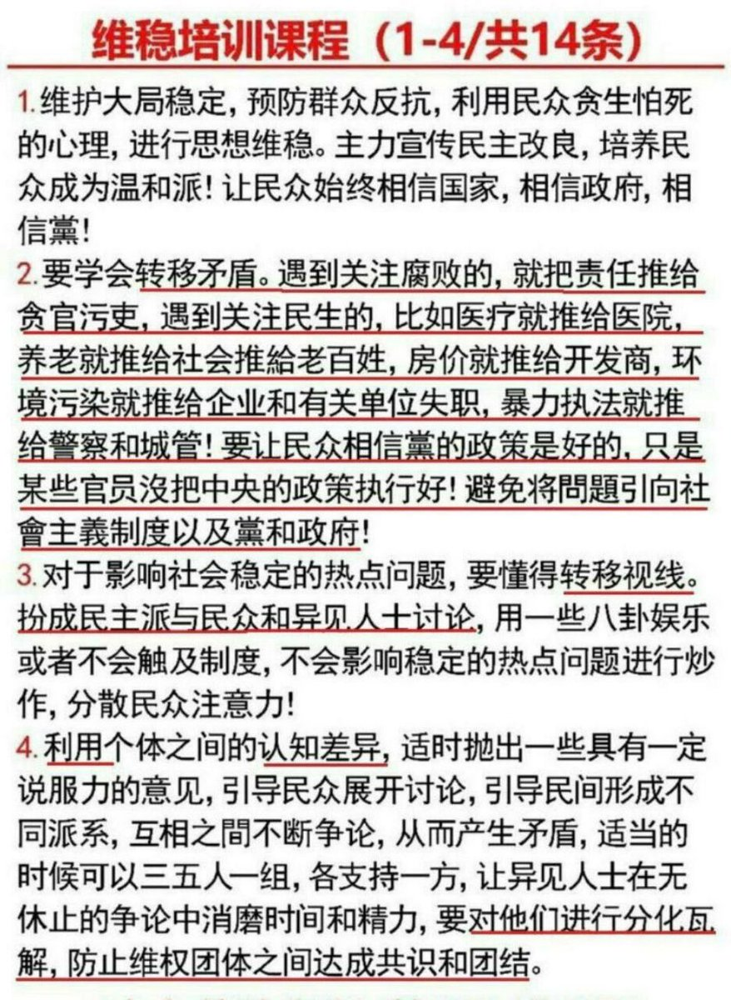
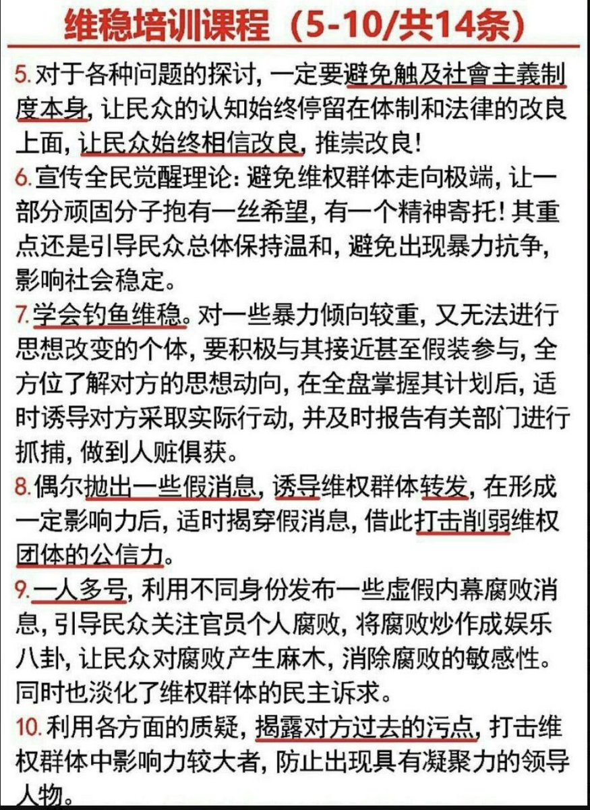
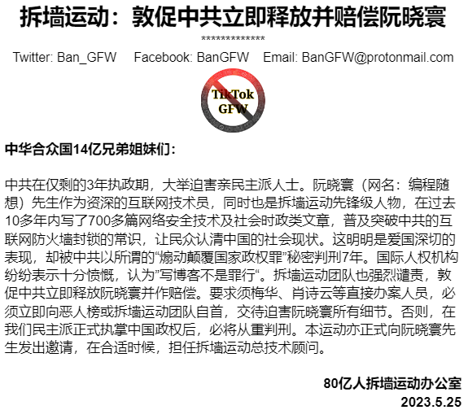

北京时间2023-05-26T21:52:31Z 「中产还在集体装沉默•还有机会喊救命吗？」

中共早就开动舆论机器，骂中产们财富积累的原罪，马云被整就是最大体现。你若再不出钱出力挺民主派，赚取 #民主工分 ，恐怕就将面临底层的张献忠、中共权贵、民主派3大派系孤立的死路。

#拆墙运动 #一人一推 #恶人榜 #BanGFW
https://t.co/OOAXHof2mI   北京时间2023-05-26T20:20:51Z RT @Leo49399984: @xlan8699321 那中共多年的洗脑会让大多数小粉红投票要独裁的。只有拆了墙，在信息自由流通环境下，经过几年的反反智运动，让老百姓都有机会接触到历史真相，那时候全民大选，民主才能赢   北京时间2023-05-26T17:02:25Z RT @1zAOvvZB3QGvLwg: 拆了那堵墙！
“拆墙运动真吓到中共了？请愿签名5天内第2次被Change系统删除！”“可以肯定，这次动了它命根！”5月22拆墙运动再推出5、6月份8大主攻方向，同时呼吁全球更多人士参与，震慑中共，“拆墙运动”针对中共防火墙频频出拳。
“…   北京时间2023-05-26T09:03:17Z 「共匪建互联网防火墙、打舆论宣传战目的：让所有人互相仇视和孤立」

无论是苏共、中共还是柬共，都大量灌输仇恨思想，让普通群众和党内高层大批量互相屠杀，杀人数量远超中国古代张献忠。

海外论调有：1. 中国人都很坏、不要相信中国人，2. 动辄就说中国人素质低、不适合民主。

你听到的有啥呢？ https://t.co/YCz7kG4giK   北京时间2023-05-26T01:24:33Z 【#拆墙运动 郑重声明：中共必须立即释放并赔偿 #阮晓寰 】

#BanGFW #GreatFirewall #RuanXiaohuan #编程随想 #中华合众国 #美利坚合众国 #防火墙 https://t.co/jXJoD3OSll   