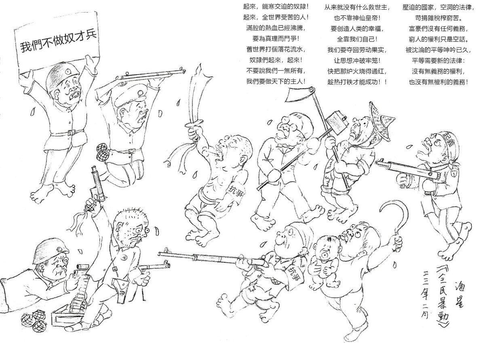
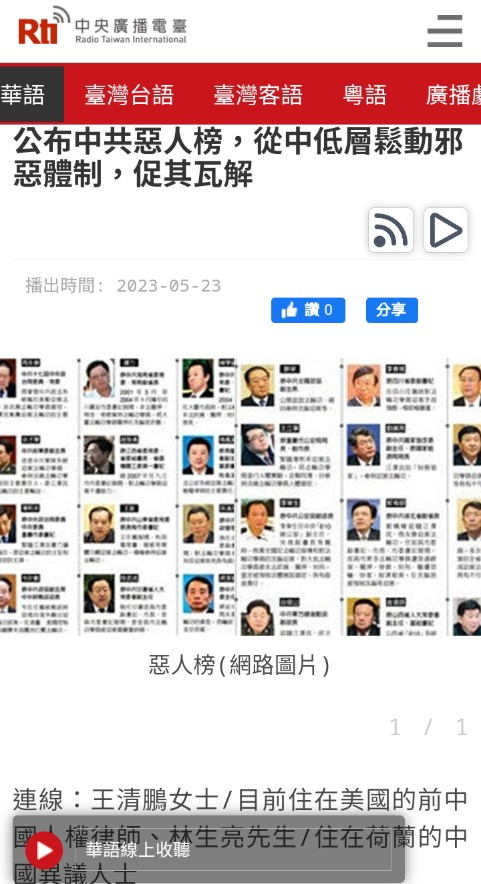
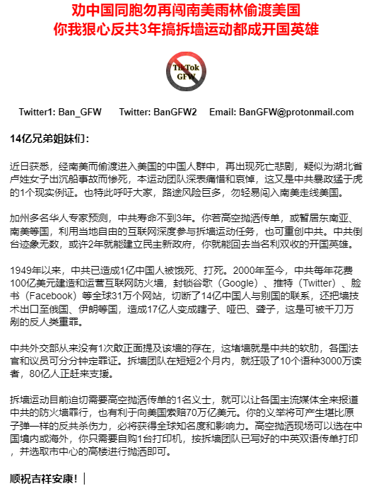

北京时间2023-05-24T23:40:02Z RT @YShuisang: @realcaixia https://t.co/yk21jbt6jM   北京时间2023-05-24T23:03:21Z 你通过高空抛洒 #拆墙运动 传单而顺利获选为 #中华合众国联邦政府 新任大总统，为了接轨欧美民主标准，你会支持废除老虎凳、满清十大酷刑、死刑吗？   北京时间2023-05-24T21:48:55Z 我们会尽快新成立 #23324专案组 ，锁定并曝光跨国镇压 #拆墙 人的40多名网警的个人及其家庭、财产等信息，争取3年内，在中华合众国联邦过渡政府辖区将这些在逃罪犯尽快捉拿归案。
#拆墙运动 #BanGFW   北京时间2023-05-24T21:33:29Z 「拆牆人應在中共垮台後用滿清十大酷刑回敬軍警特惡人嗎？」

對於曾威脅和迫害 #拆牆運動 的惡人，有人建議不必局限於民主國家那套規則，因為中共的邪惡滔天，打死、餓死了1億人，沒資格享受民主式制度，而應連本帶息地雙倍償還，或至少對等償還，這也符合中國傳統規則“以血還血以牙還牙”。

你咋看？ https://t.co/x4XgpzChtN   北京时间2023-05-24T21:14:31Z 歡迎來聽能突破防火牆的央廣節目 • #拆牆運動 傑出義工林生亮和王清鵬借台灣“央廣”聲波向14億淪陷區同胞喊話：請鎖定迫害你的軍警特的長相和家庭信息 • 留著好好清算他們的罪行
#一人一推 #惡人榜 
https://t.co/4MZbZ6VtTt https://t.co/5fwHOXyND1   北京时间2023-05-24T15:24:12Z RT @Ldl076ya: 不忘记！
我们不能忘记！
纪念 #六.四！
感谢加拿大的民主人士对六四纪念付出的行动！
同时也感谢为 #拆除 中共 #互联网防火墙 努力的奋斗的民主人士！

#拆墙运动 #BanGFW

 https://t.co/UtrnDrao7m   北京时间2023-05-24T13:09:24Z RT @EvelynZworld: 突发奇想，要不六四那天各国志愿者组织个撒传单快闪活动？
留言报名拉群哈～   北京时间2023-05-24T12:35:10Z 公开信：劝中国同胞勿再闯南美雨林偷渡美国 · 你我狠心反共3年搞拆墙运动都可成开国英雄 · 高空抛洒拆墙传单就能起到原子弹级杀伤力
 #拆墙运动  #BanGFW #GreatFirewall https://t.co/rPxCFrflib   北京时间2023-05-24T10:52:37Z RT @BanGFW2: 喬鑫鑫曾在今年2月回中國前夕，就構思了“公審白宮”框架，中國人過去幾十年遭受的巨大人禍，美國政府起碼要負責1/3~1/2責任，但因領導拆牆運動而暫停寫書計劃。希望有識之士能站出來，該書有助於佔據國際道德制高點，壓制美國境內各政客、軍火商、科技公司、銀行…   北京时间2023-05-24T10:52:31Z 喬鑫鑫曾在今年2月回中國前夕，就構思了“公審白宮”框架，中國人過去幾十年遭受的巨大人禍，美國政府起碼要負責1/3~1/2責任，但因領導拆牆運動而暫停寫書計劃。希望有識之士能站出來，該書有助於佔據國際道德制高點，壓制美國境內各政客、軍火商、科技公司、銀行家高傲的頭顱，必能讓作者本人名利雙收。   北京时间2023-05-24T10:33:46Z 「向美國索賠70萬億美元屬妄想？邀請你來寫本書公審白宮建牆罪」

你必須同情中國人民主化運動，懂中英雙語，從已解密文件、官員個人回憶錄、主流媒體報導中，抓取克林頓至今的歷任總統，對CIA、司法部、國務院等關於中共建GFW事宜之態度。你不必一次性寫完，可每天曬在Twitter。
#BanGFW #拆牆運動 https://t.co/QIXlEORsVV   北京时间2023-05-24T02:07:27Z 快下载啊！【拆墙运动宝典】中文版第002期刚新鲜出炉！

中共最多就3年寿命，不建议你拿半条命去偷渡，大多数人也只能去刷盘子。大家都狠心一点，高空抛洒拆墙传单，举报 #2259专案组 200多号建墙者，争取2年倒共，你就有望成中华合众国政府第1号受嘉奖开国英雄！何愁名利？
https://t.co/dAkFal7F5B   