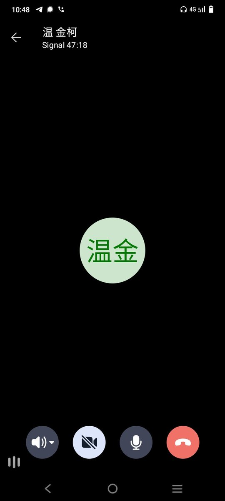
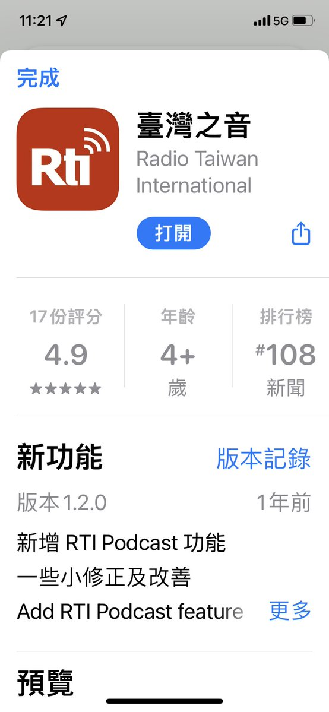
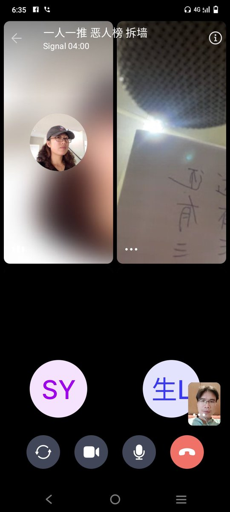
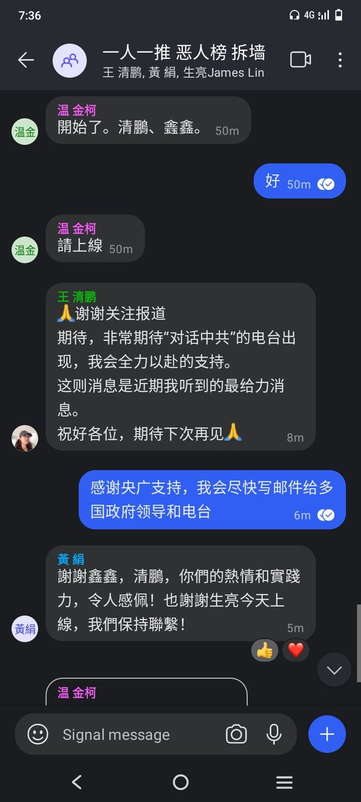
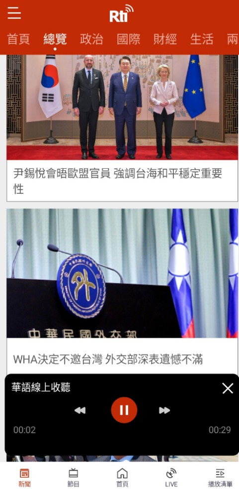

北京时间2023-05-23T21:07:57Z RT @kanzhongguo: 「拆牆運動」再出連環拳 8大主攻舉措出世(圖) https://t.co/olxJelLsep   北京时间2023-05-23T13:54:49Z 「喬鑫鑫出鏡央廣“誰聽境外廣播”：1999年衡陽上初中時聽到了賴昌星、六四學運而始終沒入黨」

作為80後，喬氏10多歲時正經歷廣播電視報紙向互聯網多媒體過渡期，那時每天早上在村後山頂，手持小收音機，忘情地收聽美國之音等境外電台，骨子裡始終抵觸CCP。央廣節目很多樣，也可收聽英文頻道學英語。 https://t.co/ar2F1Jh0Ad   北京时间2023-05-23T13:09:05Z RT @end_gfw: @Ban_GFW 苹果手机注册为海外账户下载台湾之音，教程
https://t.co/ty8nPyO10Q

国内安卓手机应用商店没有台湾之音，可以从APKPure下载
https://t.co/U18fqTap8a
或者以下链接免翻墙下载
https…   北京时间2023-05-23T12:47:11Z RT @hmc0723: 歡迎大家收聽央廣，也可以上網，下載App更方便。 https://t.co/xBGNMeN7uI   北京时间2023-05-23T10:01:54Z RT @Ban_GFW: The best way to bypass the info blockade of CCP's #GreatFirewall---Listen to Radio Taiwan International 
收聽台灣央廣電台方法：

央廣成立於192…   北京时间2023-05-23T01:36:23Z 「感謝中華民國政府喉舌“央廣”幫 #拆牆運動 向淪陷區民主喊話」

央廣成立於1928年，有多個大功率電波發射塔，能覆蓋中國大陸全境，能輕鬆突破共匪的互聯網防火牆信息封鎖，低成本高效率地向牆內傳遞真實社會信息。央廣的節目快來下載APP收聽哦！牆內人士買個廉價的小收音機就好。
#一人一推 #惡人榜 https://t.co/8tgJVzzAY8   