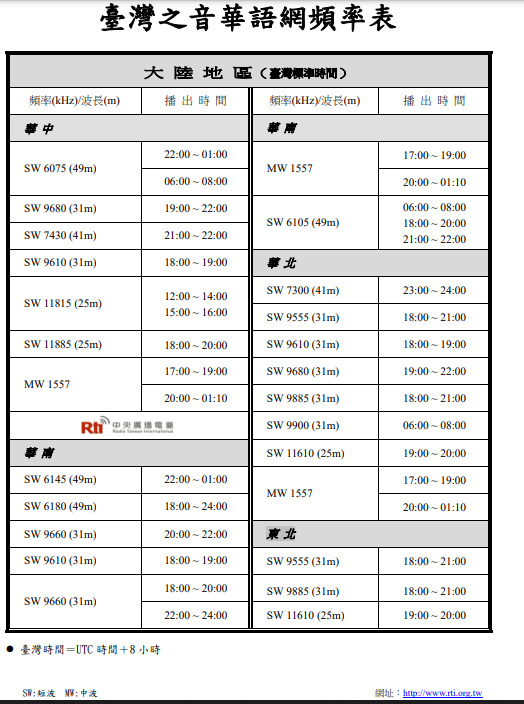
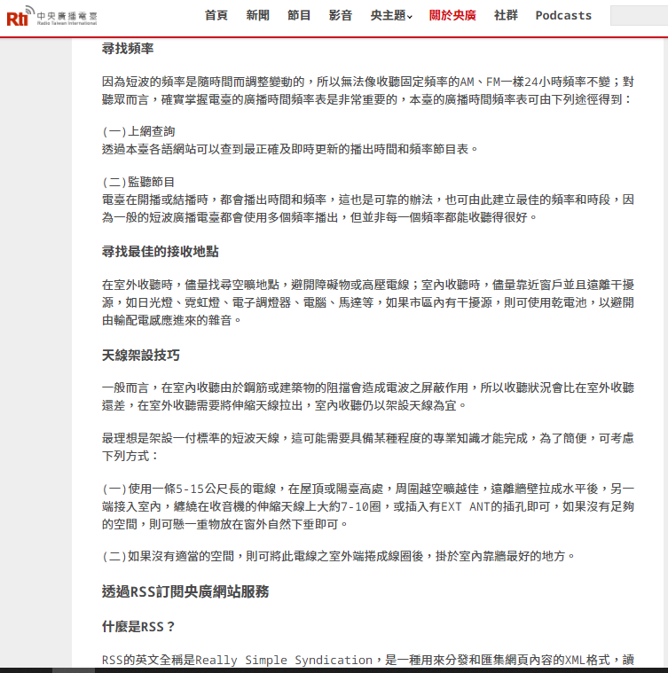

北京时间2023-05-23T10:00:23Z The best way to bypass the info blockade of CCP's #GreatFirewall---Listen to Radio Taiwan International 
收聽台灣央廣電台方法：

央廣成立於1928年，是打破中共信息封鎖妙法，有多個大功率電波發射塔，能覆蓋中國全境，在華東特別是上海有較多聽眾。也可直接下載軟件RTI to GO
#BanGFW #拆墙 https://t.co/cysAKEodrq   