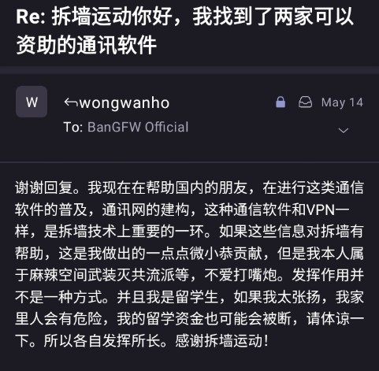
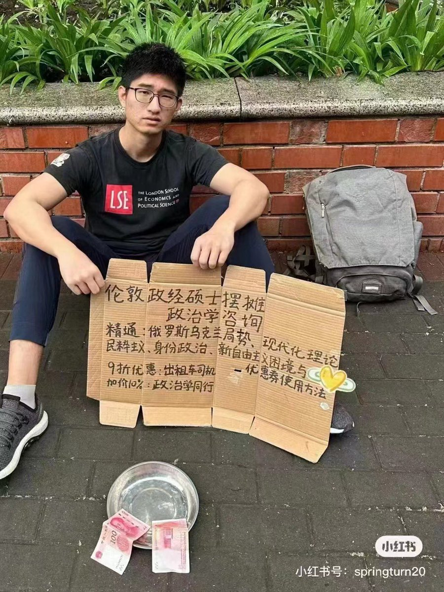

北京时间2023-05-21T21:05:36Z RT @Ban_GFW: No.1 valuable question to MFA of each nation：What's your view on #BanGFW ? 
给各国外交部最有价值提问 :  #拆墙运动 视中共的互联网防火墙为全球冲突最大来源，你咋看？
@WS…   北京时间2023-05-21T14:24:32Z 【日本首相招待各国大佬称：俺们仍是民主阵营第2大财主· 我今晚就先给你们打几百亿美元反共匪吧】

岸田心想，共匪算啥玩艺，日共党书记1960年就被17岁少年长刀刺杀，法务省将日共定义为阴谋搞暴力革命的，一向严加防范，它只剩几个七八十岁的老头。欢迎东盟、韩国、北约、欧盟都快来日搞事  #拆墙运动   北京时间2023-05-21T13:21:40Z 【拆墙人的英日语速成宝典 · 在国际舞台施展反共匪法力】  

中文圈杂乱又弱小，建议 #拆墙 人把学好英日等语言作为每日第1要务，努力扩大国际影响力，不妨参考多语达人乔鑫鑫的个人经验。#BanGFW   

A. 谷歌博客 https://t.co/hXax6etvSG
B. 30页《日本语半年速成宝典》
https://t.co/HnTWkt16yE https://t.co/moDVmykRoU   北京时间2023-05-21T11:07:41Z #拆墙运动 有理论素养更是实战派，欢迎80亿人来拆毁中共的互联网防火墙的诚意从没减退，我们会认真回复心平气和、理性客观的邮件。

发邮件才是最靠谱的陌生拜访方式，对于粉丝不到100、文字不到100、只提问题不说对策的网友，其非邮件方式，一般不回复，敬请原谅！📬BanGFW@protonmail.com
#BanGFW https://t.co/SLoySawm37   北京时间2023-05-21T09:46:14Z RT @Jwang312: 如果一个人真正静下来思考30秒，就能理解拆了中共防火墙，自由世界网络环境就会被污染这种话是给中共帮腔的扯淡。最反共的声音都在墙内。为什么看不到？有绝对严格的言论管制你当然看不到这不是废话吗。为什么中文网络有如此浓的反串文化和阴阳文化？说明人们想正常说…   北京时间2023-05-21T09:23:15Z RT @torontobigface: 我看到很多人说，如果互联网墙倒了。
中国人冲到世界上会到处祸害，还是有墙好。
其实我不太赞成这个观点
因为如果玩互联网早的应该知道，2012年左右的互联网是什么样。
那时候粉红才是网上的过街老鼠。
是极端的言论管控，造就遍地战狼的氛围。…   北京时间2023-05-21T09:19:12Z #拆墙运动 日后也得在美国搞个GFW博物馆，把中共的罪恶永远钉在十字架上。   北京时间2023-05-21T09:08:39Z RT @bj_8964: @BanGFW2 现在墙内很多人为了用chatgpt midjourney这些ai工具都在了解翻墙，正是拆墙的好时机。   北京时间2023-05-21T09:08:20Z RT @jackshu12: @BanGFW2 拆墙才是中共最害怕的事情   北京时间2023-05-21T08:59:13Z 「键政派和说书人遍地•实锤反共才可能有人有钱💰」

中文推特圈只有约1000万人，自称反共者，Twitter上往往只是漫无目的地评论、转发党国时政，没联络墙内力量，更没动到非中文圈力量，粉丝没1000。反击共匪力道几乎为0。不必再苦苦摸索，#拆墙运动 项目基本成熟，请你也来天天痛击共匪软肋
#BanGFW https://t.co/JjnN0L5SPO   北京时间2023-05-21T08:30:34Z RT @xtatpc: @BanGFW2 @RealHaonian 攻防一直在进行中，拆不完，补不完。建和补是国家队，打洞的只是个人队，这个态势没变过，特殊时期VPN几乎都失效或抽风，但平时并不想封死，只是控制比例。不要幻想有一劳永逸的西方技术“大杀器”，根本不存在这样的东西。…   