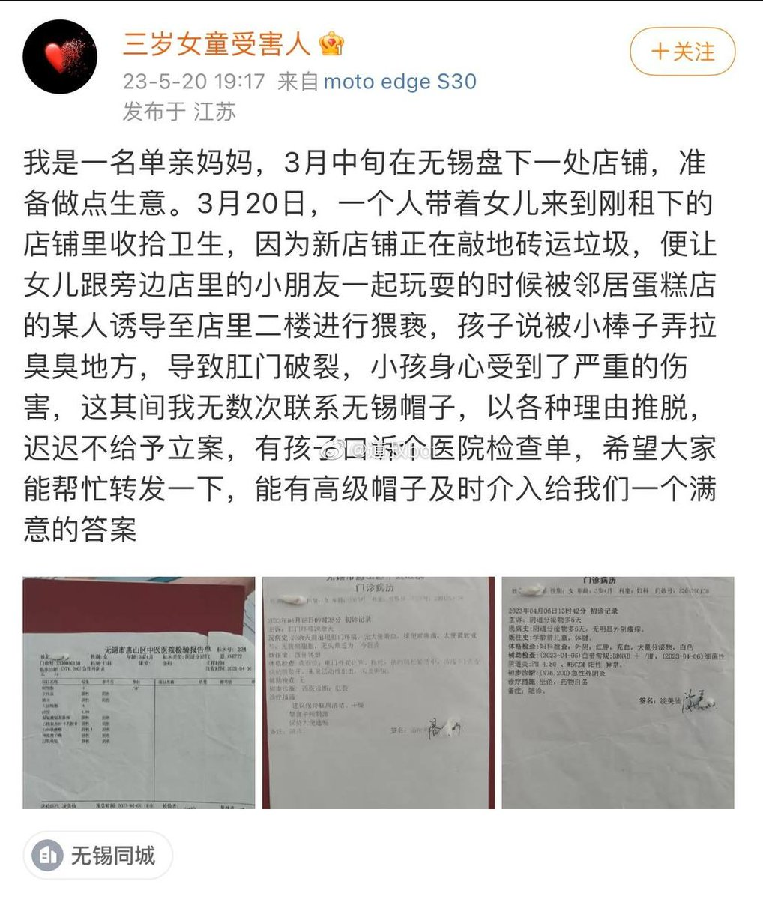
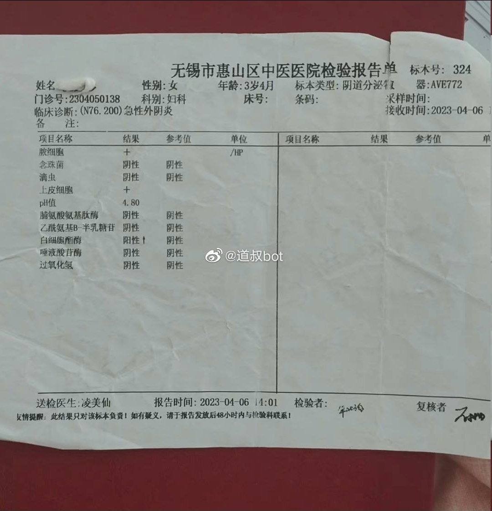
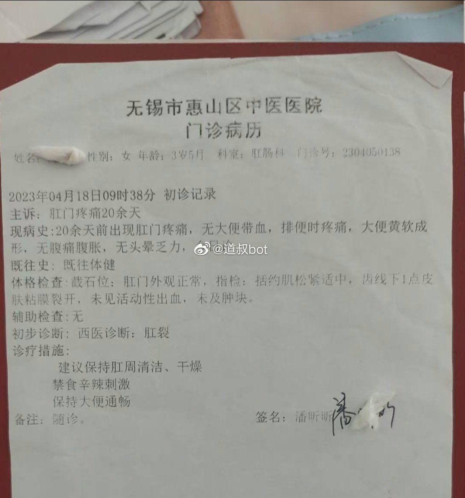
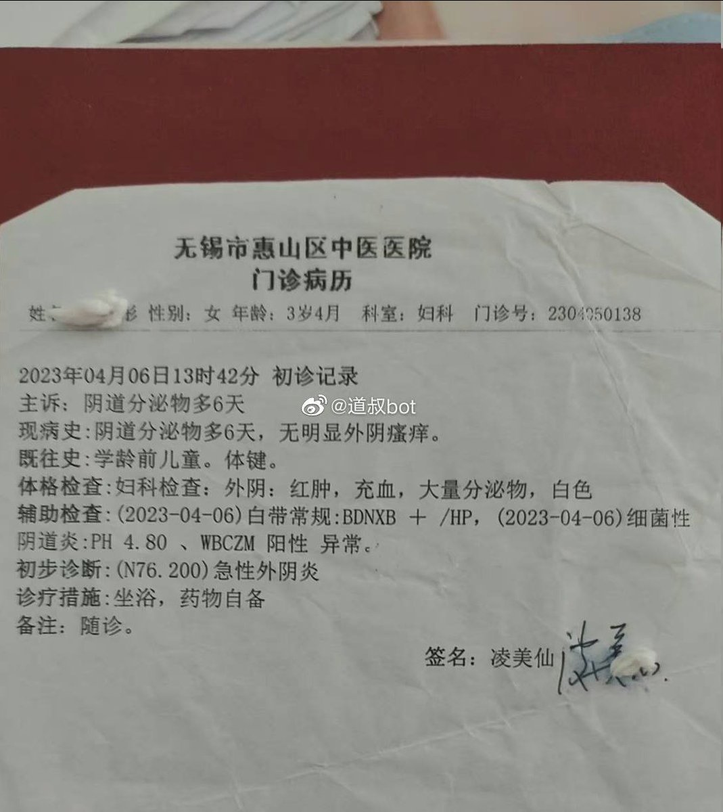

谁将十万横扫三江 北京时间 2023-05-21T12:50:38Z 1660146055890214915 三岁女童遭猥亵导致肛门破裂

帽子干这种事轻车熟路了，能打胜仗作风优良 https://t.co/xzDQVKXgzA   谁将十万横扫三江 北京时间 2023-05-21T00:46:37Z 1659963852967247872 南京农民工合伙自助做饭吃，被罚15万
相关部门：敢乱说罚你二十倍！

南京一群建筑工人，为了吃饭方便和省点钱在一小区的出租房内凑钱“搭伙做饭”。为何会开出如此高额罚金？下面一起来了解下事件经过。在南京市建邺区的一家建筑公司的工人，由于工地附近没有餐饮设施，为了节省时间和费用，大家决定在出租房内自行准备食材做饭吃。工人里面有个老张头，在大家当中资历比较深且做饭技术不错，于是大家就推举老张头来给大家做饭，食材就大家一起出钱买。吃好饭，干好活，那段时间工人们日子过的相当高兴。然而好景不长，江苏省南京市建邺区市场监管局就对该建筑公司下达了行政处罚告知书，并罚没款项高达15万元。理由竟是：群众举报，出租房常有穿着厨师服装的人员进出。他们认为这家建筑公司名下的出租房实际上是一个单位员工食堂。并且在现场调查人员发现确有餐桌椅和菜单，认为他们就是在销售食品。面对这个决定，建筑公司的员工们感到非常不解。他们强调自己并没有销售任何食品，只是相互帮助，解决就餐问题。尽管工人们进行多次否认，表明就餐地规模有限，人数稀少，根本无法被视为一个真正的食堂。但当他们想再次解释说明时，市监局负责人便语气不好地表示：要是不交就罚20倍！南京市建邺区市场监管局陈副局长表示，单位向员工提供餐饮服务，无论是否盈利或对外经营都要具备食品经营许可证，由此判断该建筑公司的行为涉嫌违法。15万这个数字对于收入有限的底层建筑工人来说，简直是天价。   谁将十万横扫三江 北京时间 2023-05-21T13:22:41Z 1660154119972347905 这就是为什么以前我上班宁愿通勤一个半小时 https://t.co/CVth4p8sJv   