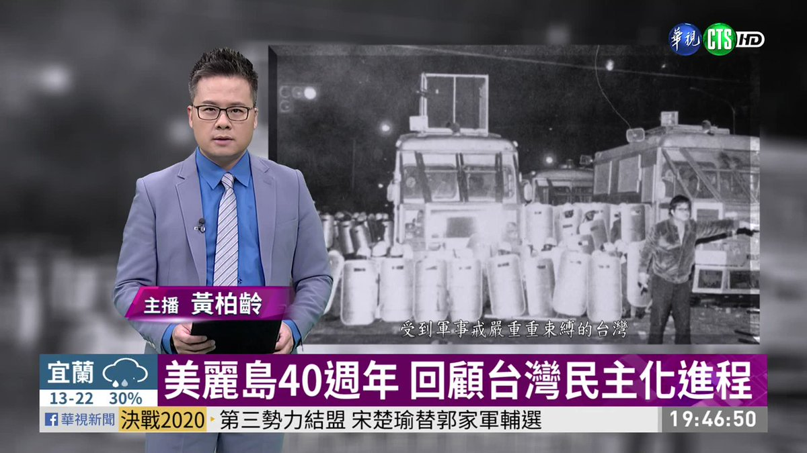
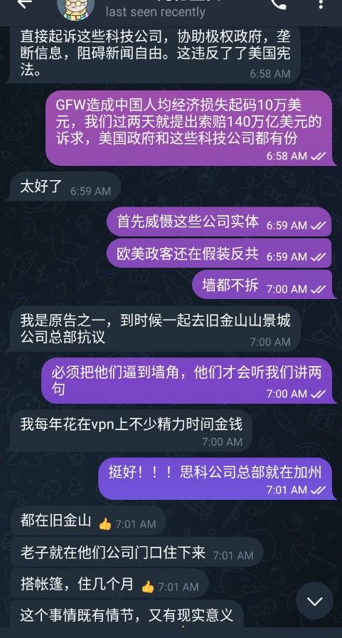
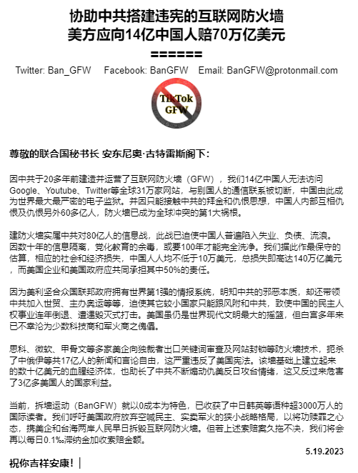

北京时间2023-05-19T22:26:33Z 【中共最爱单打独斗者· 不拆墙的反独裁方案都是空想】

拆毁互联网防火墙是海内外各派最大的利益交集 
#拆墙运动 团队将聚焦拆墙这1件事 
避免卷入地域、党派、宗教、族群等局部利益纠纷
但若你不尽心拆墙则难逃无钱又无人的命运
快来联手拆墙哦！
#BanGFW #姨学 #三民主义 #联邦制 #张献忠 #基督救国   北京时间2023-05-19T21:48:49Z 【坐牢是政商界原始資本 · 歡迎你來當職業革命家】

台灣政商界眾多大佬，如施明德、謝長廷、陳菊、陳水扁等，都曾搞過“美麗島雜誌”抗議，坐過独裁者黑牢，後紛紛當選縣市長、議員，各派聯手組建民進黨。倒共涉幾十萬億美元利益，投入必有回報。 #BanGFW #拆牆運動 

記錄片：https://t.co/44vtuiEaJX https://t.co/HGzMRM9g0h   北京时间2023-05-19T15:54:37Z RT @TommyPang10: 今天中国人的思想境界，对世界的认知，罪魁祸首就是“长城防火墙”30年来，过滤信息洗脑造成全民的愚昧无知。

推倒网墙，是启蒙全民对民主自由认知的第一步，也是最重要的一步！   北京时间2023-05-19T14:35:47Z 「招聘全球顶级律所向美国索赔70万亿美元」

律所核心合伙人必须懂中英双语，情感上同情中国的人权事业，在美国有10年以上大型人权类跨国索赔案执业经验，负责代理14亿中国人向美国白宫和企业索赔。
邮箱：bangfw@protonmail.com
#BanGFW #拆墙运动 https://t.co/YUFIRv3d4F   北京时间2023-05-19T10:23:24Z 「#拆墙运动 粉丝靠走线赴美 • 要搬去硅谷抗议 • 再把建墙者告到联邦最高法院」

不逼一把，白宫一天天真把自己当全球的救世主！先不说国际贸易法和道德伦理，思科、甲骨文、微软等，和白宫，都是中共建GFW、切断10多亿人和60多亿人联系的同犯，打压言论自由，违背了1791年宪法修正案第1款！#BanGFW https://t.co/iAJMrKOeBI   北京时间2023-05-19T06:38:39Z RT @WENBO92601009: @patty19890604 说拆墙没用的，如果不是专制独裁的走狗，一定是傻X   北京时间2023-05-19T06:37:07Z RT @1zAOvvZB3QGvLwg: 拆了那堵墙！
海外华人3月上旬发起的针对中共网络“柏林墙”的“拆墙运动”倡议40多天，就得到近100万人网上支持和多国海外华人的行动声援。同时，“拆墙运动”也推出各种拆墙举措。
https://t.co/0l4dIQ7yxc   北京时间2023-05-19T02:28:48Z 最近新汇款又到账了？不给点索赔压力，国际政坛就始终被少数军火商和墙技术商绑架！   北京时间2023-05-19T01:57:16Z 公开信：美方应就互联网防火墙赔中国人70万亿美元
Open Letter : U.S. entities should be responsible for the loss of 70 trillion US$ on the #GreatFirewall 

@USA_China_Talk @France_en_Chine @GerAmbChina
@CanadaChina  @ukinchina @JapaneseEmbass @UN 
#BanGFW #拆墙运动 https://t.co/ehgRJU7xEL   