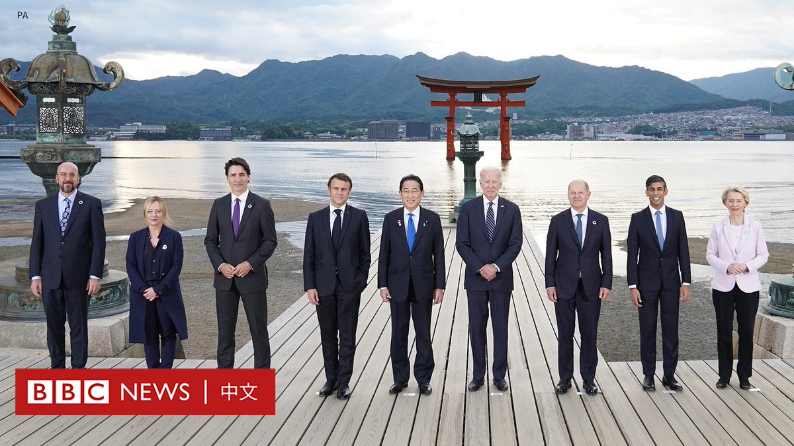
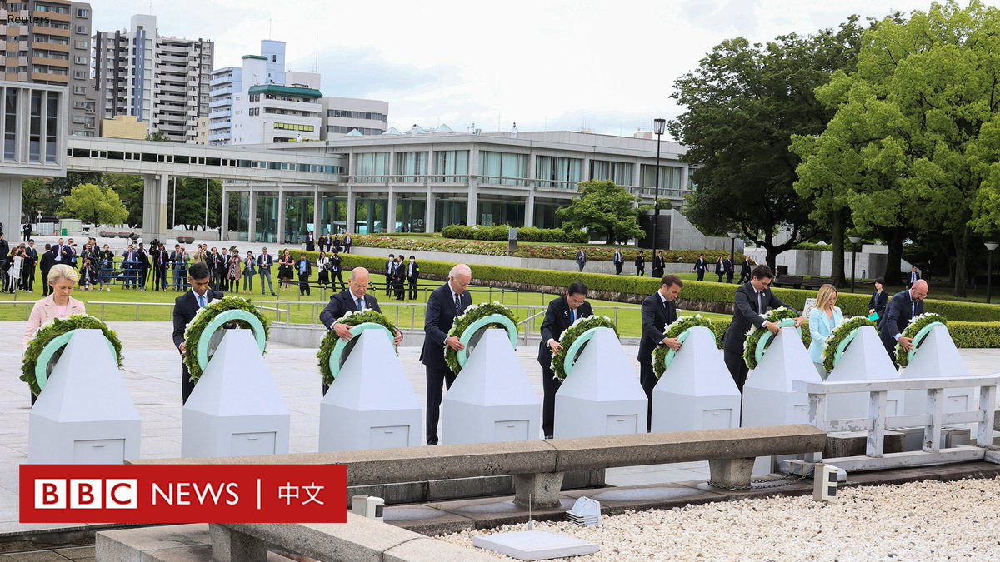
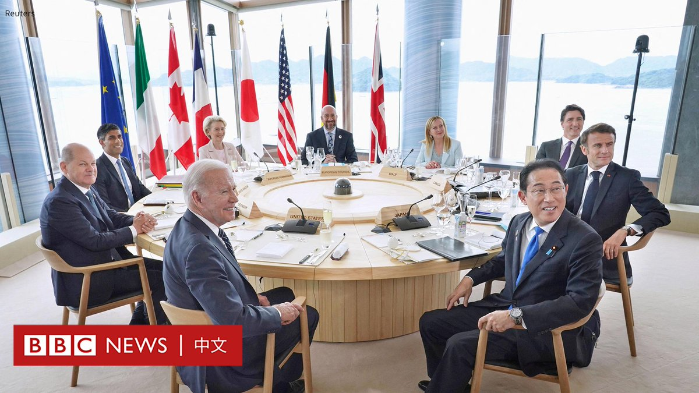

D英国广播公司BBC 北京时间 2023-05-19T20:17:38Z 1659533772776259584 七国集团（G7）领导人在日本广岛举行年度会议，七国领导人在一份声明中表示， 要求俄罗斯“立即、完全和无条件地将其军队和军事装备撤出整个国际公认的乌克兰领土”。

领导人说，“我们对乌克兰的支持不会动摇”，各国“共同反对俄罗斯对乌克兰进行的非法、无理和无端的侵略战争”。

他们将对俄罗斯采取进一步制裁，确保俄罗斯无法再将能源供应用作武器。

制裁还针对向俄罗斯前线运送物资的实体。

较早前，七国集团已就进一步制裁俄罗斯达成共识，并再次承诺向乌克兰提供 “财政、人道主义、军事和外交支援”。

G7包括美国、英国、加拿大、法国、德国、意大利和日本，但今年还邀请了其他八个国家。

多家媒体报道称，乌克兰总统泽连斯基将亲自前往日本出席峰会，但该消息尚未得到官方证实。   