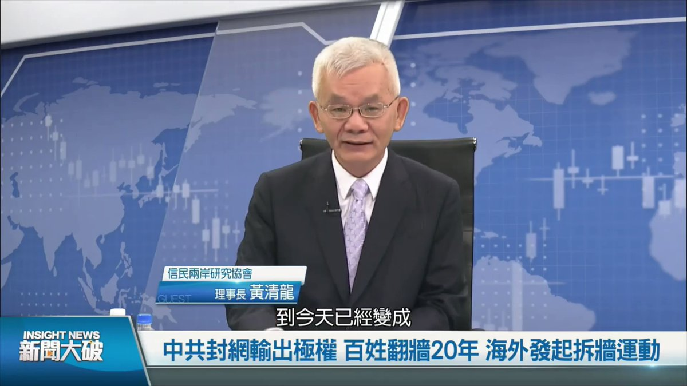
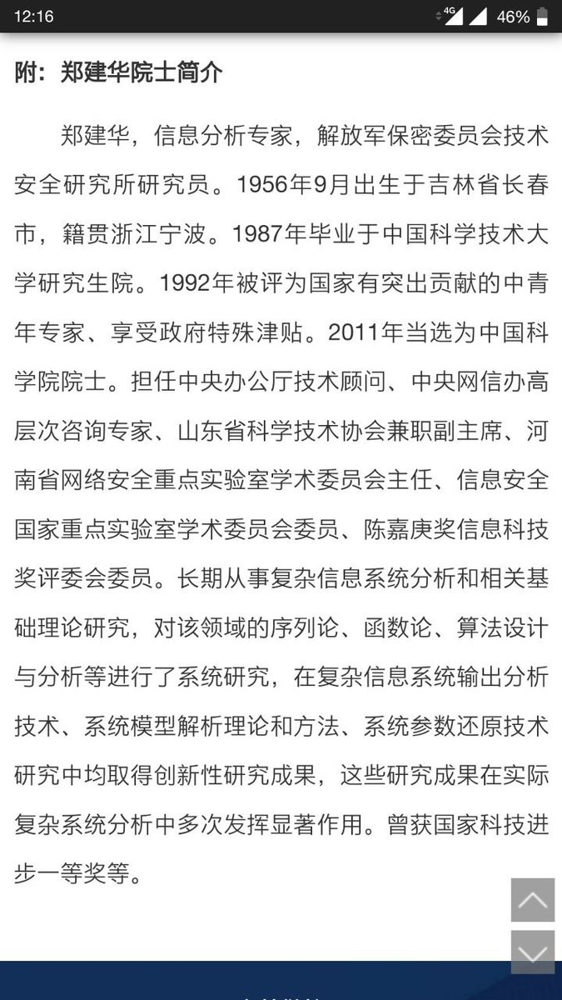
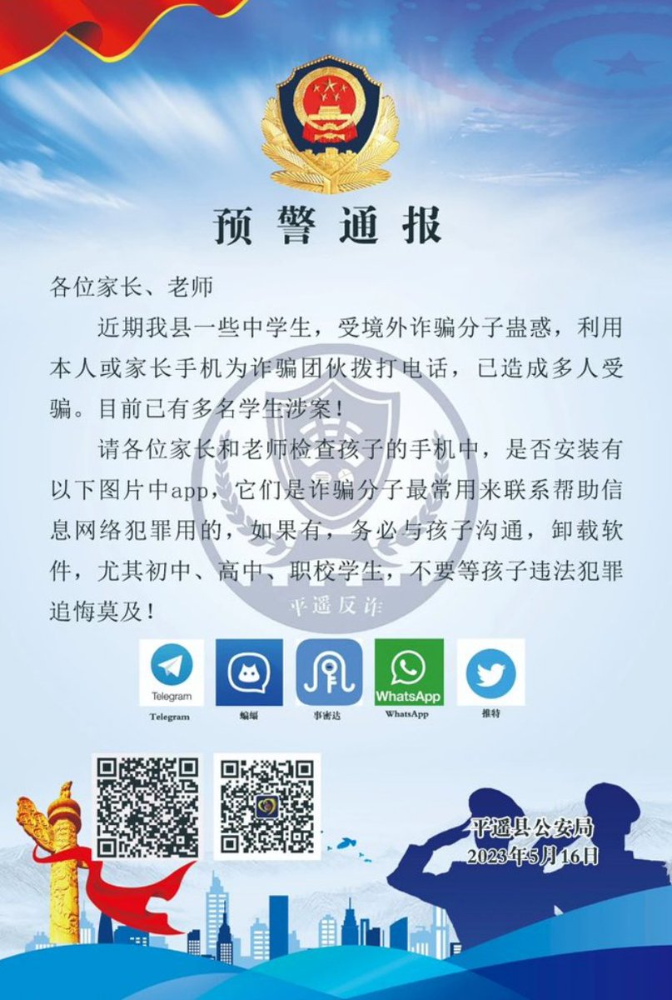
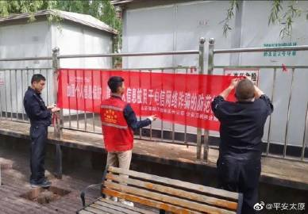

北京时间2023-05-18T16:37:08Z RT @End_GFW06: #拆墙运动 #BanGFW
今天打开邮箱收到了我给全球各国驻华大使馆的邀请帮助14亿中国人拆除中共 #互联网柏林墙 邮件回复。
只要行动每天都会收到惊喜！
拆墙的目标会越来越近了，但是也需要更多人的加入这项活动。
让中共 #防火墙 墙倒。中共政权灭…   北京时间2023-05-18T15:00:12Z 如果认清了党国真相而留下，这反而是更大的英雄主义，个个都想着逃避责任、远走他乡，是不可能根治共匪的全球威胁，祝贺王律仍然斗志昂扬！  

台湾当前的政商大佬们，许多是三四十年前坐过独裁者的黑牢。相信王律前途光明！请墙内墙外一起来 #拆墙 ，先来打破中共的信息封锁。   北京时间2023-05-18T14:18:50Z 【台灣大記者黃清龍：若能拆毁防火牆 · 中共就垮台了】Senior journali in Taiwan Mr. HUANG Ching-Lung:  #GreatFirewall ban can end CCP 

 當前提拆毀互聯網防火牆富有歷史意義，大家應都來 #拆牆。因牆阻隔，外國資訊進不去中國，中共卻可以向世界散播信息，形成資訊流不對稱。#BanGFW #拆牆運動 https://t.co/n4DKGa8Z3x   北京时间2023-05-18T12:30:32Z RT @Ban_GFW: 我们14亿中国人谴责中共并坚定支持乌克兰，尊重加德日芬等国驻华使馆在官邸张贴挺乌标语的权利 #BanGFW
We, 1.4 billion Chinese always #StandWithUkraine️  &amp; respect lawful righ…   北京时间2023-05-18T11:39:46Z 【#2259专案组 互联网防火墙第001号嫌犯 #郑建华】
1956年生，中国科学院院士(副部长级)，擅长互联网加密和监控

【No.001 suspect in building #GreatFirewall of #Project2259 】
Born in 1956, vice-minister level official, member of Chinese Academy of Sciences
#拆墙运动 #BanGFW #反人类罪 https://t.co/znC8a3YNaB   北京时间2023-05-18T11:02:31Z #拆墙运动 吓尿中共？公安部正以反电诈为名收缴中国各类翻墙软件
When scared, the Chinese Communist Party are launching national crackdown enforcement on VPNs, by which Chinese can visit Google YouTube Twitter.
#BanGFW #防火墙 https://t.co/diL7krm5cd   北京时间2023-05-18T10:10:00Z RT @yurangjingke: 有没有懂无人机的朋友，介绍一下操控无人机撒传单的可行性？比如是否容易被中共定位无人机操控者的确切位置？
感觉无人机撒传单是比防火墙更有效的突破信息壁垒方式。而且可以打破信息茧房。突破算法进行流量操控。   