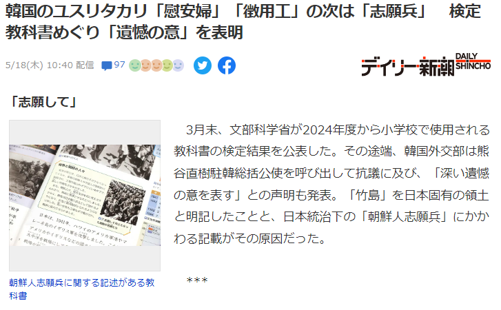
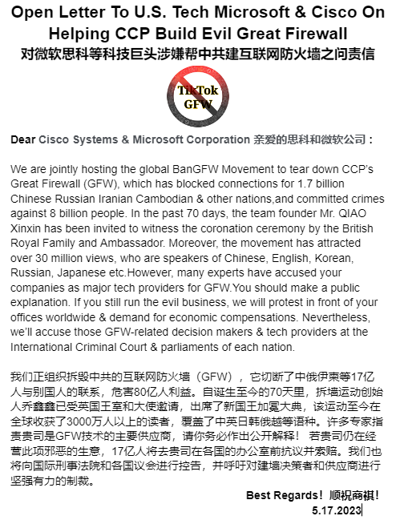

北京时间2023-05-18T14:48:05Z Korean victims of forced labor, prostitution, military service, which happened 100 years ago, are still suing Japan companies &amp; government for  compensation. 1.4 billion Chinese will also punish those entities in USA.
韩国人仍在向肇事公司和政府索赔，中国人也要追赔百年。
#BanGFW https://t.co/bXucCUofP0   北京时间2023-05-18T12:25:08Z 我们14亿中国人谴责中共并坚定支持乌克兰，尊重加德日芬等国驻华使馆在官邸张贴挺乌标语的权利 #BanGFW
We, 1.4 billion Chinese always #StandWithUkraine️  &amp; respect lawful rights of putting those political signs on the wall in your embassy. 
@USA_China_Talk @CanadaChina @JapaneseEmbass https://t.co/s7ISllwWMo   北京时间2023-05-18T11:58:55Z RT @BanGFW2: 【#2259专案组 互联网防火墙第001号嫌犯 #郑建华】
1956年生，中国科学院院士(副部长级)，擅长互联网加密和监控

【No.001 suspect in building #GreatFirewall of #Project2259 】
Bo…   北京时间2023-05-18T00:49:28Z 为尽快拆毁互联网防火墙，我们敦促微软、思科等美企1个月内终止与中共合作
To tear down the CCP's Internet Berlin Wall soon, we demand tech companies, such as Cisco &amp; Microsoft end supports to the CCP in 1 month.  @Microsoft @Cisco 
#BanGFW #拆墙运动 https://t.co/bPczuVCJsi   