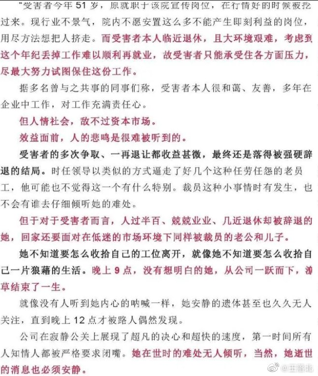

谁将十万横扫三江 北京时间 2023-05-18T20:48:12Z 1659179076048019456 北京某设计院高龄员工被裁后跳楼

坐标北京某设计院，以绩效不好为由开除了一位51岁的员工，年过半百的员工一时无法接受，于被劝退的当晚九点从楼上一跃而下，三小时后才被人发现，发现时已经身亡。

据网传消息，该员工姓杨，女性，今年51岁，原为该集团下属杂志的编辑，后被调岗至该设计院做宣传工作，其工作兢兢业业，为人和善，本来只差4年就可以退休回家颐养天年，最终却以这样的方式为自己的人生画下了休止符。   