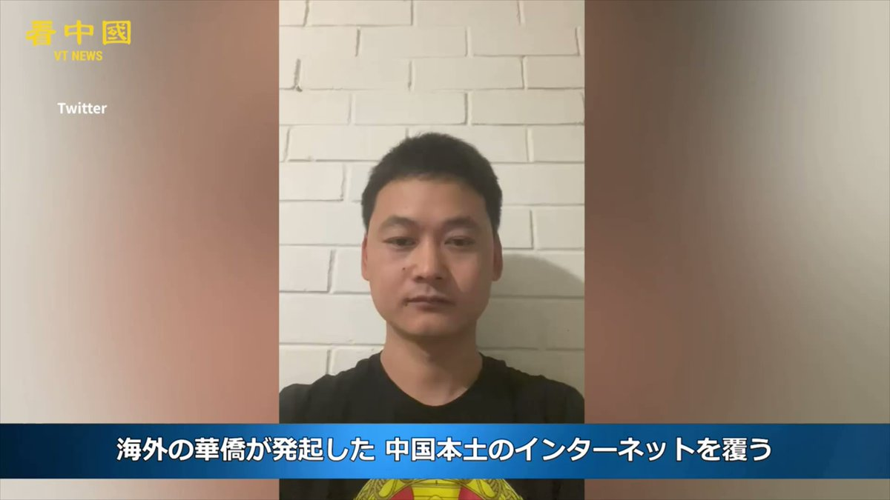

北京时间2023-05-17T17:57:19Z 2259专案组招聘1名组长，你不必露面，负责牵头调查中共防火墙技术关联的200多个人和实体信息，并展开国际追责行动。
We need a head for 2259 Project, u don't have to make public appearances, but lead the investigation on 200+ Great Firewall-related individuals &amp; entities.
#BanGFW #拆墙 https://t.co/8ClPSOgt2W   北京时间2023-05-17T13:14:54Z RT @BanGFW2: 业内码农：中共每年花100亿美元维护互联网防火墙 · 严望佳、云晓春、韩伟力3博士应坐牢
Chinese coders: CCP spends 10 billion USD to maintain #GreatFirewall to block Goo…   北京时间2023-05-17T12:37:35Z RT @BanGFW2: 纽约的时政评论家秦鹏 @shijianxingzou 挺 #拆墙运动 ：可在国际法理上挑战中共的“互联网主权”
NY-based Chinese commentator Mr. QIN Peng: #BanGFW Movement can  chall…   北京时间2023-05-17T11:34:27Z RT @BanGFW2: 【擒贼先擒王 · 防火墙之母（女神）严望佳像过街老鼠一样躲外国记者 CCP's Founding Mother of Great Firewall Ms. YAN Wangjia dare not face @VOANews journalists…   北京时间2023-05-17T00:07:39Z 日本語のニュースメディア「看中国」で #BanGFW が紹介されました。
#BanGFW was featured in the Japanese news outlets @kanzhongguo 
#拆墙运动 在新闻门户网“看中国”的日本语版视频报道
#GreatFirewall #防火墙 #만리방화벽금지 #ベルリンの壁　#インタネット  #禁止

https://t.co/dqCYsfk8oX https://t.co/NGbWv1egVf   