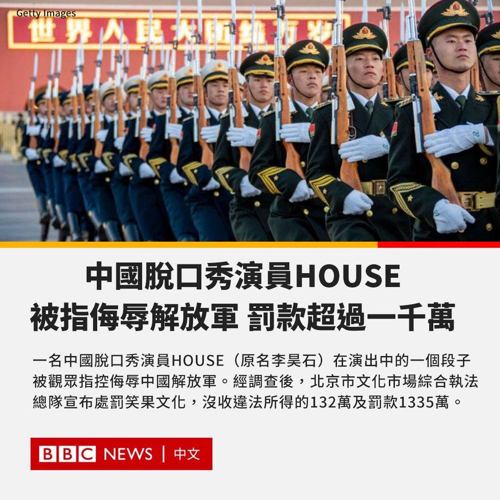

D英国广播公司BBC 北京时间 2023-05-17T15:25:57Z 1658735590962249729 近日，一名中国脱口秀演员HOUSE（原名李昊石）在演出中的一个段子被观众指控侮辱中国解放军，引起舆论争议。经调查后，北京市文化市场综合执法总队5月17日宣布处罚笑果文化，没收违法所得的132万元人民币并罚款1335万元。

北京市文化市场综合执法总队指，笑果文化违反了《营业性演出管理条例》第二十五条、第二十六条规定。除了罚款，他们将对涉案人员及其演出经纪机构和演出场所经营单位追究责任，并无限期暂停涉事公司在京所有演出活动。

5月13日，微博网友“不愿透露姓名的曼联球迷天某”发文称，对笑果北京脱口秀专场中的一个段子感到不适。

该网友在微博写道：“某脱口秀演员说自己领养了两条野狗，这两条野狗给他的感觉很不一样，他见到这两条野狗的时候他们正在追松鼠。别的小狗让他感觉很萌很可爱，萌化了。这两条野狗让他想起来八个字，‘作风优良，能打胜仗’。”

这名网友认为，这个梗侮辱了人民子弟兵。

在中国，“作风优良，能打胜仗”一直被当局用来形容中国军队。

脱口秀演员是HOUSE所在的笑果文化是一家喜剧产业公司，曾出品《吐槽大会》、《脱口秀大会》等节目，也进行线下演出。

5月15日，笑果文化发布声明，已无限期停止HOUSE演出工作，并向大众表示歉意。

李昊石本人也在微博上道歉，称自己在演出中使用了非常不恰当的比喻，给观众造成了不好的感受和联想，“我将为此承担责任，停止一切演艺，深刻反省，重新学习”。目前，他的微博已经被禁言。   