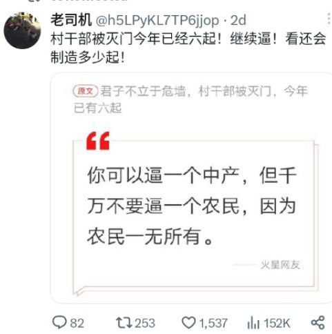
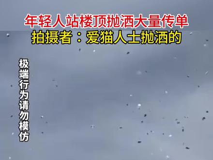
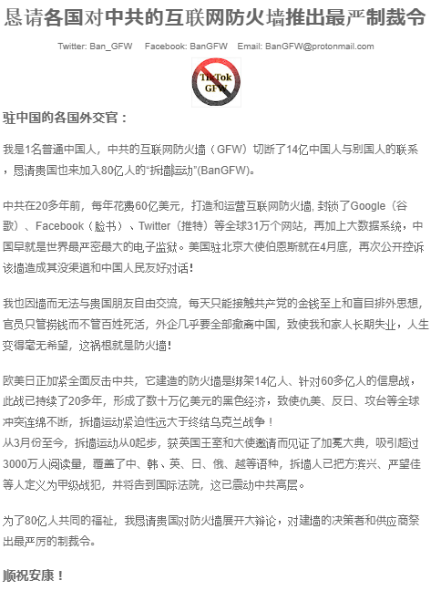
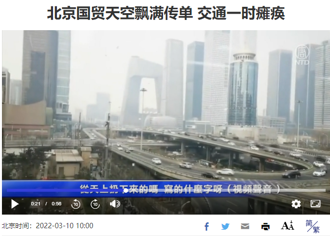
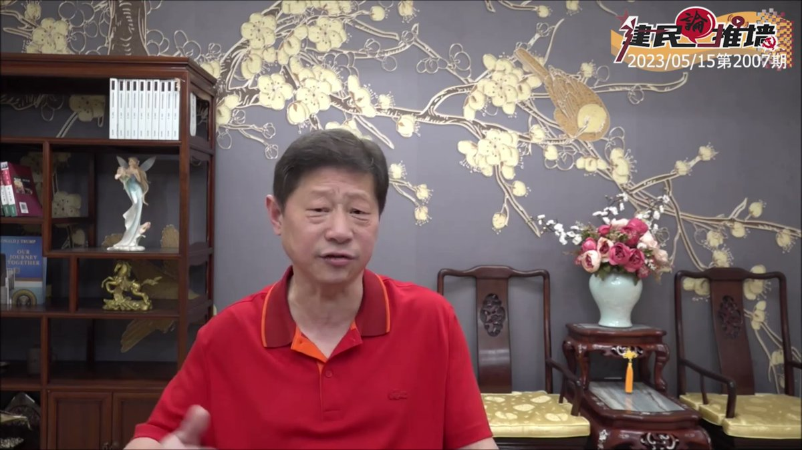

北京时间2023-05-16T19:00:24Z 【#拆墙运动 高空抛洒用的文稿出炉 · 请各大侠在中国境内外亲测匪党抗压性】

以下有中、英文2个PDF版，每次可各打印一些。从原访民近二十年记录看，宣传效果极佳，容易瞬间造成巨大的国际影响力，会让匪党天天是007工作制。

中文版：https://t.co/suUew0CosA

英文版：https://t.co/ST1P5J3sy1   北京时间2023-05-16T14:30:40Z 本法也可以在中共的海外使领馆附近操作，引起各国当地媒体关注和报道   北京时间2023-05-16T13:02:22Z 身为中产的你，若再不表态站队，出钱出力挺民主，恐怕身家性命遭共匪抢夺而无处说话、无人同情，受到底层的张献忠、高层的共产党、国际化的民主派3大派系的巨大压力。 
 #拆墙运动 #BanGFW #一人一推  #恶人榜 https://t.co/FJ9MQgMc4t   北京时间2023-05-16T12:39:38Z 【墙内人火烧中共老巢绝招：高空抛洒 #拆墙运动 传单】

有墙内反共人士献计称，若每城有1人就能让各省城管和警察疲于奔命，抓捕起码要三四小时，你可选择最繁华地段的商业中心，提前买好出国的机票或车票，在广州、景洪、珠海、防城港等可先搞起来。
可编辑打印文本的网址：https://t.co/K1Pv4k0XyW https://t.co/ErsLkTOS2H   北京时间2023-05-16T11:39:12Z 吴建民先生数十年来为打破中共专制、拆毁中共的互联网防火墙而积极奔走呼号，实为 #拆墙运动 开山鼻祖。 他被迫害和入狱多年，却始终不为中共威逼利诱所动，实为海外华人民运中的一股清流，请大家多多支持！#BanGFW   北京时间2023-05-16T11:23:03Z “六四”学运领袖 @sifan198964 吴建民评 #拆墙运动 : 防火墙倒塌=中共灭亡· 快拆墙！ 
A prominent  rights activist Mr. WU Jianmin: the collapse of Great Firewall means the disintegration of CCP, let’s #BanGFW !!
#TiananmenMassacre #天安門大屠殺 #六四34周年 #TiananmenMothers #天安門母親 https://t.co/ZOXDqokI2z   