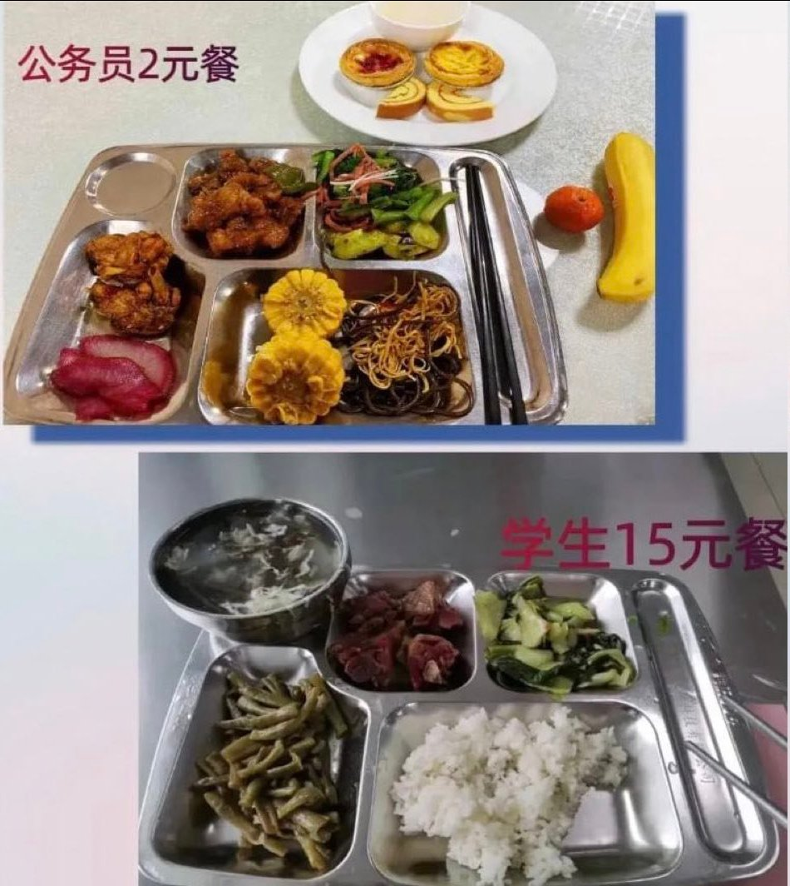

谁将十万横扫三江 北京时间 2023-05-14T15:41:54Z 1657652441998036992 社会上：两荤一素20 https://t.co/xD1uOohtfA   谁将十万横扫三江 北京时间 2023-05-14T08:24:08Z 1657542275415838720 2023年5月10日下午，济南某学校的高中英语教师贾某闯进村长家中，将村长刘某夫妻二人和十五岁的儿子杀害。

据官媒报道，受害者是一家三口，丈夫是农村致富带头人，企业家，村支书，今年63岁，妻子37岁，还有一个16的儿子。

凶案现场非常惨烈，等120到达现场，一家三口都已经死亡。

据网传消息，村长刘某今年63岁，被授予“泉城最美退役军人”，全国劳动模范、济南市道德模范，今年五一受过表彰。刘某的妻子张某今年37岁，是长清区的政协委员，也是济南葫芦湾生态农业专业合作社的社长。而凶手贾某也是优秀教师，支援过西藏，学生对他评价很好，平时没有发过脾气。

关于犯罪嫌疑人行凶的原因，坊间存在两个说法。一种说法称，犯罪嫌疑人是当地一所中学的老师，其女儿被刘继杰的儿子刘某欺侮，甚至是糟蹋。该老师报警，刘某被抓，但刘继杰通过疏通关系，其儿子很快被放。之后，刘某更加嚣张，继续威胁该老师的女儿，导致其女儿被逼得患了精神疾病。老师申诉无门，持刀行凶。

另一种说法与第一种说法基本相同，称凶手是当地的一位中学英语老师，该老师的儿子本来和刘继杰的儿子是好朋友，后来两人关系出现问题，刘继杰与其儿子纠集一帮人对该老师的儿子进行恐吓，导致该老师的儿子精神分裂，老师被逼无奈，于是持刀报复。

不管两种说法哪种更接近事实，有一点是相同的，就是这起悲剧直接导火索是由刘继杰儿子引起的。   