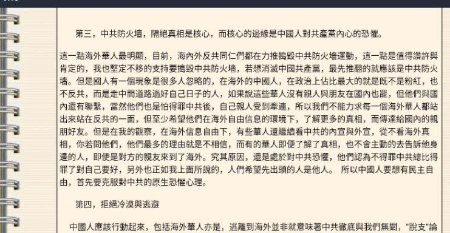
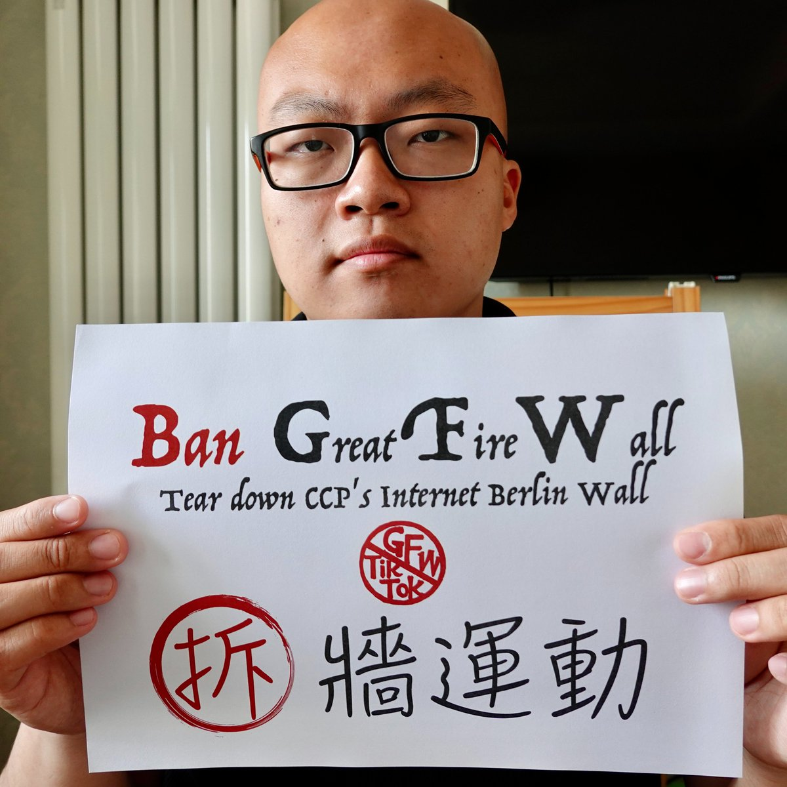
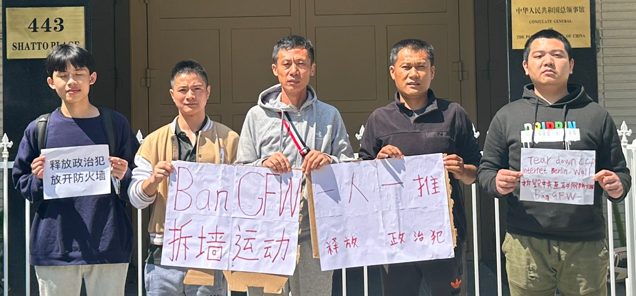

北京时间2023-05-11T22:58:38Z RT @anticommunism20: #2023年第一推 #一人一推 致推特小粉红网友们，你们应该和我们一起支持捣毁防火墙。原因如下：1.相信你们90%都是翻墙来外网看黄网的，虽然VPN也不贵，但是再好的VPN也不如直连比较好。2.你们坚信反贼的言论不会改变你们对党和国家的…   北京时间2023-05-11T22:48:11Z 【新西兰孟佳美：力挺 #拆墙运动 海外民运应优先推进】

孟女士 @anticommunism20 撰写长文纪念“六四”事件时指，中共互联网防火墙隔绝了真相，呼吁海外华人在自由的信息环境下，放弃精致的利己主义，揭发中共暴政。唯有如此，等你有困难时，才可能有别人热心帮助。#BanGFW 
https://t.co/F29Fb5MRkP https://t.co/ulIZbmGCbA   北京时间2023-05-11T18:38:08Z RT @Ban_GFW: Advocates of Global Ban Great Firewall Movement 
80亿人拆墙运动在各国的铁粉代表 (2nd Version第2版 )
@Jwang312 @Lydia981402 @zhan42577 @hualing…   北京时间2023-05-11T17:08:20Z RT @hualing04177805: 我多希望我的哥哥能够看到外面世界，我想说给他外面的世界很好，可是即使我说给他听，他依旧不肯相信，甚至说你别说给我听。哥我是你弟弟，我还能害你吗？只要防火墙一日存在，14亿中国人就得被迫接受共匪洗脑教育。天天吹嘘只有读书才能出人头地，去你…   北京时间2023-05-11T12:53:16Z RT @Ban_GFW: 美国之音时事大家谈上周结论称，很多硅谷公司都是中共防火墙帮凶。那么我们这些防火墙下最大的受害者，若到这些美国科技公司驻全球办公室抗议，甚至提起刑事控告及民事索赔，阻止其向CCP出口互联网审查技术，从而实现技术拆墙，可行性有多高？https://t.co…   北京时间2023-05-11T09:56:14Z 【你不心动吗？#拆墙运动 拟捧红多名政界小明星】

本运动在诞生后短短60多天里，以快准狠凝聚共识，已狂吸中英日韩语等2000万人次以上国际阅读量，为让更多人加入这场80亿人的正义工程，正需培养一批阳光积极、有勇有谋的榜样，展现你成长经历及拆墙生活。请你务必在个人网帖中添加标签  #ILoveBanGFW https://t.co/VuRqauAeSY   